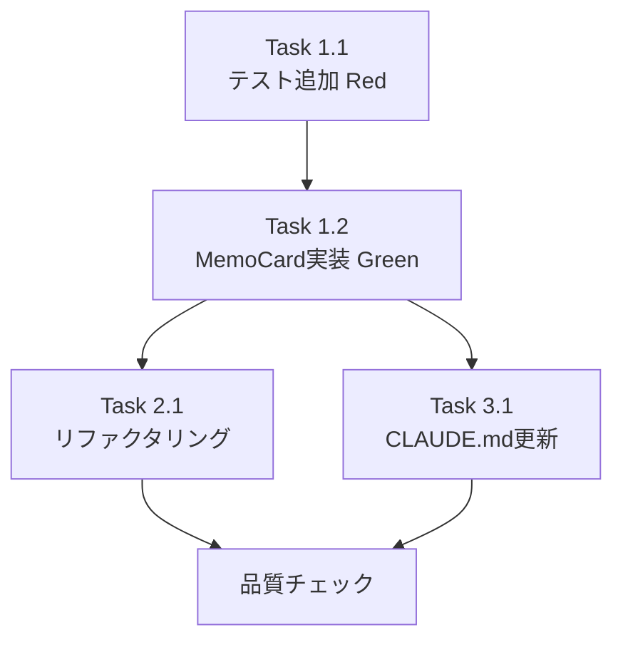

# Issue #321 作業計画書

## Issue: メモのコピー機能

**Issue番号**: #321
**サイズ**: S（小規模）
**優先度**: Medium
**ラベル**: feature
**依存Issue**: なし

---

## 概要

MemoCard.tsxにコピーボタンを追加し、メモの`content`フィールドをクリップボードにコピーできるようにする。変更範囲は以下の2ファイルのみ（プレゼンテーション層に閉じる）:

- `src/components/worktree/MemoCard.tsx` - コピーボタンUI追加
- `tests/unit/components/worktree/MemoCard.test.tsx` - テスト7件追加

---

## 詳細タスク分解

### Phase 1: 実装（TDD: Red→Green）

#### Task 1.1: テストケース追加（Red）
- **成果物**: `tests/unit/components/worktree/MemoCard.test.tsx`
- **依存**: なし
- **内容**:
  - `vi.mock('@/lib/clipboard-utils')`モックを追加
  - 以下の7テストケースを追加（最初はRedで失敗させる）:
    1. コピーボタンのレンダリング（`aria-label="Copy memo content"`）
    2. クリック時の`copyToClipboard`呼び出し（memo.contentが引数）
    3. 成功後のCheckアイコン表示
    4. 2秒後のCopyアイコン復帰（`vi.advanceTimersByTime(2000)`）
    5a. 空コンテンツ（`content: ''`）時の振る舞い
    5b. 空白文字のみ（`content: '   '`）時の振る舞い
    6. 高速ダブルクリック時の振る舞い（S1-004）
    7. コピーフィードバック中のアンマウント（S1-005、React警告なし）

#### Task 1.2: MemoCard.tsx実装（Green）
- **成果物**: `src/components/worktree/MemoCard.tsx`
- **依存**: Task 1.1
- **内容**:
  ```
  1. importの追加:
     - lucide-react: { Copy, Check }
     - react: { useRef, useEffect }（既存importに追加）
     - @/lib/clipboard-utils: { copyToClipboard }

  2. 状態とRef追加（コンポーネント内):
     - const [copied, setCopied] = useState(false)
     - const timerRef = useRef<ReturnType<typeof setTimeout>>()

  3. useEffect cleanup追加:
     - アンマウント時にclearTimeout(timerRef.current)

  4. handleCopyコールバック追加:
     - contentガード（!content の早期リターン）
     - copyToClipboard(content)呼び出し
     - setCopied(true)
     - clearTimeout(timerRef.current)（高速連打対策）
     - timerRef.current = setTimeout(() => setCopied(false), 2000)
     - catchブロック: サイレントエラー

  5. ヘッダー部JSX更新:
     - 削除ボタンの左にコピーボタンを追加
     - aria-label="Copy memo content"
     - copied ? <Check> : <Copy> のアイコン切替
  ```

### Phase 2: リファクタリング（Refactor）

#### Task 2.1: コード品質確認
- **依存**: Task 1.2
- **内容**:
  - `useCallback`依存配列の確認（`content`が正しく含まれているか）
  - Tailwindクラスの整理（ボタンスタイルの統一確認）
  - コメント追記（設計根拠: S1-002クリーンアップの説明）

### Phase 3: ドキュメント更新

#### Task 3.1: CLAUDE.md更新
- **成果物**: `CLAUDE.md`
- **依存**: Task 1.2
- **内容**:
  - MemoCard.tsxのモジュール説明を追加
  - 例: `src/components/worktree/MemoCard.tsx` - メモカードコンポーネント（Issue #321: コピーボタン追加、Copy/Checkアイコン切替、useRefタイマークリーンアップ）

---

## タスク依存関係



---

## 実装詳細（設計方針書より）

### コピーボタンの仕様

| 項目 | 仕様 |
|------|------|
| コピー対象 | `content`フィールドのみ（`title`は対象外） |
| アイコン（通常時） | lucide-react `Copy`（gray-400） |
| アイコン（成功後） | lucide-react `Check`（green-600） |
| フィードバック時間 | 2秒後にCopyに戻る |
| ホバー色 | text-gray-600（削除ボタンのred-500と区別） |
| aria-label | `"Copy memo content"` |
| 配置 | ヘッダー行右側、削除ボタンの左隣 |
| エラー処理 | サイレント（アイコンが変わらないことで通知） |

### タイマークリーンアップ（S1-002）

```typescript
// useRef + useEffect による安全なタイマー管理
const timerRef = useRef<ReturnType<typeof setTimeout>>();

useEffect(() => {
  return () => {
    if (timerRef.current) {
      clearTimeout(timerRef.current);
    }
  };
}, []);

// handleCopy内
if (timerRef.current) clearTimeout(timerRef.current);
timerRef.current = setTimeout(() => setCopied(false), 2000);
```

---

## 品質チェック項目

| チェック項目 | コマンド | 基準 |
|-------------|----------|------|
| ESLint | `npm run lint` | エラー0件 |
| TypeScript | `npx tsc --noEmit` | 型エラー0件 |
| Unit Test | `npm run test:unit` | 全テストパス |
| Build | `npm run build` | 成功 |

---

## 成果物チェックリスト

### コード
- [ ] `src/components/worktree/MemoCard.tsx` - コピーボタン実装

### テスト
- [ ] `tests/unit/components/worktree/MemoCard.test.tsx` - 7テストケース追加
- [ ] MemoPane.test.tsx が引き続き全パス

### ドキュメント
- [ ] `CLAUDE.md` - MemoCard.tsx説明追加

---

## Definition of Done

- [ ] コピーボタンがMemoCardヘッダーに表示される
- [ ] クリックでメモcontentがクリップボードにコピーされる
- [ ] Copy→Check→Copy（2秒）のアイコン切替が動作する
- [ ] 空コンテンツ時にコピー処理が実行されない
- [ ] アンマウント時のReact警告が発生しない
- [ ] TypeScript型チェックパス（`npx tsc --noEmit`）
- [ ] ESLintエラー0件（`npm run lint`）
- [ ] 単体テスト全パス（テスト7件追加）
- [ ] MemoPane.test.tsx既存テスト全パス
- [ ] モバイル画面幅でヘッダー4要素レイアウトが崩れない
- [ ] CLAUDE.md更新完了

---

## 参照ファイル

| ファイル | 用途 |
|---------|------|
| `src/components/worktree/FileViewer.tsx` L53-75, L153-167 | コピーパターン参考実装 |
| `src/lib/clipboard-utils.ts` | `copyToClipboard()`ユーティリティ |
| `tests/unit/components/MarkdownEditor.test.tsx` | clipboard-utilsモックの参考 |
| `dev-reports/design/issue-321-memo-copy-design-policy.md` | 設計方針書 |

---

## 次のアクション

1. **TDD実装開始**: `/pm-auto-dev 321`
2. **PR作成**: 実装完了後 `/create-pr`

---

*Generated by work-plan skill for Issue #321*
*Date: 2026-02-20*
