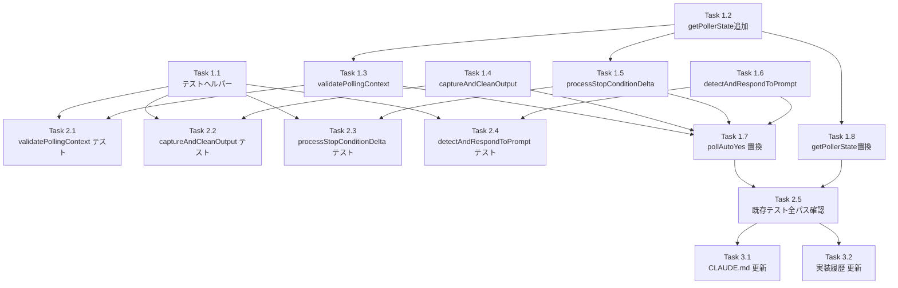

# Issue #323 作業計画書: auto-yes-manager.ts pollAutoYes() リファクタリング

## Issue: リファクタリング（pollAutoYes() 責務分割）
**Issue番号**: #323
**サイズ**: M（既存コードの分割・テスト追加。機能変更なし）
**優先度**: Medium
**依存Issue**: なし
**設計方針書**: `dev-reports/design/issue-323-auto-yes-manager-refactoring-design-policy.md`

---

## 詳細タスク分解

### Phase 1: メイン実装（auto-yes-manager.ts）

- [ ] **Task 1.1**: テストヘルパー `createTestPollerState()` を追加
  - 成果物: `tests/unit/lib/auto-yes-manager.test.ts`（ヘルパー追加のみ）
  - 内容: `AutoYesPollerState` のデフォルト値を持つファクトリ関数を追加
  - 依存: なし
  - 優先度: 最初に追加（以降のテストで使用する）

- [ ] **Task 1.2**: `getPollerState()` getter を追加
  - 成果物: `src/lib/auto-yes-manager.ts`
  - 内容: `autoYesPollerStates.get(worktreeId)` のラッパー関数を追加（private, non-export）
  - 依存: なし
  - 根拠: `getAutoYesState()` パターンとの一貫性維持（DR003）

- [ ] **Task 1.3**: `validatePollingContext()` を追加
  - 成果物: `src/lib/auto-yes-manager.ts`
  - 内容:
    - `pollerState` が undefined → `'stopped'` 返却
    - `autoYesState` が無効/期限切れ → `stopAutoYesPolling()` 呼び出し後 `'expired'` 返却
    - それ以外 → `'valid'` 返却
  - シグネチャ: `export function validatePollingContext(worktreeId: string, pollerState: AutoYesPollerState | undefined): 'valid' | 'stopped' | 'expired'`
  - `@internal` / `@precondition`: worktreeId は `isValidWorktreeId()` 検証済みであること
  - 依存: Task 1.2 (`getAutoYesState` 使用)

- [ ] **Task 1.4**: `captureAndCleanOutput()` を追加
  - 成果物: `src/lib/auto-yes-manager.ts`
  - 内容:
    - `captureSessionOutput(worktreeId, cliToolId, 5000)` を呼び出し（5000行上限）
    - `stripAnsi(output)` でANSIコード除去
    - cleanOutput 文字列を返却
  - シグネチャ: `export async function captureAndCleanOutput(worktreeId: string, cliToolId: CLIToolType): Promise<string>`
  - スコープ外: thinkingウィンドウイング・detectThinking 呼び出しは `pollAutoYes()` 内に残留
  - 依存: なし（外部モジュール呼び出しのみ）

- [ ] **Task 1.5**: `processStopConditionDelta()` を追加
  - 成果物: `src/lib/auto-yes-manager.ts`
  - 内容:
    - `stopCheckBaselineLength < 0`（初回）: ベースライン設定して `false` 返却
    - `cleanOutput.length > baseline`: デルタ抽出 → `checkStopCondition(worktreeId, newContent)` に委譲
    - `cleanOutput.length < baseline`: ベースラインリセット → `false` 返却
    - `cleanOutput.length === baseline`: スキップ → `false` 返却
  - シグネチャ: `export function processStopConditionDelta(worktreeId: string, pollerState: AutoYesPollerState, cleanOutput: string): boolean`
  - `pollerState` を直接変更（mutation: `stopCheckBaselineLength` 更新）
  - `@internal` / `@precondition`: worktreeId は `isValidWorktreeId()` 検証済みであること
  - 依存: Task 1.2

- [ ] **Task 1.6**: `detectAndRespondToPrompt()` を追加
  - 成果物: `src/lib/auto-yes-manager.ts`
  - 内容（8ステップ）:
    1. `buildDetectPromptOptions(cliToolId)` + `detectPrompt(cleanOutput, promptOptions)`
    2. プロンプト未検出 → `pollerState.lastAnsweredPromptKey = null` → `'no_prompt'`
    3. `generatePromptKey()` + `isDuplicatePrompt()` → `'duplicate'`
    4. `resolveAutoAnswer()` → null の場合 `'no_answer'`
    5. `CLIToolManager.getInstance()` → `sendPromptAnswer()`
    6. `updateLastServerResponseTimestamp()` + `resetErrorCount()`
    7. `pollerState.lastAnsweredPromptKey = promptKey` → `'responded'`
    8. catch → `incrementErrorCount()` → `'error'`
  - **注意**: クールダウンスケジューリングは `pollAutoYes()` のオーケストレーター側で行う（SRP）
  - シグネチャ: `export async function detectAndRespondToPrompt(worktreeId: string, pollerState: AutoYesPollerState, cliToolId: CLIToolType, cleanOutput: string): Promise<'responded' | 'no_prompt' | 'duplicate' | 'no_answer' | 'error'>`
  - `@internal` / `@precondition`: worktreeId は `isValidWorktreeId()` 検証済みであること
  - 依存: Task 1.2

- [ ] **Task 1.7**: `pollAutoYes()` をオーケストレーターに置き換え
  - 成果物: `src/lib/auto-yes-manager.ts`
  - 内容: 139行の実装を〜30行のオーケストレーターに置き換え
    1. `getPollerState()` → `validatePollingContext()` 呼び出し
    2. `captureAndCleanOutput()` 呼び出し（エラーは外側 catch で処理）
    3. thinkingウィンドウイング + `detectThinking()` はインラインで残留
    4. `processStopConditionDelta()` 呼び出し
    5. `detectAndRespondToPrompt()` 呼び出し、`'responded'` の場合のみ cooldown スケジュール
  - 依存: Task 1.3 〜 Task 1.6

- [ ] **Task 1.8**: `scheduleNextPoll()` / `stopAutoYesPolling()` などで `getPollerState()` を使用に変更
  - 成果物: `src/lib/auto-yes-manager.ts`
  - 内容: 6箇所の `autoYesPollerStates.get(worktreeId)` を `getPollerState(worktreeId)` に置換
  - 依存: Task 1.2

---

### Phase 2: テスト追加

- [ ] **Task 2.1**: `validatePollingContext()` の個別テストを追加
  - 成果物: `tests/unit/lib/auto-yes-manager.test.ts`
  - 内容（タイマー非依存）:
    - pollerState undefined → `'stopped'` 返却
    - autoYes期限切れ → `'expired'` 返却 + `stopAutoYesPolling()` 呼び出し確認
    - autoYes無効 → `'expired'` 返却
    - 有効状態 → `'valid'` 返却
  - 依存: Task 1.3, Task 1.1

- [ ] **Task 2.2**: `captureAndCleanOutput()` の個別テストを追加
  - 成果物: `tests/unit/lib/auto-yes-manager.test.ts`
  - 内容（タイマー非依存）:
    - ANSI コードが正しく除去される
    - `captureSessionOutput` のエラーがそのまま throw される
  - 依存: Task 1.4, Task 1.1

- [ ] **Task 2.3**: `processStopConditionDelta()` の個別テストを追加
  - 成果物: `tests/unit/lib/auto-yes-manager.test.ts`
  - 内容（タイマー非依存、`checkStopCondition` とのサブ統合テスト）:
    - 初回呼び出し（`stopCheckBaselineLength === -1`）: ベースライン設定、`false` 返却
    - 出力増加: デルタ抽出して `checkStopCondition` に委譲
    - 出力縮小: ベースラインリセット、`false` 返却
    - 長さ変化なし: スキップ、`false` 返却
    - stop condition マッチ時: `true` 返却、auto-yes 無効化
  - 依存: Task 1.5, Task 1.1

- [ ] **Task 2.4**: `detectAndRespondToPrompt()` の個別テストを追加
  - 成果物: `tests/unit/lib/auto-yes-manager.test.ts`
  - 内容（タイマー非依存）:
    - プロンプト未検出 → `'no_prompt'`、`lastAnsweredPromptKey = null`
    - 重複プロンプト → `'duplicate'`
    - 回答不能 → `'no_answer'`
    - 正常応答 → `'responded'`、タイムスタンプ更新、エラーカウントリセット
    - 送信エラー → `'error'`、`incrementErrorCount()` 呼び出し確認
  - 依存: Task 1.6, Task 1.1

- [ ] **Task 2.5**: 既存テスト全パス確認
  - コマンド: `npm run test:unit -- auto-yes-manager`
  - 確認: 既存の `vi.useFakeTimers` ベーステスト群が全て通過すること
  - 依存: Task 1.7, Task 1.8

---

### Phase 3: ドキュメント更新

- [ ] **Task 3.1**: CLAUDE.md のモジュール説明を更新
  - 成果物: `CLAUDE.md`
  - 内容: `auto-yes-manager.ts` の主要機能モジュール表に分割関数名を追記
    - `validatePollingContext()`, `captureAndCleanOutput()`, `processStopConditionDelta()`, `detectAndRespondToPrompt()`, `getPollerState()`（private）
    - 設計選択結果（関数群方式）を記載
  - 依存: Task 1.7

- [ ] **Task 3.2**: `docs/implementation-history.md` にエントリ追加
  - 成果物: `docs/implementation-history.md`
  - 内容: Issue #323 の概要・主要変更ファイル・設計書リンクを追記
  - 依存: Task 1.7

---

## タスク依存関係

---

## 品質チェック項目

| チェック項目 | コマンド | 基準 |
|-------------|----------|------|
| ESLint | `npm run lint` | エラー0件 |
| TypeScript | `npx tsc --noEmit` | 型エラー0件 |
| Unit Test | `npm run test:unit -- auto-yes-manager` | 全テストパス |
| Build | `npm run build` | 成功 |

---

## 実装順序（推奨）

TDD アプローチで実装する場合の推奨順序：

1. **Task 1.1** + **Task 1.2**: テストヘルパーと getter を先に準備
2. **Task 1.3** + **Task 2.1**: `validatePollingContext()` の Red → Green
3. **Task 1.4** + **Task 2.2**: `captureAndCleanOutput()` の Red → Green
4. **Task 1.5** + **Task 2.3**: `processStopConditionDelta()` の Red → Green
5. **Task 1.6** + **Task 2.4**: `detectAndRespondToPrompt()` の Red → Green
6. **Task 1.7** + **Task 1.8** + **Task 2.5**: `pollAutoYes()` 置き換えと既存テスト全パス確認
7. **Task 3.1** + **Task 3.2**: ドキュメント更新

---

## 成果物チェックリスト

### コード
- [ ] `validatePollingContext()` 追加
- [ ] `captureAndCleanOutput()` 追加
- [ ] `processStopConditionDelta()` 追加
- [ ] `detectAndRespondToPrompt()` 追加
- [ ] `getPollerState()` 追加
- [ ] `pollAutoYes()` をオーケストレーターに置き換え（〜30行）
- [ ] `autoYesPollerStates.get()` → `getPollerState()` 置換（6箇所）

### テスト
- [ ] `createTestPollerState()` テストヘルパー追加
- [ ] `validatePollingContext()` 個別テスト（タイマー非依存）
- [ ] `captureAndCleanOutput()` 個別テスト（タイマー非依存）
- [ ] `processStopConditionDelta()` 個別テスト（タイマー非依存）
- [ ] `detectAndRespondToPrompt()` 個別テスト（タイマー非依存）
- [ ] 既存テスト全パス確認

### ドキュメント
- [ ] `CLAUDE.md` のモジュール説明更新
- [ ] `docs/implementation-history.md` への Issue #323 エントリ追加

---

## Definition of Done

- [ ] 既存テスト（`tests/unit/lib/auto-yes-manager.test.ts`）が全てパス
- [ ] `pollAutoYes()` が 4-5 個の単一責務関数に分割済み
- [ ] 分割関数の個別テストが追加（タイマー非依存）
- [ ] 機能変更なし（外部インターフェース維持）
- [ ] ESLint エラー 0 件
- [ ] TypeScript 型エラー 0 件
- [ ] CLAUDE.md 更新
- [ ] `docs/implementation-history.md` 更新

---

## 次のアクション

作業計画確認後：
1. TDD 実装: `/tdd-impl` または `/pm-auto-dev`
2. 進捗確認: `/progress-report`
3. PR 作成: `/create-pr`

---

*Generated by /work-plan command for Issue #323*
*Date: 2026-02-21*
