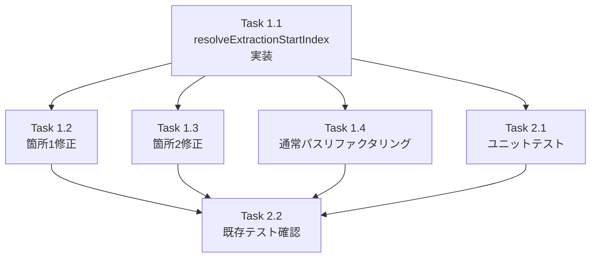

# 作業計画書: Issue #326

## Issue: fix: インタラクティブプロンプト検出時にtmuxバッファ全体がレスポンスとして保存される

**Issue番号**: #326
**サイズ**: S
**優先度**: High (bug)
**依存Issue**: なし
**設計方針書**: `dev-reports/design/issue-326-prompt-response-extraction-design-policy.md`

---

## 概要

`src/lib/response-poller.ts`の`extractResponse()`関数で、インタラクティブプロンプト検出時に`lastCapturedLine`を無視してtmuxバッファ全体が返され、前の会話内容がAssistantメッセージに混入するバグを修正する。

**修正アプローチ**:
1. `resolveExtractionStartIndex()` ヘルパー関数を抽出し、startIndex決定ロジックを一元化
2. 箇所1（Claude早期プロンプト検出）と箇所2（フォールバックプロンプト検出）の両方でこのヘルパーを使用し、`lastCapturedLine`以降の行のみを返すよう修正
3. 箇所2に`stripAnsi()`を追加（XSSリスク軽減 + 箇所1との一貫性）

---

## タスク分解

### Phase 1: 実装

#### Task 1.1: resolveExtractionStartIndex()ヘルパー関数の実装
- **成果物**: `src/lib/response-poller.ts`への関数追加
- **依存**: なし
- **実装内容**:
  ```typescript
  /**
   * Determine the start index for response extraction based on buffer state.
   * Shared between normal response extraction and prompt detection paths.
   *
   * bufferWasReset is computed internally from lastCapturedLine, totalLines,
   * and bufferReset. Callers do NOT need to pre-compute bufferWasReset.
   *
   * @internal Exported for testing only
   */
  export function resolveExtractionStartIndex(
    lastCapturedLine: number,
    totalLines: number,
    bufferReset: boolean,
    cliToolId: CLIToolType,
    findRecentUserPromptIndex: (windowSize: number) => number
  ): number {
    // 防御的バリデーション（Stage 4 SF-001）
    lastCapturedLine = Math.max(0, lastCapturedLine);

    // bufferWasResetを内部で計算（MF-001: 責務境界）
    const bufferWasReset = lastCapturedLine >= totalLines || bufferReset;

    if (bufferWasReset) {
      const foundUserPrompt = findRecentUserPromptIndex(40);
      return foundUserPrompt >= 0 ? foundUserPrompt + 1 : 0;
    } else if (cliToolId === 'codex') {
      return Math.max(0, lastCapturedLine);
    } else if (lastCapturedLine >= totalLines - 5) {
      const foundUserPrompt = findRecentUserPromptIndex(50);
      return foundUserPrompt >= 0 ? foundUserPrompt + 1 : Math.max(0, totalLines - 40);
    } else {
      return Math.max(0, lastCapturedLine);
    }
  }
  ```
- **注意**: `cliToolId === 'claude'`ブロック内から呼ばれる場合、codex分岐は到達不能だが汎用性のためcliToolIdを引数として保持する（設計書3-4参照）

#### Task 1.2: 箇所1の修正（Claude早期プロンプト検出、L326-341）
- **成果物**: `src/lib/response-poller.ts`の行326-341付近の修正
- **依存**: Task 1.1
- **修正内容**:
  ```typescript
  // Before:
  return {
    response: stripAnsi(fullOutput),  // バッファ全体
    isComplete: true,
    lineCount: totalLines,
  };

  // After:
  const startIndex = resolveExtractionStartIndex(
    lastCapturedLine, totalLines, bufferReset, cliToolId, findRecentUserPromptIndex
  );
  const extractedLines = lines.slice(startIndex);
  return {
    response: stripAnsi(extractedLines.join('\n')),
    isComplete: true,
    lineCount: totalLines,
  };
  ```

#### Task 1.3: 箇所2の修正（フォールバックプロンプト検出、L487-499）
- **成果物**: `src/lib/response-poller.ts`の行487-499付近の修正
- **依存**: Task 1.1
- **修正内容**:
  ```typescript
  // Before:
  return {
    response: fullOutput,  // バッファ全体（stripAnsiなし）
    isComplete: true,
    lineCount: totalLines,
  };

  // After:
  const startIndex = resolveExtractionStartIndex(
    lastCapturedLine, totalLines, bufferReset, cliToolId, findRecentUserPromptIndex
  );
  const extractedLines2 = lines.slice(startIndex);
  return {
    response: stripAnsi(extractedLines2.join('\n')),  // stripAnsi追加（XSSリスク軽減）
    isComplete: true,
    lineCount: totalLines,
  };
  ```
- **注意**: `stripAnsi()`を追加することでANSIコードのDB保存を防止（セキュリティ必須修正）

#### Task 1.4: 通常レスポンスパスのリファクタリング（L364-386）
- **成果物**: `src/lib/response-poller.ts`の行364-386付近のリファクタリング
- **依存**: Task 1.1
- **修正内容**: 既存の4分岐startIndex決定ロジックを`resolveExtractionStartIndex()`呼び出しに置換
  ```typescript
  // Before: 4分岐のインラインロジック
  let startIndex: number;
  const bufferWasReset = lastCapturedLine >= totalLines || bufferReset;
  if (bufferWasReset) { ... }
  else if (cliToolId === 'codex') { ... }
  else if (lastCapturedLine >= totalLines - 5) { ... }
  else { ... }

  // After:
  const startIndex = resolveExtractionStartIndex(
    lastCapturedLine, totalLines, bufferReset, cliToolId, findRecentUserPromptIndex
  );
  ```
- **注意**: Claude/Codex/Gemini全completionパスに影響するため、動作変更がないことを確認すること

### Phase 2: テスト

#### Task 2.1: resolveExtractionStartIndex()のユニットテスト作成
- **成果物**: `tests/unit/lib/resolve-extraction-start-index.test.ts`（新規）
- **依存**: Task 1.1
- **テストケース**（設計書6-2より）:

  | # | テストケース | 入力 | 期待値 |
  |---|------------|------|-------|
  | 1 | 通常ケース | lastCapturedLine=50, totalLines=100, bufferReset=false, claude | 50 |
  | 2 | バッファリセット（UPあり） | lastCapturedLine=200, totalLines=80, bufferReset=true, findRecentUserPromptIndex→60 | 61 |
  | 3 | バッファリセット（UPなし） | lastCapturedLine=200, totalLines=80, bufferReset=true, findRecentUserPromptIndex→-1 | 0 |
  | 4 | Codex通常ケース | lastCapturedLine=50, totalLines=100, bufferReset=false, codex | 50 |
  | 5 | バッファスクロール境界 | lastCapturedLine=96, totalLines=100, bufferReset=false, claude, UP→85 | 86 |
  | 6 | バッファスクロール境界（UPなし） | lastCapturedLine=96, totalLines=100, bufferReset=false, claude, UP→-1 | 60 |
  | 7 | lastCapturedLine=0 Codex | lastCapturedLine=0, totalLines=100, bufferReset=false, codex | 0 |
  | 8 | lastCapturedLine=0 通常 | lastCapturedLine=0, totalLines=100, bufferReset=false, claude | 0 |
  | 9 | 負値入力（防御的バリデーション） | lastCapturedLine=-1, totalLines=100, bufferReset=false, claude | 0 |
  | 10 | totalLines=0（空バッファ） | lastCapturedLine=0, totalLines=0, bufferReset=false, claude, UP→-1 | 0 |

#### Task 2.2: 既存テストのパス確認
- **成果物**: テスト実行結果
- **依存**: Task 1.1 〜 Task 1.4
- **確認内容**:
  - `tests/unit/lib/response-poller.test.ts` の既存テストがすべてパス
  - リファクタリング後の通常レスポンスパスの動作に変化がないこと

---

## タスク依存関係



---

## 変更ファイル一覧

| ファイル | 変更種別 | 内容 |
|---------|---------|------|
| `src/lib/response-poller.ts` | 修正 | resolveExtractionStartIndex()追加、箇所1/箇所2修正、通常パスリファクタリング |
| `tests/unit/lib/resolve-extraction-start-index.test.ts` | 新規 | resolveExtractionStartIndex()のユニットテスト |

---

## 品質チェック項目

| チェック項目 | コマンド | 基準 |
|-------------|----------|------|
| ESLint | `npm run lint` | エラー0件 |
| TypeScript | `npx tsc --noEmit` | src/関連エラー0件（既存設定エラーを除く） |
| Unit Test | `npm run test:unit` | 全テストパス |

---

## 実装上の注意点

1. **行番号はスナップショット**: 設計書・Issue記載の行番号は設計時点のもの。実装時は関数名・コメント・コードパターンで特定すること
2. **部分レスポンスパス（L501-533）は対象外**: このパスは独自のstartIndexロジックを持ち、resolveExtractionStartIndex()の対象外
3. **箇所2のstripAnsi追加はセキュリティ必須**: ANSIコードがDB保存されdangerouslySetInnerHTMLパスを経由する可能性があるため必須
4. **findRecentUserPromptIndexはクロージャ**: resolveExtractionStartIndex()の引数として渡す際、extractResponse()内で定義されているクロージャをそのまま渡す

---

## Definition of Done

- [ ] Task 1.1: `resolveExtractionStartIndex()`が実装されている
- [ ] Task 1.2: 箇所1（Claude早期プロンプト検出）が`lastCapturedLine`以降のみを返す
- [ ] Task 1.3: 箇所2（フォールバックプロンプト検出）が`lastCapturedLine`以降のみを返し、`stripAnsi()`が適用されている
- [ ] Task 1.4: 通常レスポンスパスのリファクタリングが完了し、動作変更なし
- [ ] Task 2.1: 10テストケース全パス
- [ ] Task 2.2: 既存テスト全パス
- [ ] `npm run lint` エラー0件
- [ ] `npm run test:unit` 全パス

---

## 次のアクション

1. **実装**: `/tdd-impl 326` で TDD実装開始
2. **進捗報告**: `/progress-report` で状況報告
3. **PR作成**: 実装完了後 `/create-pr` で自動作成
