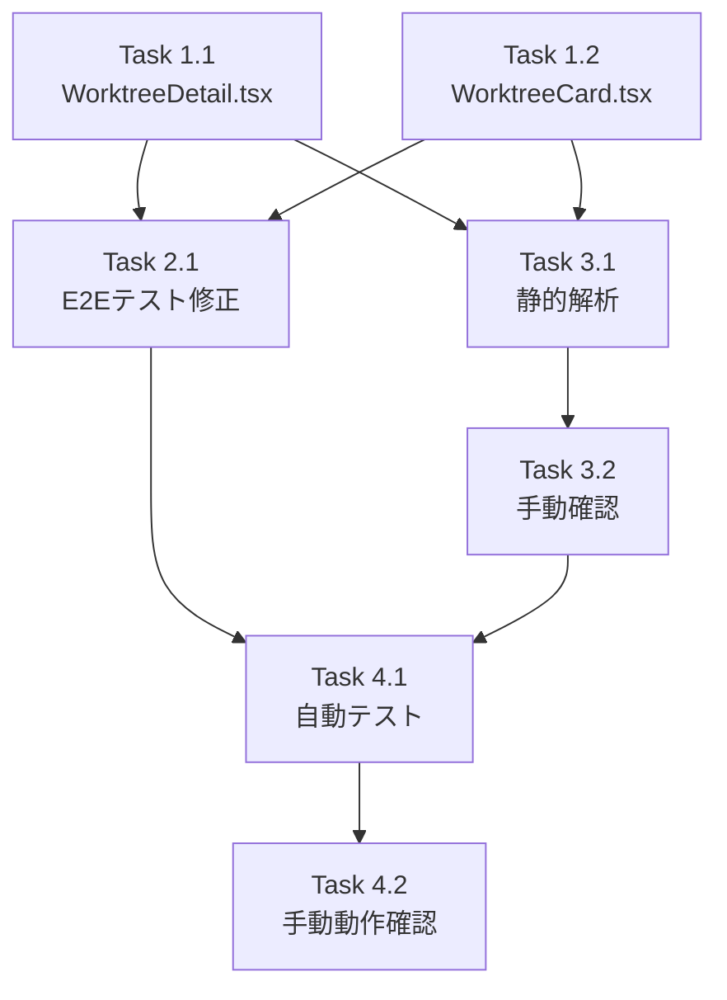

# 作業計画書: Issue #33 Codex/Gemini文言削除

## Issue概要

| 項目 | 内容 |
|------|------|
| **Issue番号** | #33 |
| **タイトル** | codex geminiの文言の削除 |
| **サイズ** | S（小規模） |
| **優先度** | Medium |
| **依存Issue** | なし |
| **設計方針書** | [承認済み](../../design/issue-33-codex-gemini-removal-design-policy.md) |

### 要件サマリ
トップページおよび詳細ページからcodex/geminiの表記を削除し、Claude Code専用UIとする。内部ロジックは将来の再導入に備えて維持。

---

## 詳細タスク分解

### Phase 1: UI変更（必須）

#### Task 1.1: WorktreeDetail.tsx修正
| 項目 | 内容 |
|------|------|
| **成果物** | `src/components/worktree/WorktreeDetail.tsx` |
| **依存** | なし |
| **見積もり** | S |

**修正内容:**
- [ ] `TabView`型定義の変更（`'codex' | 'gemini'`削除）
- [ ] `CLI_TABS`配列の変更（`['claude']`のみ）
- [ ] タブナビゲーションからCodex/Geminiボタン削除（約30行削除）
- [ ] 直接的な条件分岐の修正（166行目: `if (activeTab === 'claude' || ...)`）
- [ ] 直接的な条件分岐の修正（620行目: `{(activeTab === 'claude' || ...) && (`）

#### Task 1.2: WorktreeCard.tsx修正
| 項目 | 内容 |
|------|------|
| **成果物** | `src/components/worktree/WorktreeCard.tsx` |
| **依存** | なし |
| **見積もり** | S |

**修正内容:**
- [ ] 確認ダイアログ文言修正（54行目付近）
  - 変更前: `「${name}」の全てのセッション（Claude/Codex/Gemini）を終了しますか？`
  - 変更後: `「${name}」のセッションを終了しますか？`
- [ ] Last Messages表示からCodex/Gemini削除（244-277行目付近、約34行削除）

---

### Phase 2: テスト更新

#### Task 2.1: E2Eテスト修正
| 項目 | 内容 |
|------|------|
| **成果物** | `tests/e2e/cli-tool-selection.spec.ts` |
| **依存** | Task 1.1, Task 1.2 |
| **見積もり** | S |

**修正内容:**

| # | テストケース | 対応 |
|---|-------------|------|
| 1 | `should display CLI Tool badge in worktree card` | 修正（Claudeのみ確認） |
| 2 | `should navigate to worktree detail...` | 削除 |
| 3 | `should display Edit button for CLI Tool...` | 削除 |
| 4 | `should show radio buttons when editing CLI Tool` | 削除 |
| 5 | `should display Save and Cancel buttons...` | 削除 |
| 6 | `should cancel CLI Tool editing` | 削除 |
| 7 | `should be responsive on mobile` | 修正（Claudeのみ確認） |
| 8 | `should display CLI Tool with correct badge color` | 維持 |

---

### Phase 3: デッドコードチェック

#### Task 3.1: 静的解析によるデッドコード検出
| 項目 | 内容 |
|------|------|
| **成果物** | デッドコードレポート |
| **依存** | Task 1.1, Task 1.2 |
| **見積もり** | XS |

**実行コマンド:**
```bash
# TypeScript未使用エクスポートチェック
npx tsc --noEmit 2>&1 | grep -E "is declared but|never used"

# ESLint未使用変数チェック
npm run lint -- --rule 'no-unused-vars: error' --rule '@typescript-eslint/no-unused-vars: error'

# 未使用インポートチェック（ビルド時に検出）
npm run build
```

**チェック対象:**
- [ ] 変更したファイル内で未使用となったimport文
- [ ] 変更したファイル内で未使用となった変数・関数
- [ ] 型定義（`'codex' | 'gemini'`が残っていても、意図的な維持として許容）

#### Task 3.2: 手動デッドコード確認
| 項目 | 内容 |
|------|------|
| **成果物** | 確認レポート |
| **依存** | Task 3.1 |
| **見積もり** | XS |

**確認項目:**
- [ ] WorktreeDetail.tsx: Codex/Gemini関連のローカル変数が残っていないか
- [ ] WorktreeCard.tsx: Codex/Gemini関連のローカル変数が残っていないか
- [ ] import文: 不要になったBadgeバリアント等のimportがないか

**意図的に維持するコード（デッドコードとして報告しない）:**
| ファイル | 内容 | 理由 |
|---------|------|------|
| `cli-tools/types.ts` | `CLIToolType = 'claude' \| 'codex' \| 'gemini'` | 再導入に備えて維持 |
| `cli-tools/codex.ts` | Codex CLI実装 | 再導入に備えて維持 |
| `cli-tools/gemini.ts` | Gemini CLI実装 | 再導入に備えて維持 |
| `cli-tools/manager.ts` | 3ツールの登録 | 再導入に備えて維持 |
| `cli-patterns.ts` | ツール別パターン | 再導入に備えて維持 |
| `tests/unit/cli-tools/*.test.ts` | Codex/Geminiテスト | 内部ロジック品質担保 |

---

### Phase 4: 品質確認

#### Task 4.1: 自動テスト実行
| 項目 | 内容 |
|------|------|
| **成果物** | テスト結果レポート |
| **依存** | Task 2.1 |
| **見積もり** | S |

**実行コマンド:**
```bash
# Lint
npm run lint

# 型チェック
npx tsc --noEmit

# 単体テスト
npm run test:unit

# ビルド
npm run build
```

#### Task 4.2: 手動動作確認
| 項目 | 内容 |
|------|------|
| **成果物** | 動作確認チェックリスト |
| **依存** | Task 4.1 |
| **見積もり** | S |

**確認項目:**
- [ ] トップページ: Codex/Geminiバッジが表示されないこと
- [ ] トップページ: Last MessagesにCodex/Gemini項目がないこと
- [ ] 詳細ページ: Codex/Geminiタブが表示されないこと
- [ ] 詳細ページ: Claudeタブが正常に動作すること
- [ ] セッション終了確認ダイアログ: 「Claude/Codex/Gemini」の文言がないこと
- [ ] モバイル表示: 上記すべてが正常であること

---

## タスク依存関係



**並列実行可能:**
- Task 1.1 と Task 1.2（相互依存なし）

---

## 品質チェック項目

| チェック項目 | コマンド | 基準 |
|-------------|----------|------|
| ESLint | `npm run lint` | エラー0件、警告最小化 |
| TypeScript | `npx tsc --noEmit` | 型エラー0件 |
| Unit Test | `npm run test:unit` | 全テストパス |
| Build | `npm run build` | 成功 |
| デッドコード | 静的解析 + 手動確認 | 意図的維持以外のデッドコードなし |

---

## 成果物チェックリスト

### コード変更
- [ ] `src/components/worktree/WorktreeDetail.tsx`
- [ ] `src/components/worktree/WorktreeCard.tsx`

### テスト変更
- [ ] `tests/e2e/cli-tool-selection.spec.ts`

### 品質確認
- [ ] デッドコードチェック完了
- [ ] 全自動テストパス
- [ ] 手動動作確認完了

---

## Definition of Done

Issue #33の完了条件:

- [ ] すべてのタスクが完了
- [ ] トップページからcodex/gemini表記が削除されている
- [ ] 詳細ページからcodex/geminiタブが削除されている
- [ ] デッドコードチェック完了（意図的維持以外）
- [ ] CIチェック全パス（lint, type-check, test, build）
- [ ] 手動動作確認完了

---

## 実行順序サマリ

| 順序 | タスク | 見積もり | 累計 |
|------|-------|---------|------|
| 1 | Task 1.1 + Task 1.2（並列） | S | S |
| 2 | Task 2.1（E2Eテスト修正） | S | M |
| 3 | Task 3.1 + Task 3.2（デッドコードチェック） | XS | M |
| 4 | Task 4.1（自動テスト） | S | M+ |
| 5 | Task 4.2（手動確認） | S | L |

**総見積もり**: M〜L（約2-3時間）

---

## 次のアクション

作業計画承認後:

1. **ブランチ作成**: `feature/33-remove-codex-gemini-ui`
2. **タスク実行**: 本計画に従って実装
3. **デッドコードチェック**: Phase 3を実施
4. **品質確認**: Phase 4を実施
5. **PR作成**: `/create-pr`で自動作成

---

## 関連ドキュメント

- [設計方針書](../../design/issue-33-codex-gemini-removal-design-policy.md)
- [アーキテクチャレビュー](../../review/2026-01-11-issue-33-architecture-review.md)
- [CLAUDE.md](../../../CLAUDE.md)
