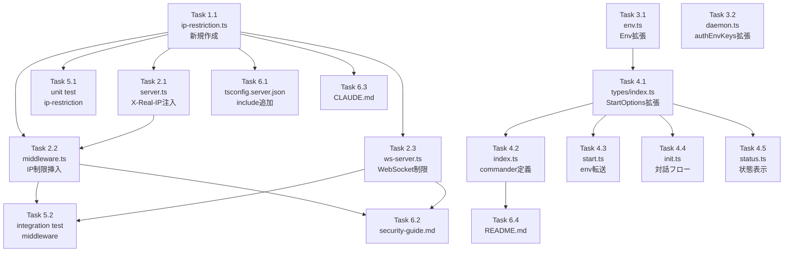

# 作業計画書

## Issue: アクセス元 IP の制限オプション

**Issue番号**: #332
**サイズ**: L
**優先度**: High
**依存Issue**: #331（トークン認証・HTTPS対応）
**設計方針書**: `dev-reports/design/issue-332-ip-restriction-design-policy.md`

---

## 実装概要

CommandMateサーバーへのアクセスを特定のIPアドレス/CIDRレンジに限定するオプション機能を追加する。
新規モジュール `src/lib/ip-restriction.ts`（Edge Runtime互換）をコアとして、HTTP（middleware.ts）と
WebSocket（ws-server.ts）の両レイヤーで多層防御（defense-in-depth）を実現する。

**影響ファイル数**: 19ファイル（新規2 + 変更13 + ドキュメント3 + ビルド設定1）

---

## 詳細タスク分解

### Phase 1: コアモジュール実装（新規作成）

#### Task 1.1: `src/lib/ip-restriction.ts` 新規作成
- **成果物**: `src/lib/ip-restriction.ts`
- **依存**: なし
- **内容**:
  - **内部定数（未export）**:
    - `IPV4_MAPPED_IPV6_PREFIX = '::ffff:'`
    - `IPV4_PATTERN` / `IPV4_CIDR_PATTERN`（正規表現）
    - `MAX_IPV4_PREFIX_LENGTH = 32`
    - `MAX_ALLOWED_IP_ENTRIES = 256`（DoS防止）
    - `MAX_CIDR_ENTRY_LENGTH = 18`（入力バリデーション）
  - **モジュールスコープ初期化**:
    - `const allowedIpsEnv = process.env.CM_ALLOWED_IPS?.trim() || ''`
    - `const trustProxyEnv = process.env.CM_TRUST_PROXY?.trim() || ''`（値検証+console.warn）
    - `const cachedRanges: CidrRange[]`（allowedIpsEnvをパース結果をキャッシュ）
  - **エクスポート関数**:
    - `parseAllowedIps(envValue: string): CidrRange[]` - fail-fast（throw）
    - `getAllowedRanges(): CidrRange[]` - キャッシュ返却
    - `isIpAllowed(ip: string, ranges: CidrRange[]): boolean` - OR判定
    - `normalizeIp(ip: string): string` - IPv4-mapped IPv6正規化
    - `isIpRestrictionEnabled(): boolean` - allowedIpsEnv.length > 0
    - `getClientIp(headers): string | null` - X-Real-IP/X-Forwarded-For取得
  - **エクスポート型**:
    - `CidrRange { network: number; mask: number }`

  > **注意点（設計方針書 S3-006）**: このモジュールはEdge Runtime互換が必須。
  > Node.js固有モジュール（`net`, `dns`, `fs` 等）を一切importしないこと。

- **実装時の注意**:
  - `parseAllowedIps()` でのバリデーション順序:
    1. エントリ数上限チェック（MAX_ALLOWED_IP_ENTRIES=256）
    2. 各エントリ長上限チェック（MAX_CIDR_ENTRY_LENGTH=18）
    3. IPv4/CIDR正規表現チェック
    4. オクテット範囲チェック（0-255）
    5. プレフィックス長チェック（0-32）

---

### Phase 2: サーバーサイド統合

#### Task 2.1: `server.ts` - X-Real-IPヘッダー注入
- **成果物**: `server.ts`（変更）
- **依存**: Task 1.1
- **内容**:
  - requestHandler内、L119後（setHeaderガードのreturn後）とL120（upgradeスキップif文の前）の間に挿入:
    ```typescript
    const clientIp = req.socket.remoteAddress || '';
    if (process.env.CM_TRUST_PROXY !== 'true') {
      req.headers['x-real-ip'] = clientIp;  // 偽ヘッダーを常に上書き
    } else {
      if (!req.headers['x-forwarded-for']) {
        req.headers['x-real-ip'] = clientIp;
      }
    }
    ```

#### Task 2.2: `src/middleware.ts` - IP制限チェック挿入
- **成果物**: `src/middleware.ts`（変更）
- **依存**: Task 1.1
- **内容**:
  - `import { getAllowedRanges, isIpAllowed, isIpRestrictionEnabled, getClientIp, normalizeIp } from '../lib/ip-restriction'` を追加
  - middleware関数の先頭（Step 1）に挿入（WebSocket upgrade処理よりも前）:
    ```typescript
    if (isIpRestrictionEnabled()) {
      const clientIp = getClientIp(request.headers);
      if (!clientIp || !isIpAllowed(clientIp, getAllowedRanges())) {
        const safeIp = clientIp ? normalizeIp(clientIp).substring(0, 45) : 'unknown';
        console.warn(`[IP-RESTRICTION] Denied: ${safeIp}`);
        return new NextResponse(null, { status: 403 });
      }
    }
    ```

  > **注意点（設計方針書 S4-003）**: AUTH_EXCLUDED_PATHS（/login等）を含む全リクエストがIP制限の対象となる。
  > このStep 1はWebSocket upgradeチェック（Step 2）よりも前に配置すること。

#### Task 2.3: `src/lib/ws-server.ts` - WebSocket IP制限追加
- **成果物**: `src/lib/ws-server.ts`（変更）
- **依存**: Task 1.1
- **内容**:
  - `import { getAllowedRanges, isIpAllowed, isIpRestrictionEnabled, normalizeIp } from './ip-restriction'` を追加
  - upgradeハンドラー内、HMRフィルタ（L71-77）の後・認証チェック（L79）の前に挿入:
    ```typescript
    if (isIpRestrictionEnabled()) {
      const clientIp = normalizeIp(request.socket.remoteAddress || '');
      if (!isIpAllowed(clientIp, getAllowedRanges())) {
        socket.write('HTTP/1.1 403 Forbidden\r\n\r\n');
        socket.destroy();
        return;
      }
    }
    ```

  > **注意点（設計方針書 S2-008）**: WebSocket upgradeではgetClientIp()を使用しない。
  > `request.socket.remoteAddress`を直接使用（X-Real-IP/X-Forwarded-Forは未適用）。

---

### Phase 3: 設定・環境変数レイヤー

#### Task 3.1: `src/lib/env.ts` - Envインターフェース拡張
- **成果物**: `src/lib/env.ts`（変更）
- **依存**: なし
- **内容**:
  - Envインターフェースに以下を追加:
    ```typescript
    CM_ALLOWED_IPS?: string;  // 許可IPリスト（カンマ区切り）
    CM_TRUST_PROXY?: string;  // リバースプロキシ信頼設定（'true'/'false'）
    ```
  > **注意点（設計方針書 S2-002）**: getEnv()の戻り値には含めない（既存のCM_AUTH_TOKEN_HASHパターンと同じ）。
  > `ENV_MAPPING`への追加も不要（レガシー名が存在しないため）。

#### Task 3.2: `src/cli/utils/daemon.ts` - authEnvKeys拡張
- **成果物**: `src/cli/utils/daemon.ts`（変更）
- **依存**: なし
- **内容**:
  - authEnvKeys配列に追加（**必須**: 漏れるとdaemonモードでIP制限が機能しない）:
    ```typescript
    'CM_ALLOWED_IPS',    // 追加
    'CM_TRUST_PROXY',    // 追加
    ```

---

### Phase 4: CLI統合

#### Task 4.1: `src/cli/types/index.ts` - StartOptions拡張
- **成果物**: `src/cli/types/index.ts`（変更）
- **依存**: なし
- **内容**: StartOptionsに `allowedIps?: string`、`trustProxy?: boolean` を追加

#### Task 4.2: `src/cli/index.ts` - commander オプション定義追加
- **成果物**: `src/cli/index.ts`（変更）
- **依存**: Task 4.1
- **内容**:
  ```
  .option('--allowed-ips <cidrs>', 'Allowed IP addresses/CIDR ranges (comma-separated)')
  .option('--trust-proxy', 'Trust X-Forwarded-For header from reverse proxy')
  ```

#### Task 4.3: `src/cli/commands/start.ts` - 環境変数転送追加
- **成果物**: `src/cli/commands/start.ts`（変更）
- **依存**: Task 4.1、Task 4.2
- **内容**:
  - daemonモード: authEnvKeys転送前にprocess.env設定
  - foregroundモード（L286-300付近のIssue #331環境変数設定ブロックの後）に追加:
    ```typescript
    if (options.allowedIps) {
      process.env.CM_ALLOWED_IPS = options.allowedIps;
    }
    if (options.trustProxy) {
      process.env.CM_TRUST_PROXY = 'true';
    }
    ```
  - `CM_ALLOWED_IPS`設定時の`REVERSE_PROXY_WARNING`非表示: 警告表示条件に`!options.allowedIps`を追加

#### Task 4.4: `src/cli/commands/init.ts` - IP制限設定の対話フロー追加
- **成果物**: `src/cli/commands/init.ts`（変更）
- **依存**: Task 4.1
- **内容**:
  - 対話形式でIP制限設定の有無を確認
  - 設定する場合はCIDRレンジの入力を促す
  - `.env`ファイルへの自動書き出し

#### Task 4.5: `src/cli/commands/status.ts` - IP制限状態表示
- **成果物**: `src/cli/commands/status.ts`（変更）
- **依存**: Task 4.1
- **内容**: IP制限設定の有無と設定値を表示

#### Task 4.6: `src/cli/config/security-messages.ts` - 警告メッセージ更新
- **成果物**: `src/cli/config/security-messages.ts`（変更）
- **依存**: なし
- **内容**: REVERSE_PROXY_WARNINGに`--allowed-ips`オプションの案内を追加

---

### Phase 5: テスト実装

#### Task 5.1: `tests/unit/ip-restriction.test.ts` 新規作成
- **成果物**: `tests/unit/ip-restriction.test.ts`（新規）
- **依存**: Task 1.1
- **テストケース網羅**:
  - `parseAllowedIps()`:
    - 単一IP（/32）
    - CIDR範囲（/24、/8等）
    - 複数CIDR（カンマ区切り）
    - 空文字・空白のみ → 空配列
    - 不正CIDR形式 → Error throw
    - オクテット範囲外（256等）→ Error throw
    - プレフィックス長範囲外（33等）→ Error throw
    - エントリ数上限超過（MAX_ALLOWED_IP_ENTRIES+1）→ Error throw
    - エントリ長上限超過（MAX_CIDR_ENTRY_LENGTH+1）→ Error throw
    - `/0`（全許可）→ 許可
  - `isIpAllowed()`:
    - マッチするIP → true
    - マッチしないIP → false
    - 複数CIDRのいずれかにマッチ → true（OR判定）
    - 空のranges → false
  - `normalizeIp()`:
    - IPv4アドレス → そのまま
    - IPv4-mapped IPv6（`::ffff:192.168.1.1`）→ `192.168.1.1`
    - 純粋なIPv6 → そのまま
    - 空文字 → 空文字
  - `isIpRestrictionEnabled()`:
    - `vi.resetModules()`パターンで環境変数変更を反映
  - `getClientIp()`:
    - CM_TRUST_PROXY=false: X-Real-IPを使用
    - CM_TRUST_PROXY=true: X-Forwarded-For先頭IPを使用
    - ヘッダーなし → null

  > **注意点（設計方針書 S3-001）**: モジュールスコープキャッシュのテスト:
  > ```typescript
  > beforeEach(() => {
  >   delete process.env.CM_ALLOWED_IPS;
  >   delete process.env.CM_TRUST_PROXY;
  > });
  > // 環境変数を変更する場合:
  > process.env.CM_ALLOWED_IPS = '192.168.0.0/24';
  > await vi.resetModules();
  > const { isIpRestrictionEnabled } = await import('../../../src/lib/ip-restriction');
  > ```

#### Task 5.2: `tests/integration/auth-middleware.test.ts` - IP制限テスト追加
- **成果物**: `tests/integration/auth-middleware.test.ts`（変更）
- **依存**: Task 1.1、Task 2.2
- **テストケース**:
  - IP制限有効時: 許可IPからのリクエスト → 通過
  - IP制限有効時: 拒否IPからのリクエスト → 403
  - IP制限有効時: AUTH_EXCLUDED_PATHS（/loginページ）も拒否 → 403（S4-003確認）
  - IP制限無効時: CM_ALLOWED_IPS未設定 → 通過（既存動作変化なし）
  - CM_TRUST_PROXY=true: X-Forwarded-For先頭IPで判定
  - CM_TRUST_PROXY=false: X-Real-IPで判定（偽ヘッダー上書き確認）

  > **注意点（設計方針書 S3-003）**: daemon.test.ts の authEnvKeys 転送テストに
  > CM_ALLOWED_IPS/CM_TRUST_PROXY のケースを追加:
  > - `beforeEach`にてCM_ALLOWED_IPS/CM_TRUST_PROXYをenv削除
  > - CM_ALLOWED_IPSがspawnのenvに正しく転送されることを確認

---

### Phase 6: ビルド設定・ドキュメント

#### Task 6.1: `tsconfig.server.json` - includeリスト更新
- **成果物**: `tsconfig.server.json`（変更）
- **依存**: Task 1.1
- **内容**: includeリストに `"src/lib/ip-restriction.ts"` を追加
- > **重要（設計方針書 S3-002）**: ws-server.tsがip-restriction.tsをimportするため必須。漏れると`npm run build:server`でエラー。

#### Task 6.2: `docs/security-guide.md` 更新
- **成果物**: `docs/security-guide.md`（変更）
- **依存**: Task 2.2、Task 2.3
- **内容**:
  - IP制限の設定方法（環境変数・CLIオプション）
  - CM_TRUST_PROXY の運用要件（リバースプロキシ設定）
  - セキュリティチェックリストへの追加

#### Task 6.3: `CLAUDE.md` 更新
- **成果物**: `CLAUDE.md`（変更）
- **依存**: Task 1.1
- **内容**:
  - 主要機能モジュール一覧に `src/lib/ip-restriction.ts` を追加
  - `src/config/auth-config.ts`（Issue #332: CM_ALLOWED_IPS/CM_TRUST_PROXY追加）を記載

#### Task 6.4: `README.md` 更新
- **成果物**: `README.md`（変更）
- **依存**: Task 4.2
- **内容**: `CM_ALLOWED_IPS` / `CM_TRUST_PROXY` の説明追加

---

## タスク依存関係



---

## 実装順序（推奨）

| 優先度 | Task | 理由 |
|--------|------|------|
| 1 | Task 1.1（ip-restriction.ts） | 全タスクの基盤 |
| 2 | Task 3.1（env.ts）、Task 3.2（daemon.ts） | 依存なし、後続に必要 |
| 3 | Task 2.1（server.ts） | middleware.tsより前 |
| 4 | Task 2.2（middleware.ts）、Task 2.3（ws-server.ts） | コア機能 |
| 5 | Task 4.1（types）、Task 4.6（security-messages） | CLI統合の基盤 |
| 6 | Task 4.2（index.ts）、Task 4.3（start.ts）、Task 4.4（init.ts）、Task 4.5（status.ts） | CLI機能 |
| 7 | Task 5.1（unit test）、Task 5.2（integration test） | テスト（TDDではTask 1.1と同時） |
| 8 | Task 6.1（tsconfig.server.json） | ビルド設定 |
| 9 | Task 6.2（security-guide）、Task 6.3（CLAUDE.md）、Task 6.4（README.md） | ドキュメント |

---

## 品質チェック項目

| チェック項目 | コマンド | 基準 |
|-------------|----------|------|
| ESLint | `npm run lint` | エラー0件 |
| TypeScript | `npx tsc --noEmit` | 型エラー0件 |
| Unit Test | `npm run test:unit` | 全テストパス |
| Build (Next.js) | `npm run build` | 成功 |
| Build (CLI) | `npm run build:cli` | 成功 |
| Build (Server) | `npm run build:server` | 成功（tsconfig.server.json更新後） |

---

## 成果物チェックリスト

### 新規作成ファイル
- [ ] `src/lib/ip-restriction.ts`
- [ ] `tests/unit/ip-restriction.test.ts`

### 変更が必要なファイル

#### コア
- [ ] `server.ts` - X-Real-IP注入
- [ ] `src/middleware.ts` - IP制限チェック（Step 1）
- [ ] `src/lib/ws-server.ts` - WebSocket IP制限

#### 設定
- [ ] `src/lib/env.ts` - Env interface拡張
- [ ] `src/cli/utils/daemon.ts` - authEnvKeys拡張（**必須**）

#### CLI
- [ ] `src/cli/types/index.ts` - StartOptions拡張
- [ ] `src/cli/index.ts` - commander定義追加
- [ ] `src/cli/commands/start.ts` - env転送・警告抑制
- [ ] `src/cli/commands/init.ts` - 対話フロー追加
- [ ] `src/cli/commands/status.ts` - 状態表示追加
- [ ] `src/cli/config/security-messages.ts` - 警告メッセージ更新

#### テスト
- [ ] `tests/integration/auth-middleware.test.ts` - IP制限テスト追加

#### ビルド設定
- [ ] `tsconfig.server.json` - include追加（**必須**）

#### ドキュメント
- [ ] `docs/security-guide.md`
- [ ] `CLAUDE.md`
- [ ] `README.md`

---

## Definition of Done

- [ ] 環境変数 `CM_ALLOWED_IPS` でIPアドレス/CIDRレンジを指定できる
- [ ] 許可リスト外IPからのHTTPリクエストが403で拒否される
- [ ] WebSocket接続にもIP制限が適用される
- [ ] `CM_ALLOWED_IPS` 未設定時はIP制限なしで動作する（後方互換性）
- [ ] 既存のトークン認証（`CM_AUTH_TOKEN_HASH`）と併用できる
- [ ] `CM_TRUST_PROXY=true` の場合、X-Forwarded-ForのIPを使用する
- [ ] `CM_TRUST_PROXY=false` の場合、server.tsがX-Real-IPとして注入し偽ヘッダーを防ぐ
- [ ] IPv4-mapped IPv6アドレスが正しく処理される
- [ ] Edge Runtime環境で動作する（Node.js固有モジュール不使用）
- [ ] `--allowed-ips` / `--trust-proxy` CLIオプションで設定できる
- [ ] daemonモードでIP制限が機能する（daemon.ts authEnvKeys更新済み）
- [ ] 不正CIDR設定時にfail-fast（サーバー起動エラー）となる
- [ ] TypeScriptビルド（tsc --noEmit）エラー0件
- [ ] ESLintエラー0件
- [ ] 単体テスト全パス（カバレッジ80%以上）
- [ ] 統合テスト全パス
- [ ] ドキュメント更新完了（security-guide.md、CLAUDE.md、README.md）

---

## セキュリティ実装チェックリスト

### 設計方針書 Stage 4（セキュリティレビュー）指摘事項

- [ ] **S4-001**: getClientIp()のJSDocにX-Forwarded-For先頭IP使用警告を明記
- [ ] **S4-002**: MAX_ALLOWED_IP_ENTRIES=256 の内部定数を実装
- [ ] **S4-003**: IP制限をAUTH_EXCLUDED_PATHS評価より前（Step 1）に配置
- [ ] **S4-004**: ログ出力前にnormalizeIp()適用、substring(0, 45)で切り詰め
- [ ] **S4-005**: MAX_CIDR_ENTRY_LENGTH=18 の内部定数を実装
- [ ] **S4-006**: CM_TRUST_PROXY非準拠値（'true'/'false'以外）へのconsole.warn実装

---

## 次のアクション

1. **実装開始**: Task 1.1（ip-restriction.ts）から着手（TDDで実装）
2. **ブランチ**: `feature/332-worktree`（現在のブランチ）
3. **進捗報告**: `/progress-report` で定期報告
4. **PR作成**: `/create-pr` で自動作成

---

*Generated by work-plan command for Issue #332*
