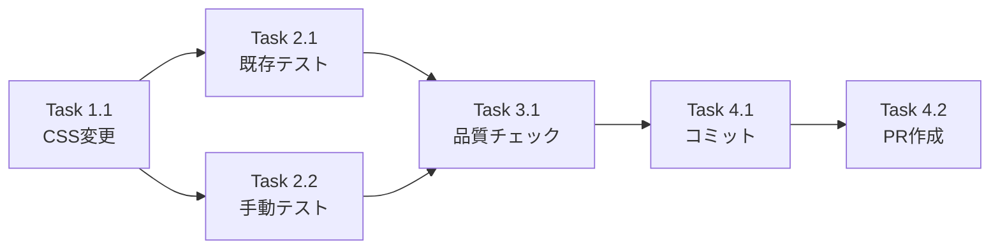

# 作業計画書: Issue #34

## Issue概要

| 項目 | 内容 |
|------|------|
| **Issue番号** | #34 |
| **タイトル** | スマホ利用時メッセージ入力欄をスクロール可能にしてほしい |
| **サイズ** | **XS**（1行変更） |
| **優先度** | Medium |
| **依存Issue** | なし |
| **ブランチ名** | `fix/34-mobile-textarea-scroll` |

---

## 関連ドキュメント

| ドキュメント | パス | ステータス |
|-------------|------|-----------|
| 設計方針書 | `dev-reports/design/issue-34-mobile-textarea-scroll-design-policy.md` | 完了 |
| アーキテクチャレビュー | `dev-reports/design/issue-34-architecture-review.md` | **Approved** |

---

## 変更概要

### 変更ファイル

| ファイル | 変更内容 | 行数 |
|---------|---------|------|
| `src/components/worktree/MessageInput.tsx` | CSSクラス変更 | 1行 |

### 変更詳細

```diff
// src/components/worktree/MessageInput.tsx (219行目)
- className="flex-1 outline-none bg-transparent resize-none py-1 overflow-hidden"
+ className="flex-1 outline-none bg-transparent resize-none py-1 overflow-y-auto scrollbar-thin"
```

---

## 詳細タスク分解

### Phase 1: 実装（5分）

| タスク | 内容 | 成果物 | 依存 |
|--------|------|--------|------|
| **Task 1.1** | CSS クラス変更 | `MessageInput.tsx` | なし |

### Phase 2: テスト（10分）

| タスク | 内容 | 成果物 | 依存 |
|--------|------|--------|------|
| **Task 2.1** | 既存テスト実行 | テスト結果 | Task 1.1 |
| **Task 2.2** | 手動テスト（モバイルエミュレーター） | 動作確認 | Task 1.1 |

### Phase 3: 品質チェック（5分）

| タスク | 内容 | 成果物 | 依存 |
|--------|------|--------|------|
| **Task 3.1** | lint/type-check/build | CI準拠確認 | Task 1.1 |

### Phase 4: PR作成（5分）

| タスク | 内容 | 成果物 | 依存 |
|--------|------|--------|------|
| **Task 4.1** | コミット作成 | Git commit | Task 3.1 |
| **Task 4.2** | PR作成 | GitHub PR | Task 4.1 |

---

## タスク依存関係



---

## 実装手順

### Step 1: ブランチ作成

```bash
git checkout develop
git pull origin develop
git checkout -b fix/34-mobile-textarea-scroll
```

### Step 2: コード変更

**ファイル**: `src/components/worktree/MessageInput.tsx`
**行**: 219

```typescript
// Before
className="flex-1 outline-none bg-transparent resize-none py-1 overflow-hidden"

// After
className="flex-1 outline-none bg-transparent resize-none py-1 overflow-y-auto scrollbar-thin"
```

### Step 3: テスト実行

```bash
# 既存テスト実行
npm run test:unit -- tests/unit/components/worktree/MessageInput.test.tsx

# 全体テスト
npm run test:unit
```

### Step 4: 手動テスト

1. `npm run dev` で開発サーバー起動
2. Chrome DevTools でモバイルエミュレーション（iPhone 12/13）
3. メッセージ入力欄に10行以上のテキストを入力
4. スクロールが可能であることを確認
5. テキスト編集が正常に動作することを確認

### Step 5: 品質チェック

```bash
npm run lint
npx tsc --noEmit
npm run build
```

### Step 6: コミット＆PR

```bash
git add src/components/worktree/MessageInput.tsx
git commit -m "fix(ux): enable scroll in mobile message input textarea

- Change overflow-hidden to overflow-y-auto for scrollable content
- Add scrollbar-thin class for consistent scrollbar styling
- Fixes #34"
git push -u origin fix/34-mobile-textarea-scroll
```

---

## 品質チェック項目

| チェック項目 | コマンド | 基準 |
|-------------|----------|------|
| ESLint | `npm run lint` | エラー0件 |
| TypeScript | `npx tsc --noEmit` | 型エラー0件 |
| Unit Test | `npm run test:unit` | 全テストパス |
| Build | `npm run build` | 成功 |

---

## 手動テストチェックリスト

| No | テストケース | 期待結果 | 確認 |
|----|-------------|---------|------|
| 1 | 短文（1-2行）入力 | 高さ自動調整、スクロールバー非表示 | [ ] |
| 2 | 中文（3-6行）入力 | 高さ自動調整、スクロールバー非表示 | [ ] |
| 3 | 長文（7行以上）入力 | 高さ160px固定、スクロール可能 | [ ] |
| 4 | スクロール後に編集 | 正常に編集可能 | [ ] |
| 5 | 長文削除 | 高さが自動で縮小 | [ ] |
| 6 | デスクトップ確認 | 既存動作維持 | [ ] |

---

## Definition of Done

Issue完了条件：

- [ ] `MessageInput.tsx` の CSS クラス変更完了
- [ ] 既存テスト全パス
- [ ] 手動テスト完了（モバイルエミュレーター）
- [ ] CI チェック全パス（lint, type-check, test, build）
- [ ] PR 作成・レビュー承認
- [ ] main ブランチへマージ

---

## リスクと対策

| リスク | 発生確率 | 対策 |
|--------|---------|------|
| 既存テスト失敗 | 極低 | CSS変更のみなので影響なし |
| モバイルスクロール非対応 | 極低 | 標準CSSプロパティ使用 |
| iOS Safari で問題 | 低 | 事前にエミュレーターで確認 |

---

## 見積もり

| 項目 | 時間 |
|------|------|
| 実装 | 5分 |
| テスト | 10分 |
| 品質チェック | 5分 |
| PR作成 | 5分 |
| **合計** | **約25分** |

---

## 次のアクション

1. **即時実行可能**: 設計レビュー承認済み
2. **ブランチ作成**: `fix/34-mobile-textarea-scroll`
3. **実装**: 1行変更
4. **PR作成**: `/create-pr` で自動作成

---

## 署名

| 役割 | 担当者 | 日付 |
|------|--------|------|
| 計画作成 | Claude | 2026-01-12 |
