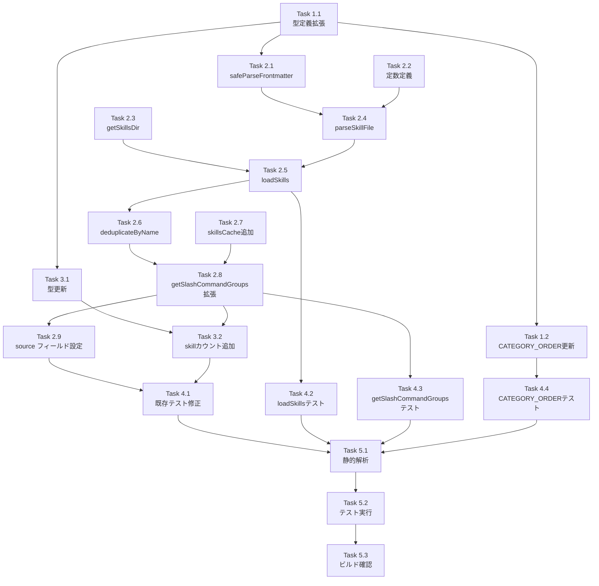

# 作業計画: Issue #343 - スラッシュコマンドセレクターで .claude/skills も表示する

## Issue概要

**Issue番号**: #343
**タイトル**: feat: スラッシュコマンドセレクターで .claude/skills も表示する
**サイズ**: M
**優先度**: High
**依存Issue**: なし

---

## 詳細タスク分解

### Phase 1: 型定義・設定変更（最優先）

> ⚠️ 型定義変更はコンパイルエラーを引き起こすため最初に実施する

#### Task 1.1: 型定義の拡張
- **対象ファイル**: `src/types/slash-commands.ts`
- **内容**:
  - `SlashCommandCategory` に `'skill'` を追加
  - `SlashCommandSource` に `'skill'` を追加
  - `CATEGORY_LABELS` に `skill: 'Skills'` を追加（Record型の制約により必須）
- **完了条件**: `npx tsc --noEmit` でエラー0件

#### Task 1.2: カテゴリ表示順序の更新
- **対象ファイル**: `src/lib/command-merger.ts`
- **内容**:
  - `CATEGORY_ORDER` に `'skill'` を追加（`'workflow'` と `'standard-session'` の間、6番目の位置）
- **完了条件**: 型エラーなし

---

### Phase 2: skills 読み込みロジック実装

#### Task 2.1: `safeParseFrontmatter()` の実装（セキュリティ最優先）
- **対象ファイル**: `src/lib/slash-commands.ts`
- **内容**:
  ```typescript
  const SAFE_MATTER_OPTIONS = {
    engines: {
      js: { parse: () => { throw new Error('JS engine disabled'); }, stringify: () => '' },
      javascript: { parse: () => { throw new Error('JS engine disabled'); }, stringify: () => '' },
    },
  };
  function safeParseFrontmatter(content: string) {
    return matter(content, SAFE_MATTER_OPTIONS);
  }
  ```
  - 既存の `parseCommandFile()` も `safeParseFrontmatter()` を使用するよう更新
- **完了条件**: `---js` 形式の frontmatter を含む SKILL.md が安全に処理される

#### Task 2.2: skills 読み込み定数定義
- **対象ファイル**: `src/lib/slash-commands.ts`
- **内容**:
  ```typescript
  const MAX_SKILLS_COUNT = 100;
  const MAX_SKILL_FILE_SIZE_BYTES = 65536; // 64KB
  const MAX_SKILL_NAME_LENGTH = 100;
  const MAX_SKILL_DESCRIPTION_LENGTH = 500;
  ```

#### Task 2.3: `getSkillsDir()` の実装
- **対象ファイル**: `src/lib/slash-commands.ts`
- **内容**:
  ```typescript
  function getSkillsDir(basePath?: string): string {
    const root = basePath || process.cwd();
    return path.join(root, '.claude', 'skills');
  }
  ```

#### Task 2.4: `parseSkillFile()` の実装
- **対象ファイル**: `src/lib/slash-commands.ts`
- **内容**:
  - 引数: `skillDirPath: string, skillName: string`
  - `safeParseFrontmatter()` を使用して SKILL.md をパース
  - `name`, `description` を取得（`MAX_SKILL_NAME_LENGTH`, `MAX_SKILL_DESCRIPTION_LENGTH` で切り詰め）
  - ファイルサイズ事前チェック（`MAX_SKILL_FILE_SIZE_BYTES` 超過時はスキップ）
  - エラー時は `console.error()` でログ出力して `null` を返す
  - `category: 'skill'`, `source: 'skill'` を明示的に設定

#### Task 2.5: `loadSkills()` の実装
- **対象ファイル**: `src/lib/slash-commands.ts`
- **内容**:
  ```typescript
  export async function loadSkills(basePath?: string): Promise<SlashCommand[]> {
    const skillsDir = getSkillsDir(basePath);
    if (!fs.existsSync(skillsDir)) return [];
    const entries = fs.readdirSync(skillsDir, { withFileTypes: true });
    const skills: SlashCommand[] = [];
    let count = 0;
    for (const entry of entries) {
      // セキュリティ: シンボリックリンク不追跡（isDirectory() は symlink に対して false）
      if (!entry.isDirectory()) continue;
      // セキュリティ: '..' エントリを拒否
      if (entry.name.includes('..')) continue;
      // セキュリティ: パス検証
      const resolvedPath = path.resolve(skillsDir, entry.name);
      if (!resolvedPath.startsWith(path.resolve(skillsDir) + path.sep)) continue;
      // DoS 対策: 上限チェック
      if (count >= MAX_SKILLS_COUNT) {
        console.warn(`loadSkills: MAX_SKILLS_COUNT (${MAX_SKILLS_COUNT}) exceeded, skipping remaining skills`);
        break;
      }
      const skill = parseSkillFile(resolvedPath, entry.name);
      if (skill) { skills.push(skill); count++; }
    }
    skills.sort((a, b) => a.name.localeCompare(b.name));
    return skills;
  }
  ```

#### Task 2.6: `deduplicateByName()` ヘルパー実装
- **対象ファイル**: `src/lib/slash-commands.ts`
- **内容**:
  ```typescript
  function deduplicateByName(skills: SlashCommand[], commands: SlashCommand[]): SlashCommand[] {
    const map = new Map<string, SlashCommand>();
    for (const skill of skills) map.set(skill.name, skill);
    for (const cmd of commands) map.set(cmd.name, cmd); // commands で上書き = command 優先
    return Array.from(map.values());
  }
  ```

#### Task 2.7: `skillsCache` の追加と `clearCache()` 更新
- **対象ファイル**: `src/lib/slash-commands.ts`
- **内容**:
  ```typescript
  let skillsCache: SlashCommand[] | null = null;

  export function clearCache(): void {
    commandsCache = null;
    skillsCache = null; // 両方クリア
  }
  ```

#### Task 2.8: `getSlashCommandGroups()` の拡張
- **対象ファイル**: `src/lib/slash-commands.ts`
- **内容**: skills のロード・重複排除・統合
  ```typescript
  export async function getSlashCommandGroups(basePath?: string): Promise<SlashCommandGroup[]> {
    if (basePath) {
      const commands = await loadSlashCommands(basePath);
      const skills = await loadSkills(basePath);
      return groupByCategory(deduplicateByName(skills, commands));
    }
    // キャッシュ: 個別管理（片方失敗でも他方を再ロードしない）
    if (commandsCache === null) {
      commandsCache = await loadSlashCommands();
    }
    if (skillsCache === null) {
      skillsCache = await loadSkills().catch(() => []);
    }
    return groupByCategory(deduplicateByName(skillsCache, commandsCache));
  }
  ```

#### Task 2.9: `loadSlashCommands()` の `source` フィールド設定
- **対象ファイル**: `src/lib/slash-commands.ts`
- **内容**: `parseCommandFile()` の戻り値に basePath の有無で `source: 'worktree'` または `source: 'mcbd'` を設定
  ```typescript
  return {
    name: fileName,
    description: frontmatter.description || '',
    category: category as SlashCommandCategory,
    source: basePath ? 'worktree' : 'mcbd',  // 追加
    model: frontmatter.model,
    filePath: path.relative(process.cwd(), filePath),
  };
  ```
  ※ `loadSlashCommands()` に `basePath` を渡す形で判定

---

### Phase 3: API レスポンス拡張

#### Task 3.1: `SlashCommandsResponse` 型の更新
- **対象ファイル**: `src/app/api/worktrees/[id]/slash-commands/route.ts`
- **内容**:
  ```typescript
  interface SlashCommandsResponse {
    groups: ...;
    sources: {
      standard: number;
      worktree: number;
      mcbd: number;
      skill: number;  // 追加
    };
    cliTool: CLIToolType;
  }
  ```

#### Task 3.2: skill カウント計算の追加
- **対象ファイル**: `src/app/api/worktrees/[id]/slash-commands/route.ts`
- **内容**: `flatMap()` を1回に統合して DRY 化
  ```typescript
  const allFilteredCommands = filteredGroups.flatMap(g => g.commands);
  const filteredStandardCount = allFilteredCommands.filter(cmd => cmd.source === 'standard').length;
  const filteredWorktreeCount = allFilteredCommands.filter(cmd => cmd.source === 'worktree').length;
  const filteredSkillCount = allFilteredCommands.filter(cmd => cmd.source === 'skill').length;
  // sources レスポンスに skill: filteredSkillCount を追加
  ```

---

### Phase 4: テスト実装

#### Task 4.1: 既存テスト修正
- **対象ファイル**: `tests/unit/slash-commands.test.ts`
- **内容**:
  - L126 `validCategories` に `'skill'` を追加
  - L154-160 `labelMap` に `skill: 'Skills'` を追加
  - L48-57 `SlashCommandCategory` テストのカテゴリ数を 5 → 6 に更新
  - `getCachedCommands` テスト (L169-193): source フィールド追加による影響を確認・更新

- **対象ファイル**: `tests/integration/api-worktree-slash-commands.test.ts`
- **内容**: L91 の sources 検証に `sources.skill` のアサーション追加

#### Task 4.2: `loadSkills()` の新規単体テスト
- **対象ファイル**: `tests/unit/slash-commands.test.ts`（または新規ファイル）
- **テストフィクスチャ**: `tests/fixtures/skills/` ディレクトリに配置
  - `tests/fixtures/skills/valid-skill/SKILL.md` - 正常な SKILL.md
  - `tests/fixtures/skills/no-frontmatter/SKILL.md` - frontmatter なし
  - `tests/fixtures/skills/js-engine/SKILL.md` - `---js` 形式（RCE テスト用）
- **テストケース**:
  - スキル ディレクトリが存在する場合のパース検証
  - スキルディレクトリが存在しない場合は空配列を返す
  - 不正な SKILL.md はエラーログ出力後スキップ
  - `---js` 形式 frontmatter の安全な処理（エラーとなるが例外はスローしない）
  - シンボリックリンクエントリはスキップ（`vi.mock('fs')` でモック）
  - `..` を含むエントリを拒否
  - `MAX_SKILLS_COUNT` 超過時に警告ログ出力
  - `MAX_SKILL_FILE_SIZE_BYTES` 超過ファイルをスキップ

#### Task 4.3: `getSlashCommandGroups()` の新規単体テスト
- **テストケース**:
  - skills + commands の統合グルーピング
  - 同名の command が skill を優先する（`deduplicateByName` 検証）
  - `clearCache()` で `commandsCache` と `skillsCache` の両方がクリアされる
  - `loadSkills()` 失敗時に `skillsCache = []` となり再ロードされない

#### Task 4.4: `CATEGORY_ORDER` の配置検証テスト
- **対象ファイル**: `tests/unit/lib/command-merger.test.ts`
- **内容**: `'skill'` が `'workflow'` と `'standard-session'` の間に位置することを検証

---

### Phase 5: 品質検証・ドキュメント

#### Task 5.1: 静的解析チェック
```bash
npx tsc --noEmit
npm run lint
```

#### Task 5.2: テスト実行
```bash
npm run test:unit
npm run test:integration
```

#### Task 5.3: ビルド確認
```bash
npm run build
```

#### Task 5.4: CLAUDE.md 更新（任意）
- `src/lib/slash-commands.ts` の説明に `loadSkills()` 関数の追記を検討

---

## タスク依存関係



---

## 品質チェック項目

| チェック項目 | コマンド | 基準 |
|-------------|----------|------|
| ESLint | `npm run lint` | エラー0件 |
| TypeScript | `npx tsc --noEmit` | 型エラー0件 |
| Unit Test | `npm run test:unit` | 全テストパス |
| Integration Test | `npm run test:integration` | 全テストパス |
| Build | `npm run build` | 成功 |

---

## 成果物チェックリスト

### コード（変更）
- [ ] `src/types/slash-commands.ts` - 型定義拡張（'skill' 追加）
- [ ] `src/lib/command-merger.ts` - `CATEGORY_ORDER` 更新
- [ ] `src/lib/slash-commands.ts` - `safeParseFrontmatter` / `loadSkills` / `deduplicateByName` / `getSlashCommandGroups` 拡張
- [ ] `src/app/api/worktrees/[id]/slash-commands/route.ts` - `sources.skill` 追加

### テスト（更新・追加）
- [ ] `tests/unit/slash-commands.test.ts` - 既存テスト修正 + `loadSkills` / `getSlashCommandGroups` 新規テスト
- [ ] `tests/unit/lib/command-merger.test.ts` - `CATEGORY_ORDER` テスト追加
- [ ] `tests/integration/api-worktree-slash-commands.test.ts` - `sources.skill` 検証追加
- [ ] `tests/fixtures/skills/` - テストフィクスチャ作成

---

## Definition of Done

- [ ] 全タスク完了
- [ ] `npx tsc --noEmit` エラー0件
- [ ] `npm run lint` エラー0件
- [ ] `npm run test:unit` 全パス
- [ ] `npm run test:integration` 全パス
- [ ] `npm run build` 成功
- [ ] 受け入れ条件 1-11 が全て満たされている

---

## 実装順序サマリー

1. **最優先**: `SlashCommandSource` / `SlashCommandCategory` / `CATEGORY_LABELS` 型定義（Task 1.1）
2. **セキュリティ**: `safeParseFrontmatter()` 実装（Task 2.1）
3. **コア実装**: `loadSkills()` / `deduplicateByName()` / `getSlashCommandGroups()` 拡張（Task 2.2-2.8）
4. **source 設定**: `loadSlashCommands()` の source フィールド（Task 2.9）
5. **API 更新**: `SlashCommandsResponse` 型と skill カウント（Task 3.1-3.2）
6. **テスト**: 既存修正 + 新規テスト（Task 4.1-4.4）
7. **品質確認**: 静的解析・ビルド（Task 5.1-5.3）

---

## 関連ファイル

- 設計方針書: `dev-reports/design/issue-343-skills-loader-design-policy.md`
- Issueレビュー: `dev-reports/issue/343/issue-review/summary-report.md`
- 設計レビュー: `dev-reports/issue/343/multi-stage-design-review/summary-report.md`

---

*Generated by /work-plan - 2026-02-22*
