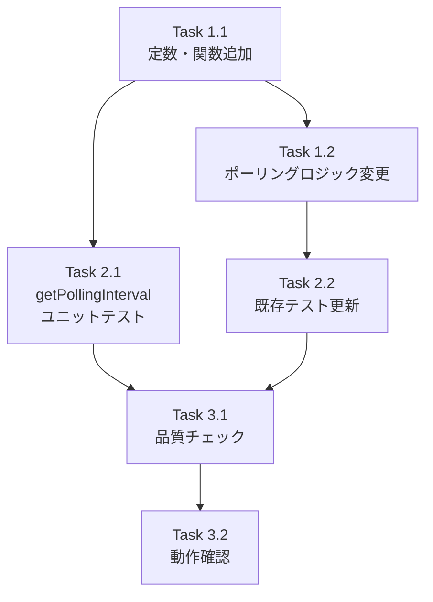

# 作業計画書: Issue #35

## Issue概要

**Issue番号**: #35
**タイトル**: パフォーマンス改善: ステータスに応じた動的ポーリング間隔の実装
**ラベル**: enhancement
**サイズ**: S（Small）
**優先度**: Medium
**依存Issue**: なし

### 概要

サイドバーのワークツリー一覧取得のポーリング間隔を、ステータスに応じて動的に変更することでパフォーマンスを改善する。

### 受入条件

- [ ] ステータスに応じてポーリング間隔が動的に変更される
- [ ] 処理中のワークツリーがある場合は2秒間隔
- [ ] セッション実行中（処理中以外）は5秒間隔
- [ ] アイドル状態は10秒間隔
- [ ] 既存のテストがパス
- [ ] 体感上のレスポンス低下がないこと

---

## 詳細タスク分解

### Phase 1: 実装（見積: 30分）

#### Task 1.1: 定数・関数の追加
- **成果物**: `src/contexts/WorktreeSelectionContext.tsx`
- **依存**: なし
- **内容**:
  - `POLLING_INTERVALS`定数の追加
  - `getPollingInterval`関数の実装

```typescript
const POLLING_INTERVALS = {
  PROCESSING: 2000,      // 処理中
  SESSION_RUNNING: 5000, // セッション実行中
  IDLE: 10000,           // アイドル
} as const;

function getPollingInterval(worktrees: Worktree[]): number {
  const hasActiveProcessing = worktrees.some(wt =>
    wt.isProcessing || wt.isWaitingForResponse
  );
  if (hasActiveProcessing) return POLLING_INTERVALS.PROCESSING;

  const hasRunning = worktrees.some(wt => wt.isSessionRunning);
  if (hasRunning) return POLLING_INTERVALS.SESSION_RUNNING;

  return POLLING_INTERVALS.IDLE;
}
```

#### Task 1.2: ポーリングロジックの変更
- **成果物**: `src/contexts/WorktreeSelectionContext.tsx`
- **依存**: Task 1.1
- **内容**:
  - `setInterval` → `setTimeout`への変更
  - 動的間隔決定ロジックの組み込み
  - クリーンアップ処理の更新

```typescript
useEffect(() => {
  const timeoutRef = { current: null as NodeJS.Timeout | null };
  let isMounted = true;

  const poll = async () => {
    if (!isMounted) return;

    try {
      const response = await worktreeApi.getAll();
      dispatch({ type: 'SET_WORKTREES', worktrees: response.worktrees });

      const nextInterval = getPollingInterval(response.worktrees);
      if (isMounted) {
        timeoutRef.current = setTimeout(poll, nextInterval);
      }
    } catch (err) {
      console.error('[WorktreeSelectionContext] Polling error:', err);
      if (isMounted) {
        timeoutRef.current = setTimeout(poll, POLLING_INTERVALS.SESSION_RUNNING);
      }
    }
  };

  poll();

  return () => {
    isMounted = false;
    if (timeoutRef.current) {
      clearTimeout(timeoutRef.current);
    }
  };
}, []);
```

### Phase 2: テスト（見積: 20分）

#### Task 2.1: getPollingInterval関数のユニットテスト
- **成果物**: `tests/unit/contexts/WorktreeSelectionContext.test.tsx`
- **依存**: Task 1.1
- **カバレッジ目標**: 100%（新規関数）

```typescript
describe('getPollingInterval', () => {
  it('should return 2000ms when any worktree is processing');
  it('should return 2000ms when any worktree is waiting for response');
  it('should return 5000ms when session is running but not processing');
  it('should return 10000ms when all worktrees are idle');
  it('should return 10000ms when worktrees array is empty');
});
```

#### Task 2.2: 既存テストの更新
- **成果物**: `tests/unit/contexts/WorktreeSelectionContext.test.tsx`
- **依存**: Task 1.2
- **内容**:
  - タイマーモックの更新（setInterval → setTimeout）
  - ポーリング動作テストの更新

### Phase 3: 品質確認（見積: 10分）

#### Task 3.1: 品質チェック実行
- **依存**: Task 2.1, Task 2.2
- **内容**:
  - ESLint実行
  - TypeScript型チェック
  - ユニットテスト実行
  - ビルド確認

#### Task 3.2: 動作確認
- **依存**: Task 3.1
- **内容**:
  - アイドル状態でのポーリング間隔確認（10秒）
  - セッション実行中のポーリング間隔確認（5秒）
  - 処理中のポーリング間隔確認（2秒）
  - ステータス変化時の間隔切り替え確認

---

## タスク依存関係



---

## 対象ファイル一覧

| ファイル | 変更種別 | 内容 |
|---------|---------|------|
| `src/contexts/WorktreeSelectionContext.tsx` | 修正 | ポーリングロジック変更 |
| `tests/unit/contexts/WorktreeSelectionContext.test.tsx` | 修正 | テスト追加・更新 |

---

## 品質チェック項目

| チェック項目 | コマンド | 基準 |
|-------------|----------|------|
| ESLint | `npm run lint` | エラー0件 |
| TypeScript | `npx tsc --noEmit` | 型エラー0件 |
| Unit Test | `npm run test:unit` | 全テストパス |
| Build | `npm run build` | 成功 |

---

## 成果物チェックリスト

### コード
- [ ] `POLLING_INTERVALS`定数
- [ ] `getPollingInterval`関数
- [ ] 動的ポーリングロジック（setTimeout使用）
- [ ] エラー時のフォールバック処理
- [ ] クリーンアップ処理

### テスト
- [ ] `getPollingInterval`のユニットテスト（5ケース）
- [ ] 既存テストの更新（タイマーモック）

---

## Definition of Done

Issue完了条件：

- [ ] すべてのタスクが完了
- [ ] 新規関数のテストカバレッジ100%
- [ ] CIチェック全パス（lint, type-check, test, build）
- [ ] 動作確認完了（3つのステータスでの間隔確認）
- [ ] コードレビュー承認

---

## 期待される効果

| 状態 | 現在 | 変更後 | 削減率 |
|-----|------|-------|-------|
| アイドル時 | 2秒 | 10秒 | **80%削減** |
| セッション実行時 | 2秒 | 5秒 | **60%削減** |
| 処理中 | 2秒 | 2秒 | 維持 |

---

## 次のアクション

作業計画承認後：

1. **ブランチ作成**: `feature/35-dynamic-polling-interval`
2. **タスク実行**: 計画に従って実装
3. **品質チェック**: 全チェックパスを確認
4. **PR作成**: `/create-pr`で自動作成

---

## 関連ドキュメント

- [設計方針書](../design/issue-35-dynamic-polling-design-policy.md)
- [アーキテクチャレビュー](../review/2026-01-11-issue-35-architecture-review.md)
