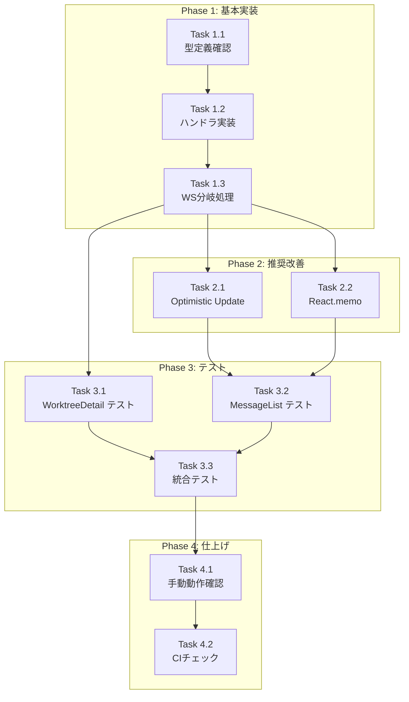

# Issue #36 作業計画書

## Issue概要

**タイトル**: UX改善: Yes/No回答時の不要なリロード・スクロールリセットを修正
**Issue番号**: #36
**ラベル**: bug, enhancement
**サイズ**: M（中規模）
**優先度**: High
**依存Issue**: なし

### 問題の要約

Yes/Noプロンプトに回答すると、画面がリロードされたように見え（先頭から末尾までスクロール）、UXが悪化している。原因は全メッセージ再取得とDOM再構築。

### 解決策の要約

1. WebSocketイベント種類別処理（`message_updated` vs `message`）
2. 差分更新（該当メッセージのみ更新/新規メッセージのみ追加）
3. Optimistic Update（即座にUI更新、失敗時ロールバック）
4. React.memo によるレンダリング最適化

---

## 詳細タスク分解

### Phase 1: 基本実装（WebSocket差分更新）

#### Task 1.1: 型定義の確認・拡張
- **成果物**: `src/hooks/useWebSocket.ts`
- **依存**: なし
- **作業内容**:
  - `ChatBroadcastPayload` 型の確認
  - `isChatPayload` 型ガードが `message_updated` にも対応しているか確認
  - 必要に応じて型定義を拡張

#### Task 1.2: メッセージ更新ハンドラの実装
- **成果物**: `src/components/worktree/WorktreeDetail.tsx`
- **依存**: Task 1.1
- **作業内容**:
  - `handleMessageUpdate` 関数の実装（エラーハンドリング付き）
  - `handleNewMessage` 関数の実装（重複チェック、エラーハンドリング付き）

#### Task 1.3: WebSocketメッセージハンドラの修正
- **成果物**: `src/components/worktree/WorktreeDetail.tsx`
- **依存**: Task 1.2
- **作業内容**:
  - `handleWebSocketMessage` のイベント種類別分岐追加
  - `message_updated` → `handleMessageUpdate` 呼び出し
  - `message` → `handleNewMessage` 呼び出し
  - 未知イベント → フォールバック `fetchMessages()`

### Phase 2: 推奨改善項目

#### Task 2.1: Optimistic Update の実装
- **成果物**: `src/components/worktree/MessageList.tsx`, `src/components/worktree/WorktreeDetail.tsx`
- **依存**: Task 1.3
- **作業内容**:
  - `MessageListProps` に `onOptimisticUpdate`, `onOptimisticRollback` を追加
  - `handlePromptResponse` を Optimistic Update 対応に修正
  - `WorktreeDetail` に `handleOptimisticUpdate`, `handleOptimisticRollback` を追加
  - `MessageList` への props 追加

#### Task 2.2: React.memo による MessageBubble 最適化
- **成果物**: `src/components/worktree/MessageList.tsx`
- **依存**: Task 1.3
- **作業内容**:
  - `MessageBubble` を `React.memo` でラップ
  - カスタム比較関数の実装（id, content, promptData.status, promptData.answer）
  - `onFilePathClick`, `onPromptRespond` が `useCallback` でメモ化されていることを確認

### Phase 3: テスト

#### Task 3.1: ユニットテストの追加
- **成果物**: `tests/unit/components/worktree/WorktreeDetail.test.tsx`
- **依存**: Task 1.3, Task 2.1, Task 2.2
- **作業内容**:
  - `handleMessageUpdate` のテスト
  - `handleNewMessage` のテスト（重複チェック含む）
  - `handleWebSocketMessage` のイベント分岐テスト

#### Task 3.2: MessageList テストの追加
- **成果物**: `tests/unit/components/worktree/MessageList.test.tsx`
- **依存**: Task 2.1, Task 2.2
- **作業内容**:
  - Optimistic Update のテスト
  - ロールバックのテスト
  - React.memo の動作確認テスト

#### Task 3.3: 統合テストの追加
- **成果物**: `tests/integration/yes-no-response.test.tsx`
- **依存**: Task 3.1, Task 3.2
- **作業内容**:
  - Yes/No回答フローの統合テスト
  - スクロール位置維持の確認
  - API失敗時のロールバック確認

### Phase 4: 動作確認・仕上げ

#### Task 4.1: 手動動作確認
- **依存**: Task 3.3
- **作業内容**:
  - Yes/No回答 → 即座にUI更新されることを確認
  - Yes/No回答 → スクロール位置が維持されることを確認
  - 新規メッセージ追加 → 末尾へスクロールすることを確認
  - API失敗時 → ロールバックされることを確認
  - 既存機能が正常に動作することを確認

#### Task 4.2: CIチェック
- **依存**: Task 4.1
- **作業内容**:
  - `npm run lint` → エラー0件
  - `npx tsc --noEmit` → 型エラー0件
  - `npm run test:unit` → 全テストパス
  - `npm run build` → 成功

---

## タスク依存関係

---

## 品質チェック項目

| チェック項目 | コマンド | 基準 |
|-------------|----------|------|
| ESLint | `npm run lint` | エラー0件 |
| TypeScript | `npx tsc --noEmit` | 型エラー0件 |
| Unit Test | `npm run test:unit` | 全テストパス |
| Build | `npm run build` | 成功 |

---

## 成果物チェックリスト

### コード変更

| ファイル | 変更内容 | 状態 |
|---------|---------|------|
| `src/hooks/useWebSocket.ts` | 型定義確認/拡張 | [ ] |
| `src/components/worktree/WorktreeDetail.tsx` | WebSocket分岐、ハンドラ実装 | [ ] |
| `src/components/worktree/MessageList.tsx` | Optimistic Update、React.memo | [ ] |

### テスト

| ファイル | 内容 | 状態 |
|---------|------|------|
| `tests/unit/components/worktree/WorktreeDetail.test.tsx` | ハンドラ、WS分岐テスト | [ ] |
| `tests/unit/components/worktree/MessageList.test.tsx` | Optimistic Update、memo テスト | [ ] |
| `tests/integration/yes-no-response.test.tsx` | Yes/No回答フローテスト | [ ] |

### ドキュメント

| ファイル | 内容 | 状態 |
|---------|------|------|
| `dev-reports/design/issue-36-yes-no-response-ux-design-policy.md` | 設計方針書 | [x] 完了 |
| `dev-reports/review/20260111-205214-architecture-review-issue-36.md` | アーキテクチャレビュー | [x] 完了 |
| `dev-reports/issue/36/work-plan.md` | 作業計画書（本ファイル） | [x] 完了 |

---

## Definition of Done

Issue完了条件：

- [ ] すべてのタスク（Phase 1-4）が完了
- [ ] 受入条件を満たす:
  - [ ] Yes/No回答後に画面がちらつかない
  - [ ] Yes/No回答後にスクロール位置が維持される
  - [ ] 全メッセージ再取得ではなく、該当メッセージのみ更新される
  - [ ] 既存のテストがパス
- [ ] CIチェック全パス（lint, type-check, test, build）
- [ ] コードレビュー承認
- [ ] 設計方針書・作業計画書の完成

---

## 関連ドキュメント

| ドキュメント | パス |
|-------------|------|
| 設計方針書 | `dev-reports/design/issue-36-yes-no-response-ux-design-policy.md` |
| アーキテクチャレビュー | `dev-reports/review/20260111-205214-architecture-review-issue-36.md` |
| Issue | https://github.com/Kewton/MyCodeBranchDesk/issues/36 |

---

## 次のアクション

作業計画承認後：

1. **ブランチ作成**: `feature/36-yes-no-response-ux`
2. **Phase 1 実行**: 基本実装（WebSocket差分更新）
3. **Phase 2 実行**: 推奨改善項目（Optimistic Update、React.memo）
4. **Phase 3 実行**: テスト追加
5. **Phase 4 実行**: 動作確認・CIチェック
6. **進捗報告**: `/progress-report` で定期報告
7. **PR作成**: `/create-pr` で自動作成
