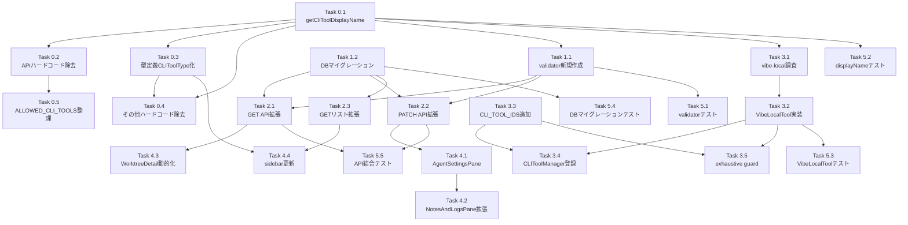

# Issue #368 作業計画書

## Issue: CMATEタブにAgent設定タブを追加し、表示するコーディングエージェントを選択可能にする

**Issue番号**: #368
**サイズ**: L
**優先度**: Medium
**依存Issue**: なし

---

## 詳細タスク分解

### Phase 0: 前提リファクタリング（CLI_TOOL_IDS一元化）

> **目的**: vibe-local追加前に全ハードコード箇所をCLI_TOOL_IDS参照に統一し、今後のツール追加コストをゼロにする。

- [ ] **Task 0.1**: `getCliToolDisplayName()` 共通関数の追加（`src/lib/cli-tools/types.ts`）
  - `CLI_TOOL_DISPLAY_NAMES` マッピング追加
  - `getCliToolDisplayName(id: CLIToolType): string` エクスポート
  - 成果物: `src/lib/cli-tools/types.ts`
  - 依存: なし

- [ ] **Task 0.2**: APIルートのハードコード除去（11ファイル）
  - `worktrees/route.ts`、`worktrees/[id]/route.ts`、`send/route.ts`、`current-output/route.ts`、`interrupt/route.ts`、`auto-yes/route.ts`、`cli-tool/route.ts`、`start-polling/route.ts`、`messages/route.ts`
  - ローカル配列を `CLI_TOOL_IDS` 参照に変更
  - `validCliTools` を `CLI_TOOL_IDS` から導出（R2-001対応）
  - 成果物: 上記11ファイル
  - 依存: Task 0.1

- [ ] **Task 0.3**: 型定義のCLIToolType化（`src/types/models.ts`、`src/types/sidebar.ts`）
  - `sessionStatusByCli` → `Partial<Record<CLIToolType, ...>>`（R1-002対応）
  - `lastMessagesByCli` → `Partial<Record<CLIToolType, string>>`
  - `SidebarBranchItem.cliStatus` → `Partial<Record<CLIToolType, BranchStatus>>`
  - `Worktree` インターフェースに `selectedAgents?: [CLIToolType, CLIToolType]` 追加（R2-005対応）
  - 成果物: `src/types/models.ts`、`src/types/sidebar.ts`
  - 依存: Task 0.1

- [ ] **Task 0.4**: その他ハードコード除去
  - `src/lib/api-client.ts`（4箇所のリテラル型 → `CLIToolType`）
  - `src/lib/log-manager.ts`（L187, L221のリテラル配列 + L91, L101, L137表示名）
  - `src/lib/db.ts`（`getLastMessagesByCliBatch()` 返値型変更、SQL IN句除去）（R4-001対応）
  - `src/lib/standard-commands.ts`（型アサーション修正）
  - `src/components/worktree/LogViewer.tsx`（cliToolFilter型）
  - `src/components/worktree/MessageList.tsx`（`getToolName()` → `getCliToolDisplayName()` 統一）
  - `src/components/worktree/AutoYesToggle.tsx`（`formatCliToolName()` → `getCliToolDisplayName()`）
  - `src/components/sidebar/BranchListItem.tsx`（ハードコード参照 → Optional Chaining）（R3-001対応）
  - `src/lib/claude-executor.ts`（`buildCliArgs()` 引数型を `CLIToolType` に変更）（R1-005対応）
  - `src/lib/cli-tools/base.ts`（`execAsync('which ...')` → `execFile` に変更）（R4-003対応）
  - 成果物: 上記10ファイル
  - 依存: Task 0.1, Task 0.3

- [ ] **Task 0.5**: ALLOWED_CLI_TOOLS整理
  - `claude-executor.ts` と `auto-yes/route.ts` の二重定義を役割別にリネーム検討（R3-006対応）
  - `INTERACTIVE_ALLOWED_CLI_TOOLS` / `NON_INTERACTIVE_ALLOWED_CLI_TOOLS` 分離
  - 成果物: `src/lib/claude-executor.ts`、`src/app/api/worktrees/[id]/auto-yes/route.ts`
  - 依存: Task 0.2

### Phase 1: バリデーション・DB設計

- [ ] **Task 1.1**: `selected-agents-validator.ts` 新規作成
  - `validateAgentsPair()` 共通コア関数（R1-001対応）
  - `parseSelectedAgents(raw: string | null)` （フォールバック + console.warn + ログサニタイズ）（R4-005対応）
  - `validateSelectedAgentsInput(input: unknown)` （APIバリデーション用）
  - 成果物: `src/lib/selected-agents-validator.ts`
  - 依存: Task 0.1

- [ ] **Task 1.2**: DBマイグレーション v18追加
  - `src/lib/db-migrations.ts` に migration version 18 追加
  - `ALTER TABLE worktrees ADD COLUMN selected_agents TEXT`
  - `UPDATE worktrees SET selected_agents = CASE ...`（cli_tool_id考慮の初期値設定）
  - 成果物: `src/lib/db-migrations.ts`
  - 依存: なし

- [ ] **Task 1.3**: `db.ts` `getLastMessagesByCliBatch()` 更新
  - 返値型を `Partial<Record<CLIToolType, string>>` に変更（R2-002対応）
  - SQL IN句を除去してアプリ層でフィルタリング（R4-001対応）
  - 成果物: `src/lib/db.ts`
  - 依存: Task 0.3

### Phase 2: API拡張

- [ ] **Task 2.1**: GET `/api/worktrees/[id]` 拡張
  - DBから `selected_agents` 取得 → `parseSelectedAgents()` でパース
  - レスポンスに `selectedAgents: [CLIToolType, CLIToolType]` フィールド追加
  - `isValidWorktreeId(params.id)` チェック追加（R4-002対応）
  - 成果物: `src/app/api/worktrees/[id]/route.ts`
  - 依存: Task 1.1, Task 1.2

- [ ] **Task 2.2**: PATCH `/api/worktrees/[id]` 拡張
  - リクエストボディに `selectedAgents` フィールド追加
  - `validateSelectedAgentsInput()` でバリデーション
  - `cli_tool_id` 整合性チェック + 自動更新（同一トランザクション）
  - `cliToolIdAutoUpdated` フラグをレスポンスに追加（R1-007対応）
  - `isValidWorktreeId(params.id)` チェック（R4-002対応）
  - 成果物: `src/app/api/worktrees/[id]/route.ts`
  - 依存: Task 1.1, Task 1.2

- [ ] **Task 2.3**: GET `/api/worktrees` 拡張
  - worktrees一覧で `selected_agents` を含める
  - `sessionStatusByCli` の型を `Partial<Record<CLIToolType, ...>>` に変更
  - 成果物: `src/app/api/worktrees/route.ts`
  - 依存: Task 1.1, Task 1.2

### Phase 3: CLIツール追加（vibe-local）

> **注意**: 技術調査後に実装。調査結果次第で別Issue分離の可能性あり。

- [ ] **Task 3.1**: vibe-local技術調査
  - 実行コマンド名・起動引数確認
  - プロンプト検出パターン確認
  - ステータス検出パターン確認
  - セキュリティチェックリスト確認（R4-004対応）
  - 成果物: 調査メモ（dev-reports/）

- [ ] **Task 3.2**: `VibeLocalTool` クラス実装
  - `src/lib/cli-tools/vibe-local.ts` 新規作成
  - `BaseCLITool` 継承、`id = 'vibe-local'`
  - 技術調査結果に基づいてセッション管理実装
  - 成果物: `src/lib/cli-tools/vibe-local.ts`
  - 依存: Task 3.1, Task 0.1

- [ ] **Task 3.3**: `CLI_TOOL_IDS` に `'vibe-local'` 追加
  - `src/lib/cli-tools/types.ts` 更新
  - `CLI_TOOL_DISPLAY_NAMES` に `'vibe-local': 'Vibe Local'` 追加
  - 成果物: `src/lib/cli-tools/types.ts`
  - 依存: Task 0.1

- [ ] **Task 3.4**: `CLIToolManager` にVibeLocalTool登録
  - `src/lib/cli-tools/manager.ts` 更新
  - 成果物: `src/lib/cli-tools/manager.ts`
  - 依存: Task 3.2, Task 3.3

- [ ] **Task 3.5**: switch文exhaustive guard導入（5箇所）
  - `cli-patterns.ts`（`detectThinking()`、`getCliToolPatterns()`）
  - `assistant-response-saver.ts`（`cleanCliResponse()`）
  - `claude-executor.ts`（`buildCliArgs()`）
  - `MessageList.tsx`（`getToolName()` → `getCliToolDisplayName()` 統一）
  - 成果物: 上記4ファイル
  - 依存: Task 3.3, Task 0.4

### Phase 4: UIコンポーネント実装

以下のTask 4.1〜4.3は並行実施可能（依存: Task 2.1, Task 2.2完了後）。

- [ ] **Task 4.1**: `AgentSettingsPane` コンポーネント新規作成
  - チェックボックスUIで2つまで選択
  - 2選択済み時の未選択項目disabled
  - `getCliToolDisplayName()` でツール名表示
  - PATCH API呼び出し（`selectedAgents` 更新）
  - `dangerouslySetInnerHTML` 禁止（R4-006対応）
  - i18n対応
  - 成果物: `src/components/worktree/AgentSettingsPane.tsx`
  - 依存: Task 2.2

- [ ] **Task 4.2**: `NotesAndLogsPane` 拡張（Agentサブタブ追加）
  - `SubTab = 'notes' | 'logs' | 'agent'` に型拡張
  - Agentタブ追加
  - `activeSubTab === 'agent'` 時に `AgentSettingsPane` を描画
  - i18nキー追加（`locales/en/schedule.json`、`locales/ja/schedule.json`）
  - 成果物: `src/components/worktree/NotesAndLogsPane.tsx`、i18nファイル
  - 依存: Task 4.1

- [ ] **Task 4.3**: `WorktreeDetailRefactored` 動的レンダリング
  - `selectedAgents` stateをGET APIレスポンスから取得
  - L1795（デスクトップ）、L2081（モバイル）のハードコード配列を `selectedAgents` に置換
  - `activeCliTab` 初期値を `selectedAgents[0]` に変更（R1-007, F502対応）
  - `useEffect` で `selectedAgents` 変更時に `activeCliTab` を同期
  - 成果物: `src/components/worktree/WorktreeDetailRefactored.tsx`
  - 依存: Task 2.1

- [ ] **Task 4.4**: `sidebar.ts` `toBranchItem()` 更新
  - `selectedAgents` 引数を追加
  - `cliStatus` を `Partial<Record<CLIToolType, BranchStatus>>` で格納
  - `BranchListItem.tsx` の参照を Optional Chaining に変更
  - 成果物: `src/types/sidebar.ts`、`src/components/sidebar/BranchListItem.tsx`
  - 依存: Task 0.3, Task 2.3

### Phase 5: テスト

- [ ] **Task 5.1**: `selected-agents-validator.ts` 単体テスト（新規）
  - `parseSelectedAgents()`: 正常値・不正JSON・配列長不正・不正ツールID・重複・null
  - `validateSelectedAgentsInput()`: 成功/失敗ケース
  - `validateAgentsPair()`: 共通コアのテスト
  - 成果物: `tests/unit/selected-agents-validator.test.ts`
  - 依存: Task 1.1

- [ ] **Task 5.2**: `getCliToolDisplayName()` 単体テスト
  - 全CLIToolID、ハイフン付きID（`'vibe-local'`）
  - 成果物: `tests/unit/cli-tools/display-name.test.ts`
  - 依存: Task 0.1

- [ ] **Task 5.3**: `VibeLocalTool` 単体テスト（Task 3.2完了後）
  - セッション管理、インストール確認
  - 成果物: `tests/unit/cli-tools/vibe-local.test.ts`
  - 依存: Task 3.2

- [ ] **Task 5.4**: DBマイグレーション v18 テスト
  - 全CLIToolType値に対するマイグレーション結果テスト（R1-010対応）
  - `cli_tool_id = 'gemini'` などの既存データのデフォルト値設定確認
  - 成果物: `tests/unit/db-migrations.test.ts`（既存ファイル拡張）
  - 依存: Task 1.2

- [ ] **Task 5.5**: API結合テスト
  - PATCH: selected_agents更新・バリデーションエラー・cli_tool_id自動更新
  - GET: selectedAgentsフィールドの返却確認
  - 成果物: `tests/integration/api/worktrees-selected-agents.test.ts`（新規）
  - 依存: Task 2.1, Task 2.2

- [ ] **Task 5.6**: 既存テストの修正
  - `tests/unit/cli-tools/` 内の `CLI_TOOL_IDS.length` アサーション更新（Task 3.3後）
  - `tests/integration/` の APIレスポンス形式変更対応
  - 成果物: 既存テストファイル更新
  - 依存: Task 3.3, Task 2.1, Task 2.2

### Phase 6: ドキュメント更新

- [ ] **Task 6.1**: CLAUDE.md更新
  - 新規モジュール（`selected-agents-validator.ts`、`AgentSettingsPane`、`vibe-local.ts`）の追加
  - 成果物: `CLAUDE.md`
  - 依存: Phase 1〜4完了後

---

## タスク依存関係

---

## 品質チェック項目

| チェック項目 | コマンド | 基準 |
|-------------|----------|------|
| ESLint | `npm run lint` | エラー0件 |
| TypeScript | `npx tsc --noEmit` | 型エラー0件 |
| Unit Test | `npm run test:unit` | 全テストパス |
| Integration Test | `npm run test:integration` | 全テストパス |
| Build | `npm run build` | 成功 |

---

## Definition of Done

- [ ] Phase 0: CLI_TOOL_IDSハードコード一元化完了（TS型エラー0件確認）
- [ ] Phase 1: バリデーター・DBマイグレーション実装完了
- [ ] Phase 2: API拡張完了（GET/PATCH両方）
- [ ] Phase 3: vibe-local実装完了（技術調査後）
- [ ] Phase 4: UIコンポーネント実装完了（AgentSettingsPane + 動的レンダリング）
- [ ] Phase 5: テスト全パス（カバレッジ80%以上）
- [ ] Phase 6: CLAUDE.md更新完了
- [ ] CIチェック全パス（lint / type-check / test / build）
- [ ] 受け入れ基準チェック全通過

---

## 受け入れ基準チェック

- [ ] CMATEタブに「Agent」サブタブが表示される
- [ ] Agentタブで利用可能なエージェント一覧（claude, codex, gemini, vibe-local）が表示される
- [ ] ユーザーが2つのエージェントを選択できる
- [ ] 3つ以上の選択はできない（UIで制御）
- [ ] 選択状態がWorktree単位で永続化される
- [ ] ターミナルヘッダーのエージェントタブが選択に応じて動的に切り替わる
- [ ] デフォルト値は `['claude', 'codex']`（既存動作の維持）
- [ ] デスクトップ・モバイル両方で正しく動作する
- [ ] vibe-localのtmuxセッション管理が他ツールと同様に機能する
- [ ] 既存テストが全てパスする

---

*Generated by work-plan skill for Issue #368*
