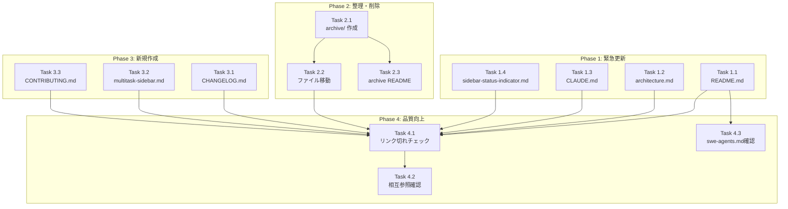

# Issue #37: ドキュメント最新化 - 作業計画書

## Issue概要

| 項目 | 内容 |
|------|------|
| **Issue番号** | #37 |
| **タイトル** | ドキュメント最新化: Issue #33対応と全体整理 |
| **ラベル** | documentation |
| **サイズ** | M（中規模） |
| **優先度** | High（Phase 1）/ Medium（Phase 2-4） |
| **状態** | OPEN |
| **依存Issue** | #33（Codex/Gemini UI削除 - CLOSED） |
| **設計方針書** | `dev-reports/design/issue-37-documentation-update-design-policy.md` |
| **アーキテクチャレビュー** | `dev-reports/review/2025-01-12-issue-37-architecture-review.md` |

### 問題の概要

Issue #33（Codex/Gemini UIからの削除）に伴うドキュメント更新と、全体的なドキュメント整理を行う。

### 主な問題点

1. **Codex/Gemini記載が古い** - UIから削除済みだが、ドキュメントは3ツール対応と記載
2. **実装計画が陳腐化** - 実装完了後も残存
3. **CHANGELOGがない** - リリースノート・変更履歴がない
4. **命名規則が不統一** - ALL_CAPSと小文字が混在
5. **機能ドキュメント不足** - 実装済み機能のドキュメントが2件のみ

---

## 実装フェーズ概要

| Phase | 内容 | 優先度 | 作業量 |
|-------|------|--------|--------|
| **Phase 1** | 緊急更新（Issue #33対応） | 高 | 小 |
| **Phase 2** | 整理・削除 | 中 | 小 |
| **Phase 3** | 新規作成 | 中 | 中 |
| **Phase 4** | 品質向上 | 低 | 小〜中 |

---

## Phase 1: 緊急更新（Issue #33対応）

### タスク一覧

- [ ] **Task 1.1**: README.md 更新
  - 成果物: `README.md`
  - 内容: Codex/Gemini記載を「Claude Code専用」に修正、将来対応予定として言及
  - 依存: なし

- [ ] **Task 1.2**: architecture.md 更新
  - 成果物: `docs/architecture.md`
  - 内容: セクション1.3, 6.1.5 に現状と将来計画を明記
  - 依存: なし

- [ ] **Task 1.3**: CLAUDE.md 更新
  - 成果物: `CLAUDE.md`
  - 内容: Issue #4記載を「休止中」と更新
  - 依存: なし

- [ ] **Task 1.4**: sidebar-status-indicator.md 更新
  - 成果物: `docs/features/sidebar-status-indicator.md`
  - 内容: CLIツールテーブルをClaude専用に修正、将来対応注記
  - 依存: なし

### 詳細変更内容

#### Task 1.1: README.md

**変更箇所（3-17行目付近）**:

```diff
- git worktree ごとに SWE CLI tool (Claude Code / Codex / Gemini) / tmux セッションを張り...
+ git worktree ごとに Claude Code / tmux セッションを張り、スマホブラウザからチャット操作できる開発コンパニオンツール。

- **対応CLI tool:**
- - Claude Code (デフォルト)
- - Codex CLI
- - Gemini CLI
+ > **Note**: 本プロジェクトは現在 Claude Code のみをサポートしています。
+ > Codex CLI / Gemini CLI 等への対応は、将来のアップデートで検討予定です。
```

#### Task 1.2: architecture.md

**セクション 1.3 更新**:

```markdown
### 1.3 現在の実装状況

- **CLIツールサポート**: 現在は Claude Code のみ
  - コードベースには複数CLI対応の抽象化レイヤー（Strategy パターン）が残存
  - UI/UXの観点から、Issue #33 で一時的に Claude Code 専用化
  - 将来的な他CLIツール対応の拡張性は維持

> 関連: Issue #4（複数CLI実装）、Issue #33（UI簡素化）
```

**セクション 6.1.5 注記追加**:

```markdown
> **注意**: Issue #33 により、UI上ではClaude Code のみ選択可能。
> 以下のコード構造は将来の拡張のために維持されています。
```

#### Task 1.3: CLAUDE.md

**Issue #4記載部分を更新**:

```markdown
### Issue #4: 複数CLIツールサポート（休止中）
- **現状**: Issue #33により、Claude Code専用に一時変更
- **コード**: 抽象化レイヤー（Strategy パターン）は維持
- **将来**: UI/UX改善後に再有効化を検討
```

#### Task 1.4: sidebar-status-indicator.md

**CLIツール別対応テーブル更新**:

```diff
- | CLIツール | 思考パターン | プロンプトパターン |
- |-----------|-------------|-------------------|
- | Claude | `✻ Thinking…` | `❯` |
- | Codex | `• Planning` | `›` |
- | Gemini | - | `%` / `$` |
+ | CLIツール | 思考パターン | プロンプトパターン | 状態 |
+ |-----------|-------------|-------------------|------|
+ | Claude | `✻ Thinking…` | `❯` | ✅ 対応 |
+
+ > **Note**: Codex CLI / Gemini CLI のパターンはコードベースに定義済みですが、
+ > 現在のUIでは Claude Code のみサポートしています（Issue #33）。
```

### Phase 1 成果物チェックリスト

- [ ] README.md がClaude Code専用と記載されている
- [ ] README.md に将来対応予定の注記がある
- [ ] architecture.md の記載が現状を反映している
- [ ] CLAUDE.md が最新状態に更新されている
- [ ] sidebar-status-indicator.md が更新されている

---

## Phase 2: 整理・削除

### タスク一覧

- [ ] **Task 2.1**: docs/archive/ ディレクトリ作成
  - 成果物: `docs/archive/`
  - 依存: なし

- [ ] **Task 2.2**: 実装計画ファイルのアーカイブ移動
  - 成果物:
    - `docs/archive/PHASE5-7_IMPLEMENTATION_PLAN.md`
    - `docs/archive/PROMPT_HANDLING_IMPLEMENTATION_PLAN.md`
  - 依存: Task 2.1

- [ ] **Task 2.3**: アーカイブREADME作成
  - 成果物: `docs/archive/README.md`
  - 内容: アーカイブの目的と内容説明
  - 依存: Task 2.1

### Phase 2 成果物チェックリスト

- [ ] `docs/archive/` ディレクトリが存在する
- [ ] 実装計画ファイルがアーカイブに移動されている
- [ ] アーカイブREADMEが作成されている

---

## Phase 3: 新規作成

### タスク一覧

- [ ] **Task 3.1**: CHANGELOG.md 作成
  - 成果物: `CHANGELOG.md`
  - 形式: Keep a Changelog
  - 依存: なし

- [ ] **Task 3.2**: multitask-sidebar.md 作成
  - 成果物: `docs/features/multitask-sidebar.md`
  - 内容: Issue #22 の機能ドキュメント
  - 依存: なし

- [ ] **Task 3.3**: CONTRIBUTING.md 作成
  - 成果物: `CONTRIBUTING.md`
  - 内容: コントリビューションガイド
  - 依存: なし

### 詳細内容

#### Task 3.1: CHANGELOG.md

```markdown
# Changelog

All notable changes to this project will be documented in this file.

The format is based on [Keep a Changelog](https://keepachangelog.com/en/1.1.0/).

## [Unreleased]

### Changed
- ドキュメント全体を最新化 (#37)

## [0.2.0] - 2025-01-XX

### Changed
- Codex/Gemini選択UIを一時的に非表示化 (#33)
- モバイル入力エリアのスクロール改善 (#34)
- Yes/Noレスポンス時のスクロール・リロード問題を修正 (#36)

### Added
- サイドバーリアルタイムステータスインジケーター (#31)
- マルチタスクサイドバー (#22)
- 履歴表示の改善 (#28)

## [0.1.0] - 2024-11-XX

### Added
- 初期リリース
- git worktree検出・管理
- Claude Code / tmuxセッション統合
- チャットUI（送信・受信・履歴表示）
- Markdownログ保存
- WebSocketリアルタイム更新
- モバイル対応UIレイアウト
```

#### Task 3.2: multitask-sidebar.md

```markdown
# マルチタスクサイドバー

> Issue #22 で実装されたデスクトップ向けサイドバー機能

## 概要

デスクトップ環境で常時表示されるサイドバーにより、複数ブランチの状態を
一覧で確認しながら作業できます。

## 機能

### 2カラムレイアウト
- **デスクトップ**: サイドバー（左）+ メインエリア（右）
- **モバイル**: タブ切り替え方式

### ブランチ一覧
- リアルタイムステータス表示
- 最終更新日時
- 最後のメッセージプレビュー

### ソート機能
- 更新日時（デフォルト）
- リポジトリ名
- ブランチ名
- ステータス

## 関連
- [ステータスインジケーター](./sidebar-status-indicator.md)
- Issue #22
```

#### Task 3.3: CONTRIBUTING.md

```markdown
# Contributing to MyCodeBranchDesk

プロジェクトへの貢献をお待ちしています！

## 貢献方法

### バグ報告
1. Issueを検索して重複がないか確認
2. 新しいIssueを作成
3. 再現手順、期待動作、実際の動作を記載

### 機能提案
1. Issueを作成して背景と提案内容を共有
2. ディスカッション後、実装方針を決定

### Pull Request
1. featureブランチを作成: `feature/<issue番号>-<説明>`
2. 変更をコミット（コミットメッセージ規約に従う）
3. テストを実行: `npm test`
4. PRを作成

## コーディング規約

- TypeScript: strict mode
- コンポーネント: 関数コンポーネント
- スタイル: Tailwind CSS
- テスト: Vitest + Playwright

詳細は [CLAUDE.md](./CLAUDE.md) を参照してください。
```

### Phase 3 成果物チェックリスト

- [ ] CHANGELOG.md が作成されている
- [ ] docs/features/multitask-sidebar.md が作成されている
- [ ] CONTRIBUTING.md が作成されている

---

## Phase 4: 品質向上

### タスク一覧

- [ ] **Task 4.1**: リンク切れチェック
  - 方法: 手動確認 or markdownlint
  - 依存: Phase 1-3 完了後

- [ ] **Task 4.2**: ドキュメント相互参照確認
  - 対象: 主要ドキュメント間のリンク
  - 依存: Task 4.1

- [ ] **Task 4.3**: swe-agents.md 確認（オプション）
  - 内容: CLI対応記載の確認と必要に応じて更新
  - 依存: Phase 1 完了後

### Phase 4 成果物チェックリスト

- [ ] リンク切れがない
- [ ] 主要ページ間の相互参照が正しい
- [ ] swe-agents.md が最新状態（該当する場合）

---

## タスク依存関係



---

## 品質チェック項目

| チェック項目 | 方法 | 基準 |
|-------------|------|------|
| Markdown構文 | markdownlint | エラー0件 |
| リンク切れ | 手動確認 | 切れリンク0件 |
| 内容の一貫性 | 目視確認 | 矛盾なし |
| 日本語表現 | 目視確認 | 自然な表現 |

---

## 成果物チェックリスト

### Phase 1（緊急）
- [ ] `README.md` - Claude Code専用に修正
- [ ] `docs/architecture.md` - 現状反映
- [ ] `CLAUDE.md` - Issue #4記載更新
- [ ] `docs/features/sidebar-status-indicator.md` - CLIテーブル修正

### Phase 2（整理）
- [ ] `docs/archive/` ディレクトリ
- [ ] `docs/archive/PHASE5-7_IMPLEMENTATION_PLAN.md`
- [ ] `docs/archive/PROMPT_HANDLING_IMPLEMENTATION_PLAN.md`
- [ ] `docs/archive/README.md`

### Phase 3（新規）
- [ ] `CHANGELOG.md`
- [ ] `docs/features/multitask-sidebar.md`
- [ ] `CONTRIBUTING.md`

### Phase 4（品質）
- [ ] リンク切れなし
- [ ] 相互参照正常

---

## Definition of Done

Issue完了条件：

- [ ] Phase 1〜3 のすべてのタスクが完了
- [ ] README.md がClaude Code専用と明記
- [ ] 陳腐化したドキュメントがアーカイブ済み
- [ ] CHANGELOG.md が作成されている
- [ ] リンク切れがない
- [ ] PRレビュー承認

---

## リスクと緩和策

| リスク | 影響度 | 緩和策 |
|--------|-------|--------|
| リンク切れ発生 | 中 | Phase 4で網羅的にチェック |
| 更新漏れ | 低 | チェックリストで管理 |
| 既存リンクの破損 | 中 | アーカイブ移動でリダイレクト不要（内部参照少ない） |

---

## 次のアクション

作業計画承認後：

1. **ブランチ作成**
   ```bash
   git checkout -b docs/37-documentation-update
   ```

2. **Phase 1 実装開始**
   - README.md から着手（影響が最も大きい）

3. **進捗報告**
   - `/progress-report` で定期報告

4. **PR作成**
   - `/create-pr` で自動作成

---

## 関連ドキュメント

- [設計方針書](../../design/issue-37-documentation-update-design-policy.md)
- [アーキテクチャレビュー](../../review/2025-01-12-issue-37-architecture-review.md)
- [Issue #37](https://github.com/Kewton/MyCodeBranchDesk/issues/37)
- [Issue #33](https://github.com/Kewton/MyCodeBranchDesk/issues/33) - 関連Issue

---

**作成日**: 2025-01-12
**最終更新**: 2025-01-12
**ステータス**: 計画策定完了・実装待ち
