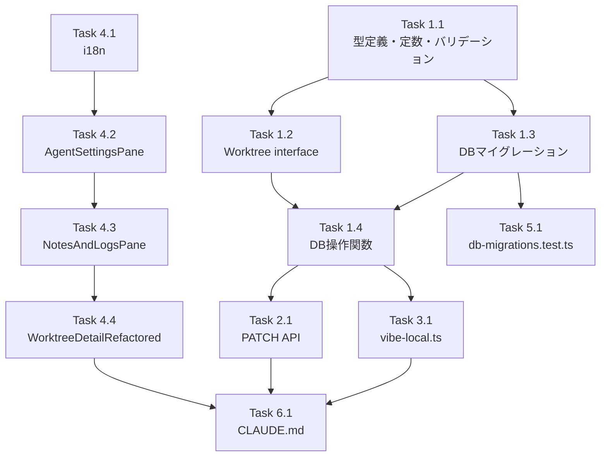

# Issue #374 作業計画書

## Issue: feat: Vibe Localにコンテキストウィンドウサイズ(--context-window)の設定を追加

**Issue番号**: #374
**サイズ**: M
**優先度**: Medium
**依存Issue**: #368（Vibe Local統合 - 実装済み）

---

## 概要

Vibe Local CLIツールに `--context-window` パラメータを追加し、worktree単位でOllamaのコンテキストウィンドウサイズを設定可能にする。既存の `vibeLocalModel` 実装パターン（DB永続化 → API → UI → CLIオプション）を踏襲する。

**スコープ**: 対話モード（tmuxセッション）のみ。スケジュール実行（-pモード）は対象外。

---

## 詳細タスク分解

### Phase 1: 型定義・定数・DB層

---

#### Task 1.1: 型定義とバリデーション関数の追加
**ファイル**: `src/lib/cli-tools/types.ts`
**依存**: なし
**内容**:
- `VIBE_LOCAL_CONTEXT_WINDOW_MIN = 128` 定数追加（JSDoc付き）
- `VIBE_LOCAL_CONTEXT_WINDOW_MAX = 2097152` 定数追加（JSDoc付き）
- `isValidVibeLocalContextWindow(value: unknown): value is number` 型ガード関数追加
  - `typeof value === 'number'` チェック
  - `Number.isInteger(value)` チェック
  - `value >= VIBE_LOCAL_CONTEXT_WINDOW_MIN && value <= VIBE_LOCAL_CONTEXT_WINDOW_MAX` チェック

**テスト**: `tests/unit/lib/cli-tools/types.test.ts`（新規作成）
- 正常値（128, 8192, 2097152）
- 境界値（127拒否、2097153拒否）
- NaN / Infinity / 負数 / 小数 / 文字列 / null / undefined の拒否

---

#### Task 1.2: Worktree インターフェース更新
**ファイル**: `src/types/models.ts`
**依存**: Task 1.1
**内容**:
- `Worktree` interface に `vibeLocalContextWindow?: number | null` フィールド追加（vibeLocalModel の直後に配置）

---

#### Task 1.3: DBマイグレーション追加
**ファイル**: `src/lib/db-migrations.ts`
**依存**: なし
**内容**:
- `CURRENT_SCHEMA_VERSION` を `19` → `20` に更新
- version 20 マイグレーション関数を追加:
  ```sql
  ALTER TABLE worktrees ADD COLUMN vibe_local_context_window INTEGER DEFAULT NULL
  ```
- version 20 の `down()` 関数: `console.log` のみ（SQLite DROP COLUMN 制約のため）

---

#### Task 1.4: DB操作関数の追加・更新
**ファイル**: `src/lib/db.ts`
**依存**: Task 1.2, 1.3
**内容**:
- `updateVibeLocalContextWindow(db, id, contextWindow)` 関数追加（`updateVibeLocalModel` と同一パターン）
- `getWorktrees()` の修正（3箇所）:
  1. SELECT 文に `w.vibe_local_context_window` 追加（`w.vibe_local_model` の直後）
  2. `as` 型キャスト句に `vibe_local_context_window: number | null` 追加
  3. マッピング処理に `vibeLocalContextWindow: row.vibe_local_context_window ?? null` 追加
- `getWorktreeById()` の修正（3箇所）: `getWorktrees()` と同様の3箇所修正

---

### Phase 2: APIレイヤー

---

#### Task 2.1: PATCH API バリデーション追加
**ファイル**: `src/app/api/worktrees/[id]/route.ts`
**依存**: Task 1.1, 1.2, 1.4
**内容**:
- PATCHハンドラに `vibeLocalContextWindow` フィールドの処理を追加（`vibeLocalModel` バリデーションの直後に配置）:
  ```typescript
  if ('vibeLocalContextWindow' in body) {
    const ctxWindow = body.vibeLocalContextWindow
    if (ctxWindow !== null && !isValidVibeLocalContextWindow(ctxWindow)) {
      return NextResponse.json({ error: 'vibeLocalContextWindow must be null or an integer (128-2097152)' }, { status: 400 })
    }
    updateVibeLocalContextWindow(db, params.id, ctxWindow)
  }
  ```
- `isValidVibeLocalContextWindow` を `cli-tools/types.ts` からインポート
- `updateVibeLocalContextWindow` を `db.ts` からインポート

**テスト**: `tests/integration/api/worktrees/[id]/patch-vibe-local-context-window.test.ts`（または既存ファイルに追記）
- 正常値 8192 → 200
- null（リセット）→ 200
- 境界値 128 → 200、127 → 400
- 上限境界値 2097152 → 200、2097153 → 400
- 非整数 128.5 → 400
- 負数 -1 → 400
- 文字列 'abc' → 400

---

### Phase 3: CLIレイヤー

---

#### Task 3.1: vibe-local.ts の startSession() 更新
**ファイル**: `src/lib/cli-tools/vibe-local.ts`
**依存**: Task 1.1, 1.4
**内容**:
- `startSession()` 内で `vibeLocalContextWindow` をDBから取得（`vibeLocalModel` と同じ try-catch ブロック内）:
  ```typescript
  const contextWindow = wt.vibeLocalContextWindow ?? null
  ```
- コマンド構築時に defense-in-depth バリデーション後、`--context-window` オプションを追加:
  ```typescript
  if (isValidVibeLocalContextWindow(contextWindow)) {
    vibeLocalCommand += ` --context-window ${Number(contextWindow)}`
  }
  ```
- `isValidVibeLocalContextWindow` を `cli-tools/types.ts` からインポート

**テスト**: 既存の `vibe-local.ts` 関連テストに追加
- contextWindow が有効値の場合、コマンドに `--context-window` が含まれること
- contextWindow が null の場合、コマンドに `--context-window` が含まれないこと
- contextWindow が無効値の場合、コマンドに `--context-window` が含まれないこと（defense-in-depth）

---

### Phase 4: UIレイヤー

---

#### Task 4.1: i18n キー追加
**ファイル**: `locales/en/schedule.json`, `locales/ja/schedule.json`
**依存**: なし
**内容**:
- `vibeLocalContextWindow`: `"Context Window"` / `"コンテキストウィンドウ"`
- `vibeLocalContextWindowDefault`: `"Default (auto)"` / `"デフォルト（自動）"`

---

#### Task 4.2: AgentSettingsPane に入力欄追加
**ファイル**: `src/components/worktree/AgentSettingsPane.tsx`
**依存**: Task 4.1
**内容**:
- props interface に追加:
  - `vibeLocalContextWindow?: number | null`
  - `onVibeLocalContextWindowChange?: (value: number | null) => void`
- Ollamaモデルセレクター下にコンテキストウィンドウ入力欄追加:
  - `type="number"`, `step="1"`, `min="128"`, `max="2097152"`
  - placeholder: `t('vibeLocalContextWindowDefault')`（"Default (auto)"）
  - 空欄 → `null`、数値入力 → `parseInt()` で変換してコールバック呼び出し
  - Vibe Local 選択時のみ表示（vibeLocalModel セレクターと同じ表示条件）

**テスト**: `tests/unit/components/worktree/AgentSettingsPane.test.tsx`
- 既存 props factory に `vibeLocalContextWindow`/`onVibeLocalContextWindowChange` 追加
- 新規テストケース: 入力欄の表示/非表示、値変更コールバック

---

#### Task 4.3: NotesAndLogsPane props 伝播追加
**ファイル**: `src/components/worktree/NotesAndLogsPane.tsx`
**依存**: Task 4.2
**内容**:
- `NotesAndLogsPaneProps` に追加:
  - `vibeLocalContextWindow?: number | null`
  - `onVibeLocalContextWindowChange?: (value: number | null) => void`
- `AgentSettingsPane` への props 伝播追加

**テスト**: `tests/unit/components/worktree/NotesAndLogsPane.test.tsx`
- 既存 props factory に新規 props 追加

---

#### Task 4.4: WorktreeDetailRefactored state 管理追加
**ファイル**: `src/components/worktree/WorktreeDetailRefactored.tsx`
**依存**: Task 4.3
**内容**:
- state 追加: `const [vibeLocalContextWindow, setVibeLocalContextWindow] = useState<number | null>(worktree.vibeLocalContextWindow ?? null)`
- callback 追加: `onVibeLocalContextWindowChange` (API PATCH 呼び出し、`vibeLocalModel` の `onVibeLocalModelChange` と同一パターン)
- API 応答からの値同期 useEffect に `vibeLocalContextWindow` 追加
- `MobileContentProps` interface に `vibeLocalContextWindow`/`onVibeLocalContextWindowChange` 追加
- `MobileContent` の memo ケース（L897-908付近）での props 伝播追加
- デスクトップレイアウトの `NotesAndLogsPane`（L1941-1948付近）への props 伝播追加

---

### Phase 5: テスト・DBマイグレーションテスト更新

---

#### Task 5.1: db-migrations.test.ts 更新
**ファイル**: `tests/unit/lib/db-migrations.test.ts`
**依存**: Task 1.3
**内容**:
- L37: `expect(CURRENT_SCHEMA_VERSION).toBe(19)` → `.toBe(20)` に更新
- L430: `expect(getCurrentVersion(db)).toBe(19)` → `.toBe(20)` に更新
- L443: `expect(getCurrentVersion(db)).toBe(19)` → `.toBe(20)` に更新
- rollbackMigrations テストの `rollbackMigrations(db, 16)` 呼び出し: version 20 の `down()` が定義済みであることを確認

---

### Phase 6: ドキュメント更新

---

#### Task 6.1: CLAUDE.md 更新
**ファイル**: `CLAUDE.md`
**依存**: 全 Phase 完了
**内容**:
- `src/lib/cli-tools/types.ts` 行に `VIBE_LOCAL_CONTEXT_WINDOW_MIN/MAX`、`isValidVibeLocalContextWindow()` を追記
- `src/lib/cli-tools/vibe-local.ts` 行に `--context-window` オプション対応を追記
- `src/components/worktree/AgentSettingsPane.tsx` 行にコンテキストウィンドウ入力UIを追記

---

## タスク依存関係



**並列実行可能なグループ**:
- Group A（独立）: Task 1.1, Task 1.3, Task 4.1
- Group B（Group A完了後）: Task 1.2, Task 5.1
- Group C（Task 1.2+1.3完了後）: Task 1.4
- Group D（Task 1.4完了後）: Task 2.1, Task 3.1
- Group E（Task 4.1完了後）: Task 4.2
- Group F（Task 4.2完了後）: Task 4.3
- Group G（Task 4.3完了後）: Task 4.4
- Group H（全 Phase 完了後）: Task 6.1

---

## 品質チェック項目

| チェック項目 | コマンド | 基準 |
|-------------|----------|------|
| ESLint | `npm run lint` | エラー0件 |
| TypeScript | `npx tsc --noEmit` | 型エラー0件 |
| Unit Test | `npm run test:unit` | 全テストパス |
| Build | `npm run build` | 成功 |

---

## 成果物チェックリスト

### コード（実装）
- [ ] `src/lib/cli-tools/types.ts` — 定数・型ガード関数追加
- [ ] `src/types/models.ts` — Worktree interface 更新
- [ ] `src/lib/db-migrations.ts` — version 20 マイグレーション
- [ ] `src/lib/db.ts` — updateVibeLocalContextWindow + SELECT 6箇所修正
- [ ] `src/app/api/worktrees/[id]/route.ts` — PATCH バリデーション追加
- [ ] `src/lib/cli-tools/vibe-local.ts` — --context-window 引数対応
- [ ] `src/components/worktree/AgentSettingsPane.tsx` — UI 入力欄追加
- [ ] `src/components/worktree/NotesAndLogsPane.tsx` — props 伝播
- [ ] `src/components/worktree/WorktreeDetailRefactored.tsx` — state/callback 管理

### テスト
- [ ] `tests/unit/lib/cli-tools/types.test.ts` — isValidVibeLocalContextWindow テスト
- [ ] `tests/unit/lib/db-migrations.test.ts` — バージョン番号更新（L37, L430, L443）
- [ ] `tests/integration/api/worktrees/[id]/` — PATCH API テスト
- [ ] `tests/unit/components/worktree/AgentSettingsPane.test.tsx` — props 更新
- [ ] `tests/unit/components/worktree/NotesAndLogsPane.test.tsx` — props 更新

### ドキュメント
- [ ] `locales/en/schedule.json` — i18n キー追加
- [ ] `locales/ja/schedule.json` — i18n キー追加
- [ ] `CLAUDE.md` — モジュール説明更新

---

## Definition of Done

- [ ] 全タスク（Task 1.1〜6.1）が完了
- [ ] 単体テストがすべてパス
- [ ] TypeScript strict モードでコンパイルエラー 0 件
- [ ] ESLint エラー 0 件
- [ ] ビルド成功
- [ ] 受け入れ基準をすべて満たす:
  - AgentSettingsPane で Vibe Local 選択時にコンテキストウィンドウ入力欄が表示される
  - 入力した値が DB に永続化され、ページリロード後も保持される
  - セッション起動時に `--context-window {value}` が正しく CLI 引数として渡される
  - 未設定（null）の場合はオプションが省略される
  - 不正な値がバリデーションで拒否される
  - 他ツール（Claude/Codex/Gemini）への影響がない

---

## 次のアクション

1. ブランチ: `feature/374-worktree`（既存）
2. TDD実装: `/pm-auto-dev 374`
3. 進捗報告: `/progress-report`
4. PR作成: `/create-pr`
