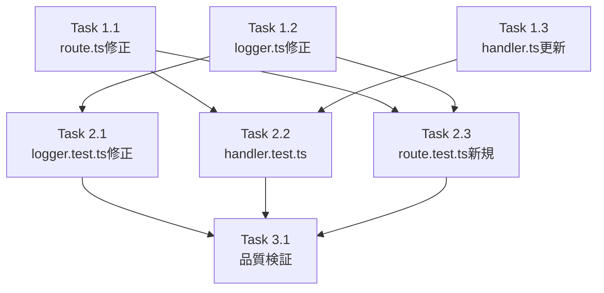

# 作業計画: Issue #376

## Issue: fix: External Apps proxy strips pathPrefix causing Bad Gateway for basePath-configured apps

**Issue番号**: #376
**サイズ**: S
**優先度**: High
**依存Issue**: なし（Issue #42 の設計に準拠した修正）
**ブランチ**: `feature/376-worktree`（作成済み）

---

## 概要

External Apps のプロキシルートハンドラが `pathPrefix` を除去して upstream に転送しているため、`basePath` を設定したアプリケーションに接続できず Bad Gateway エラーが発生する。

**根本原因**: `src/app/proxy/[...path]/route.ts:31` の path 構築ロジックが `pathPrefix` を除去している。

**波及影響**（マルチステージレビューで発見）:
- `src/lib/proxy/logger.ts` の二重プレフィックス問題 → 同時修正必須
- `tests/unit/proxy/logger.test.ts` の CI 失敗リスク → 同時修正必須

---

## 詳細タスク分解

### Phase 1: コア修正（バグ修正 + ログ修正）

#### Task 1.1: route.ts のパス構築ロジック修正（Must Fix SF1-001）
- **成果物**: `src/app/proxy/[...path]/route.ts`
- **変更内容**:
  ```typescript
  // 変更前
  const [pathPrefix, ...rest] = pathSegments;
  const path = '/' + rest.join('/');
  // 変更後
  const [pathPrefix] = pathSegments;  // rest変数除去（ESLint対策）
  const path = '/proxy/' + pathSegments.join('/');
  ```
- **依存**: なし

#### Task 1.2: logger.ts の二重プレフィックス修正（Must Fix SF2-001, SF2-002, SF3-001）
- **成果物**: `src/lib/proxy/logger.ts`
- **変更内容**:
  1. `logProxyRequest()` line 60 のメッセージ構築: `/proxy/${entry.pathPrefix}${entry.path}` → `${entry.path}`
  2. `logProxyError()` line 88 のメッセージ構築: `/proxy/${pathPrefix}${path}` → `${path}`
  3. `ProxyLogEntry.path` JSDoc: `Request path (after /proxy/{pathPrefix})` → `Full request path including proxy prefix (e.g., /proxy/{pathPrefix}/page)`
  4. `logProxyError()` `@example` JSDoc: path 引数を `'/proxy/app-svelte/page'` 形式に更新
- **依存**: なし（独立修正可能）

#### Task 1.3: handler.ts のコメント・JSDoc 更新（Must Fix SF1-002, Should Fix SF2-003）
- **成果物**: `src/lib/proxy/handler.ts`
- **変更内容**:
  1. line 40: `// Strip the path prefix and forward to the upstream app's root` → `// Forward the full path including proxy prefix to the upstream`
  2. line 41: `// This allows upstream apps to work without special basePath configuration` → `// Upstream apps must be configured with basePath: '/proxy/{pathPrefix}'`
  3. `proxyHttp()` / `proxyWebSocket()` `@param path` JSDoc: `The request path (after /proxy/{pathPrefix})` → `The full request path including proxy prefix (e.g., /proxy/{pathPrefix}/page)`
- **依存**: なし

### Phase 2: テスト修正・追加

#### Task 2.1: logger.test.ts の CI 失敗修正（Must Fix SF3-002, Should Fix SF3-004）
- **成果物**: `tests/unit/proxy/logger.test.ts`
- **変更内容**:
  1. `'should format log message correctly'` テスト (line 138): `path: '/api/data'` → `path: '/proxy/app-streamlit/api/data'`
  2. `logProxyError` テスト (line 181): `'/page'` → `'/proxy/app-svelte/page'`
  3. `logProxyError` テスト (line 201): `'/api/submit'` → `'/proxy/app-next2/api/submit'`
  4. `ProxyLogEntry type` テスト (line 54, 75): `'/page'` → `'/proxy/app-svelte/page'`（期待値も合わせて更新）
  5. `logProxyRequest` テスト (line 93, 114, 159): path データを新形式に更新
- **依存**: Task 1.2

#### Task 2.2: handler.test.ts のコメント更新・テスト追加（Should Fix SF1-003, SF2-005）
- **成果物**: `tests/unit/proxy/handler.test.ts`
- **変更内容**:
  1. line 160-161 コメント: `'buildUpstreamUrl strips the proxy prefix...'` → `'buildUpstreamUrl forwards the full path including proxy prefix to upstream'`
  2. line 230-231 コメント: 同様に更新
  3. line 244 コメント: `'Path is forwarded directly to upstream without proxy prefix'` → `'Path is forwarded directly to upstream including proxy prefix'`
  4. line 259 コメント: `'Query strings are preserved, proxy prefix is stripped'` → `'Query strings are preserved with full proxy path'`
  5. 新規テスト追加: `'should correctly forward path with proxy prefix to upstream'`
     - path = `'/proxy/app-svelte/nested/page?query=1'` を渡した場合
     - fetch URL が `'http://127.0.0.1:5173/proxy/app-svelte/nested/page?query=1'` であることを検証
- **依存**: Task 1.1

#### Task 2.3: route.test.ts の新規統合テスト作成（Should Fix SF2-004）
- **成果物**: `tests/unit/proxy/route.test.ts`（新規作成）
- **変更内容**:
  1. `'should preserve pathPrefix when proxying to upstream'`: GET /proxy/localllmtest/page → upstream に `/proxy/localllmtest/page` を渡す
  2. `'should handle root path with pathPrefix'`: GET /proxy/myapp/ → upstream に `/proxy/myapp/` を渡す
  3. `'should handle deep nested path with pathPrefix'`: GET /proxy/app/a/b/c → upstream に `/proxy/app/a/b/c` を渡す
  4. `'should pass correct path to logProxyRequest'`: `ProxyLogEntry.path` に `/proxy/{pathPrefix}/...` が渡されることを検証
- **依存**: Task 1.1, Task 1.2

### Phase 3: 品質検証

#### Task 3.1: 静的解析・テスト実行
- `npx tsc --noEmit` → TypeScript エラー 0件確認
- `npm run lint` → ESLint エラー 0件確認
- `npm run test:unit` → 全テストパス確認

---

## タスク依存関係



---

## 品質チェック項目

| チェック項目 | コマンド | 基準 |
|-------------|----------|------|
| ESLint | `npm run lint` | エラー0件 |
| TypeScript | `npx tsc --noEmit` | 型エラー0件 |
| Unit Test | `npm run test:unit` | 全テストパス |

---

## 成果物チェックリスト

### コード修正
- [ ] `src/app/proxy/[...path]/route.ts` - path構築ロジック修正（1行）
- [ ] `src/lib/proxy/handler.ts` - コメント・JSDoc更新
- [ ] `src/lib/proxy/logger.ts` - ログメッセージ修正・JSDoc更新

### テスト修正・追加
- [ ] `tests/unit/proxy/logger.test.ts` - テストデータ更新（CI失敗防止）
- [ ] `tests/unit/proxy/handler.test.ts` - コメント更新・新規テスト追加
- [ ] `tests/unit/proxy/route.test.ts` - 新規統合テスト作成

---

## Definition of Done

- [ ] `http://localhost:3000/proxy/{pathPrefix}/` 経由でbasePath設定済みアプリにアクセスできる
- [ ] 全単体テストパス（`npm run test:unit`）
- [ ] TypeScript エラーなし（`npx tsc --noEmit`）
- [ ] ESLint エラーなし（`npm run lint`）
- [ ] コードレビュー承認

---

## 次のアクション

1. **TDD実装**: `/pm-auto-dev`で実装開始
2. **PR作成**: 実装完了後 `/create-pr` で PR 作成

---

## 参照ドキュメント

- 設計方針書: `dev-reports/design/issue-376-proxy-pathprefix-fix-design-policy.md`
- マルチステージレビュー結果: `dev-reports/issue/376/multi-stage-design-review/summary-report.md`
