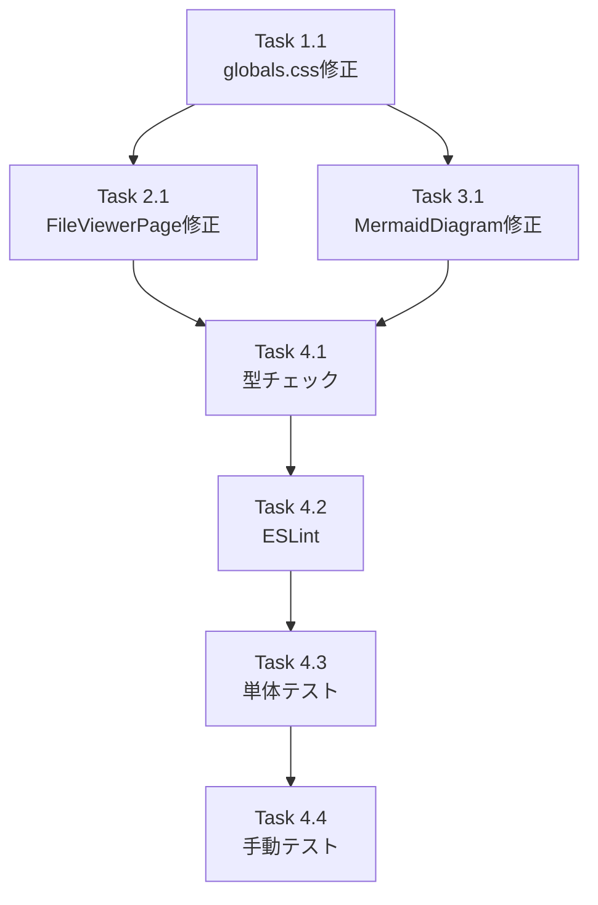

# 作業計画書

## Issue: fix: 言語未指定コードブロックの背景が白で文字が読めない
**Issue番号**: #390
**サイズ**: S（CSS修正のみ、3ファイル変更）
**優先度**: High（視認性バグ）
**依存Issue**: なし

---

## 概要

マークダウンファイル表示時、言語未指定コードブロックが背景白・文字白で読めない問題を修正する。

**根本原因**: `globals.css` の `.prose pre { bg-transparent }` が Tailwind Typography のデフォルトダーク背景を透明に上書きしており、`rehype-highlight` が言語未指定時に `.hljs` クラスを付与しないため、フォールバックスタイルが存在しない。

**修正方針**: CSSフォールバック方式（方式A）を採用。`.prose pre code:not(.hljs)` ルールを追加して言語未指定コードブロックのダーク背景を保証する。

---

## 詳細タスク分解

### Phase 1: CSS修正（globals.css）

- [ ] **Task 1.1**: `src/app/globals.css` の `.prose pre` 修正
  - **成果物**: `src/app/globals.css` 更新
  - **変更内容**:
    - `.prose pre { @apply bg-transparent p-0 border-0; }` → `@apply bg-[#0d1117] p-0 border-0 rounded-md overflow-x-auto;`
    - `.prose pre code:not(.hljs) { @apply block text-[#c9d1d9]; padding: 1rem; }` を新規追加
  - **依存**: なし
  - **影響**: MarkdownEditor.tsx・MessageList.tsx は自動対応（変更不要）

### Phase 2: FileViewerPage 修正

- [ ] **Task 2.1**: `src/app/worktrees/[id]/files/[...path]/page.tsx` のカスタム `pre` コンポーネント修正
  - **成果物**: `src/app/worktrees/[id]/files/[...path]/page.tsx` 更新
  - **変更内容**:
    - L170-173: カスタム `pre` から `bg-gray-50 border border-gray-200 rounded-md p-4` を除去し、`overflow-x-auto` のみ残す
    - L150: `prose-pre:bg-gray-100 prose-pre:border prose-pre:border-gray-200` を削除
  - **依存**: Task 1.1（globals.css で bg-[#0d1117] が管理される前提）
  - **設計根拠**: DRY原則 - 色値を globals.css に一元管理（D1-001/D1-002）

### Phase 3: MermaidDiagram.tsx エラー表示修正

- [ ] **Task 3.1**: `src/components/worktree/MermaidDiagram.tsx` エラー表示 `<pre>` に背景色追加
  - **成果物**: `src/components/worktree/MermaidDiagram.tsx` 更新
  - **変更内容**:
    - L156付近: `<pre className="text-sm text-red-500 mt-2 whitespace-pre-wrap break-words">` に `bg-red-50` を追加
  - **依存**: Task 1.1（globals.css 変更が MermaidDiagram に波及するため）
  - **設計根拠**: Tailwind ユーティリティクラスが @layer components より優先されるため、bg-red-50 が prose のダーク背景を上書きする（D3-001）

### Phase 4: 静的チェック・テスト

- [ ] **Task 4.1**: TypeScript型チェック
  - **コマンド**: `npx tsc --noEmit`
  - **基準**: 型エラー0件
  - **依存**: Task 2.1, Task 3.1

- [ ] **Task 4.2**: ESLintチェック
  - **コマンド**: `npm run lint`
  - **基準**: エラー0件
  - **依存**: Task 2.1, Task 3.1

- [ ] **Task 4.3**: 単体テスト（リグレッション確認）
  - **コマンド**: `npm run test:unit`
  - **基準**: 既存テスト全パス（CSS変更のみのためテスト追加不要）
  - **依存**: Task 4.1, Task 4.2

- [ ] **Task 4.4**: 手動テスト（10パターン）
  - **依存**: Task 4.3

---

## タスク依存関係

---

## 手動テスト計画（10パターン）

| # | コンポーネント | シナリオ | 優先度 | 確認内容 |
|---|-------------|---------|--------|---------|
| T-001 | MarkdownEditor | 言語未指定コードブロック | 高 | ダーク背景 (#0d1117) + 明るい文字 (#c9d1d9) で表示 |
| T-002 | MarkdownEditor | 言語指定ありコードブロック | 高 | シンタックスハイライトが正常（リグレッション確認） |
| T-003 | MessageList | アシスタントメッセージ - 言語未指定 | 高 | アシスタントメッセージ内でダーク背景で表示 |
| T-004 | MessageList | アシスタントメッセージ - 言語指定あり | 高 | シンタックスハイライトが正常（リグレッション確認） |
| T-005 | MessageList | ユーザーメッセージ（prose-invert） | 中 | ユーザーメッセージ内でコードブロックが読みやすく表示 |
| T-006 | FileViewerPage | マークダウン - 言語未指定 | 高 | カスタム pre 修正 + prose-pre クラス削除後にダーク背景で表示 |
| T-007 | 全コンポーネント | インラインコード | 高 | `code` がbg-gray-100のまま変化していない（リグレッション） |
| T-008 | MessageList | realtime output ANSI出力 | 低 | ANSI出力の `<pre>` が bg-gray-900 のまま変化していない |
| T-009 | MermaidDiagram | エラー表示 | 中 | エラー表示が bg-red-50（明るい背景）上に赤テキストで表示 |
| T-010 | FileViewerPage | 非マークダウンファイル表示 | 低 | `.prose` 外の pre 要素がリグレッションしていない |

---

## 変更ファイル一覧

| ファイル | 変更種別 | タスク |
|--------|---------|-------|
| `src/app/globals.css` | 修正 | Task 1.1 |
| `src/app/worktrees/[id]/files/[...path]/page.tsx` | 修正 | Task 2.1 |
| `src/components/worktree/MermaidDiagram.tsx` | 修正 | Task 3.1 |

**自動対応（変更不要）**:
- `src/components/worktree/MarkdownEditor.tsx` — globals.css 修正で自動適用
- `src/components/worktree/MessageList.tsx` — globals.css 修正で自動適用

---

## 品質チェック項目

| チェック項目 | コマンド | 基準 |
|-------------|----------|------|
| TypeScript | `npx tsc --noEmit` | 型エラー0件 |
| ESLint | `npm run lint` | エラー0件 |
| Unit Test | `npm run test:unit` | 全テストパス |
| 手動テスト | - | 10パターン全て確認 |

---

## 成果物チェックリスト

### コード変更
- [ ] `src/app/globals.css`: `.prose pre` のダーク背景設定 + `.prose pre code:not(.hljs)` フォールバック追加
- [ ] `src/app/worktrees/[id]/files/[...path]/page.tsx`: カスタム `pre` の `overflow-x-auto` のみ残し、`prose-pre:*` 削除
- [ ] `src/components/worktree/MermaidDiagram.tsx`: エラー表示 `<pre>` に `bg-red-50` 追加

### テスト
- [ ] `npm run test:unit` — 全テストパス（CSS変更のみのため新規テスト不要）
- [ ] 手動テスト — 10パターン全て確認

### ドキュメント
- [ ] `CLAUDE.md` 更新（必要に応じて）

---

## Definition of Done

- [ ] 全3ファイルの変更完了
- [ ] `npx tsc --noEmit` エラー0件
- [ ] `npm run lint` エラー0件
- [ ] `npm run test:unit` 全テストパス
- [ ] 手動テスト10パターン全て確認
- [ ] PR作成

---

## 次のアクション

1. **実装開始**: `/pm-auto-dev 390` で自動開発
2. **PR作成**: `/create-pr` で自動作成

---

## 参考資料

- **設計方針書**: `dev-reports/design/issue-390-code-block-dark-bg-design-policy.md`
- **Issueレビューサマリー**: `dev-reports/issue/390/issue-review/summary-report.md`
- **設計レビューサマリー**: `dev-reports/issue/390/multi-stage-design-review/summary-report.md`

---

*Generated by work-plan command for Issue #390*
