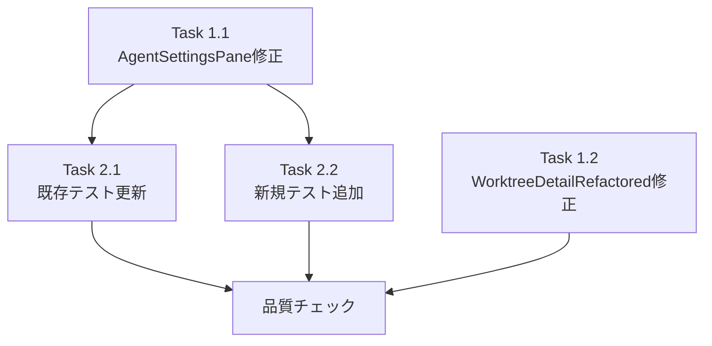

# Issue #391 作業計画書

## Issue: fix: エージェント選択のチェックボックスを外すと自動で再チェックされる

**Issue番号**: #391
**サイズ**: S（変更ファイル3件、小規模バグ修正）
**優先度**: High（UX破壊的バグ）
**依存Issue**: #368（Agent設定UI導入 - 起因となった実装）

---

## 概要

AgentSettingsPaneのチェックボックスを外すと、ポーリング（2-5秒）で自動リチェックされるバグ。
クライアントサイドの状態管理ロジックのみの修正（API/DB変更なし）。

**修正戦略**: 案A（isEditingフラグ）+ 案B（selectedAgents同一値チェック）の組み合わせ

---

## 詳細タスク分解

### Phase 1: ソース修正

#### Task 1.1: AgentSettingsPane修正（案A）

**ファイル**: `src/components/worktree/AgentSettingsPane.tsx`
**依存**: なし
**所要時間**: 約15分

**変更内容**:
1. `isEditing` state追加（L80付近、saving stateの直下）
   ```typescript
   const [isEditing, setIsEditing] = useState(false);
   ```

2. useEffect（L98-100）にisEditingガード追加
   ```typescript
   useEffect(() => {
     if (!isEditing) {
       setCheckedIds(new Set(selectedAgents));
     }
   }, [selectedAgents, isEditing]);
   ```

3. handleCheckboxChange（L141-176）修正
   - チェック解除時: `setIsEditing(true)`追加
   - API成功時: `setCheckedIds(new Set(pair))`をonSelectedAgentsChange前に追加
   - finally節: `setIsEditing(false)`追加

**チェックポイント**:
- [ ] isEditing state追加（useState(false)）
- [ ] useEffectにif (!isEditing)ガード追加（依存配列に[selectedAgents, isEditing]）
- [ ] チェック解除時にsetIsEditing(true)
- [ ] API成功時にsetCheckedIds(new Set(pair))を先行呼び出し
- [ ] finally節でsetIsEditing(false)
- [ ] useCallback依存配列にisEditingを含めない（setterは安定参照）

---

#### Task 1.2: WorktreeDetailRefactored修正（案B）

**ファイル**: `src/components/worktree/WorktreeDetailRefactored.tsx`
**依存**: なし（Task 1.1と並行可能）
**所要時間**: 約10分

**変更内容**:
1. selectedAgentsRef追加（L984付近、selectedAgents stateの直下）
   ```typescript
   const selectedAgentsRef = useRef(selectedAgents);
   useEffect(() => {
     selectedAgentsRef.current = selectedAgents;
   }, [selectedAgents]);
   ```

2. fetchWorktree内のselectedAgents更新ロジック修正（L1034-1037）
   ```typescript
   if (data.selectedAgents) {
     const current = selectedAgentsRef.current;
     const isSame = data.selectedAgents.length === current.length &&
       data.selectedAgents.every((v: string, i: number) => v === current[i]);
     if (!isSame) {
       setSelectedAgents(data.selectedAgents);
     }
   }
   ```

**チェックポイント**:
- [ ] selectedAgentsRef useRef追加
- [ ] selectedAgents同期用useEffect追加（依存配列: [selectedAgents]）
- [ ] fetchWorktree内: 配列比較ロジック追加（要素順序込み個別比較）
- [ ] 同一値の場合setSelectedAgentsをスキップ
- [ ] fetchWorktreeのuseCallback依存配列は変更なし（[worktreeId]のまま）

---

### Phase 2: テスト修正

#### Task 2.1: 既存テスト更新

**ファイル**: `tests/unit/components/worktree/AgentSettingsPane.test.tsx`
**依存**: Task 1.1完了後
**所要時間**: 約10分

**変更内容**:
- L62-80「should sync checked state when selectedAgents prop changes」
  - テストの前提条件としてisEditing=false状態（初期状態）を明示的に文書化
  - rerenderでselectedAgents propを変更した際にcheckedIdsが正しく更新されることを確認

---

#### Task 2.2: 新規テストケース追加

**ファイル**: `tests/unit/components/worktree/AgentSettingsPane.test.tsx`
**依存**: Task 1.1完了後
**所要時間**: 約30分

| テスト | 検証内容 |
|-------|---------|
| T1: isEditing中のprop変更無視 | チェックを外した後（isEditing=true中）にselectedAgents propが変更されてもcheckedIdsが上書きされない |
| T2: isEditing解除後の同期 | 2つ選択完了後（API成功→isEditing=false）、次のselectedAgents prop変更が正しく同期される。setCheckedIds(pair)が先行呼び出しされることを外部振る舞いで検証 |
| T3: API失敗時のリバート＋isEditingリセット | APIレスポンスが!okの時、checkedIdsがリバートされisEditingがfalseになること |
| T4: ネットワークエラー時のリバート＋isEditingリセット | fetch例外発生時、checkedIdsがリバートされisEditingがfalseになること |

---

## タスク依存関係



※ Task 1.1とTask 1.2は並行実施可能。

---

## 品質チェック項目

| チェック項目 | コマンド | 基準 |
|-------------|----------|------|
| ESLint | `npm run lint` | エラー0件 |
| TypeScript | `npx tsc --noEmit` | 型エラー0件 |
| Unit Test | `npm run test:unit` | 全テストパス（既存+新規T1-T4） |
| Build | `npm run build` | 成功 |

---

## 成果物チェックリスト

### コード（変更）
- [ ] `src/components/worktree/AgentSettingsPane.tsx` - isEditing案A実装
- [ ] `src/components/worktree/WorktreeDetailRefactored.tsx` - selectedAgentsRef案B実装

### テスト
- [ ] `tests/unit/components/worktree/AgentSettingsPane.test.tsx` - 既存テスト更新+T1-T4追加

### ドキュメント（変更不要）
- `CLAUDE.md` - 変更不要
- `README.md` - 変更不要

---

## Definition of Done

- [ ] Task 1.1完了（AgentSettingsPane修正）
- [ ] Task 1.2完了（WorktreeDetailRefactored修正）
- [ ] Task 2.1完了（既存テスト更新）
- [ ] Task 2.2完了（新規テストT1-T4追加）
- [ ] ESLint: エラー0件
- [ ] TypeScript: 型エラー0件
- [ ] Unit Test: 全テストパス
- [ ] Build: 成功
- [ ] 受入条件確認:
  - [ ] チェックボックスを外した状態が維持される（ポーリングで戻らない）
  - [ ] 別のエージェントを選択して2つになった時にAPIが呼ばれ、正しく保存される
  - [ ] API失敗時はサーバーの値にリバートされ、isEditingフラグもfalseにリセットされる
  - [ ] ページリロード時はサーバーの値が正しく反映される

---

## 次のアクション

1. **TDD実装**: `/pm-auto-dev 391` で自動実装
2. **PR作成**: `/create-pr` でPR作成

---

*Issue #391 作業計画書 - 2026-03-02*
*設計方針書: `dev-reports/design/issue-391-agent-checkbox-fix-design-policy.md`*
