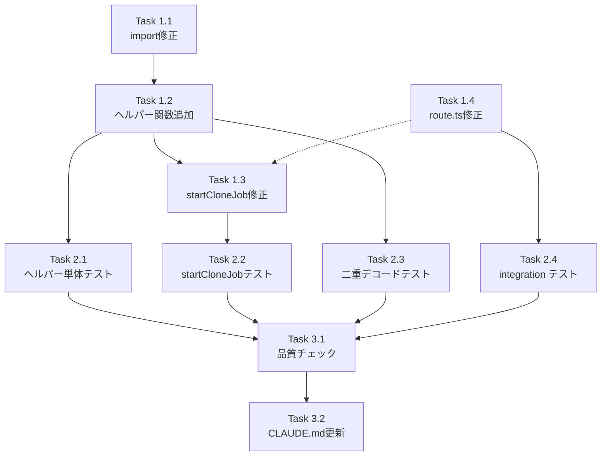

# 作業計画書: Issue #392

## Issue 概要

**タイトル**: security: clone target path validation bypass allows repositories outside CM_ROOT_DIR
**Issue番号**: #392
**サイズ**: S（変更ファイル3件、修正ロジック局所化）
**優先度**: High（セキュリティ脆弱性）
**依存Issue**: なし

### 問題の要点
`POST /api/repositories/clone` の `customTargetPath` が `isPathSafe()` で検証後にカノニカル化されずそのまま `git clone` に渡されるため、相対パスで `CM_ROOT_DIR` 外にクローンできる。

### 修正方針（設計方針書より）
`validateWorktreePath()` を活用（Option A）し、検証+カノニカル化を原子的に実行。ヘルパー関数 `resolveCustomTargetPath()` を挟んで例外→null 変換を行い、既存エラーパターンを維持。

---

## 詳細タスク分解

### Phase 1: ソースコード修正（実装）

- [ ] **Task 1.1**: `clone-manager.ts` の import 修正
  - **成果物**: `src/lib/clone-manager.ts`（L18）
  - **変更内容**: `import { isPathSafe }` → `import { validateWorktreePath }`
  - **依存**: なし
  - **注意**: `isPathSafe` の直接呼び出し箇所が L341 のみであることを確認し、明示的に削除する（D5-001）

- [ ] **Task 1.2**: `resolveCustomTargetPath()` ヘルパー関数追加
  - **成果物**: `src/lib/clone-manager.ts`（L193以前 / CloneManager クラス定義直前）
  - **変更内容**: 以下のモジュールスコープ関数を追加
    ```typescript
    export function resolveCustomTargetPath(
      customTargetPath: string,
      basePath: string
    ): string | null {
      try {
        return validateWorktreePath(customTargetPath, basePath);
      } catch {
        // [S1-001] Log rejection for attack detection and debugging.
        // Use a fixed message string to avoid leaking rootDir from exception messages.
        console.warn('[CloneManager] Invalid custom target path rejected');
        return null;
      }
    }
    ```
  - **依存**: Task 1.1

- [ ] **Task 1.3**: `startCloneJob()` のパス処理修正
  - **成果物**: `src/lib/clone-manager.ts`（L336-343）
  - **変更内容**:
    ```typescript
    // Before
    const targetPath = customTargetPath || this.getTargetPath(repoName);
    if (customTargetPath && !isPathSafe(customTargetPath, this.config.basePath!)) {
      return { success: false, error: ERROR_DEFINITIONS.INVALID_TARGET_PATH };
    }

    // After
    let targetPath: string;
    if (customTargetPath) {
      const resolved = resolveCustomTargetPath(customTargetPath, this.config.basePath!);
      if (!resolved) {
        return { success: false, error: ERROR_DEFINITIONS.INVALID_TARGET_PATH };
      }
      targetPath = resolved;
    } else {
      targetPath = this.getTargetPath(repoName);
    }
    ```
  - **依存**: Task 1.2

- [ ] **Task 1.4**: `route.ts` の `targetDir` 入力サニタイズ修正
  - **成果物**: `src/app/api/repositories/clone/route.ts`（L96）
  - **変更内容**:
    ```typescript
    // Before
    const result = await cloneManager.startCloneJob(cloneUrl.trim(), targetDir);

    // After
    const MAX_TARGET_DIR_LENGTH = 1024;
    const trimmedTargetDir = targetDir?.trim() || undefined;
    if (trimmedTargetDir && trimmedTargetDir.length > MAX_TARGET_DIR_LENGTH) {
      return NextResponse.json(
        {
          success: false,
          error: {
            category: 'validation',
            code: 'INVALID_TARGET_PATH',
            message: 'Target directory path is too long',
            recoverable: true,
            suggestedAction: 'Use a path within the configured base directory',
          },
        },
        { status: 400 }
      );
    }
    const result = await cloneManager.startCloneJob(cloneUrl.trim(), trimmedTargetDir);
    ```
  - **依存**: なし（Task 1.3 と並行可能）

### Phase 2: テスト追加

- [ ] **Task 2.1**: `resolveCustomTargetPath()` 単体テスト追加
  - **成果物**: `tests/unit/lib/clone-manager.test.ts`
  - **テストケース**:
    - H-001: 正常な相対パス → 絶対パスを返す
    - H-002: パストラバーサル (`../escape`) → `null` を返す
    - H-003: 空文字 → `null` を返す（防御的テスト、`@internal` コメント付き）
    - H-004: null バイト → `null` を返す
  - **import 追加**: `import { CloneManager, CloneManagerError, resetWorktreeBasePathWarning, resolveCustomTargetPath } from '@/lib/clone-manager';`
  - **依存**: Task 1.2

- [ ] **Task 2.2**: `startCloneJob()` 相対パステストケース追加
  - **成果物**: `tests/unit/lib/clone-manager.test.ts`
  - **テストケース**:
    - T-001: 相対パスが basePath 内の絶対パスに解決される（`"my-repo"` → `"/tmp/repos/my-repo"`）
    - T-002: ネストされた相対パス（`"nested/deep/repo"` → `"/tmp/repos/nested/deep/repo"`）
    - T-003: パストラバーサルが拒否される（`"../escape"` → `INVALID_TARGET_PATH`）
    - T-004: 既存の絶対パステストが引き続き動作する（後方互換性確認）
    - T-005: `existsSync()` に解決済み絶対パスが渡される（`vi.mocked(existsSync)` 引数確認）
    - T-006: エラーメッセージに basePath が含まれない（D4-001 情報漏洩防止確認）
  - **依存**: Task 1.3

- [ ] **Task 2.3**: `validateWorktreePath()` 二重デコード安全性テスト追加
  - **成果物**: `tests/unit/lib/clone-manager.test.ts` または `tests/unit/lib/path-validator.test.ts`
  - **テストケース**:
    - S4-001-T1: `resolveCustomTargetPath('%252e%252e%252fetc', '/tmp/repos')` → `null`
    - S4-001-T2: `resolveCustomTargetPath('..%2fetc', '/tmp/repos')` → `null`
    - S4-001-T3: `resolveCustomTargetPath('normal-repo', '/tmp/repos')` → `'/tmp/repos/normal-repo'`
  - **目的**: `validateWorktreePath()` の二重デコードリスク（S1-002/S4-001）の実証的検証
  - **依存**: Task 1.2

- [ ] **Task 2.4**: `route.ts` の `targetDir` trim/長さ制限 integration テスト追加
  - **成果物**: `tests/integration/api-clone.test.ts`
  - **テストケース**:
    - R-001: `targetDir = "  my-repo  "` → trim されて `startCloneJob()` に `"my-repo"` が渡される（成功）
    - R-002: `targetDir = "   "` → `undefined` として扱われ、デフォルトパスを使用
    - R-003: `targetDir` が 1025 文字 → 400 エラー（`INVALID_TARGET_PATH`）
  - **依存**: Task 1.4

### Phase 3: 品質確認・ドキュメント更新

- [ ] **Task 3.1**: 品質チェック実行
  - `npx tsc --noEmit`
  - `npm run lint`
  - `npm run test:unit`
  - `npm run test:integration`

- [ ] **Task 3.2**: CLAUDE.md の clone-manager.ts 説明更新（S3-004）
  - `resolveCustomTargetPath()` の説明を `clone-manager.ts` モジュール欄に追記

---

## タスク依存関係



**並行実行可能**: Task 1.4 と Task 1.1〜1.3 は独立して並行実施可能。

---

## 品質チェック項目

| チェック項目 | コマンド | 基準 |
|-------------|----------|------|
| TypeScript | `npx tsc --noEmit` | 型エラー 0件 |
| ESLint | `npm run lint` | エラー 0件 |
| Unit Test | `npm run test:unit` | 全パス |
| Integration Test | `npm run test:integration` | 全パス |
| Build | `npm run build` | 成功 |

---

## 成果物チェックリスト

### コード
- [ ] `src/lib/clone-manager.ts`: `import` 修正 + `resolveCustomTargetPath()` 追加 + `startCloneJob()` パス処理修正
- [ ] `src/app/api/repositories/clone/route.ts`: `targetDir` trim + 長さ制限

### テスト
- [ ] `tests/unit/lib/clone-manager.test.ts`: H-001〜H-004 + T-001〜T-006 + S4-001-T1〜T3
- [ ] `tests/integration/api-clone.test.ts`: R-001〜R-003

### ドキュメント
- [ ] `CLAUDE.md`: `clone-manager.ts` の `resolveCustomTargetPath()` 追記（Task 3.2）

---

## 実装上の注意事項

1. **D4-001 情報漏洩防止**: `validateWorktreePath()` の例外メッセージ（rootDir含む）を catch で握り潰し、`INVALID_TARGET_PATH` 固定エラーのみを返すこと
2. **S1-001 ロギング**: `resolveCustomTargetPath()` の catch ブロックで `console.warn('[CloneManager] Invalid custom target path rejected')` を必ず出力すること（攻撃検知のため）
3. **S4-001 実証検証**: `validateWorktreePath()` の二重デコードテスト（S4-001-T1〜T3）を実装前に実行し、安全性を確認すること
4. **後方互換性**: 既存の絶対パスによる `customTargetPath` テスト（T-004）が引き続きパスすることを確認すること

---

## Definition of Done

- [ ] Phase 1 全 4 タスク完了
- [ ] Phase 2 全 4 タスクのテスト全パス
- [ ] Phase 3 品質チェック全パス（TypeScript・ESLint・Unit・Integration）
- [ ] セキュリティ要件: 相対パスが basePath 内の絶対パスに解決されること
- [ ] 情報漏洩防止: エラーメッセージに rootDir が含まれないこと
- [ ] CLAUDE.md 更新完了

---

## 次のアクション

1. TDD実装（`/pm-auto-dev 392`）
2. PR作成（`/create-pr`）

---

*Generated by work-plan command for Issue #392*
