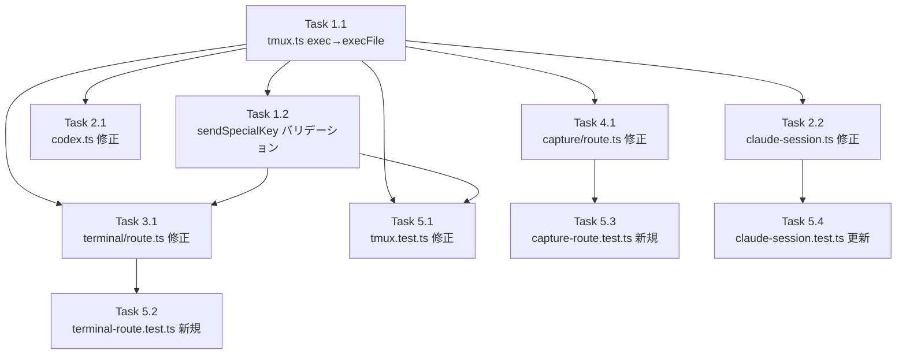

# Issue #393 作業計画書

## Issue: security: authenticated RCE and shell injection via /api/worktrees/[id]/terminal

**Issue番号**: #393
**サイズ**: L
**優先度**: Critical
**依存Issue**: なし

---

## 実装タスク分解

### Phase 1: tmux.ts の exec()→execFile() 移行（基盤）

- [ ] **Task 1.1**: `tmux.ts` 全9関数・11箇所の exec()→execFile() 移行
  - 成果物: `src/lib/tmux.ts`
  - 依存: なし
  - 詳細:
    - `isTmuxAvailable()`: exec → execFile('tmux', ['-V'])
    - `hasSession()`: exec → execFile('tmux', ['has-session', '-t', sessionName])
    - `listSessions()`: exec → execFile('tmux', ['list-sessions', '-F', format])
    - `createSession()` (new-session): exec → execFile('tmux', ['new-session', '-d', '-s', sessionName, '-c', workingDirectory])
    - `createSession()` (set-option): exec → execFile('tmux', ['set-option', '-t', sessionName, 'history-limit', String(historyLimit)])
    - `sendKeys()`: exec → execFile('tmux', ['send-keys', '-t', sessionName, keys, 'C-m'])（シングルクォートエスケープ除去）
    - `sendSpecialKeys()`: exec → execFile('tmux', ['send-keys', '-t', sessionName, keys[i]])
    - `sendSpecialKey()`: exec → execFile('tmux', ['send-keys', '-t', sessionName, key])
    - `capturePane()`: exec → execFile('tmux', [...], { maxBuffer: 10MB 維持 })
    - `killSession()`: exec → execFile('tmux', ['kill-session', '-t', sessionName])
    - `ensureSession()`: ラッパーのため変更不要

- [ ] **Task 1.2**: `tmux.ts` に `sendSpecialKey()` のランタイムバリデーション追加
  - 成果物: `src/lib/tmux.ts`
  - 依存: Task 1.1
  - 詳細:
    - `ALLOWED_SINGLE_SPECIAL_KEYS = new Set(['Escape', 'C-c', 'C-d', 'C-m', 'Enter'])` を定義
    - `sendSpecialKey()` 先頭に `if (!ALLOWED_SINGLE_SPECIAL_KEYS.has(key)) { throw new Error(...) }` を追加

### Phase 2: codex.ts / claude-session.ts の直接exec()統一

- [ ] **Task 2.1**: `codex.ts` の直接exec()呼び出しをtmux.ts関数に置き換え
  - 成果物: `src/lib/cli-tools/codex.ts`
  - 依存: Task 1.1
  - 詳細:
    - Line 102: `execAsync(\`tmux send-keys -t "${sessionName}" Down\`)` → `tmux.sendSpecialKeys(sessionName, ['Down'])`
    - Line 104: `execAsync(\`tmux send-keys -t "${sessionName}" Enter\`)` → `tmux.sendSpecialKeys(sessionName, ['Enter'])`
    - Line 139: `execAsync(\`tmux send-keys -t "${sessionName}" C-m\`)` → `tmux.sendSpecialKey(sessionName, 'C-m')`
    - Line 170: `execAsync(\`tmux send-keys -t "${sessionName}" C-d\`)` → `tmux.sendSpecialKey(sessionName, 'C-d')`
    - `sendSpecialKeys`, `sendSpecialKey` のインポートを追加
    - 不要になった `child_process.exec` インポートを削除確認

- [ ] **Task 2.2**: `claude-session.ts` の直接exec()呼び出しをtmux.ts関数に置き換え
  - 成果物: `src/lib/claude-session.ts`
  - 依存: Task 1.1
  - 詳細:
    - Line 783: `execAsync(\`tmux send-keys -t "${sessionName}" C-d\`)` → `tmux.sendSpecialKey(sessionName, 'C-d')`

### Phase 3: terminal/route.ts の修正

- [ ] **Task 3.1**: `terminal/route.ts` の入力バリデーション追加・構造変更
  - 成果物: `src/app/api/worktrees/[id]/terminal/route.ts`
  - 依存: Task 1.1, Task 1.2
  - 詳細:
    1. `isCliToolType()` バリデーション追加（固定文字列エラーメッセージ使用）
    2. `getWorktreeById()` DB確認追加（`import { getWorktreeById } from '@/lib/db'`）
    3. `MAX_COMMAND_LENGTH = 10000` の長さ制限追加
    4. `CLIToolManager.getInstance().getTool(cliToolId).getSessionName(worktreeId)` に統一
    5. ローカル `getSessionName()` 関数の削除
    6. `sendToTmux()` 廃止、`tmux.sendKeys()` 直接呼び出しに変更（意味的差異を保持）
    7. セッション不在時の `createSession()` 自動作成を削除→404返却
    8. `import * as tmux from '@/lib/tmux'` を削除（最小限の named import に変更: `import { sendKeys } from '@/lib/tmux'`）
    9. 500エラーレスポンスを固定文字列に変更（`error.message` 非公開）

### Phase 4: capture/route.ts の修正

- [ ] **Task 4.1**: `capture/route.ts` の入力バリデーション追加・構造変更
  - 成果物: `src/app/api/worktrees/[id]/capture/route.ts`
  - 依存: Task 1.1
  - 詳細:
    1. `isCliToolType()` バリデーション追加（固定文字列エラーメッセージ使用）
    2. `getWorktreeById()` DB確認追加
    3. `lines` パラメータの4段階バリデーション（typeof/Number.isInteger/境界値/Math.floor）
    4. `CLIToolManager.getInstance().getTool(cliToolId).getSessionName(worktreeId)` に統一
    5. ローカル `getSessionName()` 関数の削除
    6. セッション不在時404返却（固定文字列）
    7. 500エラーレスポンスを固定文字列に変更

### Phase 5: テスト追加・修正

- [ ] **Task 5.1**: `tmux.test.ts` のモック変更
  - 成果物: `tests/unit/tmux.test.ts`
  - 依存: Task 1.1, 1.2
  - 詳細:
    - `vi.mock('child_process')` のモック対象を `exec` → `execFile` に変更
    - 既存テストの `expect(exec).toHaveBeenCalledWith(...)` を `expect(execFile).toHaveBeenCalledWith(引数配列形式)` に更新
    - `'should escape single quotes'` テストを更新（シングルクォートがそのまま引数配列要素として渡されることを検証）
    - シェルインジェクション防止テストを追加
    - `sendSpecialKey()` 無効キーでError throwテストを追加
    - `sendSpecialKeys()` 複数形のテスト追加（有効配列/無効キー/空配列）
    - killSession() エラーメッセージ互換性テストを追加

- [ ] **Task 5.2**: `terminal-route.test.ts` 新規作成
  - 成果物: `tests/unit/terminal-route.test.ts`
  - 依存: Task 3.1
  - テストケース:
    - 有効なcliToolIdでコマンド送信 → 200 success
    - 無効なcliToolId（シェルメタ文字含む） → 400（固定文字列エラー）
    - DBに存在しないworktreeId → 404
    - セッション不在時 → 404
    - command未指定 → 400
    - commandが10001文字超 → 400
    - 500エラー時は固定文字列を返す

- [ ] **Task 5.3**: `capture-route.test.ts` 新規作成
  - 成果物: `tests/unit/capture-route.test.ts`
  - 依存: Task 4.1
  - テストケース:
    - 有効なcliToolIdでキャプチャ → 200 + output
    - 無効なcliToolId → 400
    - DBに存在しないworktreeId → 404
    - linesが負数 → 400
    - linesが文字列 → 400
    - linesが100001 → 400
    - セッション不在時 → 404
    - 500エラー時は固定文字列を返す

- [ ] **Task 5.4**: `claude-session.test.ts` のモック更新
  - 成果物: `tests/unit/lib/claude-session.test.ts`
  - 依存: Task 2.2
  - 詳細:
    - `vi.mock('@/lib/tmux')` に `sendSpecialKey: vi.fn()` を追加
    - `stopClaudeSession()` で `tmux.sendSpecialKey(sessionName, 'C-d')` が呼ばれることを検証

---

## タスク依存関係

---

## 品質チェック項目

| チェック項目 | コマンド | 基準 |
|-------------|----------|------|
| ESLint | `npm run lint` | エラー0件 |
| TypeScript | `npx tsc --noEmit` | 型エラー0件 |
| Unit Test | `npm run test:unit` | 全テストパス |
| Build | `npm run build` | 成功 |

---

## 成果物チェックリスト

### 修正ファイル
- [ ] `src/lib/tmux.ts` - exec()→execFile()移行、sendSpecialKey()ランタイムバリデーション
- [ ] `src/lib/cli-tools/codex.ts` - 直接exec()→tmux.ts関数統一（4箇所）
- [ ] `src/lib/claude-session.ts` - 直接exec()→tmux.sendSpecialKey()（1箇所）
- [ ] `src/app/api/worktrees/[id]/terminal/route.ts` - バリデーション追加・構造変更
- [ ] `src/app/api/worktrees/[id]/capture/route.ts` - バリデーション追加・構造変更

### テストファイル
- [ ] `tests/unit/tmux.test.ts` - モック変更・テスト追加
- [ ] `tests/unit/terminal-route.test.ts` - 新規作成
- [ ] `tests/unit/capture-route.test.ts` - 新規作成
- [ ] `tests/unit/lib/claude-session.test.ts` - モック更新

### ドキュメント
- [ ] `CLAUDE.md` - モジュール説明の更新（terminal/capture route.ts のセキュリティ修正内容）

---

## Definition of Done

- [ ] 全タスク完了
- [ ] 単体テスト全パス
- [ ] TypeScript型エラー0件
- [ ] ESLintエラー0件
- [ ] ビルド成功

---

## 実装順序（推奨）

1. **Task 1.1** → tmux.ts 基盤移行（最優先: 後続全タスクの基盤）
2. **Task 1.2** → sendSpecialKey() バリデーション（Task 1.1 と同ファイル、まとめて実施）
3. **Task 2.1 + 2.2** → codex.ts / claude-session.ts 修正（並行実施可能）
4. **Task 3.1 + 4.1** → terminal/route.ts / capture/route.ts 修正（並行実施可能）
5. **Task 5.1-5.4** → テスト追加・修正（全実装完了後）

---

*Generated by work-plan command for Issue #393*
*設計方針書: `dev-reports/design/issue-393-security-rce-shell-injection-design-policy.md`*
