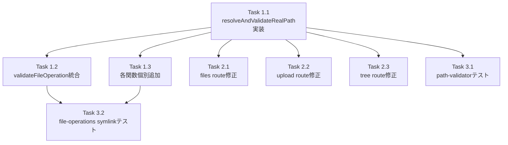

# Issue #394 作業計画書

## Issue概要
**Issue番号**: #394
**タイトル**: security: symlink traversal in file APIs allows access outside worktree root
**サイズ**: M
**優先度**: High（セキュリティ脆弱性）
**依存Issue**: なし

### 問題サマリー
`isPathSafe()`がレキシカルパス正規化のみを行い`realpathSync()`によるsymlink解決を行わないため、worktree内のsymlinkを経由して外部ファイルにアクセス可能な脆弱性。

### 修正アプローチ（Option B）
`resolveAndValidateRealPath()`を`path-validator.ts`に新規追加し、全ファイルAPIエンドポイントで`isPathSafe()`後に呼び出す（既存の`isPathSafe()`は変更しない）。

---

## 詳細タスク分解

### Phase 1: コア実装

- [ ] **Task 1.1**: `resolveAndValidateRealPath()`の実装
  - 成果物: `src/lib/path-validator.ts`（関数追加）
  - 依存: なし
  - 実装内容:
    - `realpathSync(rootDir)` → resolvedRoot
    - 対象パスが存在する場合: `realpathSync(fullPath)` → resolvedTarget
    - 対象パスが存在しない場合: 最近接祖先ディレクトリのrealpathSync（`while (currentPath !== path.dirname(currentPath))`で停止）
    - `resolvedTarget.startsWith(resolvedRoot + sep) || resolvedTarget === resolvedRoot` で境界確認
    - エラー時はfalse（fail-safe）
    - symlink拒否時は`console.warn('[SEC-394]...')`でログ出力

- [ ] **Task 1.2**: `validateFileOperation()`にrealpath検証を統合
  - 成果物: `src/lib/file-operations.ts`（validateFileOperation修正）
  - 依存: Task 1.1
  - 実装内容:
    - `isPathSafe()`後に`resolveAndValidateRealPath()`を追加
    - `resolvedSource`の返却値は変更しない（レキシカルパスを維持、[S3-001]）
    - JSDocコメントに`[SEC-394]`タグで変更を記録（[S2-003]）

- [ ] **Task 1.3**: `file-operations.ts`の各関数にrealpath検証を個別追加
  - 成果物: `src/lib/file-operations.ts`（5関数修正）
  - 依存: Task 1.1
  - 対象関数（validateFileOperation未使用の5関数）:
    - `readFileContent()`: isPathSafe後にresolveAndValidateRealPath追加
    - `updateFileContent()`: 同上
    - `createFileOrDirectory()`: 同上（祖先走査フォールバック使用）
    - `deleteFileOrDirectory()`: 同上
    - `writeBinaryFile()`: 同上（祖先走査フォールバック使用）
  - 注意: validateFileOperation使用のrename/moveは Task 1.2 で自動カバー

### Phase 2: APIルート修正

- [ ] **Task 2.1**: `files/[...path]/route.ts`のgetWorktreeAndValidatePath修正
  - 成果物: `src/app/api/worktrees/[id]/files/[...path]/route.ts`
  - 依存: Task 1.1
  - 実装内容:
    - `getWorktreeAndValidatePath()`内のisPathSafe後にresolveAndValidateRealPath追加（主防御）
    - 画像・動画の`readFile()`直接呼び出し（行153、行200-211）はgetWorktreeAndValidatePath通過後のため自動保護（追加不要、[S1-004]）

- [ ] **Task 2.2**: `upload/[...path]/route.ts`にrealpath検証追加
  - 成果物: `src/app/api/worktrees/[id]/upload/[...path]/route.ts`
  - 依存: Task 1.1
  - 実装内容:
    - 行117の`isPathSafe(normalizedDir, worktree.path)`後に`resolveAndValidateRealPath(normalizedDir, worktree.path)`を追加（[S2-001]）

- [ ] **Task 2.3**: `tree/[...path]/route.ts`にrealpath検証追加
  - 成果物: `src/app/api/worktrees/[id]/tree/[...path]/route.ts`
  - 依存: Task 1.1
  - 実装内容:
    - 行75の`isPathSafe(relativePath, worktree.path)`後に`resolveAndValidateRealPath(relativePath, worktree.path)`を追加（[S2-001]）
    - ルートパスのみ検証（子エントリはfile-tree.tsのlstatで防御、変更なし）

### Phase 3: テスト実装

- [ ] **Task 3.1**: `path-validator.test.ts`にrealpath検証テストを追加
  - 成果物: `tests/unit/path-validator.test.ts`
  - 依存: Task 1.1
  - テストケース（10件）:
    1. 外部symlinkへのアクセス → false
    2. 内部symlink（worktree内完結）→ true
    3. dangling symlink → false
    4. 多段symlink（symlink→symlink→外部）→ false
    5. macOS tmpdir互換（rootDirにsymlink含む）→ true
    6. 存在しないパスの親ディレクトリ検証（祖先走査）
    7. ルート(/)に到達した場合の停止確認
    8. realpathSync失敗時のfail-safe（false返却）
    9. resolvedTargetがrootDirと等しい場合 → true
    10. 内部symlink下の存在しないパス（create用）→ true

- [ ] **Task 3.2**: `file-operations-symlink.test.ts`を新規作成
  - 成果物: `tests/unit/lib/file-operations-symlink.test.ts`（新規）
  - 依存: Task 1.2, Task 1.3
  - テストケース（6件）:
    1. 外部symlink経由のreadFileContent → INVALID_PATH
    2. 外部symlink経由のupdateFileContent → INVALID_PATH
    3. 外部symlink経由のdeleteFileOrDirectory → INVALID_PATH
    4. 外部symlinkディレクトリ下のcreateFileOrDirectory → INVALID_PATH
    5. 外部symlink経由のrenameFileOrDirectory（ソースパス）→ INVALID_PATH
    6. 外部symlinkディレクトリへのwriteBinaryFile → INVALID_PATH
    7. 内部symlink経由のreadFileContent → success（回帰テスト）
    8. 画像拡張子（.png）のsymlinkトラバーサル検証（[S1-004]）
    9. 動画拡張子（.mp4）のsymlinkトラバーサル検証（[S1-004]）

---

## タスク依存関係



**並列実行可能**: Task 1.2, 1.3, 2.1, 2.2, 2.3, 3.1（全てTask 1.1完了後）

---

## 品質チェック項目

| チェック項目 | コマンド | 基準 |
|-------------|----------|------|
| ESLint | `npm run lint` | エラー0件 |
| TypeScript | `npx tsc --noEmit` | 型エラー0件 |
| Unit Test | `npm run test:unit` | 全テストパス |
| Build | `npm run build` | 成功 |

---

## 成果物チェックリスト

### コード（修正ファイル）
- [ ] `src/lib/path-validator.ts` - `resolveAndValidateRealPath()`追加
- [ ] `src/lib/file-operations.ts` - `validateFileOperation()`統合 + 5関数個別追加
- [ ] `src/app/api/worktrees/[id]/files/[...path]/route.ts` - `getWorktreeAndValidatePath()`修正
- [ ] `src/app/api/worktrees/[id]/upload/[...path]/route.ts` - realpath検証追加
- [ ] `src/app/api/worktrees/[id]/tree/[...path]/route.ts` - realpath検証追加

### テスト（追加/修正ファイル）
- [ ] `tests/unit/path-validator.test.ts` - symlink検証テスト追加（10件）
- [ ] `tests/unit/lib/file-operations-symlink.test.ts` - 新規作成（9件）

### ドキュメント
- [ ] `CLAUDE.md` - `src/lib/path-validator.ts`モジュール説明に`resolveAndValidateRealPath()`を追記
- [ ] `CLAUDE.md` - `src/lib/file-operations.ts`説明にsymlink検証追加を記載

---

## 実装上の注意事項

### resolveAndValidateRealPath()のアルゴリズム詳細（設計方針書5.1より）

```typescript
export function resolveAndValidateRealPath(targetPath: string, rootDir: string): boolean {
  // 1. rootDirをrealpathSyncで解決（macOS /var互換性）
  let resolvedRoot: string;
  try {
    resolvedRoot = realpathSync(rootDir);
  } catch {
    return false; // fail-safe
  }

  const fullPath = path.resolve(rootDir, targetPath);

  // 2. 対象パスが存在する場合
  if (existsSync(fullPath)) {
    try {
      const resolvedTarget = realpathSync(fullPath);
      const ok = resolvedTarget.startsWith(resolvedRoot + sep) || resolvedTarget === resolvedRoot;
      if (!ok) {
        console.warn(`[SEC-394] symlink traversal rejected: ${targetPath} -> ${resolvedTarget}`);
      }
      return ok;
    } catch {
      return false; // fail-safe
    }
  }

  // 3. 存在しないパスの場合（create/upload）：最近接祖先ディレクトリを検証
  let currentPath = path.dirname(fullPath);
  while (currentPath !== path.dirname(currentPath)) { // ルート到達で停止
    if (existsSync(currentPath)) {
      try {
        const resolvedAncestor = realpathSync(currentPath);
        const ok = resolvedAncestor.startsWith(resolvedRoot + sep) || resolvedAncestor === resolvedRoot;
        if (!ok) {
          console.warn(`[SEC-394] symlink traversal rejected (ancestor): ${currentPath} -> ${resolvedAncestor}`);
        }
        return ok;
      } catch {
        return false; // fail-safe
      }
    }
    currentPath = path.dirname(currentPath);
  }
  return false; // rootに到達しても見つからない場合はfail-safe
}
```

### validateFileOperation()修正時の注意
- `resolvedSource`の返却値は**変更しない**（`join(worktreeRoot, sourcePath)`のレキシカルパスを維持）
- realpathSyncの結果は検証のみに使用し、返却しない（[S3-001]）

### SEC-006との重複について（moveFileOrDirectory）
- `validateFileOperation()`にresolveAndValidateRealPath追加後、`moveFileOrDirectory()`はSEC-006と二重にrealpath検証を行う
- これは意図的（Defense-in-depth）、将来SEC-006が削除される場合のみ整理する（[S4-004]）

---

## Definition of Done

- [ ] 全タスク完了
- [ ] `npm run test:unit` 全パス
- [ ] `npx tsc --noEmit` エラー0件
- [ ] `npm run lint` エラー0件
- [ ] 新規テストケース（path-validator: 10件、file-operations-symlink: 9件）が全パス
- [ ] 既存テスト（file-operations.test.ts、path-validator.test.ts等）が引き続きパス
- [ ] CLAUDE.md更新完了

---

## 次のアクション

1. **TDD実装**: `/pm-auto-dev 394`で自動実装
2. **PR作成**: `/create-pr`で自動作成

---

*Generated by work-plan for Issue #394*
*設計方針書: dev-reports/design/issue-394-symlink-traversal-fix-design-policy.md*
