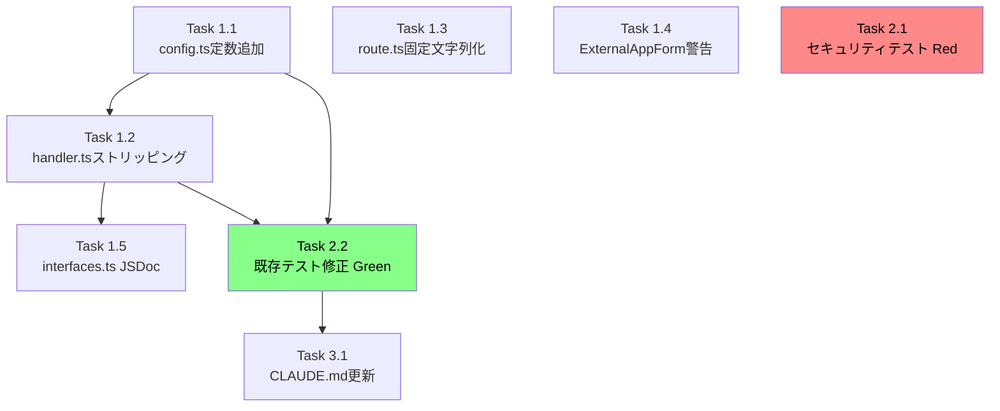

# 作業計画書 - Issue #395

## Issue: security: same-origin trust break and credential leakage through /proxy/* external app proxy

**Issue番号**: #395
**サイズ**: M
**優先度**: High（Critical security fix）
**依存Issue**: なし

---

## 変更対象ファイル一覧

| ファイル | 変更種別 | 概要 |
|---------|---------|------|
| `src/lib/proxy/config.ts` | 修正 | SENSITIVE_REQUEST_HEADERS / SENSITIVE_RESPONSE_HEADERS 定数追加 |
| `src/lib/proxy/handler.ts` | 修正 | proxyHttp()ヘッダストリッピング + proxyWebSocket()情報漏洩修正 |
| `src/app/proxy/[...path]/route.ts` | 修正 | catch節・404/503エラーレスポンス固定文字列化 |
| `src/components/external-apps/ExternalAppForm.tsx` | 修正 | セキュリティ警告バナー追加 |
| `src/lib/external-apps/interfaces.ts` | 修正 | proxyWebSocket() JSDoc更新 |
| `tests/unit/proxy/handler.test.ts` | 修正 | 既存テスト修正 + セキュリティテスト追加 |
| `CLAUDE.md` | 修正 | handler.ts / config.ts モジュール説明更新 |

---

## 詳細タスク分解

### Phase 1: コア実装

#### Task 1.1: config.ts に機密ヘッダ定数追加
- **成果物**: `src/lib/proxy/config.ts`
- **依存**: なし
- **内容**:
  - `SENSITIVE_REQUEST_HEADERS` 追加（cookie, authorization, proxy-authorization, x-forwarded-for, x-forwarded-host, x-forwarded-proto, x-real-ip）
  - `SENSITIVE_RESPONSE_HEADERS` 追加（set-cookie, content-security-policy, content-security-policy-report-only, x-frame-options, strict-transport-security, access-control-* 6ヘッダ）

#### Task 1.2: handler.ts ヘッダストリッピング実装
- **成果物**: `src/lib/proxy/handler.ts`
- **依存**: Task 1.1
- **内容**:
  - import文に SENSITIVE_REQUEST_HEADERS / SENSITIVE_RESPONSE_HEADERS 追加
  - L60 コメントを `// Clone headers, removing hop-by-hop and sensitive headers (Issue #395)` に更新
  - L62-68 リクエストヘッダフィルタリングループに SENSITIVE_REQUEST_HEADERS チェック追加
  - L86 コメントを同様に更新
  - L87-94 レスポンスヘッダフィルタリングループに SENSITIVE_RESPONSE_HEADERS チェック追加
  - `proxyWebSocket()` の `directUrl` フィールドと内部URLメッセージ除去（パラメータを `_request`, `_app`, `_path` に変更）

#### Task 1.3: route.ts エラーレスポンス固定文字列化
- **成果物**: `src/app/proxy/[...path]/route.ts`
- **依存**: なし（Task 1.1と並列可能）
- **内容**:
  - L106-109 catch節の `(error as Error).message` を `PROXY_ERROR_MESSAGES.BAD_GATEWAY` に変更
  - 404レスポンスの `pathPrefix` 情報除去（固定文字列化）
  - 503レスポンスの `app.displayName` 情報除去（固定文字列化）

#### Task 1.4: ExternalAppForm.tsx セキュリティ警告バナー追加
- **成果物**: `src/components/external-apps/ExternalAppForm.tsx`
- **依存**: なし（並列可能）
- **内容**:
  - フォーム上部に amber 色の警告バナー追加
  - "Proxied apps run under the CommandMate origin and can access CommandMate APIs. Only register trusted applications."

#### Task 1.5: interfaces.ts JSDoc更新
- **成果物**: `src/lib/external-apps/interfaces.ts`
- **依存**: Task 1.2
- **内容**:
  - `IProxyHandler.proxyWebSocket()` の JSDoc を directUrl 削除後の動作に更新

### Phase 2: テスト実装（TDD: Red→Green→Refactor）

#### Task 2.1: セキュリティ関連テスト追加（Red フェーズ: 実装前に失敗テストを書く）
- **成果物**: `tests/unit/proxy/handler.test.ts`
- **依存**: なし（Task 1より先に書く）
- **内容（新規テスト）**:
  - リクエストヘッダストリッピング: cookie, authorization, proxy-authorization, x-forwarded-for, x-forwarded-host, x-forwarded-proto, x-real-ip が upstream に転送されないこと
  - 安全なヘッダ転送（回帰）: Content-Type, Accept, User-Agent が転送されること
  - レスポンスヘッダストリッピング: set-cookie, content-security-policy, x-frame-options, strict-transport-security, access-control-allow-origin, content-security-policy-report-only が除去されること
  - proxyWebSocket() 426レスポンスに directUrl フィールドがないこと
  - proxyWebSocket() message フィールドに内部URL情報が含まれないこと（PROXY_ERROR_MESSAGES.UPGRADE_REQUIRED のみ）

#### Task 2.2: 既存テスト修正（Green フェーズ）
- **成果物**: `tests/unit/proxy/handler.test.ts`
- **依存**: Task 1.1, 1.2
- **内容**:
  - "should forward request headers"（L83-105）: Authorization ヘッダが転送されないこと、機密ヘッダ不在を明示アサート
  - "should include WebSocket upgrade instructions in error response"（L194-210）: directUrl 不在・message 固定文字列の検証に更新

### Phase 3: ドキュメント更新

#### Task 3.1: CLAUDE.md 更新
- **成果物**: `CLAUDE.md`
- **依存**: Phase 1, 2 完了後
- **内容**:
  - `src/lib/proxy/handler.ts` 説明に Issue #395 セキュリティ強化内容追記
  - `src/lib/proxy/config.ts` 説明に SENSITIVE_*定数追記

---

## タスク依存関係

---

## 品質チェック項目

| チェック項目 | コマンド | 基準 |
|-------------|----------|------|
| ESLint | `npm run lint` | エラー0件 |
| TypeScript | `npx tsc --noEmit` | 型エラー0件 |
| Unit Test | `npm run test:unit` | 全テストパス |
| Build | `npm run build` | 成功 |

---

## 成果物チェックリスト

### コード
- [ ] `src/lib/proxy/config.ts` - SENSITIVE_*定数追加
- [ ] `src/lib/proxy/handler.ts` - ヘッダストリッピング + proxyWebSocket修正
- [ ] `src/app/proxy/[...path]/route.ts` - エラーレスポンス固定文字列化
- [ ] `src/components/external-apps/ExternalAppForm.tsx` - 警告バナー
- [ ] `src/lib/external-apps/interfaces.ts` - JSDoc更新

### テスト
- [ ] 機密リクエストヘッダストリッピングテスト（7ヘッダ）
- [ ] 安全ヘッダ転送回帰テスト
- [ ] 機密レスポンスヘッダストリッピングテスト（11ヘッダ）
- [ ] proxyWebSocket() directUrl/message除去テスト
- [ ] 既存テスト修正（"should forward request headers", "should include WebSocket upgrade instructions"）

### ドキュメント
- [ ] `CLAUDE.md` 更新

---

## 受け入れ条件（Issue #395設計方針書より）

1. `SENSITIVE_REQUEST_HEADERS` / `SENSITIVE_RESPONSE_HEADERS` が `config.ts` に追加されている
2. `proxyHttp()` が cookie, authorization, proxy-authorization, x-forwarded-* をストリップする
3. `proxyHttp()` が set-cookie, CSP, X-Frame-Options, HSTS, CORS関連ヘッダをストリップする
4. `proxyWebSocket()` 426レスポンスに `directUrl` フィールドが含まれない
5. `proxyWebSocket()` 426レスポンスの `message` に内部URL情報が含まれない
6. `ExternalAppForm.tsx` にセキュリティ警告バナーが表示される
7. 全テストがパスする（既存テスト修正 + 新規テスト追加）
8. `CLAUDE.md` の handler.ts / config.ts 説明が更新されている
9. `npx tsc --noEmit` でエラーなし
10. `npm run lint` でエラーなし
11. next.config.js CSP/X-Frame-Options が /proxy/* レスポンスに適用されることを確認（または proxyHttp() 内でフォールバック付与）
12. route.ts の catch節が固定文字列エラーレスポンスを返す
13. route.ts の 404/503 レスポンスが pathPrefix / displayName を含まない

---

## 実装順序（推奨）

1. **まずテストを書く（TDD Red）**: Task 2.1 → 全テスト失敗確認
2. **config.ts から実装**: Task 1.1
3. **handler.ts 実装**: Task 1.2 → テストが Green になる
4. **route.ts 実装**: Task 1.3 → テストが Green になる
5. **UI実装**: Task 1.4
6. **JSDoc更新**: Task 1.5
7. **既存テスト修正**: Task 2.2
8. **CLAUDE.md更新**: Task 3.1
9. **最終確認**: `npm run lint && npx tsc --noEmit && npm run test:unit`

---

*Generated by work-plan command for Issue #395*
