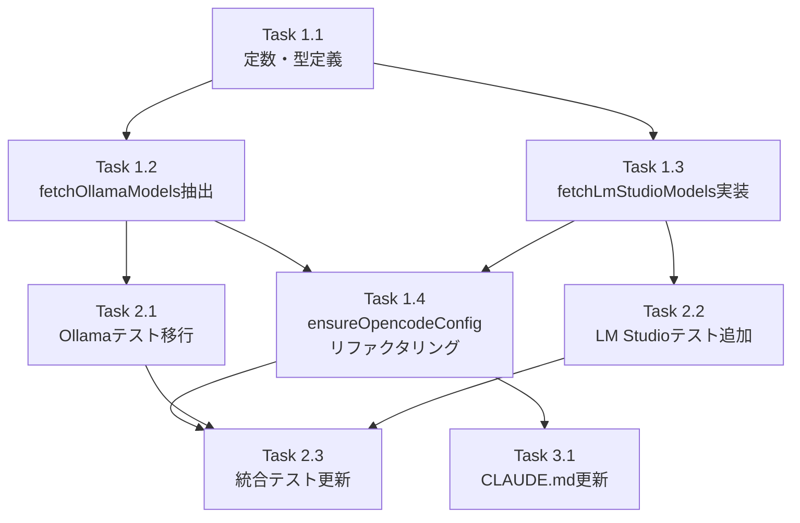

# Issue #398 作業計画書

## Issue: opencode起動時、lmStudioのモデルも選択可能にしたい
**Issue番号**: #398
**サイズ**: M
**優先度**: Medium
**依存Issue**: #379（OpenCode統合・実装済み）

---

## 実装概要

`src/lib/cli-tools/opencode-config.ts` を拡張し、`ensureOpencodeConfig()` がOllamaに加えてLM Studio（OpenAI互換API）からもモデルを取得できるよう改修する。

**コア変更**:
- `fetchOllamaModels()` / `fetchLmStudioModels()` を独立関数として実装（失敗時は空`{}`返却）
- `ensureOpencodeConfig()` を `Promise.all` + 動的プロバイダー構成に変更
- 既存テストをリファクタリングし、LM Studio関連テストを追加

---

## 詳細タスク分解

### Phase 1: コア実装

- [ ] **Task 1.1**: 定数・型定義の追加
  - 成果物: `src/lib/cli-tools/opencode-config.ts`（Constants・Typesセクション）
  - 内容:
    - `LM_STUDIO_API_URL = 'http://localhost:1234/v1/models' as const`（export）
    - `LM_STUDIO_BASE_URL = 'http://localhost:1234/v1' as const`（export）
    - `MAX_LM_STUDIO_MODELS = 100`（export）
    - `LM_STUDIO_MODEL_PATTERN = /^[a-zA-Z0-9._:/@-]{1,200}$/`（export、`@`含む200文字制限）
    - `LM_STUDIO_API_TIMEOUT_MS = 3000`（非export）
    - `MAX_LM_STUDIO_RESPONSE_SIZE = 1 * 1024 * 1024`（非export）
    - `type ProviderModels = Record<string, { name: string }>` 型エイリアス
    - `interface LmStudioModel { id?: unknown }` 型定義
  - 依存: なし

- [ ] **Task 1.2**: `fetchOllamaModels()` 独立関数の抽出
  - 成果物: `src/lib/cli-tools/opencode-config.ts`（Provider Functionsセクション追加）
  - 内容:
    - 既存 `ensureOpencodeConfig()` 内のOllama fetch・parse・validate ロジックを抽出
    - 戻り値型: `Promise<ProviderModels>`
    - 全エラー（非200/サイズ超過/構造不正/例外）で空`{}`を返す（throw しない）
    - 各fetch関数の冒頭にTODOコメント追加（3プロバイダー目追加時の共通化ポイント）
    - `export` する（テスト用）
  - 依存: Task 1.1

- [ ] **Task 1.3**: `fetchLmStudioModels()` 新関数の実装
  - 成果物: `src/lib/cli-tools/opencode-config.ts`（Provider Functionsセクション）
  - 内容:
    - LM Studio OpenAI互換API（`LM_STUDIO_API_URL`）呼び出し
    - レスポンス形式: `{ data: [{ id: string, object: string, ... }] }` をパース
    - `LM_STUDIO_API_TIMEOUT_MS` AbortController タイムアウト
    - `MAX_LM_STUDIO_RESPONSE_SIZE` レスポンスサイズ制限
    - `LM_STUDIO_MODEL_PATTERN` バリデーション（各モデルIDを検証）
    - `MAX_LM_STUDIO_MODELS` 上限切り捨て
    - LM StudioではdetailsなしのためモデルIDをそのまま表示名に使用（`{ name: id }`）
    - 全エラーで空`{}`を返す（throw しない、非致命的）
    - `export` する（テスト用）
  - 依存: Task 1.1

- [ ] **Task 1.4**: `ensureOpencodeConfig()` のリファクタリング
  - 成果物: `src/lib/cli-tools/opencode-config.ts`（Main functionセクション）
  - 内容:
    - `Promise.all([fetchOllamaModels(), fetchLmStudioModels()])` で並列取得
    - 動的プロバイダー構成: 0件プロバイダーのキーは省略
    - 両方0件の場合は `opencode.json` 生成スキップ（`return`）
    - `JSON.stringify()` でconfig生成（D4-005 JSON injection防止）
    - opencode.json の `lmstudio` プロバイダーセクション追加:
      ```json
      "lmstudio": {
        "npm": "@ai-sdk/openai-compatible",
        "name": "LM Studio (local)",
        "options": { "baseURL": "http://localhost:1234/v1" },
        "models": { ... }
      }
      ```
  - 依存: Task 1.2, Task 1.3

### Phase 2: テスト

- [ ] **Task 2.1**: 既存テストの `fetchOllamaModels()` ユニットテストへの移行
  - 成果物: `tests/unit/cli-tools/opencode-config.test.ts`（リファクタリング）
  - 内容（既存`ensureOpencodeConfig()`テスト → `fetchOllamaModels()`テストへ移行）:
    - `should handle Ollama API timeout (non-fatal)` → `fetchOllamaModels()`単体テストに移行
    - `should handle Ollama API network failure (non-fatal)` → 同上
    - `should handle non-200 API response` → 同上
    - `should reject response exceeding size limit` → 同上
    - `should reject invalid API response structure` → 同上
    - `should limit models to MAX_OLLAMA_MODELS` → 同上
    - `should skip invalid model names` → 同上
    - `should include model display name with parameter_size and quantization` → 同上
    - mockFetch: `fetchOllamaModels()` ユニットテストはOllama URLのみmock（LM Studio不要）
  - 依存: Task 1.2

- [ ] **Task 2.2**: `fetchLmStudioModels()` ユニットテストの追加
  - 成果物: `tests/unit/cli-tools/opencode-config.test.ts`（新規`describe`ブロック追加）
  - 内容（新規テストケース）:
    - 正常系: LM Studio API成功→モデル一覧取得・`{ data: [{ id }] }`パース
    - 未起動: ECONNREFUSED → 空`{}`返却（non-fatal）
    - タイムアウト: AbortError → 空`{}`返却（non-fatal）
    - 非200応答: status 500 → 空`{}`返却
    - サイズ超過: 2MB → 空`{}`返却
    - 構造不正: `{ notData: [] }` → 空`{}`返却
    - 件数制限: 150件→100件に切り捨て
    - モデルID検証: 有効ID（`/`含む）・無効ID（スペース等）のフィルタリング
    - `@` 含むモデルIDの受け入れテスト（HuggingFace形式: `org/model@revision`）
    - LM_STUDIO_MODEL_PATTERN 定数テスト（200文字制限）
  - 依存: Task 1.3

- [ ] **Task 2.3**: `ensureOpencodeConfig()` 統合テストの更新・追加
  - 成果物: `tests/unit/cli-tools/opencode-config.test.ts`（既存テスト更新）
  - 内容:
    - 残留する既存テスト（mockFetch を URL ベース分岐に更新）:
      - `should skip if opencode.json already exists`（mockFetch 呼び出しなし、変更不要）
      - `should fetch models from Ollama API and generate config` → 両API mockが必要に変更
      - `should handle write failure gracefully` → LM Studio mockFetch も追加
      - `should treat concurrent file creation as non-fatal` → LM Studio mockFetch も追加
      - `should throw on path traversal detection`（mockFetch 呼び出し前で変更不要）
      - `should throw if path is not a directory`（同上）
    - 新規統合テストケース:
      - OllamaのみAPIが動いている場合: ollamaプロバイダーのみ生成
      - LM StudioのみAPIが動いている場合: lmstudioプロバイダーのみ生成
      - 両方APIが動いている場合: ollama+lmstudio両プロバイダー生成
      - 両方未起動の場合: opencode.json 非生成
    - mockFetch実装: URLで分岐（`OLLAMA_API_URL` vs `LM_STUDIO_API_URL`）
  - 依存: Task 1.4, Task 2.1, Task 2.2

### Phase 3: ドキュメント

- [ ] **Task 3.1**: `CLAUDE.md` の `opencode-config.ts` エントリ更新
  - 成果物: `CLAUDE.md`（主要機能モジュールテーブル）
  - 内容:
    - `opencode-config.ts` エントリの記述を更新:
      - `fetchOllamaModels()` / `fetchLmStudioModels()` 独立関数化を追記
      - 新規定数: `LM_STUDIO_API_URL` / `LM_STUDIO_BASE_URL` / `LM_STUDIO_MODEL_PATTERN` / `MAX_LM_STUDIO_MODELS` を追記
      - `ProviderModels` 型エイリアス追記
  - 依存: Task 1.4

---

## タスク依存関係



---

## 変更ファイル一覧

| ファイル | 変更種別 | 変更内容 |
|---------|---------|---------|
| `src/lib/cli-tools/opencode-config.ts` | 変更 | 定数追加、型追加、fetchOllamaModels/fetchLmStudioModels実装、ensureOpencodeConfigリファクタリング |
| `tests/unit/cli-tools/opencode-config.test.ts` | 変更 | テスト移行、LM Studioテスト追加、統合テスト更新 |
| `CLAUDE.md` | 変更 | opencode-config.tsエントリ更新 |

### スコープ外（変更不要）

| ファイル | 理由 |
|---------|------|
| `src/lib/cli-tools/opencode.ts` | `ensureOpencodeConfig()` シグネチャ不変 |
| `src/lib/claude-executor.ts` | TUIモード対応で十分。スケジュール実行でのLM Studioは将来Issue |
| `src/lib/schedule-manager.ts` | opencode TUIモードではopencode.json経由のため現スコープ外 |
| `tests/unit/cli-tools/opencode.test.ts` | 新規export追加時のmock確認のみ |
| `tests/unit/lib/claude-executor.test.ts` | スコープ外方針により変更不要 |

---

## 品質チェック項目

| チェック項目 | コマンド | 基準 |
|-------------|----------|------|
| ESLint | `npm run lint` | エラー0件 |
| TypeScript | `npx tsc --noEmit` | 型エラー0件 |
| Unit Test | `npm run test:unit` | 全テストパス |
| Build | `npm run build` | 成功 |

---

## 実装上の重要注意事項

### LM_STUDIO_MODEL_PATTERN の `@` 文字
```
/^[a-zA-Z0-9._:/@-]{1,200}$/
```
- `@` 文字を許可: HuggingFace形式モデルID（`org/model@revision`）に対応
- 200文字上限: Ollamaの100文字より長いパス形式モデルID（例: `lmstudio-community/Meta-Llama-3.1-8B-Instruct-GGUF/Meta-Llama-3.1-8B-Instruct-Q4_K_M.gguf`）に対応
- 文字クラス内のハイフン `-` は末尾に配置（正規表現エスケープ不要のため）

### mockFetch URL分岐パターン（テスト実装ガイド）
```typescript
mockFetch.mockImplementation((url: string) => {
  if (url === OLLAMA_API_URL) {
    return Promise.resolve({ ok: true, text: () => Promise.resolve(JSON.stringify({ models: [...] })) });
  }
  if (url === LM_STUDIO_API_URL) {
    return Promise.resolve({ ok: true, text: () => Promise.resolve(JSON.stringify({ data: [...] })) });
  }
  return Promise.reject(new Error('Unknown URL'));
});
```

### 動作変更
既存動作ではOllama 0件でもopencode.jsonを生成していたが、新設計では両プロバイダー0件時はスキップ。これは意図的な動作改善。

---

## 成果物チェックリスト

### コード
- [ ] `opencode-config.ts`: LM_STUDIO_* 定数（6個）追加
- [ ] `opencode-config.ts`: `ProviderModels` 型、`LmStudioModel` 型追加
- [ ] `opencode-config.ts`: `fetchOllamaModels()` 独立関数（export）
- [ ] `opencode-config.ts`: `fetchLmStudioModels()` 新関数（export）
- [ ] `opencode-config.ts`: `ensureOpencodeConfig()` `Promise.all` + 動的プロバイダー構成

### テスト
- [ ] `opencode-config.test.ts`: 既存テスト移行（8テスト → `fetchOllamaModels()` describe）
- [ ] `opencode-config.test.ts`: LM Studioテスト追加（10件以上）
- [ ] `opencode-config.test.ts`: 統合テスト更新・追加（4ケース以上）

### ドキュメント
- [ ] `CLAUDE.md`: `opencode-config.ts` エントリ更新

---

## 受入条件（設計方針書より）

- [ ] LM Studioが起動している場合、そのモデル一覧がopencode.jsonに反映されること
- [ ] LM Studioが未起動の場合、エラーにならずOllamaのみで動作すること
- [ ] Ollamaが未起動の場合、エラーにならずLM Studioのみで動作すること
- [ ] 両方未起動の場合も、致命的エラーにならないこと
- [ ] 両方未起動で取得モデル数が0件の場合、opencode.jsonは生成しないこと（SF-004）
- [ ] ユニットテスト・結合テストがすべてパスすること
- [ ] 既存のOllamaのみの動作に影響がないこと
- [ ] LM Studioモデルのスケジュール実行（非インタラクティブモード）はスコープ外

---

## Definition of Done

- [ ] 全タスク（Task 1.1〜3.1）が完了
- [ ] TypeScript型エラー0件（`npx tsc --noEmit`）
- [ ] ESLintエラー0件（`npm run lint`）
- [ ] 全ユニットテストパス（`npm run test:unit`）
- [ ] ビルド成功（`npm run build`）

---

## 関連ドキュメント

- 設計方針書: `dev-reports/design/issue-398-lmstudio-opencode-design-policy.md`
- Issueレビュー: `dev-reports/issue/398/issue-review/summary-report.md`
- 設計レビュー: `dev-reports/issue/398/multi-stage-design-review/summary-report.md`

---

*Generated by work-plan command*
*Date: 2026-03-02*
