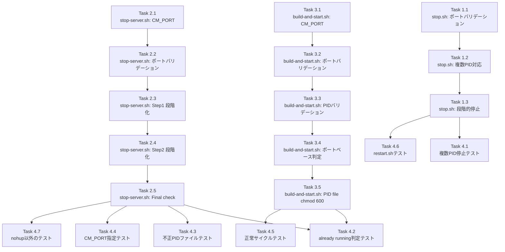

# 作業計画書: Issue #401

## Issue: fix: stop.shが古いサーバープロセスを取りこぼす問題の修正

**Issue番号**: #401
**サイズ**: S
**優先度**: Medium
**依存Issue**: なし

---

## 1. 修正対象ファイルと問題サマリー

| ファイル | 主な問題 | 修正規模 |
|---------|---------|---------|
| `scripts/stop.sh` | 複数PID未対応、停止後確認なし | 小 |
| `scripts/stop-server.sh` | CM_PORT未対応、SIGKILL即時、PIDバリデーションなし | 中 |
| `scripts/build-and-start.sh` | CM_PORT未設定、PIDバリデーション不足、ポートベース判定なし | 小 |

---

## 2. 詳細タスク分解

### Phase 1: scripts/stop.sh の修正

- [ ] **Task 1.1**: ポート番号バリデーション追加
  - `PORT` 変数解決後に `[[ "$PORT" =~ ^[0-9]+$ ]]` + 範囲チェック（1-65535）を追加
  - バリデーション失敗時は固定文字列エラーメッセージ + `exit 1`
  - 成果物: `scripts/stop.sh` 修正
  - 依存: なし

- [ ] **Task 1.2**: 複数PID対応 + PIDバリデーションパイプライン追加
  - `PID=$(lsof -ti:$PORT 2>/dev/null || true)` を `PIDS=$(lsof -ti:$PORT 2>/dev/null | grep -E '^[0-9]+$' | sort -u || true)` に変更
  - 変数名を `PID` → `PIDS` に変更
  - 依存: Task 1.1

- [ ] **Task 1.3**: SIGTERM → SIGKILL 段階的停止の実装
  - `kill "$PID"` を `echo "$PIDS" | xargs kill 2>/dev/null` に変更
  - SIGTERM後: `sleep 2` + 残留チェック + SIGKILLフォールバック
  - REMAINING変数にも `|| true` を付加
  - 成功メッセージを `"✓ Application stopped"` に変更（PID一覧は停止時に表示済みのため省略）
  - 依存: Task 1.2

---

### Phase 2: scripts/stop-server.sh の修正

- [ ] **Task 2.1**: CM_PORT環境変数対応
  - L11: `PORT=3000` → `PORT=${CM_PORT:-${MCBD_PORT:-3000}}` に変更
  - 依存: なし

- [ ] **Task 2.2**: ポート番号バリデーション追加
  - `PORT` 変数解決後に `[[ "$PORT" =~ ^[0-9]+$ ]]` + 範囲チェックを追加
  - バリデーション失敗時は固定文字列エラーメッセージ + `exit 1`
  - 依存: Task 2.1

- [ ] **Task 2.3**: Step 1（ポートベース停止）のSIGTERM + SIGKILL段階化
  - L18: `PIDS=$(lsof -ti:$PORT 2>/dev/null)` → `PIDS=$(lsof -ti:$PORT 2>/dev/null | grep -E '^[0-9]+$' | sort -u || true)` に変更
  - L22: `kill -9` をSIGTERM（`echo "$PIDS" | xargs kill 2>/dev/null`）に変更
  - `sleep 2` + REMAINING取得（`|| true`付き）+ SIGKILLフォールバック追加
  - 依存: Task 2.2

- [ ] **Task 2.4**: Step 2（PIDファイルベース停止）のバリデーションとSIGTERM + SIGKILL段階化
  - L28: `PID=$(cat "$PID_FILE")` → `PID=$(cat "$PID_FILE" 2>/dev/null | head -1 | grep -E '^[0-9]+$')` に変更
  - L29-33: SIGTERM段階で `kill -- -$PID 2>/dev/null || kill $PID 2>/dev/null` を使用（プロセスグループ対応）
  - `sleep 2` + `kill -0` チェック + SIGKILLフォールバック（`kill -9 -$PID 2>/dev/null || kill -9 $PID 2>/dev/null`）
  - SIGKILL後もプロセスが残存する場合、固定文字列の警告メッセージ出力（EPERM対応）
  - 依存: Task 2.3

- [ ] **Task 2.5**: Final check（L38-47）のPIDバリデーション追加
  - L42: `REMAINING=$(lsof -ti:$PORT 2>/dev/null)` → `REMAINING=$(lsof -ti:$PORT 2>/dev/null | grep -E '^[0-9]+$' | sort -u || true)` に変更
  - 依存: Task 2.4

---

### Phase 3: scripts/build-and-start.sh の修正

- [ ] **Task 3.1**: CM_PORT環境変数追加
  - スクリプト冒頭（`set -e` の後、変数定義ブロック）に `PORT=${CM_PORT:-${MCBD_PORT:-3000}}` を追加
  - 依存: なし

- [ ] **Task 3.2**: ポート番号バリデーション追加
  - daemonモード分岐の前に `[[ "$PORT" =~ ^[0-9]+$ ]]` + 範囲チェックを追加
  - バリデーション失敗時は固定文字列エラーメッセージ + `exit 1`
  - 依存: Task 3.1

- [ ] **Task 3.3**: PIDファイルバリデーション追加（L70）
  - `OLD_PID=$(cat "$PID_FILE")` → `OLD_PID=$(cat "$PID_FILE" 2>/dev/null | head -1 | grep -E '^[0-9]+$')` に変更
  - PIDが空の場合（不正PIDファイル）: `rm -f "$PID_FILE"` で削除して続行
  - 依存: Task 3.2

- [ ] **Task 3.4**: ポートベースalready running判定の追加
  - PIDファイルチェックブロックの後に `PORT_PIDS=$(lsof -ti:$PORT 2>/dev/null | grep -E '^[0-9]+$' | sort -u || true)` 追加
  - ポートが使用中の場合: エラーメッセージ + `exit 1`
  - 依存: Task 3.3

- [ ] **Task 3.5**: PIDファイルのパーミッション設定
  - L88: `echo $SERVER_PID > "$PID_FILE"` の後に `chmod 600 "$PID_FILE"` を追加
  - CLI側PidManager（0o600 + O_EXCL）との整合性確保
  - 依存: Task 3.4

---

### Phase 4: 手動テスト

- [ ] **Task 4.1**: 複数PID停止テスト
  - 同一ポートで複数プロセスを起動し、`stop.sh`実行後に`lsof -ti:$PORT`が空であることを確認
  - 依存: Phase 1完了

- [ ] **Task 4.2**: ポートベースalready running判定テスト
  - デーモン起動→PIDファイル手動削除→再度デーモン起動し、残留検知・停止・新規起動が正常動作することを確認
  - 依存: Phase 3完了

- [ ] **Task 4.3**: 不正PIDファイルテスト
  - PIDファイルに `12345\n67890` と書き込んで `stop-server.sh` を実行し、エラーなく動作することを確認
  - 依存: Phase 2完了

- [ ] **Task 4.4**: CM_PORT指定テスト
  - `CM_PORT=3001`で起動した後、`CM_PORT=3001 ./scripts/stop-server.sh`で停止できることを確認
  - 依存: Phase 2完了

- [ ] **Task 4.5**: 正常サイクルテスト
  - `build-and-start.sh --daemon` → `stop-server.sh` → 再起動のサイクルが正常に動作することを確認
  - 依存: Phase 2・3完了

- [ ] **Task 4.6**: restart.shテスト
  - `restart.sh`実行で停止・再起動が正常動作することを確認
  - 依存: Phase 1完了

- [ ] **Task 4.7**: nohup以外の起動パターンテスト
  - nohup以外の起動方法でのstop-server.sh動作確認（`kill -- -$PID`フォールバック検証）
  - 依存: Phase 2完了

---

## 3. タスク依存関係



---

## 4. 実装における重要な設計ポイント

### 4.1 ポートバリデーション（全3スクリプト共通）

```bash
# bash組み込みパターンマッチングを使用（シェルインジェクション防止）
PORT=${CM_PORT:-${MCBD_PORT:-3000}}
if ! [[ "$PORT" =~ ^[0-9]+$ ]] || [ "$PORT" -lt 1 ] || [ "$PORT" -gt 65535 ]; then
    echo 'ERROR: Invalid port number specified in CM_PORT or MCBD_PORT' >&2
    exit 1
fi
```

**注意**: `echo "$PORT" | grep -qE` は使用しない（S4-001）

### 4.2 安全なPIDパイプライン（全スクリプト共通）

```bash
PIDS=$(lsof -ti:$PORT 2>/dev/null | grep -E '^[0-9]+$' | sort -u || true)
```

### 4.3 SIGTERM → SIGKILL 段階的停止（stop.sh）

```bash
if [ -n "$PIDS" ]; then
    echo "Stopping process(es) on port $PORT: $(echo $PIDS | tr '\n' ' ')"
    echo "$PIDS" | xargs kill 2>/dev/null  # SIGTERM

    sleep 2
    REMAINING=$(lsof -ti:$PORT 2>/dev/null | grep -E '^[0-9]+$' | sort -u || true)
    if [ -n "$REMAINING" ]; then
        echo "Force killing remaining processes: $(echo $REMAINING | tr '\n' ' ')"
        echo "$REMAINING" | xargs kill -9 2>/dev/null  # SIGKILL
        sleep 1
    fi

    echo "✓ Application stopped"
fi
```

### 4.4 PIDファイルベース停止のプロセスグループ指定（stop-server.sh）

```bash
PID=$(cat "$PID_FILE" 2>/dev/null | head -1 | grep -E '^[0-9]+$')
if [ -n "$PID" ] && kill -0 "$PID" 2>/dev/null; then
    kill -- -$PID 2>/dev/null || kill $PID 2>/dev/null  # SIGTERM（プロセスグループ）
    sleep 2
    if kill -0 "$PID" 2>/dev/null; then
        kill -9 -$PID 2>/dev/null || kill -9 $PID 2>/dev/null  # SIGKILL
        sleep 1
        if kill -0 "$PID" 2>/dev/null; then
            echo 'WARNING: Process could not be stopped (permission denied or other error)' >&2
        fi
    fi
    stopped=true
fi
```

### 4.5 PIDファイルパーミッション（build-and-start.sh）

```bash
nohup npm start >> "$LOG_FILE" 2>&1 &
SERVER_PID=$!
echo $SERVER_PID > "$PID_FILE"
chmod 600 "$PID_FILE"  # CLI側PidManager（0o600）との整合性
```

---

## 5. 品質チェック項目

| チェック項目 | コマンド | 基準 |
|-------------|----------|------|
| ESLint | `npm run lint` | エラー0件 |
| TypeScript | `npx tsc --noEmit` | 型エラー0件 |
| Unit Test | `npm run test:unit` | 全テストパス |

**注**: シェルスクリプトのみの変更のため、TypeScript・ESLintチェックへの影響は最小限。既存テストへの影響なし。

---

## 6. 成果物チェックリスト

### コード
- [ ] `scripts/stop.sh` 修正（Task 1.1〜1.3）
- [ ] `scripts/stop-server.sh` 修正（Task 2.1〜2.5）
- [ ] `scripts/build-and-start.sh` 修正（Task 3.1〜3.5）

### テスト
- [ ] 手動テスト全項目完了（Task 4.1〜4.7）
- [ ] `npm run test:unit` 全パス確認

---

## 7. 既知の制限事項とトレードオフ

| 事項 | 内容 |
|------|------|
| 停止待機時間増加 | stop.sh: 最大3秒追加。restart.sh合計最大5秒（stop.sh内3秒 + restart.sh自身のsleep 2） |
| TOCTOU競合 | lsof→kill間の競合は理論上存在するが、ローカル開発環境では低リスク（既知の制限として文書化済み） |
| bats-core非導入 | シェルスクリプトの自動テスト未整備（スコープ外） |
| CLIとのPIDファイル分断 | `~/.commandmate/*.pid`とscripts/の分断解消は別Issue |

---

## 8. Definition of Done

- [ ] 全タスク（Phase 1〜3）の実装完了
- [ ] 手動テスト全項目パス（Task 4.1〜4.7）
- [ ] `npm run test:unit` 全パス
- [ ] `npx tsc --noEmit` 型エラー0件
- [ ] `npm run lint` エラー0件
- [ ] PRレビュー承認

---

## 9. 次のアクション

1. **実装開始**: Phase 1（stop.sh）→ Phase 2（stop-server.sh）→ Phase 3（build-and-start.sh）の順で実装
2. **手動テスト**: Phase 4の手動テスト全項目を実施
3. **PR作成**: `/create-pr` でPR作成

---

*作業計画作成日: 2026-03-03*
*設計方針書: `dev-reports/design/issue-401-stop-script-fix-design-policy.md`*
*Issue: https://github.com/Kewton/CommandMate/issues/401*
