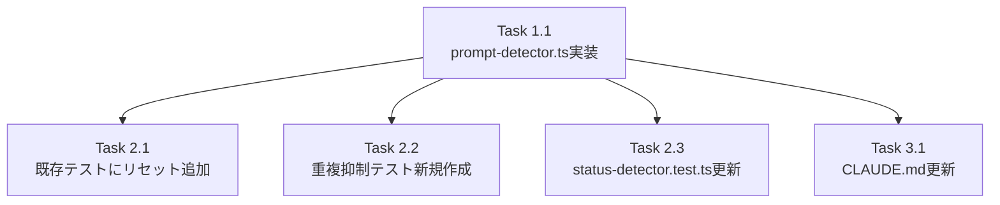

# 作業計画: Issue #402

## Issue: perf: detectPromptの重複ログ出力を抑制してI/O負荷を軽減

**Issue番号**: #402
**サイズ**: S（変更ファイル: 2〜3ファイル、主要変更は1ファイル）
**優先度**: Medium（パフォーマンス改善）
**依存Issue**: なし

---

## 詳細タスク分解

### Phase 1: コア実装

- [ ] **Task 1.1**: `src/lib/prompt-detector.ts` への重複ログ抑制キャッシュ実装
  - 成果物: `src/lib/prompt-detector.ts`（変更）
  - 内容:
    - モジュールスコープ変数 `let lastOutputTail: string | null = null` 追加（D1）
    - `detectPrompt()` 冒頭で `lines = output.split('\n')` を1回実行し、`tailForDedup = lines.slice(-50).join('\n')` で末尾50行抽出（D2-001）
    - `isDuplicate = tailForDedup === lastOutputTail` でキャッシュ判定（D2-001）
    - `if (!isDuplicate)` ガードで `logger.debug('detectPrompt:start')` を囲む（D2-002）
    - `lastOutputTail = tailForDedup` でキャッシュ更新（D2-003）
    - `logger.info('detectPrompt:multipleChoice')` を `if (!isDuplicate)` で囲む（D2-004）
    - `logger.debug('detectPrompt:complete')` を `if (!isDuplicate)` で囲む（D2-005）
    - `resetDetectPromptCache()` `@internal` export追加（D3）
    - 既存の `yes/noパターン用 lastLines` は `lines` を再利用（split()の重複呼び出し回避）[S1-004]
  - 依存: なし
  - 制約: D4-001: 戻り値不変、D4-002: 検出ロジック不変、D4-003: キャッシュ1エントリ

### Phase 2: テスト

- [ ] **Task 2.1**: 既存テストへのキャッシュリセット追加
  - 成果物: `tests/unit/prompt-detector.test.ts`（変更）
  - 内容:
    - `resetDetectPromptCache` を `@/lib/prompt-detector` からインポート
    - 全テスト describe ルートレベルの `beforeEach` に `resetDetectPromptCache()` を追加（必須: S3-001）
  - 依存: Task 1.1

- [ ] **Task 2.2**: 重複ログ抑制の新規テスト追加
  - 成果物: `tests/unit/prompt-detector-cache.test.ts`（新規作成）または `tests/unit/prompt-detector.test.ts` 内の describe ブロック
  - 内容（T1〜T5のテストカテゴリに対応）:
    - **T1**: 同一output→2回目以降のログがスキップされることを `vi.spyOn(logger, 'debug')` / `vi.spyOn(logger, 'info')` で検証
    - **T2**: 異なるoutput→通常ログ出力されることを検証
    - **T3**: キャッシュヒット時の戻り値が非キャッシュ時と同一であることを検証（D4-001）
    - **T4**: `resetDetectPromptCache()` 後はログ出力されることを検証
    - **T5**: `beforeEach`/`afterEach` でキャッシュリセットを行い、テスト間の状態分離を保証
  - 依存: Task 1.1

- [ ] **Task 2.3**: `status-detector.test.ts` への resetDetectPromptCache 追加（推奨）
  - 成果物: `tests/unit/lib/status-detector.test.ts`（変更）
  - 内容:
    - `resetDetectPromptCache` をインポート
    - `beforeEach` で `resetDetectPromptCache()` を呼び出し
  - 依存: Task 1.1

### Phase 3: ドキュメント更新

- [ ] **Task 3.1**: `CLAUDE.md` の `prompt-detector.ts` モジュール説明更新
  - 成果物: `CLAUDE.md`（変更）
  - 内容: Issue #402 のキャッシュ機構について追記
    ```
    **Issue #402: 重複ログ抑制** - lastOutputTailモジュールスコープキャッシュで同一output末尾50行の重複ログをスキップ、resetDetectPromptCache() @internal exportでテスト分離
    ```
  - 依存: Task 1.1

---

## タスク依存関係



---

## 影響確認チェックリスト（コード変更なし）

以下のファイルは変更不要だが、テスト実行時に影響がないことを確認する：

- [ ] `src/lib/response-poller.ts` - detectPromptWithOptions()経由の戻り値に影響なし（D4-001）
- [ ] `src/lib/auto-yes-manager.ts` - ポーリング動作に影響なし（D4-001/D4-002）
- [ ] `src/lib/status-detector.ts` - SF-001の2重呼び出しがキャッシュで自然に抑制（追加検証）
- [ ] `tests/integration/issue-256-acceptance.test.ts` - 戻り値のみを検証するため影響なし
- [ ] `tests/integration/issue-208-acceptance.test.ts` - 戻り値のみを検証するため影響なし

---

## 品質チェック項目

| チェック項目 | コマンド | 基準 |
|-------------|----------|------|
| TypeScript | `npx tsc --noEmit` | 型エラー0件 |
| ESLint | `npm run lint` | エラー0件 |
| Unit Test | `npm run test:unit` | 全テストパス |
| Integration Test | `npm run test:integration` | 全テストパス |

---

## 実装上の注意事項

### prompt-detector.ts の現在の構造

- L170: `export function detectPrompt(output: string, options?: DetectPromptOptions): PromptDetectionResult`
- L171: `logger.debug('detectPrompt:start', { outputLength: output.length })`
- L173: `const lines = output.split('\n')` ← 既存。tailForDedupの抽出とlinesの共有でここを1回のsplit()に
- L185: `logger.info('detectPrompt:multipleChoice', { isPrompt: true, question: ..., optionsCount: ... })`
- L216: `logger.debug('detectPrompt:complete', { isPrompt: false })`

### 実装順序の重要ポイント

1. `lastOutputTail` の宣言はモジュールスコープ（関数外）に配置
2. `lines = output.split('\n')` は既存の L173 を活用（位置を前に移動してisDuplicate計算に使う）
3. キャッシュ更新（`lastOutputTail = tailForDedup`）は**ログ出力前**に行う（D2-003設計通り）
4. `isDuplicate` フラグは戻り値返却には**絶対に関与させない**（D4-001/D4-002）
5. `resetDetectPromptCache()` はファイル末尾にエクスポート（既存の `@internal` export パターンに準拠）

---

## Definition of Done

Issue完了条件：
- [ ] Task 1.1〜1.1: `src/lib/prompt-detector.ts` 変更完了
- [ ] Task 2.1: `tests/unit/prompt-detector.test.ts` のbeforeEachリセット追加
- [ ] Task 2.2: 重複抑制テスト (T1〜T5) 全件パス
- [ ] Task 2.3: `status-detector.test.ts` beforeEachリセット追加（推奨）
- [ ] Task 3.1: `CLAUDE.md` 更新
- [ ] TypeScript: エラー0件
- [ ] ESLint: エラー0件
- [ ] Unit Test: 全テストパス
- [ ] Integration Test: 全テストパス
- [ ] 受入条件:
  - 同一プロンプト出力に対して連続呼び出しで2回目以降のログがスキップされること
  - 新しいプロンプトが検出された場合は通常通りログ出力されること
  - detectPrompt()の戻り値に影響がないこと（D4-001）
  - logger.debug/logger.infoの両ログレベルで重複抑制が正しく動作すること

---

## 次のアクション

1. `src/lib/prompt-detector.ts` の実装（Task 1.1）
2. テスト追加（Task 2.1〜2.3）
3. CLAUDE.md更新（Task 3.1）
4. 品質チェック実行
5. `/create-pr` でPR作成
