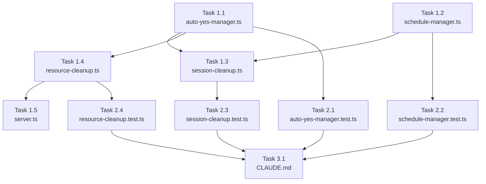

# Issue #404 作業計画

## Issue概要

**Issue番号**: #404
**タイトル**: chore: 長期運用時のリソースリーク対策（残留MCPプロセス + globalThis Mapメモリリーク）
**サイズ**: M
**優先度**: Medium
**依存Issue**: なし（#407 は本Issueに統合済み）

### 実装スコープ

| カテゴリ | 内容 |
|---------|------|
| A. 孤立MCPプロセス | `initResourceCleanup()` で起動時に検出・停止（TypeScript実装のみ、shellスクリプト不要） |
| B. globalThis Mapリーク | worktree削除時のエントリ削除 + 24時間定期クリーンアップ |

---

## 詳細タスク分解

### Phase 1: コア実装

#### Task 1.1: `auto-yes-manager.ts` への削除関数追加
- **成果物**: `src/lib/auto-yes-manager.ts`
- **依存**: なし
- **変更内容**:
  - `deleteAutoYesState(worktreeId: string): boolean` の追加（`isValidWorktreeId()` バリデーション付き [SEC-404-001]）
  - `getAutoYesStateWorktreeIds(): string[]` の追加（`@internal` export、定期クリーンアップ用）
  - `getAutoYesPollerWorktreeIds(): string[]` の追加（`@internal` export、定期クリーンアップ用）

#### Task 1.2: `schedule-manager.ts` への worktree単位停止関数追加
- **成果物**: `src/lib/schedule-manager.ts`
- **依存**: なし
- **変更内容**:
  - `stopScheduleForWorktree(worktreeId: string): void` の追加
    - `schedules` Mapを全イテレーションしworktreeIdフィルタ（O(N)、N≤100）
    - `cmateFileCache` のキー（worktree path）を内部DBルックアップで解決
    - DBルックアップ失敗時はスケジュール停止のみ実施（フォールバック）
    - `activeProcesses` の停止は方式(c)：自然回収委任（cronJob.stop()で新規実行防止）

#### Task 1.3: `session-cleanup.ts` の修正
- **成果物**: `src/lib/session-cleanup.ts`
- **依存**: Task 1.1, Task 1.2
- **変更内容**:
  - `cleanupWorktreeSessions()` 内の `stopAllSchedules()` を `stopScheduleForWorktree(worktreeId)` に変更
  - `deleteAutoYesState(worktreeId)` 呼び出しを追加（`stopAutoYesPolling()` の**後**に実行）
  - 呼び出し順序: `stopAutoYesPolling()` → `deleteAutoYesState()` → `stopScheduleForWorktree()`

#### Task 1.4: `resource-cleanup.ts` の新規作成
- **成果物**: `src/lib/resource-cleanup.ts`（新規）
- **依存**: Task 1.1
- **変更内容**:
  - **Section 1: MCP孤立プロセスクリーンアップ**
    - `cleanupOrphanedMcpProcesses(): Promise<OrphanCleanupResult>`
    - ppid=1 + プロセス名パターン複合チェック（`MCP_PROCESS_PATTERNS`）
    - `execFile('ps', [...], { maxBuffer: MAX_PS_OUTPUT_BYTES })` 使用
    - PIDのparseInt後バリデーション（`Number.isInteger(pid) && pid > 0`）
    - コンテナ環境（/proc/1/cgroup存在）では `execFile` 呼び出しをスキップ
  - **Section 2: globalThis Map定期クリーンアップ**
    - `cleanupOrphanedMapEntries(): CleanupMapResult`
    - `getAllWorktrees()` でDB照会 → Map差分検出 → 孤立エントリ削除
    - better-sqlite3の同期APIで同一同期区間で実行（レース条件なし）
  - **オーケストレーター**
    - `initResourceCleanup()`: 両セクションを初期化（重複タイマー防止: `__resourceCleanupTimerId` 存在チェック）
    - `stopResourceCleanup()`: タイマーを停止（`clearInterval`）
  - **定数**
    - `CLEANUP_INTERVAL_MS = 24 * 60 * 60 * 1000`
    - `MCP_PROCESS_PATTERNS = ['codex mcp-server', 'playwright-mcp']`
    - `MAX_PS_OUTPUT_BYTES = 1 * 1024 * 1024`

#### Task 1.5: `server.ts` の修正
- **成果物**: `server.ts`
- **依存**: Task 1.4
- **変更内容**:
  - 起動シーケンスに `initResourceCleanup()` を追加（`initScheduleManager()` の後）
  - `gracefulShutdown()` に `stopResourceCleanup()` を追加（`stopAllSchedules()` の後）

---

### Phase 2: テスト実装

#### Task 2.1: `auto-yes-manager.test.ts` への追加テスト
- **成果物**: `tests/unit/auto-yes-manager.test.ts`（追記）
- **依存**: Task 1.1
- **テストケース**:
  - `deleteAutoYesState()` が `autoYesStates` からエントリを削除する
  - `deleteAutoYesState()` が `autoYesPollerStates` に影響しない
  - `deleteAutoYesState()` が不正な worktreeId に対して `false` を返す（バリデーション確認）
  - `getAutoYesStateWorktreeIds()` / `getAutoYesPollerWorktreeIds()` が正しいキー配列を返す

#### Task 2.2: `schedule-manager.test.ts` への追加テスト
- **成果物**: `tests/unit/schedule-manager.test.ts`（追記）
- **依存**: Task 1.2
- **テストケース**:
  - `stopScheduleForWorktree()` が対象worktreeのcronJobのみ停止する
  - `stopScheduleForWorktree()` が他worktreeのスケジュールに影響しない
  - `stopScheduleForWorktree()` が対象worktreeのcmateFileCacheエントリを削除する
  - `stopScheduleForWorktree()` がDB lookup失敗時もスケジュール停止を続行する（フォールバック）

#### Task 2.3: `session-cleanup.test.ts` の修正・追加テスト
- **成果物**: `tests/unit/session-cleanup.test.ts`（追記）
- **依存**: Task 1.3
- **前提**: `vi.mock('@/lib/auto-yes-manager')` と `vi.mock('@/lib/schedule-manager')` を追加
- **テストケース**:
  - `cleanupWorktreeSessions()` が `stopAutoYesPolling` → `deleteAutoYesState` → `stopScheduleForWorktree` の順で呼ぶ
  - `cleanupWorktreeSessions()` が `stopAllSchedules()` を呼ばない（回帰テスト）

#### Task 2.4: `resource-cleanup.test.ts` の新規作成
- **成果物**: `tests/unit/resource-cleanup.test.ts`（新規）
- **依存**: Task 1.4
- **テストケース**:
  - `initResourceCleanup()` でタイマーが起動する
  - `initResourceCleanup()` の重複呼び出しでタイマーが1つだけ起動する（重複防止）
  - `stopResourceCleanup()` でタイマーが停止する
  - `cleanupOrphanedMapEntries()` が孤立エントリを検出・削除する
  - `cleanupOrphanedMapEntries()` が有効なworktreeのエントリを削除しない

---

### Phase 3: CLAUDE.md 更新

#### Task 3.1: CLAUDE.md の主要機能モジュール表を更新
- **成果物**: `CLAUDE.md`
- **依存**: Phase 1, Phase 2 完了後
- **変更内容**:
  - `src/lib/resource-cleanup.ts` の説明を追加
  - `src/lib/session-cleanup.ts` の説明を更新（`stopScheduleForWorktree()` 呼び出しに変更）
  - `src/lib/auto-yes-manager.ts` の説明を更新（`deleteAutoYesState()` 追加）
  - `src/lib/schedule-manager.ts` の説明を更新（`stopScheduleForWorktree()` 追加）

---

## タスク依存関係

---

## 品質チェック項目

| チェック項目 | コマンド | 基準 |
|-------------|----------|------|
| ESLint | `npm run lint` | エラー0件 |
| TypeScript | `npx tsc --noEmit` | 型エラー0件 |
| Unit Test | `npm run test:unit` | 全テストパス |
| Build | `npm run build` | 成功 |

---

## 実装上の注意事項

### セキュリティ制約
- [SEC-404-001] `deleteAutoYesState()`: `isValidWorktreeId()` バリデーション必須
- `execFile()` 使用必須（`exec()` 禁止、Issue #393規約）
- ps出力パーサー: PIDのparseInt後 `Number.isInteger(pid) && pid > 0` チェック必須
- MCP_PROCESS_PATTERNSのマッチは境界マッチを推奨

### 実装順序の制約
- `session-cleanup.ts` の呼び出し順序: `stopAutoYesPolling()` → `deleteAutoYesState()` → `stopScheduleForWorktree()`
- `server.ts` の起動順序: `initScheduleManager()` → `initResourceCleanup()`
- `stopScheduleForWorktree()` はDBからworktreeレコードが削除される前に呼び出す

### 設計方針参照
- `dev-reports/design/issue-404-resource-leak-cleanup-design-policy.md`

---

## Definition of Done

- [ ] Task 1.1〜1.5（実装）完了
- [ ] Task 2.1〜2.4（テスト）完了 - 全テストパス
- [ ] Task 3.1（CLAUDE.md）完了
- [ ] `npm run lint` エラー0件
- [ ] `npx tsc --noEmit` 型エラー0件
- [ ] `npm run test:unit` 全テストパス
- [ ] `npm run build` 成功
- [ ] 受入条件すべて確認済み

---

## 次のアクション

1. **TDD実装**: `/pm-auto-dev 404`
2. **PR作成**: `/create-pr`
