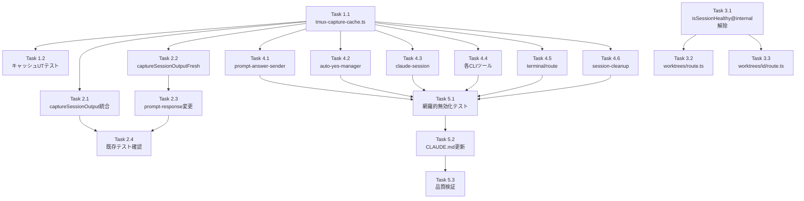

# Issue #405 作業計画書

## Issue: perf: tmux capture最適化 - N+1パターン解消・キャッシュ導入・ポーリング効率改善

**Issue番号**: #405
**サイズ**: L（複数モジュールにまたがる変更、新規モジュール追加含む）
**優先度**: High
**依存Issue**: なし

---

## 概要

3つの問題を一体的に解決する：
1. **S1**: GET /api/worktrees の N+1 パターン（50回のtmux操作/リクエスト）
2. **S3**: tmux capture結果のキャッシュなし（7箇所からの重複取得）
3. **P1/P2**: ポーリングによるtmux操作の増幅

解決策：tmux captureキャッシュ（TTL=2秒）導入 + listSessions()一括取得 + キャッシュ無効化フック

---

## Phase 1: キャッシュモジュール基盤

### Task 1.1: tmux-capture-cache.ts 新規作成

**成果物**: `src/lib/tmux-capture-cache.ts`
**依存**: なし
**見積**: M（複数の機能を実装）

実装内容：
- `CacheEntry` インターフェース（output, capturedLines, timestamp）
- 定数: `CACHE_TTL_MS=2000`, `CACHE_MAX_ENTRIES=100`, `CACHE_MAX_CAPTURE_LINES=10000`
- `getCachedCapture(sessionName, requestedLines)`: TTLチェック + lazy eviction
- `sliceOutput(fullOutput, requestedLines)`: 末尾からのスライス（行ベース）
- `setCachedCapture(sessionName, output, capturedLines)`: full sweep + サイズ制限
- `invalidateCache(sessionName)`: debugログ付き削除 [SEC4-006]
- `clearAllCache()`: 全クリア（graceful shutdown用）
- `resetCacheForTesting()`: テスト分離用
- `getOrFetchCapture(sessionName, requestedLines, fetchFn)`: singleflightパターン
- globalThisパターン: `globalThis.__tmuxCaptureCache`

**セキュリティ要件**:
- setCachedCapture()でfull sweep（[SEC4-002]）
- invalidateCache()にdebugログ（[SEC4-006]）
- sessionNameはTrust Boundary内でのみ使用（[SEC4-001]）

**sliceOutput()の整合性検証注記** [DA3-001]:
- `output.split('\n').length`との行数整合性を必ずテストで検証
- 末尾改行の有無によるoff-by-oneを検証するテストケースを追加
- requestedLines >= capturedLinesの場合はフル返却（スライスなし）

### Task 1.2: tmux-capture-cache.ts ユニットテスト

**成果物**: `tests/unit/lib/tmux-capture-cache.test.ts`
**依存**: Task 1.1
**見積**: M

テストケース：
- TTLベースのキャッシュヒット/ミス
- full sweep（setCachedCapture時のTTL切れエントリ削除）
- サイズ制限（CACHE_MAX_ENTRIES超過時の最古エントリ削除）
- singleflightパターン（同時リクエストの重複排除）
- invalidateCache()の動作確認
- clearAllCache()の動作確認
- sliceOutput()の各行数パターン（100, 200, 5000, 10000行）[DC2-012]
- 末尾改行の有無テスト（off-by-one検証）[DA3-001]
- resetCacheForTesting()によるテスト分離

---

## Phase 2: captureSessionOutput()統合 + captureSessionOutputFresh()追加

### Task 2.1: cli-session.ts - captureSessionOutput()キャッシュ統合

**成果物**: `src/lib/cli-session.ts` 修正
**依存**: Task 1.1
**見積**: S

変更内容：
- `getOrFetchCapture(sessionName, lines, fetchFn)`を使用するように変更
- fetchFn内で既存の `hasSession()` + `capturePane()` を実行
- エラーメッセージ形式を維持: `'Failed to capture {cliTool.name} output: {errorMessage}'`[DC2-004]
- ログ出力方針: キャッシュヒット時はdebugログ（sessionName, requestedLines, cacheAge）[DC2-003]
- キャッシュimportはcli-session.tsに集中（将来のDI移行余地を残す）[DR1-004]

**インターフェース非変更の確認**:
- `captureSessionOutput(worktreeId, cliToolId, lines)` のシグネチャは変更しない
- 既存テスト（auto-yes-manager.test.tsの90箇所以上のモック等）が修正なしでパスすること

### Task 2.2: cli-session.ts - captureSessionOutputFresh()新規追加

**成果物**: `src/lib/cli-session.ts` 修正
**依存**: Task 1.1
**見積**: S

実装内容：
```typescript
export async function captureSessionOutputFresh(
  worktreeId: string,
  cliToolId: string,
  lines: number = 5000
): Promise<string>
```

- キャッシュをバイパスして直接 `capturePane()` を実行
- 結果が空文字列でない場合のみ `setCachedCapture()` で書き戻し [SEC4-007]
- エラー時は `invalidateCache(sessionName)` を呼ぶ（TOCTOU対策）[DA3-005]
- `prompt-response/route.ts` での使用を想定（lines=5000デフォルト）

コード例：
```typescript
try {
  const output = await capturePane(sessionName, { startLine: -lines });
  if (output && output.length > 0) {
    setCachedCapture(sessionName, output, lines);
  } else {
    invalidateCache(sessionName);
  }
  return sliceOutput(output, lines);
} catch (error) {
  invalidateCache(sessionName);
  throw error;
}
```

### Task 2.3: prompt-response/route.ts - captureSessionOutputFresh()呼び出しに変更

**成果物**: `src/app/api/worktrees/[id]/prompt-response/route.ts` 修正
**依存**: Task 2.2
**見積**: XS

変更内容：
- L96の `captureSessionOutput(params.id, cliToolId, 5000)` を `captureSessionOutputFresh(params.id, cliToolId)` に変更
- 既存の `isRunning()` チェック（L79）はHealthCheck目的で維持（別目的）[DC2-008]

### Task 2.4: 既存テストのパス確認

**成果物**: テスト結果
**依存**: Task 2.1, 2.2, 2.3
**見積**: XS

確認内容：
- `npm run test:unit` で既存テストが変更なしでパスすること
- `tests/unit/api/prompt-response-verification.test.ts`（38箇所のcaptureSessionOutput参照）を重点確認
- `captureSessionOutputFresh()` のモック対応が必要かを確認 [DA3-011]

---

## Phase 3: isRunning()最適化（listSessions一括取得）

### Task 3.1: isSessionHealthy()の@internal解除

**成果物**: `src/lib/claude-session.ts` 修正
**依存**: なし
**見積**: XS

変更内容：
- `isSessionHealthy()` の `@internal` アノテーションをproduction exportに変更 [DC2-002]
- `HealthCheckResult` インターフェースも公開export

### Task 3.2: worktrees/route.ts - listSessions()一括取得

**成果物**: `src/app/api/worktrees/route.ts` 修正
**依存**: Task 3.1
**見積**: M

変更内容（listSessions()によるN+1解消）：
```typescript
// 変更前: 各worktreeに対してcliTool.isRunning()を呼ぶ（5回のhasSession()）
// 変更後: listSessions()で1回取得してSet.has()で判定
const sessionNames = new Set(await tmux.listSessions());
for (const worktree of worktrees) {
  for (const cliToolId of selectedCLIToolIds) {
    const sessionName = CLIToolManager.getTool(cliToolId).getSessionName(worktree.id);
    const isRunning = sessionNames.has(sessionName);
    // ClaudeToolのみ追加HealthCheck [DR1-005]
    if (isRunning && cliToolId === 'claude') {
      const healthResult = await isSessionHealthy(sessionName);
      if (!healthResult.healthy) continue; // isRunning = false扱い
    }
    if (isRunning) {
      const output = await captureSessionOutput(worktree.id, cliToolId, 100);
      // ...
    }
  }
}
```

### Task 3.3: worktrees/[id]/route.ts - 同等の最適化適用

**成果物**: `src/app/api/worktrees/[id]/route.ts` 修正
**依存**: Task 3.1
**見積**: S

変更内容：
- worktrees/route.tsと同等のlistSessions()一括取得パターンを適用
- 単一worktreeのGETでも5回のhasSession()が1回のlistSessions()に削減

---

## Phase 4: キャッシュ無効化

### Task 4.1: prompt-answer-sender.ts - キャッシュ無効化フック挿入

**成果物**: `src/lib/prompt-answer-sender.ts` 修正
**依存**: Task 1.1
**見積**: S

変更内容：
- `sendKeys()` / `sendSpecialKeys()` 呼び出し後に `invalidateCache(sessionName)` を挿入
- sendPromptAnswer()完了後のキャッシュ無効化

### Task 4.2: auto-yes-manager.ts - try-finallyパターン実装

**成果物**: `src/lib/auto-yes-manager.ts` 修正
**依存**: Task 1.1
**見積**: S

変更内容：
- `detectAndRespondToPrompt()` 内の `sendPromptAnswer()` 後にtry-finallyパターンでキャッシュクリア
- 実行順序: `sendPromptAnswer()` → `invalidateCache(sessionName)` （finally保証）→ `scheduleNextPoll()`

### Task 4.3: claude-session.ts - キャッシュ無効化フック挿入

**成果物**: `src/lib/claude-session.ts` 修正
**依存**: Task 1.1
**見積**: S

変更内容：
- `sendMessageToClaude()` の末尾（pasted-text-helper.ts呼び出し後）に `invalidateCache(sessionName)` を挿入 [DA3-009]
- `stopClaudeSession()` の `tmux.sendSpecialKey(sessionName, 'C-d')` 後に `invalidateCache(sessionName)` を挿入

### Task 4.4: 各CLIツール - キャッシュ無効化フック挿入（並列実施可能）

**成果物**: 複数ファイル修正（同時作業可能）
**依存**: Task 1.1
**見積**: S × 4

- `src/lib/cli-tools/codex.ts`: sendMessage()末尾に `invalidateCache(sessionName)` 追加
- `src/lib/cli-tools/gemini.ts`: sendMessage()末尾に `invalidateCache(sessionName)` 追加
- `src/lib/cli-tools/opencode.ts`: sendMessage()/killSession()後に `invalidateCache(sessionName)` 追加
- `src/lib/cli-tools/vibe-local.ts`: sendMessage()末尾に `invalidateCache(sessionName)` 追加

### Task 4.5: terminal/route.ts - sendKeys()後のキャッシュ無効化

**成果物**: `src/app/api/worktrees/[id]/terminal/route.ts` 修正
**依存**: Task 1.1
**見積**: XS

変更内容：
- `tmux.sendKeys()` 呼び出し後に `invalidateCache(sessionName)` を挿入

### Task 4.6: session-cleanup.ts - clearAllCache()追加

**成果物**: `src/lib/session-cleanup.ts` 修正
**依存**: Task 1.1
**見積**: XS

変更内容：
- `cleanupWorktreeSessions()` の先頭に `clearAllCache()` を挿入（shutdown開始時の全キャッシュ無効化）
- FacadeパターンのDRY原則に従い既存のstop関数群と同列に追加

---

## Phase 5: テスト・ドキュメント

### Task 5.1: 全CLIツール網羅的キャッシュ無効化テスト

**成果物**: `tests/unit/lib/tmux-capture-invalidation.test.ts`（または既存テストに追加）
**依存**: Task 4.1〜4.6
**見積**: M

テストケース（B案の漏れ防止策）：
- claude-session.ts: sendMessageToClaude()後にキャッシュ無効化されること
- codex.ts: sendMessage()後にキャッシュ無効化されること
- gemini.ts: sendMessage()後にキャッシュ無効化されること
- opencode.ts: sendMessage()後にキャッシュ無効化されること
- vibe-local.ts: sendMessage()後にキャッシュ無効化されること
- terminal/route.ts: sendKeys()後にキャッシュ無効化されること
- auto-yes-manager.ts: sendPromptAnswer()後にキャッシュ無効化されること
- session-cleanup.ts: clearAllCache()で全セッションのキャッシュが無効化されること

### Task 5.2: CLAUDE.md更新

**成果物**: `CLAUDE.md` 修正
**依存**: Task 5.1
**見積**: S

追加内容：
- `src/lib/tmux-capture-cache.ts` モジュール説明追加（globalThisパターン、TTL=2秒、singleflight）
- `src/lib/cli-session.ts` の変更内容更新（captureSessionOutputFresh()追加を明記）[DC2-006]
- **新規CLIツール追加ガイドライン追記**: 「sendMessage()/killSession()実装にinvalidateCache(sessionName)を挿入すること」の注記を追加

### Task 5.3: 品質検証

**成果物**: テスト結果
**依存**: 全Task
**見積**: S

```bash
npx tsc --noEmit    # TypeScript型チェック
npm run lint        # ESLint
npm run test:unit   # 単体テスト全パス
npm run build       # ビルド成功確認
```

---

## タスク依存関係



---

## 品質チェック項目

| チェック項目 | コマンド | 基準 |
|-------------|----------|------|
| TypeScript | `npx tsc --noEmit` | 型エラー0件 |
| ESLint | `npm run lint` | エラー0件 |
| Unit Test | `npm run test:unit` | 全テストパス |
| Build | `npm run build` | 成功 |

---

## 成果物チェックリスト

### 新規ファイル
- [ ] `src/lib/tmux-capture-cache.ts`
- [ ] `tests/unit/lib/tmux-capture-cache.test.ts`
- [ ] `tests/unit/lib/tmux-capture-invalidation.test.ts`（または既存テストに追加）

### 修正ファイル
- [ ] `src/lib/cli-session.ts`（キャッシュ統合 + captureSessionOutputFresh追加）
- [ ] `src/app/api/worktrees/route.ts`（listSessions一括取得）
- [ ] `src/app/api/worktrees/[id]/route.ts`（listSessions一括取得）
- [ ] `src/app/api/worktrees/[id]/prompt-response/route.ts`（captureSessionOutputFresh呼び出し）
- [ ] `src/app/api/worktrees/[id]/terminal/route.ts`（キャッシュ無効化フック）
- [ ] `src/lib/auto-yes-manager.ts`（try-finallyキャッシュ無効化）
- [ ] `src/lib/prompt-answer-sender.ts`（キャッシュ無効化フック）
- [ ] `src/lib/claude-session.ts`（@internal解除 + キャッシュ無効化フック）
- [ ] `src/lib/cli-tools/codex.ts`（キャッシュ無効化フック）
- [ ] `src/lib/cli-tools/gemini.ts`（キャッシュ無効化フック）
- [ ] `src/lib/cli-tools/opencode.ts`（キャッシュ無効化フック）
- [ ] `src/lib/cli-tools/vibe-local.ts`（キャッシュ無効化フック）
- [ ] `src/lib/session-cleanup.ts`（clearAllCache追加）
- [ ] `CLAUDE.md`（モジュール説明 + ガイドライン追記）

---

## 受入条件チェック

- [ ] 同一セッションの重複tmux captureが排除されること
- [ ] 非実行中CLIツールへの不要なtmux操作がスキップされること
- [ ] キャッシュ導入後、セッションステータスの反映遅延がキャッシュTTL（2秒）以内に収まること
- [ ] ユーザーがコマンド送信後、次回ポーリングでステータスが更新されること（キャッシュ無効化が正しく動作すること）
- [ ] 既存のプロンプト検出・auto-yes動作に影響がないこと
- [ ] テストがパスすること
- [ ] `captureSessionOutput()` のインターフェースが変更されないこと（既存テストが変更なしでパスすること）
- [ ] GET /api/worktrees/[id] にもlistSessions()一括取得が適用されていること

---

## 特記事項

### sliceOutput()とlastCapturedLineの整合性 [DA3-001]
- `response-poller.ts` の `extractResponse()` は `lastCapturedLine` を基に差分抽出を行う
- sliceOutput()でキャッシュからスライスした場合の行数と `output.split('\n').length` の整合性を実装時に必ず検証すること
- 末尾改行の有無によるoff-by-oneが発生しないことをユニットテストで確認

### singleflightのエラー共有前提 [DA3-002]
- sessionName（`mcbd-{cliToolId}-{worktreeId}` 形式）にcliToolIdが含まれるため、異なるcliToolId経由での同一singleflight参照は発生しない
- この前提をgetOrFetchCapture()のJSDocに明記すること

### Trust Boundary [SEC4-001]
- sessionNameは必ずCLIToolManager.getTool(cliToolId).getSessionName()経由で取得すること
- 直接文字列構築してキャッシュ関数に渡すことは禁止

---

## 関連ファイル

- **設計方針書**: `dev-reports/design/issue-405-tmux-capture-optimization-design-policy.md`
- **Issueレビュー**: `dev-reports/issue/405/issue-review/summary-report.md`
- **設計レビュー**: `dev-reports/issue/405/multi-stage-design-review/summary-report.md`

---

*Generated by /work-plan 405*
