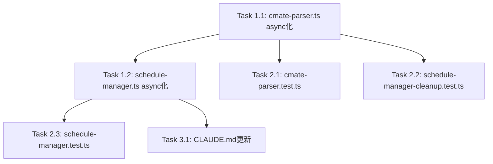

# Issue #406 作業計画書

## Issue: perf: cmate-parserの同期I/Oを非同期化してイベントループブロックを解消

**Issue番号**: #406
**サイズ**: S
**優先度**: Medium
**依存Issue**: なし
**設計方針書**: `dev-reports/design/issue-406-async-cmate-parser-design-policy.md`
**設計レビュー**: `dev-reports/issue/406/multi-stage-design-review/summary-report.md`

---

## 変更対象ファイル

| ファイル | 変更内容 | リスク |
|---------|---------|-------|
| `src/lib/cmate-parser.ts` | import 変更・validateCmatePath/readCmateFile async 化 | low |
| `src/lib/schedule-manager.ts` | syncSchedules() async 化・isSyncing ガード追加 | medium |
| `tests/unit/lib/cmate-parser.test.ts` | async/await テスト対応 | low |
| `tests/unit/lib/schedule-manager.test.ts` | vi.mock 方式変更・async/await 対応 | medium |
| `tests/unit/lib/schedule-manager-cleanup.test.ts` | mockReturnValue → mockResolvedValue | low |
| `CLAUDE.md` | モジュール説明更新 | low |

---

## 詳細タスク分解

### Phase 1: ソースコード変更

#### Task 1.1: `src/lib/cmate-parser.ts` の async 化

**成果物**: `src/lib/cmate-parser.ts`
**依存**: なし
**優先度**: 最初に実装（他の変更の前提）

変更内容:
1. import 文変更: `import { readFileSync, realpathSync } from 'fs'` を削除
2. import 追加: `import { realpath, readFile } from 'fs/promises'`
3. `validateCmatePath()` を async 化:
   - シグネチャ: `export async function validateCmatePath(filePath: string, worktreeDir: string): Promise<boolean>`
   - `realpathSync(filePath)` → `await realpath(filePath)`
   - `realpathSync(worktreeDir)` → `await realpath(worktreeDir)`
4. `readCmateFile()` を async 化:
   - シグネチャ: `export async function readCmateFile(worktreeDir: string): Promise<CmateConfig | null>`
   - `validateCmatePath(filePath, worktreeDir)` → `await validateCmatePath(filePath, worktreeDir)`
   - `readFileSync(filePath, 'utf-8')` → `await readFile(filePath, 'utf-8')`

**参照**: 設計方針書 Section 4.1

---

#### Task 1.2: `src/lib/schedule-manager.ts` の async 化

**成果物**: `src/lib/schedule-manager.ts`
**依存**: Task 1.1
**優先度**: Task 1.1 完了後

変更内容:
1. `ManagerState` に `isSyncing: boolean` フィールド追加（初期値 `false`）
2. `syncSchedules()` を async 化:
   - シグネチャ: `async function syncSchedules(): Promise<void>`
   - 関数先頭に並行実行ガード追加（DJ-007）:
     ```typescript
     if (manager.isSyncing) return;
     manager.isSyncing = true;
     ```
   - try-finally でリセット: `finally { manager.isSyncing = false; }`
   - `readCmateFile(worktree.path)` → `await readCmateFile(worktree.path)`（L516）
3. `initScheduleManager()` の syncSchedules 呼び出し変更（L617）:
   - `syncSchedules()` → `void syncSchedules()` (fire-and-forget、`.catch()` なし)
4. `setInterval` 内の syncSchedules 呼び出し変更（L620-622）:
   - `syncSchedules()` → `void syncSchedules().catch(err => console.error('[schedule-manager] Unexpected sync error:', err))`

**参照**: 設計方針書 Section 4.2、DJ-002、DJ-003、DJ-007

---

### Phase 2: テスト更新

#### Task 2.1: `tests/unit/lib/cmate-parser.test.ts` の async/await 対応

**成果物**: `tests/unit/lib/cmate-parser.test.ts`
**依存**: Task 1.1

変更内容:
1. `validateCmatePath` テストを async/await 対応:
   - テストコールバックを `async` に変更
   - `expect(() => validateCmatePath(...)).not.toThrow()` → `await expect(validateCmatePath(...)).resolves.toBe(true)`
   - `expect(() => validateCmatePath(...)).toThrow('Path traversal detected')` → `await expect(validateCmatePath(...)).rejects.toThrow('Path traversal detected')`
2. `readCmateFile` テストを async/await 対応（既に async の可能性あり、確認必要）
3. **注意**: `validateCmatePath` テスト (L358-391) は実ファイルシステム（tmpdir、symlinks）を使用しており、`fs.promises.realpath()` でそのまま動作するためモック変更不要

**参照**: 設計方針書 Section 4.3

---

#### Task 2.2: `tests/unit/lib/schedule-manager-cleanup.test.ts` のモック更新

**成果物**: `tests/unit/lib/schedule-manager-cleanup.test.ts`
**依存**: Task 1.1

変更内容:
1. L79 の `readCmateFile: vi.fn().mockReturnValue(null)` → `readCmateFile: vi.fn().mockResolvedValue(null)`

**参照**: 設計方針書 Section 4.3

---

#### Task 2.3: `tests/unit/lib/schedule-manager.test.ts` のモック方式変更

**成果物**: `tests/unit/lib/schedule-manager.test.ts`
**依存**: Task 1.1、Task 1.2
**リスク**: medium（最も複雑な変更）

変更内容:
1. ファイル先頭にファイルスコープモックを追加:
   ```typescript
   vi.mock('../../../src/lib/cmate-parser', () => ({
     readCmateFile: vi.fn().mockResolvedValue(null),
     parseSchedulesSection: vi.fn().mockReturnValue([])
   }));

   vi.mock('fs', async (importOriginal) => {
     const original = await importOriginal<typeof import('fs')>();
     return {
       ...original,
       statSync: vi.fn().mockReturnValue({ mtimeMs: 12345 })
     };
   });
   ```
2. テスト内の `vi.doMock('fs', ...)` (L277-281) を削除（`readFileSync`/`realpathSync` モックは不要になる）
3. mtime cache テスト (L273-339) の 4 件を async/await 対応:
   - テストコールバックを `async` に変更
   - `vi.advanceTimersByTime()` → `await vi.advanceTimersByTimeAsync()`
   - `initScheduleManager()` 呼び出し後に `await vi.advanceTimersByTimeAsync(0)` を追加して fire-and-forget Promise を解決
4. 'should skip DB queries when mtime is unchanged' テスト:
   - `vi.mocked(readCmateFile).mockResolvedValueOnce(...)` で CmateConfig を返すよう上書き

**参照**: 設計方針書 Section 4.3、DJ-005

---

### Phase 3: ドキュメント更新

#### Task 3.1: `CLAUDE.md` のモジュール説明更新

**成果物**: `CLAUDE.md`
**依存**: Task 1.1、Task 1.2

変更内容:
- `src/lib/cmate-parser.ts` の説明に async 化の変更を反映:
  - `readCmateFile()` が `Promise<CmateConfig | null>` を返すよう記載更新
  - `validateCmatePath()` が `Promise<boolean>` を返すよう記載更新
- `src/lib/schedule-manager.ts` の説明に syncSchedules async 化と isSyncing ガードを反映

**参照**: 設計方針書 Section 7

---

## タスク依存関係



---

## 実装順序（推奨）

1. **Task 1.1** → TypeScript 型エラーが発生するため次のタスクが明確になる
2. **Task 1.2** → 型エラーを解消しながら実装
3. **Task 2.1, 2.2** → 並行実施可能（独立）
4. **Task 2.3** → 最も複雑、単独で実施
5. **Task 3.1** → 最後に実施

---

## 品質チェック項目

| チェック項目 | コマンド | 基準 |
|-------------|----------|------|
| TypeScript | `npx tsc --noEmit` | 型エラー0件 |
| ESLint | `npm run lint` | エラー0件 |
| Unit Test | `npm run test:unit` | 全テストパス |

---

## 受入条件

- [ ] `validateCmatePath()` および `readCmateFile()` 内に同期ファイルI/Oが残っていないこと
- [ ] `readCmateFile()` が CMATE.md 不存在時に `null` を返す動作が async 化後も維持されること（テストで検証）
- [ ] スケジュールマネージャの CMATE.md 読み込みが正常に動作すること
- [ ] `syncSchedules()` の並行実行が isSyncing ガードで防止されること
- [ ] 既存テストが全てパスすること
- [ ] TypeScript 型エラーが0件であること
- [ ] ESLint エラーが0件であること

---

## Definition of Done

- [ ] Task 1.1 〜 Task 3.1 の全タスク完了
- [ ] 全受入条件を満たしていること
- [ ] `npx tsc --noEmit` 型エラー0件
- [ ] `npm run lint` エラー0件
- [ ] `npm run test:unit` 全テストパス

---

## 補足: 重要な設計注意点

### isSyncing ガード（DJ-007、SEC4-004）
syncSchedules() は async 化により 60 秒ポーリング間隔を超過した場合に並行実行のリスクがある。`ManagerState` に `isSyncing` フラグを追加して防止する（`executeSchedule()` の `isExecuting` パターンと同一）。

### fire-and-forget の非対称性（DJ-002 vs DJ-003）
- `initScheduleManager()` 内: `void syncSchedules()` — `.catch()` なし（サーバー起動時の致命的エラーは fail-fast が望ましい）
- `setInterval` 内: `void syncSchedules().catch(...)` — `.catch()` あり（繰り返し実行でサーバー停止を避ける）

### vi.mock 使用方法（DJ-005）
`vi.doMock()` は static import に効かないためファイルスコープの `vi.mock()` を使用する。
