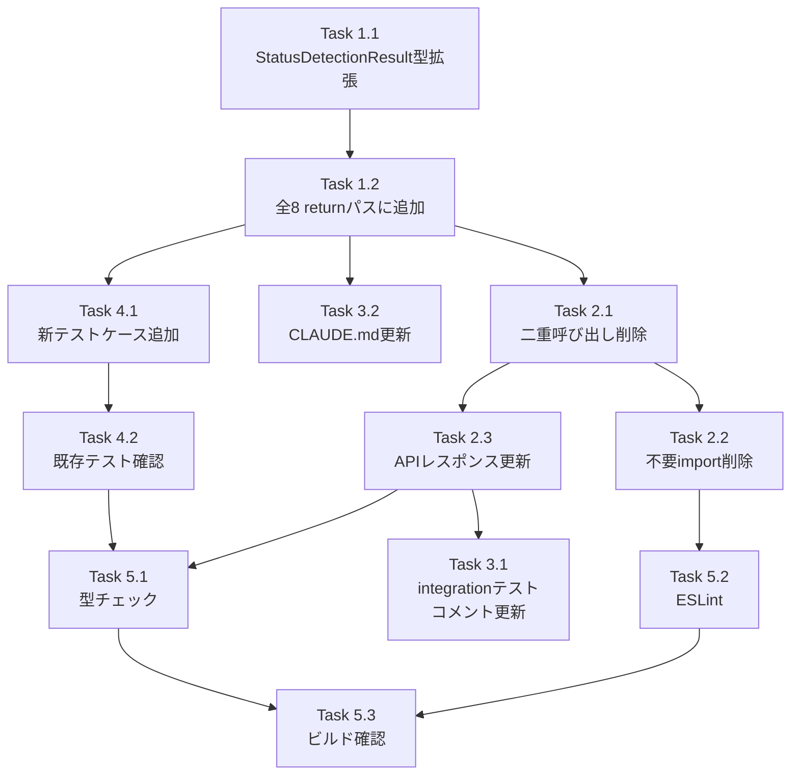

# Issue #408 作業計画書

## Issue: perf: current-output APIのdetectPrompt二重呼び出しを解消

**Issue番号**: #408
**サイズ**: S
**優先度**: Medium
**依存Issue**: なし
**設計方針書**: `dev-reports/design/issue-408-detect-prompt-dedup-design-policy.md`

---

## Issue概要

`GET /api/worktrees/:id/current-output` 内で `detectPrompt()` が `detectSessionStatus()` 内部と外部で二重に呼び出されている問題を解消する。

- **変更前**: `!thinking` ガード内でrequest毎に `detectPrompt()` が最大2回実行される
- **変更後**: `StatusDetectionResult` に `promptDetection: PromptDetectionResult`（required）を追加し、1回のみ呼び出す

---

## 詳細タスク分解

### Phase 1: 型定義・コア実装

- [ ] **Task 1.1**: `StatusDetectionResult` 型拡張
  - 対象ファイル: `src/lib/status-detector.ts`
  - 内容: `promptDetection: PromptDetectionResult` required フィールドを `StatusDetectionResult` interface に追加
  - `type { PromptDetectionResult }` を `./prompt-detector` からインポート追加
  - JSDocコメント追加（DR1-001, Section 3.1の定義どおり）
  - 依存: なし

- [ ] **Task 1.2**: `detectSessionStatus()` の全8 returnパスに `promptDetection` 追加
  - 対象ファイル: `src/lib/status-detector.ts`
  - 内容: 全8箇所の return 文に `promptDetection` フィールドを追加
  - 対象return（設計方針書 Section 4.2）:
    | パス | 行（概算） | reason |
    |------|-----------|--------|
    | 1 | L147 | `prompt_detected` |
    | 2 | L158 | `thinking_indicator` |
    | 3 | L177 | `opencode_processing_indicator` |
    | 4 | L212 | `thinking_indicator` (opencode) |
    | 5 | L225 | `opencode_response_complete` |
    | 6 | L239 | `input_prompt` |
    | 7 | L252 | `no_recent_output` |
    | 8 | L263 | `default` |
  - SF-001 resolvedアーキテクチャノートを JSDoc に追加（Section 9.1）
  - 依存: Task 1.1

### Phase 2: 呼び出し元の更新

- [ ] **Task 2.1**: `current-output/route.ts` の二重呼び出し削除
  - 対象ファイル: `src/app/api/worktrees/[id]/current-output/route.ts`
  - 削除: L98-L102のコードブロック全体（SF-001 `promptDetection` ローカル変数 + `!thinking` ガード + `detectPrompt()` 呼び出し）
  - 削除: `const cleanOutput = stripAnsi(output)` 変数宣言（L81）
  - 実施前に grep で `stripAnsi`, `cleanOutput` の全参照を確認（DR1-007）:
    ```bash
    grep -n 'stripAnsi\|cleanOutput' src/app/api/worktrees/\[id\]/current-output/route.ts
    ```
  - 依存: Task 1.2

- [ ] **Task 2.2**: `current-output/route.ts` の不要 import 削除
  - 対象ファイル: `src/app/api/worktrees/[id]/current-output/route.ts`
  - 削除対象 import（設計方針書 Section 4.4）:
    - `detectPrompt` from `@/lib/prompt-detector`
    - `buildDetectPromptOptions` from `@/lib/cli-patterns`
    - `stripBoxDrawing` from `@/lib/cli-patterns`
    - `stripAnsi` from `@/lib/cli-patterns`（`cleanOutput`削除に伴い全体削除）
  - 依存: Task 2.1

- [ ] **Task 2.3**: APIレスポンス構築の更新
  - 対象ファイル: `src/app/api/worktrees/[id]/current-output/route.ts`
  - 変更: `promptDetection.promptData` → `statusResult.promptDetection.promptData ?? null`
  - optional chaining 不要（required フィールドのため、DR1-006）
  - Issue #408 コメントを追加（Section 9.2）
  - 依存: Task 2.1

### Phase 3: コメント・ドキュメント更新

- [ ] **Task 3.1**: integration test のSF-001コメント更新
  - 対象ファイル: `tests/integration/current-output-thinking.test.ts`
  - 内容: L78, L98 のSF-001コメントを Issue #408 resolved 表記に更新（ロジック変更なし、IA3-006）
  - 依存: Task 2.3

- [ ] **Task 3.2**: CLAUDE.md の `status-detector.ts` モジュール説明更新
  - 対象ファイル: `CLAUDE.md`
  - 内容: SF-001解消、`promptDetection: PromptDetectionResult`（requiredフィールド）追加を反映（Section 10）
  - 依存: Task 1.2

### Phase 4: テスト

- [ ] **Task 4.1**: `tests/unit/lib/status-detector.test.ts` に新テストケース追加
  - 対象ファイル: `tests/unit/lib/status-detector.test.ts`
  - 追加テストケース（設計方針書 Section 7.2）:
    - prompt検出時: `promptDetection.isPrompt === true`、`promptData` が含まれること
    - prompt未検出時: `promptDetection.isPrompt === false`
    - thinking時: `promptDetection.isPrompt === false`（設計保証）
    - 一致性: `hasActivePrompt === promptDetection.isPrompt`（全ケース）
  - 依存: Task 1.2

- [ ] **Task 4.2**: 既存テスト全パス確認
  - 対象: `npm run test:unit`
  - 確認: 既存テストへの変更は不要（全テストは `detectSessionStatus()` 直接呼び出し、IA3-003）
  - 依存: Task 4.1, Task 2.3

### Phase 5: 最終検証

- [ ] **Task 5.1**: TypeScript型チェック
  - `npx tsc --noEmit` でコンパイルエラー0件を確認
  - 特に: 全8 returnパスに `promptDetection` が設定されていることをコンパイラが検証
  - 依存: Task 1.2, Task 2.3

- [ ] **Task 5.2**: ESLint チェック
  - `npm run lint` でエラー0件を確認
  - 依存: Task 2.2

- [ ] **Task 5.3**: ビルド確認
  - `npm run build` で成功を確認
  - 依存: Task 5.1, Task 5.2

---

## タスク依存関係



---

## 品質チェック項目

| チェック項目 | コマンド | 基準 |
|-------------|----------|------|
| ESLint | `npm run lint` | エラー0件 |
| TypeScript | `npx tsc --noEmit` | 型エラー0件（全8 returnパスのコンパイラ保証） |
| Unit Test | `npm run test:unit` | 全テストパス |
| Build | `npm run build` | 成功 |

---

## 成果物チェックリスト

### コード変更ファイル
- [ ] `src/lib/status-detector.ts`（型拡張 + 全8 returnパス + JSDoc更新）
- [ ] `src/app/api/worktrees/[id]/current-output/route.ts`（二重呼び出し削除 + import削除 + コメント更新）

### テスト
- [ ] `tests/unit/lib/status-detector.test.ts`（新テストケース追加）
- [ ] `tests/integration/current-output-thinking.test.ts`（SF-001コメント更新のみ）

### ドキュメント
- [ ] `CLAUDE.md`（`status-detector.ts` モジュール説明更新）

---

## Definition of Done

Issue #408 完了条件:
- [ ] `detectPrompt()` が `current-output` API リクエストあたり1回のみ呼び出されること
- [ ] `StatusDetectionResult.promptDetection` が required フィールドとして型定義されていること
- [ ] 全8 returnパスで `promptDetection` フィールドが設定されていること（コンパイラ保証）
- [ ] `promptData` のレスポンス構造が変更前後で同一であること
- [ ] 不要 import（`detectPrompt`, `buildDetectPromptOptions`, `stripBoxDrawing`, `stripAnsi`）がすべて削除されていること
- [ ] SF-001 コメントが Issue #408 resolved 表記に更新されていること
- [ ] 単体テストカバレッジ: `hasActivePrompt` と `promptDetection.isPrompt` の一致性テストが追加されていること
- [ ] CIチェック全パス（lint, type-check, test, build）
- [ ] CLAUDE.md の `status-detector.ts` 説明が更新されていること

---

## 注意事項

1. **型安全性（DR1-001）**: `promptDetection` は required フィールド。optional にしないこと
2. **8箇所（DR1-003）**: return パスは9箇所ではなく8箇所。Issue 本文の記載は古い
3. **optional chaining 不要（DR1-006）**: `statusResult.promptDetection?.promptData` ではなく `statusResult.promptDetection.promptData ?? null`
4. **既存テスト変更不要（IA3-003）**: 全テストは `detectSessionStatus()` を直接呼び出しており、required フィールド追加による破壊なし
5. **スコープ外**: `auto-yes-manager.ts`, `response-poller.ts`, `prompt-response/route.ts` は変更対象外

---

## 次のアクション

作業計画承認後：
1. **ブランチ確認**: `feature/408-worktree`（作業ブランチ）
2. **TDD実装**: `/pm-auto-dev 408` で Red-Green-Refactor サイクルを実行
3. **PR作成**: `/create-pr` で自動作成

---

*Generated by work-plan command for Issue #408*
*Date: 2026-03-03*
