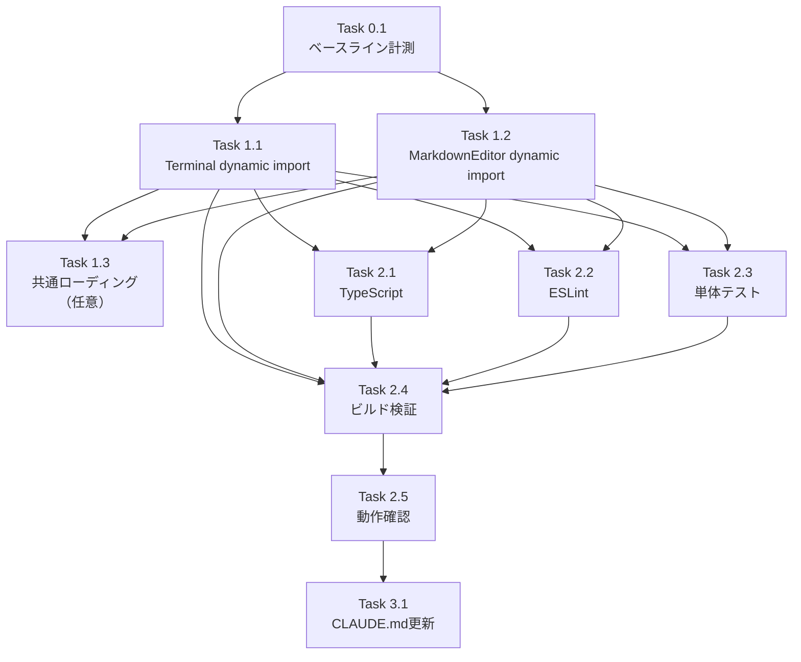

# 作業計画: Issue #410

## Issue: perf: xterm.js・highlight.jsのdynamic import化でバンドルサイズ削減

**Issue番号**: #410
**サイズ**: S（変更ファイル2件、追加コンポーネント最大1件）
**優先度**: Medium（パフォーマンス改善・SSR対応）
**依存Issue**: なし
**設計方針書**: `dev-reports/design/issue-410-dynamic-import-design-policy.md`

---

## 概要

`xterm.js`（~500KB）と`highlight.js/rehype-highlight`（~100KB+）を `next/dynamic` のdynamic importに変更し、以下2つの課題を解決する：

- **F1**: `/worktrees/[id]/terminal` ページのSSR互換性確保（xterm.jsのブラウザ専用API）
- **F2**: `/worktrees/[id]` メインページのFirst Load JS削減（rehype-highlight/highlight.js CSSの遅延ロード）

---

## 詳細タスク分解

### Phase 0: 事前準備

- [ ] **Task 0.1**: ベースライン計測
  - `npm run build` を実行
  - `/worktrees/[id]` の First Load JS (KB) を記録
  - `/worktrees/[id]/terminal` の First Load JS (KB) を記録
  - 成果物: ビルド出力の記録（メモ）
  - 依存: なし

### Phase 1: 実装タスク

- [ ] **Task 1.1**: TerminalComponent の dynamic import 化
  - **変更ファイル**: `src/app/worktrees/[id]/terminal/page.tsx`
  - **変更内容**:
    - `import { TerminalComponent } from '@/components/Terminal'` を削除
    - `import dynamic from 'next/dynamic'` を追加
    - `Loader2` を `lucide-react` からimport追加
    - `next/dynamic` + `ssr: false` + `.then((mod) => ({ default: mod.TerminalComponent }))` パターンで再定義
    - ローディングインジケーター追加（Terminal用: bg-gray-900テーマ）
  - **参考パターン**: `src/components/worktree/MermaidCodeBlock.tsx` L20-34
  - **設計根拠**: `'use client'` があっても Next.js App Router は SSR 時に Client Component を実行するため `ssr: false` が必要
  - 成果物: `src/app/worktrees/[id]/terminal/page.tsx` の変更
  - 依存: Task 0.1

- [ ] **Task 1.2**: MarkdownEditor の dynamic import 化
  - **変更ファイル**: `src/components/worktree/WorktreeDetailRefactored.tsx`
  - **変更内容**:
    - L39: `import { MarkdownEditor } from '@/components/worktree/MarkdownEditor'` を削除
    - `import dynamic from 'next/dynamic'` を追加（既にあれば追加不要）
    - `Loader2` を `lucide-react` からimport追加（UI系importの近くに配置）[S1-002]
    - `next/dynamic` + `ssr: false` + `.then((mod) => ({ default: mod.MarkdownEditor }))` パターンで再定義
    - ローディングインジケーター追加（Editor用: bg-whiteテーマ）
    - Modal内ローディング高さ確認: 親の `h-[80vh]` div内でローディングが `h-full` として正常表示されることを確認 [S3-001]
  - **参考パターン**: `src/components/worktree/MermaidCodeBlock.tsx` L20-34
  - 成果物: `src/components/worktree/WorktreeDetailRefactored.tsx` の変更
  - 依存: Task 0.1

- [ ] **Task 1.3**: （任意）共通ローディングコンポーネント作成 [S1-001]
  - **YAGNI判断**: インライン実装（Task 1.1/1.2）で十分な場合はスキップ
  - 3箇所目が発生した時点でリファクタリングする判断も妥当
  - **作成する場合のファイル**: `src/components/common/DynamicLoadingIndicator.tsx`
  - 成果物: （任意）`src/components/common/DynamicLoadingIndicator.tsx`
  - 依存: Task 1.1, Task 1.2

### Phase 2: 検証タスク

- [ ] **Task 2.1**: TypeScript型チェック
  - コマンド: `npx tsc --noEmit`
  - 基準: エラー0件
  - 依存: Task 1.1, Task 1.2

- [ ] **Task 2.2**: ESLintチェック
  - コマンド: `npm run lint`
  - 基準: エラー0件
  - 依存: Task 1.1, Task 1.2

- [ ] **Task 2.3**: 単体テスト
  - コマンド: `npm run test:unit`
  - 基準: 全テストパス（変更不要のため既存テストがパスすることを確認）
  - 変更不要確認: `MarkdownEditor.test.tsx`（直接import）、`WorktreeDetailRefactored.test.tsx`（MarkdownEditor参照なし）
  - 依存: Task 1.1, Task 1.2

- [ ] **Task 2.4**: ビルドとバンドルサイズ検証 [S1-005]
  - コマンド: `npm run build`
  - 基準:
    - ビルド成功
    - `/worktrees/[id]` First Load JS がベースラインより **50KB以上** 削減
    - `/worktrees/[id]/terminal` First Load JS がベースラインと同等以下
  - 依存: Task 1.1, Task 1.2

- [ ] **Task 2.5**: 動作確認
  - ターミナルページ (`/worktrees/[id]/terminal`) でTerminalが正常表示
  - .mdファイル編集時にMarkdownEditorが正常表示（ローディング後）
  - シンタックスハイライトが適用されること
  - Modal内ローディング高さが崩れていないこと [S3-001]
  - 依存: Task 2.4

### Phase 3: ドキュメントタスク

- [ ] **Task 3.1**: CLAUDE.md更新
  - `src/components/worktree/MarkdownEditor.tsx` のモジュール説明に「WorktreeDetailRefactored.tsxからdynamic importされる」旨を追記
  - `src/app/worktrees/[id]/terminal/page.tsx` の説明を追加（必要な場合）
  - 依存: Task 2.5

---

## タスク依存関係

---

## 品質チェック項目

| チェック項目 | コマンド | 基準 |
|-------------|----------|------|
| TypeScript | `npx tsc --noEmit` | 型エラー0件 |
| ESLint | `npm run lint` | エラー0件 |
| Unit Test | `npm run test:unit` | 全テストパス |
| Build | `npm run build` | 成功 |
| バンドルサイズ | `npm run build` 出力 | `/worktrees/[id]` で50KB以上削減 |

---

## 成果物チェックリスト

### コード変更（必須）
- [ ] `src/app/worktrees/[id]/terminal/page.tsx`: TerminalComponent dynamic import化
- [ ] `src/components/worktree/WorktreeDetailRefactored.tsx`: MarkdownEditor dynamic import化

### コード追加（任意）
- [ ] `src/components/common/DynamicLoadingIndicator.tsx`: 共通ローディングコンポーネント（YAGNI判断）

### テスト（変更不要）
- [x] `tests/unit/components/MarkdownEditor.test.tsx`: 変更不要（直接import）
- [x] `tests/unit/components/WorktreeDetailRefactored.test.tsx`: 変更不要

### ドキュメント
- [ ] `CLAUDE.md`: MarkdownEditor/terminal/page.tsx の説明更新

---

## Definition of Done

Issue完了条件：
- [ ] Task 1.1, 1.2完了（Task 1.3はYAGNI判断）
- [ ] TypeScript エラー0件 (`npx tsc --noEmit`)
- [ ] ESLint エラー0件 (`npm run lint`)
- [ ] 全ユニットテストパス (`npm run test:unit`)
- [ ] ビルド成功 + バンドルサイズ基準達成 (`npm run build`)
- [ ] 動作確認完了（ターミナル・Markdownエディタ・ハイライト）

---

## 次のアクション

作業計画承認後：
1. **ブランチ確認**: 現在 `feature/410-worktree` ブランチで作業中
2. **Task 0.1実行**: ベースライン計測
3. **Task 1.1/1.2実行**: Dynamic import化実装
4. **検証**: Phase 2の全チェック
5. **PR作成**: `/create-pr`で自動作成

---

*Generated by work-plan command for Issue #410*
