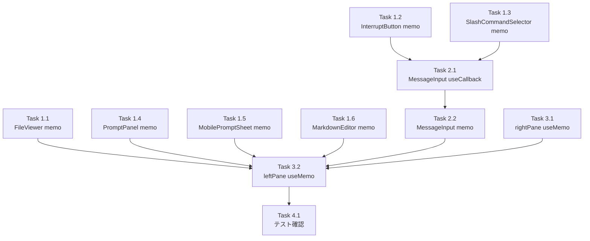

# 作業計画書: Issue #411

## Issue: perf: Reactコンポーネントのmemo化・useCallback最適化で不要な再レンダー防止

**Issue番号**: #411
**サイズ**: M
**優先度**: Medium
**依存Issue**: なし
**設計方針書**: `dev-reports/design/issue-411-react-memo-optimization-design-policy.md`

---

## 概要

ターミナルポーリング（2秒間隔）による親コンポーネント再レンダー時の不要な子コンポーネント再レンダーを防止する。

**主要な変更**:
- 8コンポーネントに `React.memo()` を適用
- `MessageInput` の9ハンドラに `useCallback` を適用
- `WorktreeDetailRefactored` の `leftPane/rightPane` を `useMemo` でメモ化

**実装パターン** (設計方針書 Section 3):
- **D1**: `export const X = memo(function X(...))`（named export形式、vi.mock互換）
- **D2**: useCallback with appropriate dependency arrays
- **D3/D4**: inline JSX を useMemo でラップ

---

## 詳細タスク分解

### Phase 1: コンポーネントmemo化（独立実装可能）

#### Task 1.1: FileViewer memo化 【優先度: 高】
- **成果物**: `src/components/worktree/FileViewer.tsx`
- **変更内容**: `export function FileViewer(...)` → `export const FileViewer = memo(function FileViewer(...))`
- **依存**: なし（最も単純、基準実装）
- **効果**: isOpen=false時のポーリング起因再レンダーをスキップ（2箇所: L2054, L2293）
- **注意**: カスタム比較関数不要（onCloseはhandleFileViewerCloseでuseCallback済み）

#### Task 1.2: InterruptButton memo化 【優先度: 高】
- **成果物**: `src/components/worktree/InterruptButton.tsx`
- **変更内容**: `export function InterruptButton(...)` → `export const InterruptButton = memo(function InterruptButton(...))`
- **依存**: なし
- **効果**: MessageInputのuseCallback化効果最大化のため前提として必要
- **注意**: 既にuseCallback 1個使用済み

#### Task 1.3: SlashCommandSelector memo化 【優先度: 中】
- **成果物**: `src/components/worktree/SlashCommandSelector.tsx`
- **変更内容**: `export function SlashCommandSelector(...)` → `export const SlashCommandSelector = memo(function SlashCommandSelector(...))`
- **依存**: なし
- **効果**: MessageInputのuseCallback化効果最大化のため前提として必要
- **注意**: 既にuseCallback 2個、useMemo 2個使用済み

#### Task 1.4: PromptPanel memo化 【優先度: 中】
- **成果物**: `src/components/worktree/PromptPanel.tsx`
- **変更内容**: `export function PromptPanel(...)` → `export const PromptPanel = memo(function PromptPanel(...))`
- **依存**: なし（Task 1.5と並行可能）
- **効果**: プロンプト表示中のポーリング起因再レンダーをスキップ
- **注意**: デスクトップでは visible=false 時はアンマウントされるため効果は限定的

#### Task 1.5: MobilePromptSheet memo化 【優先度: 中】
- **成果物**: `src/components/mobile/MobilePromptSheet.tsx`
- **変更内容**: `export function MobilePromptSheet(...)` → `export const MobilePromptSheet = memo(function MobilePromptSheet(...))`
- **依存**: なし（Task 1.4と並行可能）
- **効果**: autoYesEnabled=false時にマウントされ、visible=false時の不要再レンダーをスキップ
- **注意**: handlePromptRespond/handlePromptDismissはuseCallback済みのためカスタム比較関数不要

#### Task 1.6: MarkdownEditor memo化 【優先度: 低】
- **成果物**: `src/components/worktree/MarkdownEditor.tsx`
- **変更内容**: `export function MarkdownEditor(...)` → `export const MarkdownEditor = memo(function MarkdownEditor(...))`
- **依存**: なし
- **効果**: 条件付き描画（editorFilePath設定時のみマウント）のため効果限定的
- **注意**: 既にuseCallback 21個使用済み

### Phase 2: MessageInput useCallback化 + memo化 【優先度: 高】

#### Task 2.1: MessageInput useCallback化
- **成果物**: `src/components/worktree/MessageInput.tsx`
- **変更内容**: 9ハンドラに `useCallback` を適用

| ハンドラ | 依存配列 | 効果 |
|---------|---------|------|
| handleCompositionStart | `[]` | 高 |
| handleCompositionEnd | `[]` | 高 |
| handleCommandSelect | `[]` | 高 |
| handleCommandCancel | `[]` | 高 |
| handleFreeInput | `[]` | 高 |
| handleMessageChange | `[isFreeInputMode]` | 中 |
| submitMessage | `[isComposing, message, sending, worktreeId, cliToolId, onMessageSent]` | 低 |
| handleSubmit | `[submitMessage]` | 低 |
| handleKeyDown | `[showCommandSelector, isFreeInputMode, isComposing, isMobile, submitMessage]` | 中 |

- **依存**: Task 1.2 (InterruptButton), Task 1.3 (SlashCommandSelector) 完了後

#### Task 2.2: MessageInput memo化
- **変更内容**: `export function MessageInput(...)` → `export const MessageInput = memo(function MessageInput(...))`
- **依存**: Task 2.1 完了後

### Phase 3: WorktreeDetailRefactored inline JSX メモ化

#### Task 3.1: rightPane useMemo化
- **成果物**: `src/components/worktree/WorktreeDetailRefactored.tsx`
- **変更内容**: rightPane JSXを `useMemo` でラップ（6項目依存配列）

```typescript
const rightPaneMemo = useMemo(
  () => <TerminalDisplay output={...} isActive={...} isThinking={...} autoScroll={...} onScrollChange={...} disableAutoFollow={...} />,
  [state.terminal.output, state.terminal.isActive, state.terminal.isThinking, state.terminal.autoScroll, handleAutoScrollChange, disableAutoFollow]
);
```

- **依存**: なし（他コンポーネントのmemo化と並行可能だが、全Phase 1完了後が望ましい）

#### Task 3.2: leftPane useMemo化
- **成果物**: `src/components/worktree/WorktreeDetailRefactored.tsx`
- **変更内容**: leftPane JSXを `useMemo` でラップ（27項目依存配列）
- **依存**: Task 3.1、全Phase 1・Phase 2完了後

**依存配列 (27項目)**:
```
leftPaneTab, handleLeftPaneTabChange,
state.messages, worktreeId, handleFilePathClick, showToast,
fileSearch.query, fileSearch.mode, fileSearch.isSearching, fileSearch.error,
fileSearch.setQuery, fileSearch.setMode, fileSearch.clearSearch, fileSearch.results?.results,
handleFileSelect, handleNewFile, handleNewDirectory, handleRename,
handleDelete, handleUpload, handleMove, handleCmateSetup, fileTreeRefresh,
selectedAgents, handleSelectedAgentsChange,
vibeLocalModel, handleVibeLocalModelChange, vibeLocalContextWindow, handleVibeLocalContextWindowChange
```

**注意**: eslint-plugin-react-hooksのexhaustive-depsルールで依存配列を検証すること

### Phase 4: テスト動作確認

#### Task 4.1: 既存テストの動作確認
- **対象テストファイル**:
  - `tests/unit/components/WorktreeDetailRefactored.test.tsx`
  - `tests/unit/components/worktree/MessageInput.test.tsx`（IME compositionテスト5ケース）
  - `tests/unit/components/worktree/SlashCommandSelector.test.tsx`
  - `tests/unit/components/worktree/MarkdownEditor.test.tsx`
  - `tests/unit/components/PromptPanel.test.tsx`
  - `tests/unit/components/mobile/MobilePromptSheet.test.tsx`
  - `tests/integration/issue-266-acceptance.test.tsx`（vi.mock使用）
  - `tests/unit/components/app-version-display.test.tsx`（vi.mock使用）
- **確認内容**: memo化後のexport名がnamed export形式のため変更なし。vi.mockはモジュール全体置換のため影響なし

---

## タスク依存関係



**並行実行可能タスク**:
- Task 1.1 ～ 1.6 は相互に独立
- Task 1.4 と 1.5 は同時実施可能
- Task 3.1 は Task 3.2 の前提だが Phase 1 と並行可能

---

## 実装順序（推奨）

設計方針書 Section 8 に基づく:

1. **Task 1.1** FileViewer memo化（最も単純、基準実装）
2. **Task 1.2** InterruptButton memo化（MessageInputの前提）
3. **Task 1.3** SlashCommandSelector memo化（MessageInputの前提）
4. **Task 2.1 + 2.2** MessageInput useCallback化 + memo化
5. **Task 1.4** PromptPanel memo化
6. **Task 1.5** MobilePromptSheet memo化
7. **Task 1.6** MarkdownEditor memo化（優先度低）
8. **Task 3.1 + 3.2** WorktreeDetailRefactored useMemo化（全コンポーネントのmemo化後）
9. **Task 4.1** 既存テスト動作確認

---

## 品質チェック項目

| チェック項目 | コマンド | 基準 |
|-------------|----------|------|
| ESLint | `npm run lint` | エラー0件（exhaustive-depsも含む） |
| TypeScript | `npx tsc --noEmit` | 型エラー0件 |
| Unit Test | `npm run test:unit` | 全テストパス |
| Integration Test | `npm run test:integration` | 全テストパス |
| Build | `npm run build` | 成功 |

---

## 実装チェックリスト（設計方針書 Section 13 より）

### レビュー指摘反映チェック

- [ ] [R1-001] handleFreeInputのuseCallback化時、空依存配列が安全である根拠をコメントで明記
- [ ] [R1-002] leftPaneMemoの依存配列27項目がexhaustive-depsルールで検証済み
- [ ] [R1-004] FileViewerのmemo化後、isOpen=false時に再レンダーがスキップされることをReact DevToolsで確認
- [ ] [R1-008] submitMessageの依存配列にonMessageSentを含め、安定性チェーンを確認
- [ ] [R2-001] fetchCurrentOutputの依存配列が`[worktreeId, actions, state.prompt.visible]`であることを確認
- [ ] [R2-002] handleDeleteの依存配列が`[worktreeId, editorFilePath, tCommon, tError]`であることを確認
- [ ] [R2-003] handleLeftPaneTabChangeの依存配列が`[actions]`であることを確認
- [ ] [R2-007] MobilePromptSheetが`{!autoYesEnabled && ...}`の条件ガード内で描画されていることを確認
- [ ] [R3-001] integration testが正常にパスすることを確認
- [ ] [R3-003] handlePromptRespondのカスケード影響がポーリングサイクルでは発生しないことを確認

---

## 成果物チェックリスト

### コード
- [ ] `src/components/worktree/FileViewer.tsx` (memo)
- [ ] `src/components/worktree/InterruptButton.tsx` (memo)
- [ ] `src/components/worktree/SlashCommandSelector.tsx` (memo)
- [ ] `src/components/worktree/MessageInput.tsx` (memo + useCallback x9)
- [ ] `src/components/worktree/PromptPanel.tsx` (memo)
- [ ] `src/components/mobile/MobilePromptSheet.tsx` (memo)
- [ ] `src/components/worktree/MarkdownEditor.tsx` (memo)
- [ ] `src/components/worktree/WorktreeDetailRefactored.tsx` (leftPane/rightPane useMemo)

### テスト（新規テストは不要）
- [ ] 既存テスト全8ファイルのパス確認

### ドキュメント
- [ ] CLAUDE.md の主要機能モジュール一覧に `WorktreeDetailRefactored.tsx` のmemo化変更を追記（実装後）

---

## Definition of Done

Issue完了条件:
- [ ] 全8ファイルのmemo化/useMemo化が完了
- [ ] `npm run lint` エラー0件
- [ ] `npx tsc --noEmit` 型エラー0件
- [ ] `npm run test:unit` 全テストパス
- [ ] `npm run test:integration` 全テストパス
- [ ] React DevToolsでFileViewer(isOpen=false)とMessageInput(props不変時)の再レンダースキップを手動確認

---

## 次のアクション

作業計画確認後:
1. **実装開始**: 上記の実装順序に従って実装（TDD実装: `/pm-auto-dev 411`）
2. **進捗報告**: `/progress-report` で定期報告
3. **PR作成**: `/create-pr` で自動作成
