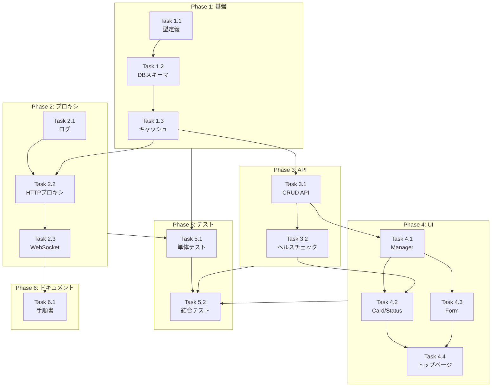

# Issue #42 作業計画書

## Issue概要

| 項目 | 内容 |
|------|------|
| **Issue番号** | #42 |
| **タイトル** | Next.js経由で複数フロント（SvelteKit/Streamlit/別Next）へパスベースで振り分け・動的切替を実現 |
| **サイズ** | L（Large） |
| **優先度** | Medium |
| **ラベル** | feature |
| **依存Issue** | なし |
| **設計書** | `dev-reports/design/issue42-proxy-routing-design-policy.md` |

---

## 受け入れ条件（Acceptance Criteria）

- [ ] MyCodeBranchDeskトップページに「外部アプリ」セクションを追加
- [ ] 外部アプリの登録機能（名前、パスプレフィックス、ポート番号）を実装
- [ ] 登録済みアプリの一覧表示・編集・削除機能を実装
- [ ] `/proxy/app-svelte/...` でSvelteKitが表示できる
- [ ] `/proxy/app-next2/...` で別Nextが表示できる
- [ ] `/proxy/app-streamlit/...` でStreamlitが安定して表示できる（WS含む）
- [ ] 振り分け先の変更を再起動なしで反映できる
- [ ] 各Appのサブパス設定手順書を作成

---

## タスク分解

### Phase 1: 基盤実装

#### Task 1.1: 型定義・インターフェース作成
- **成果物**:
  - `src/types/external-apps.ts`
  - `src/lib/external-apps/interfaces.ts`
- **依存**: なし
- **詳細**:
  - `ExternalApp`, `ExternalAppType` 型定義
  - `CreateExternalAppInput`, `UpdateExternalAppInput` 型定義
  - `ExternalAppHealth` 型定義
  - `IExternalAppManager`, `IProxyHandler` インターフェース

#### Task 1.2: DBスキーマ・マイグレーション
- **成果物**:
  - `src/lib/db-migrations.ts` (v12追加)
  - `src/lib/external-apps/db.ts`
- **依存**: Task 1.1
- **詳細**:
  - `external_apps` テーブル作成
  - インデックス作成
  - CRUD操作関数
  - DB ⇔ TypeScript マッピング関数

#### Task 1.3: キャッシュ層実装
- **成果物**: `src/lib/external-apps/cache.ts`
- **依存**: Task 1.2
- **詳細**:
  - `ExternalAppCache` クラス
  - TTL 30秒のメモリキャッシュ
  - `getByPathPrefix()`, `getAll()`, `invalidate()`

---

### Phase 2: プロキシ実装

#### Task 2.1: プロキシログ実装
- **成果物**: `src/lib/proxy/logger.ts`
- **依存**: なし
- **詳細**:
  - `ProxyLogEntry` 型
  - `logProxyRequest()`, `logProxyError()` 関数
  - 既存logger統合

#### Task 2.2: HTTPプロキシハンドラー実装
- **成果物**:
  - `src/lib/proxy/handler.ts`
  - `src/app/proxy/[...path]/route.ts`
- **依存**: Task 1.3, Task 2.1
- **詳細**:
  - `http-proxy` パッケージ導入
  - GET/POST/PUT/PATCH/DELETE対応
  - エラーハンドリング（404, 502, 504）

#### Task 2.3: WebSocketプロキシ実装
- **成果物**: `src/lib/proxy/websocket.ts`
- **依存**: Task 2.2
- **詳細**:
  - WebSocket Upgrade検出
  - `http-proxy` の `ws: true` オプション
  - Streamlit対応検証

---

### Phase 3: 管理API実装

#### Task 3.1: CRUD API実装
- **成果物**:
  - `src/app/api/external-apps/route.ts`
  - `src/app/api/external-apps/[id]/route.ts`
- **依存**: Task 1.2, Task 1.3
- **詳細**:
  - GET（一覧）, POST（登録）
  - GET（詳細）, PATCH（更新）, DELETE（削除）
  - バリデーション（ポート範囲、ホスト制限）

#### Task 3.2: ヘルスチェックAPI実装
- **成果物**: `src/app/api/external-apps/[id]/health/route.ts`
- **依存**: Task 3.1
- **詳細**:
  - ポート疎通確認
  - レスポンスタイム計測
  - エラー情報返却

---

### Phase 4: UI実装

#### Task 4.1: ExternalAppsManagerコンポーネント
- **成果物**: `src/components/external-apps/ExternalAppsManager.tsx`
- **依存**: Task 3.1
- **詳細**:
  - トップページ統合
  - アプリ一覧カード表示
  - 追加ボタン

#### Task 4.2: ExternalAppCard/Statusコンポーネント
- **成果物**:
  - `src/components/external-apps/ExternalAppCard.tsx`
  - `src/components/external-apps/ExternalAppStatus.tsx`
- **依存**: Task 4.1, Task 3.2
- **詳細**:
  - アプリ情報表示
  - ステータスインジケーター（Running/Stopped）
  - 開くボタン、設定ボタン

#### Task 4.3: ExternalAppFormコンポーネント
- **成果物**: `src/components/external-apps/ExternalAppForm.tsx`
- **依存**: Task 4.1
- **詳細**:
  - 登録/編集フォーム
  - バリデーション
  - モーダル表示

#### Task 4.4: トップページ統合
- **成果物**: `src/app/page.tsx` (修正)
- **依存**: Task 4.1, Task 4.2, Task 4.3
- **詳細**:
  - ExternalAppsManager追加
  - レイアウト調整

---

### Phase 5: テスト

#### Task 5.1: 単体テスト
- **成果物**:
  - `tests/unit/external-apps/db.test.ts`
  - `tests/unit/external-apps/cache.test.ts`
  - `tests/unit/proxy/handler.test.ts`
- **依存**: Phase 1, Phase 2
- **詳細**:
  - DB操作関数テスト
  - キャッシュ動作テスト
  - プロキシハンドラーテスト
  - カバレッジ目標: 80%以上

#### Task 5.2: 結合テスト
- **成果物**:
  - `tests/integration/external-apps-api.test.ts`
  - `tests/integration/proxy-routing.test.ts`
- **依存**: Phase 3, Phase 4
- **詳細**:
  - API CRUD操作テスト
  - プロキシルーティングE2Eテスト
  - WebSocketプロキシテスト

---

### Phase 6: ドキュメント

#### Task 6.1: App2設定手順書
- **成果物**: `docs/guides/external-app-setup.md`
- **依存**: Phase 2完了後
- **詳細**:
  - SvelteKit basePath設定
  - Streamlit baseUrlPath設定
  - Next.js basePath設定

---

## タスク依存関係

---

## 品質チェック項目

| チェック項目 | コマンド | 基準 |
|-------------|----------|------|
| ESLint | `npm run lint` | エラー0件 |
| TypeScript | `npx tsc --noEmit` | 型エラー0件 |
| Unit Test | `npm run test:unit` | 全テストパス |
| Build | `npm run build` | 成功 |

---

## 成果物チェックリスト

### コード

#### 型定義・インターフェース
- [ ] `src/types/external-apps.ts`
- [ ] `src/lib/external-apps/interfaces.ts`

#### DB・キャッシュ
- [ ] `src/lib/db-migrations.ts` (v12追加)
- [ ] `src/lib/external-apps/db.ts`
- [ ] `src/lib/external-apps/cache.ts`

#### プロキシ
- [ ] `src/lib/proxy/logger.ts`
- [ ] `src/lib/proxy/handler.ts`
- [ ] `src/lib/proxy/websocket.ts`
- [ ] `src/app/proxy/[...path]/route.ts`

#### API
- [ ] `src/app/api/external-apps/route.ts`
- [ ] `src/app/api/external-apps/[id]/route.ts`
- [ ] `src/app/api/external-apps/[id]/health/route.ts`

#### UI
- [ ] `src/components/external-apps/ExternalAppsManager.tsx`
- [ ] `src/components/external-apps/ExternalAppCard.tsx`
- [ ] `src/components/external-apps/ExternalAppStatus.tsx`
- [ ] `src/components/external-apps/ExternalAppForm.tsx`
- [ ] `src/app/page.tsx` (修正)

### テスト
- [ ] `tests/unit/external-apps/db.test.ts`
- [ ] `tests/unit/external-apps/cache.test.ts`
- [ ] `tests/unit/proxy/handler.test.ts`
- [ ] `tests/integration/external-apps-api.test.ts`
- [ ] `tests/integration/proxy-routing.test.ts`

### ドキュメント
- [ ] `docs/guides/external-app-setup.md`

---

## Definition of Done

Issue完了条件：

- [ ] 全タスク完了
- [ ] 単体テストカバレッジ80%以上
- [ ] CIチェック全パス（lint, type-check, test, build）
- [ ] コードレビュー承認
- [ ] 受け入れ条件をすべて満たす
- [ ] ドキュメント更新完了

---

## リスク・注意事項

| リスク | 対策 |
|--------|------|
| WebSocket対応の複雑性 | Task 2.3でPOC実施、問題あればCustom Server検討 |
| http-proxyとNext.js App Routerの統合 | 公式ドキュメント・コミュニティ事例を参照 |
| App2側basePath設定ミス | Task 6.1で手順書を詳細化 |

---

## 次のアクション

1. **ブランチ作成**: `feature/42-proxy-routing`
2. **依存パッケージ追加**: `npm install http-proxy @types/http-proxy`
3. **Phase 1から順次実装開始**
4. **進捗報告**: 各Phase完了時に `/progress-report` 実行
5. **PR作成**: 全Phase完了後 `/create-pr` 実行
