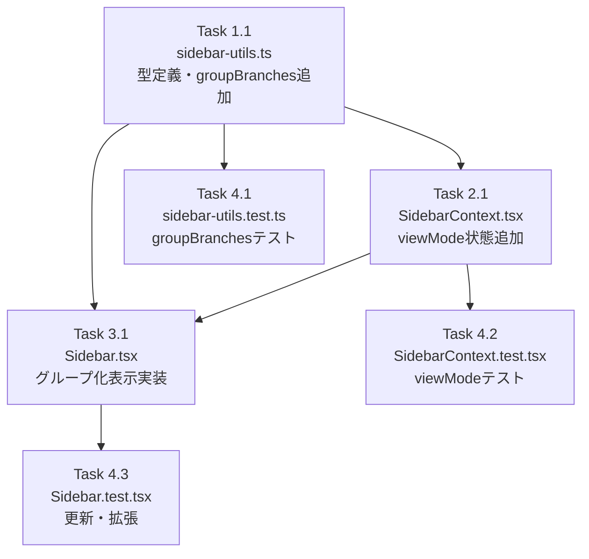

# 作業計画: Issue #449

## Issue: サイドバー表示改善: リポジトリ単位のグループ化（折りたたみ対応）

**Issue番号**: #449
**サイズ**: M
**優先度**: Medium
**依存Issue**: なし
**設計方針書**: `dev-reports/design/issue-449-sidebar-group-design-policy.md`

---

## 詳細タスク分解

### Phase 1: ライブラリ・型定義・ユーティリティ

#### Task 1.1: sidebar-utils.ts に型定義と関数追加
- **成果物**: `src/lib/sidebar-utils.ts`
- **依存**: なし
- **内容**:
  - `ViewMode` 型追加: `export type ViewMode = 'grouped' | 'flat'`
  - `BranchGroup` インターフェース追加: `export interface BranchGroup { repositoryName: string; branches: SidebarBranchItem[] }`
  - `groupBranches(items, sortKey, direction): BranchGroup[]` 関数追加
  - グループ間はrepositoryName アルファベット順
  - グループ内は既存sortBranches()を再利用
- **備考**: セキュリティ設計で定義したparseGroupCollapsed関数もこのフェーズで設計を固める

### Phase 2: 状態管理（SidebarContext）

#### Task 2.1: SidebarContext.tsx に viewMode 状態追加
- **成果物**: `src/contexts/SidebarContext.tsx`
- **依存**: Task 1.1（ViewMode型）
- **内容**:
  - 定数追加: `SIDEBAR_VIEW_MODE_STORAGE_KEY = 'mcbd-sidebar-view-mode'`、`DEFAULT_VIEW_MODE: ViewMode = 'grouped'`
  - `SidebarState` に `viewMode: ViewMode` 追加
  - `SidebarAction` に `{ type: 'SET_VIEW_MODE'; viewMode: ViewMode }` 追加（LOAD_VIEW_MODEは不要）
  - `sidebarReducer` に `SET_VIEW_MODE` ケース追加
  - `SidebarContextValue` に `viewMode: ViewMode` と `setViewMode: (mode: ViewMode) => void` 追加
  - localStorage読み込みuseEffect追加（viewMode）
  - localStorage保存useEffect追加（viewMode）
  - `setViewMode` useCallback追加
  - `value` オブジェクトを useMemo でラップ（既存技術的負債解消）

### Phase 3: UIコンポーネント実装

#### Task 3.1: Sidebar.tsx にグループ化表示を追加
- **成果物**: `src/components/layout/Sidebar.tsx`
- **依存**: Task 1.1（groupBranches, ViewMode）、Task 2.1（viewMode, setViewMode）
- **内容**:
  1. import追加: `groupBranches`, `ViewMode` from `@/lib/sidebar-utils`
  2. `SIDEBAR_GROUP_COLLAPSED_STORAGE_KEY` 定数追加
  3. `parseGroupCollapsed` バリデーション関数追加（インライン or 末尾定義）
  4. `groupCollapsed` useState（localStorage同期読み込み初期化）追加
  5. `toggleGroup` useCallback追加
  6. useMemoを3段チェーンに変更:
     - `searchFilteredItems`: toBranchItem + 検索フィルタ
     - `flatBranches`: viewMode === 'flat' ? sortBranches(...) : []
     - `groupedBranches`: viewMode === 'grouped' ? groupBranches(...) : null
  7. groupCollapsed永続化useEffect追加
  8. `GroupHeader` インラインコンポーネント追加（末尾）
  9. `ViewModeToggle` インラインコンポーネント追加（末尾）
  10. `ChevronIcon`, `GroupIcon`, `FlatListIcon` SVGアイコン追加（末尾）
  11. ヘッダー部分にViewModeToggleを追加
  12. ブランチリスト部分をグループ化/フラット条件分岐に変更
  13. 検索クエリがある場合はgroupCollapsedを無視して全グループ展開

---

## テストタスク（Phase 4）

#### Task 4.1: sidebar-utils.test.ts に groupBranches テスト追加
- **成果物**: `tests/unit/lib/sidebar-utils.test.ts`
- **依存**: Task 1.1
- **テストケース**:
  - 空配列の処理（グループなし）
  - 単一リポジトリのグループ化
  - 複数リポジトリのグループ化とアルファベット順
  - グループ内ソートが正しく適用される（sortKey別）
  - searchFilteredItemsとの組み合わせ

#### Task 4.2: SidebarContext.test.tsx に viewMode テスト追加
- **成果物**: `tests/unit/contexts/SidebarContext.test.tsx`
- **依存**: Task 2.1
- **テストケース**:
  - デフォルト viewMode が 'grouped' であること
  - setViewMode でviewModeが切り替わること
  - localStorage からviewModeが復元されること（'flat'保存→'flat'読み込み）
  - 不正な localStorage 値のフォールバック（デフォルト'grouped'）
  - TestConsumerにviewMode/setViewModeを表示追加

#### Task 4.3: Sidebar.test.tsx を更新・拡張
- **成果物**: `tests/unit/components/layout/Sidebar.test.tsx`
- **依存**: Task 3.1
- **内容**:
  - 既存テストの更新:
    - `getAllByText('MyRepo')` のカウント変更対応（グループヘッダー追加で増加）
    - 検索フィルタリング系テストの見直し
  - 新規テスト追加:
    - グループ化表示でリポジトリ名がグループヘッダーとして表示される
    - グループヘッダークリックで折りたたまれる
    - 再クリックで展開される
    - 検索中はgroupCollapsed関係なく全グループ展開
    - ViewModeToggleクリックでフラット表示に切り替わる
    - フラット表示では既存のBranchListItemがフラットに表示される
    - localStorage永続化: viewMode保存/復元
    - localStorage永続化: groupCollapsed保存/復元

---

## タスク依存関係

---

## 品質チェック項目

| チェック項目 | コマンド | 基準 |
|-------------|----------|------|
| ESLint | `npm run lint` | エラー0件 |
| TypeScript | `npx tsc --noEmit` | 型エラー0件 |
| Unit Test | `npm run test:unit` | 全テストパス |
| Build | `npm run build` | 成功 |

---

## 成果物チェックリスト

### コード
- [ ] `src/lib/sidebar-utils.ts`: ViewMode型, BranchGroup型, groupBranches()関数
- [ ] `src/contexts/SidebarContext.tsx`: viewMode状態, SET_VIEW_MODE, useMemoラップ
- [ ] `src/components/layout/Sidebar.tsx`: グループ化レンダリング, groupCollapsed, ViewModeToggle, GroupHeader

### テスト
- [ ] `tests/unit/lib/sidebar-utils.test.ts`: groupBranches()テスト追加
- [ ] `tests/unit/contexts/SidebarContext.test.tsx`: viewModeテスト追加
- [ ] `tests/unit/components/layout/Sidebar.test.tsx`: 既存更新 + 新規追加

---

## 実装上の重要ポイント

1. **3段useMemoチェーン**: searchFilteredItems → flatBranches / groupedBranches（重複ロジック防止）
2. **groupCollapsed localStorage同期読み込み**: useStateの初期化関数で読み込み（ちらつき防止）
3. **検索時の全グループ展開**: `(!groupCollapsed[repo] || !!searchQuery.trim())` の条件を使用
4. **parseGroupCollapsed**: JSON.parse結果のバリデーション（型チェック・プロトタイプ汚染対策・キー数上限100）
5. **useMemoでvalueオブジェクトをラップ**: 既存技術的負債の解消
6. **SET_VIEW_MODEのみ**: LOAD_VIEW_MODEは不要（単一フィールドのため統合）

---

## Definition of Done

- [ ] すべてのタスクが完了
- [ ] 単体テストが全パス
- [ ] TypeScript型エラー0件
- [ ] ESLintエラー0件
- [ ] ダークモード動作確認
- [ ] モバイルドロワー動作確認（グループ化表示が適用）
- [ ] localStorage永続化動作確認（viewMode・groupCollapsed）

---

## 次のアクション

1. **Task 1.1** から実装開始（sidebar-utils.ts）
2. **Task 2.1** へ進む（SidebarContext.tsx）
3. **Task 3.1** へ進む（Sidebar.tsx - 最大の変更点）
4. **Task 4.1〜4.3** でテスト追加・更新
5. `/create-pr` でPR作成

---

*Generated by /work-plan for Issue #449*
*Date: 2026-03-08*
