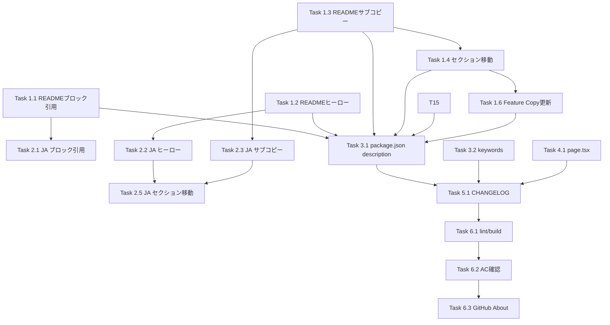

# 作業計画: Issue #457

## Issue: docs: reposition CommandMate as an agent CLI control plane, not an opinionated AI IDE

**Issue番号**: #457
**サイズ**: M
**優先度**: Medium
**種別**: ドキュメント変更（コピーライティング・ポジショニング）
**依存Issue**: なし

---

## 概要

CommandMateのREADME/ドキュメント/UIのコピーを「IDE for issue-driven AI development」から「A local control plane for agent CLIs」へリポジショニングする。コードロジックへの変更はなく、テキスト/コピーの変更のみ。

---

## 詳細タスク分解

### Phase 1: README.md（英語版）変更

- [ ] **Task 1.1**: README.md L16 ブロック引用変更
  - 変更内容: `Move issues forward, not terminal tabs.` → `Orchestrate your agent CLIs, not your terminal tabs.`
  - 成果物: `README.md` (L16)
  - 依存: なし

- [ ] **Task 1.2**: README.md ヒーローコピー変更
  - 変更内容: `CommandMate is an IDE for issue-driven AI development.` → `CommandMate is a local control plane for agent CLIs.`
  - 成果物: `README.md` (L18)
  - 依存: なし

- [ ] **Task 1.3**: README.md サブコピー変更
  - 変更内容: L28-30の既存サブコピー（`Instead of jumping straight...` + `CommandMate can become the center of your development workflow.`）を新サブコピーに置換。特にL30のガードレール違反表現を必ず削除すること
  - 新サブコピー:
    ```
    CommandMate adds orchestration and visibility on top of your existing agent CLIs.
    It does not replace tmux, Git worktrees, or your terminal. It makes them easier to manage at scale.
    ```
  - 成果物: `README.md` (L28-30)
  - 依存: なし

- [ ] **Task 1.4**: README.md Issue-Driven Developmentセクション移動
  - 変更内容: L42の `## Issue-Driven Development` セクションをOptional Workflow Layerとして `## Documentation` (L317) の直前に移動
  - 移動後の構成:
    ```markdown
    ## Optional Workflow Layer
    <a id="issue-driven-development"></a>

    If your team wants more structure, CommandMate can also help you standardize
    issue refinement, design review, planning, implementation, and acceptance checks.
    These workflows build on top of the same CLI sessions and worktrees. They are optional, not required.

    （旧Issue-Driven Developmentセクションの表・コマンドリストをここに配置）
    ```
  - **アンカー互換性**: `<a id="issue-driven-development"></a>` を必ず追加
  - 成果物: `README.md`
  - 依存: Task 1.2, 1.3

- [ ] **Task 1.5**: README.md Auto Yes Modeの説明変更（Key Featuresテーブル）
  - 変更内容: L73 `No babysitting — the agent keeps working while you're away` → `Optional unattended mode for trusted workflows -- review the Security Guide before enabling; see the Security section for risks and limitations`
  - 成果物: `README.md` (L73)
  - 依存: なし

- [ ] **Task 1.6**: README.md Feature Copyの更新（Key Featuresテーブル）
  - 変更内容: Key Featuresテーブルの各行を設計方針書セクション2-1のFeature Copy推奨フレーミングに更新
  - 成果物: `README.md`
  - 依存: Task 1.4（セクション移動後に調整）

### Phase 2: docs/ja/README.md（日本語版）変更

- [ ] **Task 2.1**: 日本語版 ブロック引用変更
  - 変更内容: `ターミナルをさばくな。Issue を前に進めよう。` → `ターミナルをさばくな。エージェント CLI をオーケストレーションしよう。`
  - 成果物: `docs/ja/README.md`
  - 依存: Task 1.1（英語版完了後）

- [ ] **Task 2.2**: 日本語版 ヒーローコピー変更
  - 変更内容: `CommandMate は、Issue ドリブン AI 開発のための IDE です。` → `CommandMate は、エージェント CLI のローカルコントロールプレーンです。`
  - 成果物: `docs/ja/README.md`
  - 依存: Task 1.2（英語版完了後）

- [ ] **Task 2.3**: 日本語版 サブコピー変更（L28, L30）
  - 変更内容:
    - L28: `いきなり実装に入るのではなく、...` → `CommandMate は、既存のエージェント CLI の上にオーケストレーションと可視性を追加します。`
    - L30: `「自分でコードを書く」より... CommandMate は開発の中心になれます。` → `tmux、Git worktree、ターミナルを置き換えません。大規模な管理を容易にします。`（ガードレール違反表現の削除）
  - 成果物: `docs/ja/README.md`
  - 依存: Task 1.3

- [ ] **Task 2.4**: 日本語版 Key Featuresテーブル順序変更
  - 変更内容: 「Issue ドリブンコマンド」を1番目から後方へ移動。英語版と同様にGit Worktree Sessions, Multi-Agent Supportを上位に配置
  - 成果物: `docs/ja/README.md`
  - 依存: なし

- [ ] **Task 2.5**: 日本語版 イシュードリブン開発セクション移動
  - 変更内容: 英語版と同様にOptional Workflow Layerとして後方（L318付近のドキュメントセクション直前）へ移動
  - 成果物: `docs/ja/README.md`
  - 依存: Task 2.2, 2.3

- [ ] **Task 2.6**: 日本語版 Auto Yesの説明変更
  - 変更内容: `放置しても止まらない` → `信頼できるワークフロー向けのオプショナル自動実行モード`
  - 成果物: `docs/ja/README.md`
  - 依存: なし

### Phase 3: package.json変更

- [ ] **Task 3.1**: package.json description変更
  - 変更内容: `"IDE for issue-driven AI development — define, plan, and let coding agents execute across Git worktrees"` → `"A local control plane for agent CLIs — orchestration and visibility for Claude Code, Codex, Gemini CLI, and more across Git worktrees"`
  - 成果物: `package.json`
  - 依存: なし

- [ ] **Task 3.2**: package.json keywords変更
  - 変更内容:
    - 削除: `issue-driven-development`
    - 追加: `gemini-cli`, `agent-cli`, `cli-orchestration`
    - 継続保持: `claude-code`, `codex-cli`, `ai-coding`, `git-worktree`, `coding-agent`, `session-manager`, `tmux`, `cli`, `developer-tools`
  - 成果物: `package.json`
  - 依存: なし

### Phase 4: src/app/page.tsx変更

- [ ] **Task 4.1**: UIヒーローコピー変更
  - 変更内容:
    - L23: `Stop managing terminal tabs. Start running issue-driven development.` → `A local control plane for agent CLIs — orchestration and visibility on top of Claude Code, Codex, Gemini CLI, and more.`
    - L25: `CommandMate helps you refine issues, run them in parallel, switch agents when needed, and keep work moving wherever you are.` → `CommandMate does not replace tmux, Git worktrees, or your terminal. It makes them easier to manage across sessions and worktrees.`
  - 成果物: `src/app/page.tsx` (L23-25)
  - 依存: なし

### Phase 5: CHANGELOG.md記録

- [ ] **Task 5.1**: CHANGELOG.md更新
  - 変更内容: 変更履歴の追記
    ```markdown
    ### Changed
    - docs: reposition CommandMate as "a local control plane for agent CLIs" instead of "IDE for issue-driven AI development" (#457)
      - Updated README.md hero copy, sub copy, and section ordering
      - Updated docs/ja/README.md with corresponding Japanese translations
      - Updated package.json description and keywords
      - Updated src/app/page.tsx hero copy
      - Updated GitHub About description
    ```
  - 成果物: `CHANGELOG.md`
  - 依存: Phase 1-4完了後

### Phase 6: 検証

- [ ] **Task 6.1**: 静的解析・ビルド確認
  - コマンド: `npm run lint && npx tsc --noEmit && npm run build`
  - 依存: Phase 1-5完了後

- [ ] **Task 6.2**: Acceptance Criteria確認
  - 全12項目のチェック（詳細は下記DoD）
  - 依存: Task 6.1

- [ ] **Task 6.3**: GitHub About description手動更新（別途）
  - 手順: GitHubリポジトリのSettings > General > Descriptionで手動変更
  - 新内容: `"A local control plane for agent CLIs — orchestration and visibility for Claude Code, Codex, Gemini CLI, and more across Git worktrees"`
  - 依存: Task 6.2

---

## タスク依存関係



---

## 品質チェック項目

| チェック項目 | コマンド | 基準 |
|-------------|----------|------|
| ESLint | `npm run lint` | エラー0件 |
| TypeScript | `npx tsc --noEmit` | 型エラー0件 |
| Build | `npm run build` | 成功 |

> **Note**: 本Issueはテキスト変更のみのため、ユニットテストの追加は不要。ただし既存テストが引き続きパスすることを確認する。

---

## Definition of Done

| # | 受入条件 | 状態 |
|---|---------|------|
| 1 | READMEのヒーローが `IDE for issue-driven AI development` でリードしなくなっている | - |
| 2 | READMEトップセクションが既存エージェントCLIとの連携を明示している | - |
| 3 | ワークフロー重視のメッセージングがコアセッション管理価値の下に移動している | - |
| 4 | Auto Yesがヒーローレベルのポジショニングから降格している | - |
| 5 | READMEにtmux/CLIとの互換性・フォールバック言語が含まれている | - |
| 6 | 日本語README（docs/ja/README.md）も同様に更新されている | - |
| 7 | package.jsonのdescriptionが新しいポジショニングを反映している | - |
| 8 | package.jsonのkeywordsが `issue-driven-development` を除去し `agent-cli`, `cli-orchestration` を含む | - |
| 9 | src/app/page.tsx L23のヒーローコピーが更新されている | - |
| 10 | src/app/page.tsx L25のサブコピーが更新されている | - |
| 11 | GitHubリポジトリのAbout descriptionが更新されている | - |
| 12 | CHANGELOG.mdに変更が記録されている | - |

---

## 参照ドキュメント

- **設計方針書**: `dev-reports/design/issue-457-readme-repositioning-design-policy.md`
- **Issueレビューサマリー**: `dev-reports/issue/457/issue-review/summary-report.md`
- **設計レビューサマリー**: `dev-reports/issue/457/multi-stage-design-review/summary-report.md`

---

## 次のアクション

1. 作業計画確認後、`/pm-auto-dev 457` でTDD実装開始
2. Phase 1→2→3→4→5→6の順序で実装
3. 完了後、`/create-pr` でPR作成

---

*Generated by work-plan skill for Issue #457*
