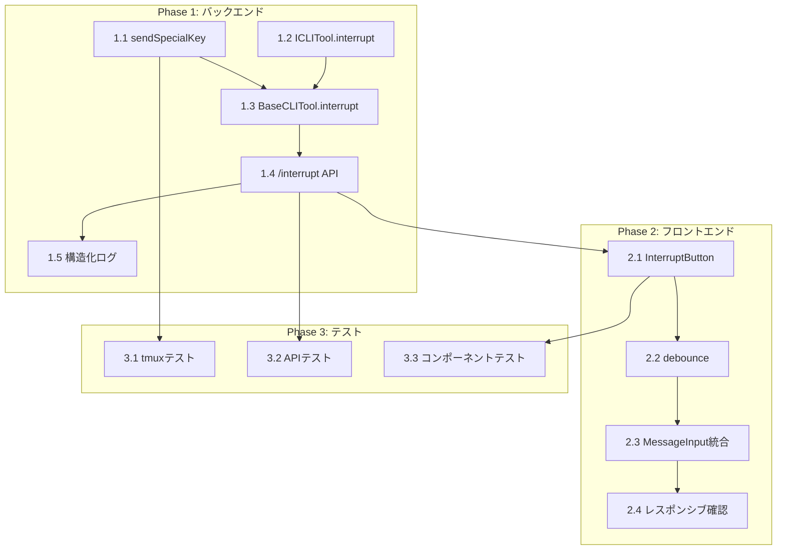

# Issue #46 作業計画書

## Issue: エスケープを入力可能にしたい（処理中断機能）

| 項目 | 値 |
|------|-----|
| **Issue番号** | #46 |
| **サイズ** | S（小規模） |
| **優先度** | Medium |
| **依存Issue** | なし |
| **関連Issue** | #41（構造化ログ） |

---

## 1. 実装範囲

### 1.1 スコープ

| カテゴリ | 対象 |
|---------|------|
| 新規作成 | `src/app/api/worktrees/[id]/interrupt/route.ts` |
| 新規作成 | `src/components/worktree/InterruptButton.tsx` |
| 更新 | `src/lib/tmux.ts`（sendSpecialKey追加） |
| 更新 | `src/lib/cli-tools/types.ts`（interrupt追加） |
| 更新 | `src/lib/cli-tools/base.ts`（interrupt実装） |
| 更新 | `src/components/worktree/MessageInput.tsx`（ボタン統合） |
| テスト | `tests/unit/interrupt.test.ts` |

### 1.2 対象外（スコープ外）

- Ctrl+C / Ctrl+D などの追加キー対応
- キーボードショートカット（Escキー直接入力）
- バックエンドでのレート制限

---

## 2. 詳細タスク分解

### Phase 1: バックエンド実装

| Task ID | タスク | 成果物 | 依存 |
|---------|--------|--------|------|
| **1.1** | sendSpecialKey関数追加 | `src/lib/tmux.ts` | なし |
| **1.2** | ICLITool.interrupt型定義追加 | `src/lib/cli-tools/types.ts` | なし |
| **1.3** | BaseCLITool.interrupt実装 | `src/lib/cli-tools/base.ts` | 1.1, 1.2 |
| **1.4** | /interrupt APIエンドポイント | `src/app/api/worktrees/[id]/interrupt/route.ts` | 1.3 |
| **1.5** | 構造化ログ追加 | `src/app/api/worktrees/[id]/interrupt/route.ts` | 1.4 |

### Phase 2: フロントエンド実装

| Task ID | タスク | 成果物 | 依存 |
|---------|--------|--------|------|
| **2.1** | InterruptButtonコンポーネント | `src/components/worktree/InterruptButton.tsx` | 1.4 |
| **2.2** | debounce実装 | `src/components/worktree/InterruptButton.tsx` | 2.1 |
| **2.3** | MessageInputへの統合 | `src/components/worktree/MessageInput.tsx` | 2.2 |
| **2.4** | モバイル/デスクトップ対応確認 | - | 2.3 |

### Phase 3: テスト

| Task ID | タスク | 成果物 | 依存 |
|---------|--------|--------|------|
| **3.1** | sendSpecialKey単体テスト | `tests/unit/tmux.test.ts` | 1.1 |
| **3.2** | /interrupt API単体テスト | `tests/unit/interrupt.test.ts` | 1.4 |
| **3.3** | InterruptButton単体テスト | `tests/unit/interrupt-button.test.ts` | 2.1 |

---

## 3. タスク依存関係



---

## 4. 実装詳細

### 4.1 Task 1.1: sendSpecialKey関数

**ファイル**: `src/lib/tmux.ts`

```typescript
/**
 * Send special key to tmux session
 */
export async function sendSpecialKey(
  sessionName: string,
  key: 'Escape' | 'C-c' | 'C-d'
): Promise<void> {
  try {
    await execAsync(
      `tmux send-keys -t "${sessionName}" ${key}`,
      { timeout: DEFAULT_TIMEOUT }
    );
  } catch (error: unknown) {
    const errorMessage = error instanceof Error ? error.message : String(error);
    throw new Error(`Failed to send special key: ${errorMessage}`);
  }
}
```

### 4.2 Task 1.2-1.3: ICLITool拡張

**ファイル**: `src/lib/cli-tools/types.ts`

```typescript
export interface ICLITool {
  // 既存メソッド...

  /**
   * 処理を中断（Escapeキー送信）
   */
  interrupt(worktreeId: string): Promise<void>;
}
```

**ファイル**: `src/lib/cli-tools/base.ts`

```typescript
async interrupt(worktreeId: string): Promise<void> {
  const sessionName = this.getSessionName(worktreeId);
  await sendSpecialKey(sessionName, 'Escape');
}
```

### 4.3 Task 1.4-1.5: /interrupt API

**ファイル**: `src/app/api/worktrees/[id]/interrupt/route.ts`

```typescript
import { createLogger } from '@/lib/logger';

const logger = createLogger('interrupt');

export async function POST(
  request: NextRequest,
  { params }: { params: { id: string } }
) {
  const log = logger.withContext({ worktreeId: params.id });
  log.info('interrupt:request');

  // 1. Worktree存在確認
  // 2. 実行中のセッションを取得
  // 3. Escapeキーを送信
  // 4. 結果を返却

  log.debug('interrupt:success', { sessionName });
}
```

### 4.4 Task 2.1-2.2: InterruptButton

**ファイル**: `src/components/worktree/InterruptButton.tsx`

```typescript
import { useMemo, useState } from 'react';
import debounce from 'lodash/debounce';

interface InterruptButtonProps {
  worktreeId: string;
  cliToolId: CLIToolType;
  disabled?: boolean;
}

export function InterruptButton({
  worktreeId,
  cliToolId,
  disabled,
}: InterruptButtonProps) {
  const [isLoading, setIsLoading] = useState(false);

  const handleInterrupt = useMemo(
    () => debounce(async () => {
      setIsLoading(true);
      try {
        await fetch(`/api/worktrees/${worktreeId}/interrupt`, {
          method: 'POST',
          body: JSON.stringify({ cliToolId }),
        });
      } finally {
        setIsLoading(false);
      }
    }, 1000, { leading: true, trailing: false }),
    [worktreeId, cliToolId]
  );

  return (
    <button
      type="button"
      onClick={handleInterrupt}
      disabled={disabled || isLoading}
      className="p-2 text-orange-600 hover:bg-orange-50 rounded-full transition-colors disabled:text-gray-300"
      aria-label="Stop processing"
    >
      <StopIcon />
    </button>
  );
}

const StopIcon = () => (
  <svg className="h-5 w-5" fill="currentColor" viewBox="0 0 24 24">
    <rect x="6" y="6" width="12" height="12" rx="2" />
  </svg>
);
```

---

## 5. 品質チェック項目

| チェック項目 | コマンド | 基準 |
|-------------|----------|------|
| ESLint | `npm run lint` | エラー0件 |
| TypeScript | `npx tsc --noEmit` | 型エラー0件 |
| Unit Test | `npm run test:unit` | 全テストパス |
| Build | `npm run build` | 成功 |

### 追加チェック

| チェック項目 | 確認方法 | 基準 |
|-------------|----------|------|
| Gemini CLI挙動 | 手動確認 | Escape送信で中断 |
| モバイル表示 | 実機/DevTools | ボタン表示・動作 |
| debounce | 連打テスト | 1秒間隔で制限 |

---

## 6. 成果物チェックリスト

### コード

- [ ] `src/lib/tmux.ts` - sendSpecialKey関数
- [ ] `src/lib/cli-tools/types.ts` - interrupt型定義
- [ ] `src/lib/cli-tools/base.ts` - interrupt実装
- [ ] `src/app/api/worktrees/[id]/interrupt/route.ts` - APIエンドポイント
- [ ] `src/components/worktree/InterruptButton.tsx` - UIコンポーネント
- [ ] `src/components/worktree/MessageInput.tsx` - ボタン統合

### テスト

- [ ] `tests/unit/tmux.test.ts` - sendSpecialKeyテスト追加
- [ ] `tests/unit/interrupt.test.ts` - API単体テスト

---

## 7. Definition of Done

Issue完了条件：

### 必須

- [ ] `/api/worktrees/:id/interrupt` APIが実装されている
- [ ] ストップボタン（⏹）がメッセージ入力欄に表示される
- [ ] ボタンタップでCLI処理が中断される
- [ ] モバイル/デスクトップ両方で動作する
- [ ] セッション未起動時は適切にエラーハンドリングされる
- [ ] debounceで連打が防止されている
- [ ] 構造化ログが出力されている
- [ ] 単体テストが追加されている
- [ ] CIチェック全パス（lint, type-check, test, build）

### 推奨

- [ ] Gemini CLIでの動作確認完了

---

## 8. 作業順序（推奨）

```
Step 1: バックエンド基盤
├── Task 1.1: sendSpecialKey（10分）
├── Task 1.2: ICLITool.interrupt型定義（5分）
└── Task 1.3: BaseCLITool.interrupt（5分）

Step 2: API実装
├── Task 1.4: /interrupt API（20分）
└── Task 1.5: 構造化ログ（5分）

Step 3: フロントエンド
├── Task 2.1: InterruptButton（15分）
├── Task 2.2: debounce（10分）
├── Task 2.3: MessageInput統合（10分）
└── Task 2.4: レスポンシブ確認（5分）

Step 4: テスト
├── Task 3.1: sendSpecialKeyテスト（10分）
├── Task 3.2: APIテスト（15分）
└── Task 3.3: コンポーネントテスト（10分）

Step 5: 最終確認
├── 品質チェック
├── Gemini CLI確認（手動）
└── PR作成
```

---

## 9. リスクと対策

| リスク | 影響 | 対策 |
|--------|------|------|
| Gemini CLIでEscapeが効かない | 機能制限 | GeminiToolでinterrupt()をオーバーライド |
| 連打による多重リクエスト | UX劣化 | フロントエンドdebounceで対応 |
| 既存テスト破壊 | CI失敗 | 各Phase後にテスト実行 |

---

## 10. 次のアクション

作業計画承認後：

1. **ブランチ作成**
   ```bash
   git checkout -b feature/46-interrupt-button
   ```

2. **タスク実行**
   - Phase 1 → Phase 2 → Phase 3 の順に実装
   - 各Phase完了後にコミット

3. **進捗報告**
   ```bash
   /progress-report
   ```

4. **PR作成**
   ```bash
   /create-pr
   ```

---

## 11. 関連ドキュメント

- [設計方針書](../design/issue46-escape-input-design-policy.md)
- [アーキテクチャレビュー](../review/2026-01-14-issue46-architecture-review.md)
- [Issue #46](https://github.com/Kewton/MyCodeBranchDesk/issues/46)
