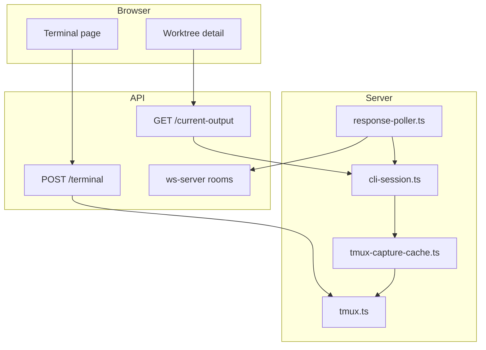
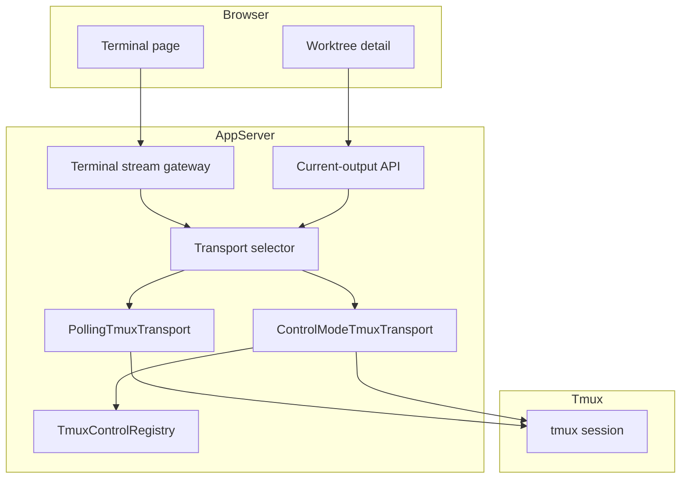

# 設計方針書: Issue #460 tmux control mode transport 導入

## 1. 概要

### 目的

tmux を永続セッション基盤として維持しつつ、ライブ terminal interaction を `capture-pane` + polling 依存から段階的に切り離し、`tmux control mode` を使った event-driven transport を導入する。

### 解決したい課題

- terminal page のライブ性不足
- TUI ツール対応のためのツール固有補償ロジックの増加
- resize が transport の第一級イベントになっていないこと
- `tmux.ts` / `response-poller.ts` / `current-output` / `Terminal.tsx` が別モデルで進化していることによる保守負荷

### スコープ

- 新規 transport abstraction (`SessionTransport`)
- 新規 `PollingTmuxTransport`
- 新規 `ControlModeTmuxTransport`
- terminal page 向け live stream 経路
- feature flag / fallback / observability / cleanup

### スコープ外

- tmux 以外の backend への置換
- 非表示セッションや履歴取得から snapshot path を即時全面撤去すること
- すべての CLI tool 固有補償を本 issue 単体で完全除去すること
- 現在の worktree detail 全体を一度に streaming 化すること

---

## 2. 現状分析

### 2.1 既存構成



### 2.2 既存コード上の問題点

| 観点 | 現状 | 問題 |
|------|------|------|
| 性能 | `response-poller.ts` と `current-output` が `capture-pane` ベース | active viewing 時でも snapshot 取得が継続する |
| 拡張性 | transport seam がなく `tmux.ts` が低レベル API を直接提供 | streaming path と polling path の共存が難しい |
| セキュリティ | 長寿命 stream の resource control が未定義 | DoS, FD leak, orphan process の境界が曖昧 |
| 保守性 | terminal page が app 標準 WebSocket 契約と分離 | 経路が二重化し、将来の修正点が増える |

### 2.3 現在の主要モジュールと責務

| ファイル | 現在の責務 | 今回の位置付け |
|---------|-----------|--------------|
| `src/lib/tmux.ts` | tmux low-level command 実行 | transport 実装の基盤に縮退 |
| `src/lib/cli-session.ts` | capture / session existence の窓口 | transport selector の呼び出し元候補 |
| `src/lib/response-poller.ts` | polling / response extraction / prompt detection | snapshot fallback path として一旦維持 |
| `src/lib/tmux-capture-cache.ts` | capture dedup / TTL cache | polling transport の内部最適化として維持 |
| `src/app/api/worktrees/[id]/current-output/route.ts` | worktree detail snapshot API | Phase 3 まで原則維持 |
| `src/app/api/worktrees/[id]/terminal/route.ts` | terminal input send-keys | terminal transport API に再整理 |
| `src/lib/ws-server.ts` | authenticated room broadcast | terminal streaming event 配信の既存候補 |
| `src/components/Terminal.tsx` | browser terminal UI | Phase 2 の主変更対象 |

---

## 3. 設計方針

### 3.1 採用方針

1. low-level tmux 操作を直接アプリへ露出しない
2. snapshot transport と streaming transport を同居させる
3. terminal page から段階導入し、worktree detail は後続フェーズで限定統合する
4. browser は tmux control mode を直接扱わず、server 側で authenticated stream に変換する
5. transport 差異は capability と fallback で吸収する

### 3.2 不採用方針

| 案 | 不採用理由 |
|----|-----------|
| いきなり全面 control-mode 化 | `current-output` / `response-poller` / terminal page が同時変更になりリスクが高い |
| browser から tmux control mode へ直接接続 | 認証・権限境界・tmux 制御面の露出が大きすぎる |
| transport abstraction なしで terminal page のみ個別改善 | worktree detail との乖離が拡大し、保守性が悪化する |
| snapshot path の即時削除 | fallback / reconnect / hidden session の要件を満たせない |

---

## 4. アーキテクチャ設計

### 4.1 目標構成



### 4.2 レイヤー構成

| レイヤー | 役割 | 主要ファイル |
|---------|------|------------|
| Presentation | terminal page / worktree detail | `src/components/Terminal.tsx`, worktree 詳細系コンポーネント |
| Gateway | authenticated browser stream と transport の仲介 | 新規 terminal stream gateway |
| Transport | snapshot / streaming 差異吸収 | 新規 `SessionTransport`, `PollingTmuxTransport`, `ControlModeTmuxTransport` |
| Infrastructure | tmux process / parser / registry | 既存 `tmux.ts` + 新規 control-mode client 群 |

### 4.3 変更対象候補

- 新規: `src/lib/session-transport.ts`
- 新規: `src/lib/transports/polling-tmux-transport.ts`
- 新規: `src/lib/transports/control-mode-tmux-transport.ts`
- 新規: `src/lib/tmux-control-client.ts`
- 新規: `src/lib/tmux-control-parser.ts`
- 新規: `src/lib/tmux-control-registry.ts`
- 新規: terminal streaming API / gateway
- 既存変更: `src/components/Terminal.tsx`
- 既存変更: `src/app/api/worktrees/[id]/terminal/route.ts`
- 既存変更: `src/lib/cli-session.ts`
- 既存変更: `src/lib/ws-server.ts` または同等の stream 配信経路

---

## 5. 詳細設計

### 5.1 `SessionTransport` インターフェース

```ts
export interface SessionTransport {
  ensureSession(sessionName: string, cwd: string): Promise<void>;
  sessionExists(sessionName: string): Promise<boolean>;
  sendInput(sessionName: string, input: string): Promise<void>;
  sendSpecialKey(sessionName: string, key: string): Promise<void>;
  resize(sessionName: string, cols: number, rows: number): Promise<void>;
  captureSnapshot(sessionName: string, opts?: CaptureOptions): Promise<string>;
  subscribe(
    sessionName: string,
    handlers: TransportHandlers
  ): Promise<TransportSubscription>;
  getCapabilities(): TransportCapabilities;
  killSession(sessionName: string): Promise<boolean>;
}

export interface TransportCapabilities {
  streamingOutput: boolean;
  explicitResize: boolean;
  snapshotFallback: boolean;
}

export interface TransportHandlers {
  onOutput(data: string): void;
  onExit?(info: { exitCode?: number | null }): void;
  onError(error: Error): void;
}

export interface TransportSubscription {
  unsubscribe(): Promise<void>;
}
```

#### 設計判断

- `captureSnapshot()` を残すことで fallback と hidden session の取得を維持する
- `getCapabilities()` を明示し、上位が transport 依存分岐を持てるようにする
- `subscribe()` は streaming transport だけでなく polling transport でも no-op / emulated subscription を提供可能にする

### 5.2 `PollingTmuxTransport`

既存 `tmux.ts` / `cli-session.ts` / `tmux-capture-cache.ts` を薄くラップする。

責務:

- `send-keys`, `capture-pane`, `kill-session` の既存挙動保持
- cache-backed snapshot 提供
- fallback transport としての後方互換性維持

非責務:

- live low-latency streaming の保証
- TUI fidelity 改善

### 5.3 `ControlModeTmuxTransport`

責務:

- tmux control mode subprocess の起動
- stdout/stderr からの control event 解析
- `sessionName` 単位の subscription 管理
- browser 向け output chunk / resize / disconnect の伝播
- idle timeout / subscriber count / cleanup 制御

内部コンポーネント:

| コンポーネント | 役割 |
|---------------|------|
| `TmuxControlClient` | tmux control mode subprocess の生成・停止 |
| `TmuxControlParser` | control mode 出力を event に変換 |
| `TmuxControlRegistry` | session ごとの client / subscriber / lifecycle 管理 |
| `ControlModeTmuxTransport` | `SessionTransport` 実装として上位に公開 |

### 5.4 Registry 設計

`TmuxControlRegistry` は `sessionName` ごとに 1 つの live client を保持する。

```ts
interface RegistryEntry {
  client: TmuxControlClient;
  subscribers: Set<string>;
  lastActivityAt: number;
  idleTimer?: NodeJS.Timeout;
}
```

設計判断:

- 同一 session への多重接続でも tmux client を使い回す
- browser client ID 単位で subscriber を追跡する
- subscriber が 0 件になったら idle timeout で自動 cleanup する

### 5.5 Terminal Stream Gateway

browser と tmux control mode の間に server-side gateway を置く。

責務:

- auth / worktree boundary check
- browser message を transport API に変換
- output chunk を app の stream event として返す
- disconnect 時に unsubscribe を呼ぶ

メッセージ種別案:

```ts
type ClientEvent =
  | { type: 'subscribe'; worktreeId: string; cliToolId: string }
  | { type: 'input'; data: string }
  | { type: 'resize'; cols: number; rows: number }
  | { type: 'unsubscribe' };

type ServerEvent =
  | { type: 'output'; data: string }
  | { type: 'status'; connected: boolean }
  | { type: 'error'; message: string }
  | { type: 'exit'; exitCode?: number | null };
```

### 5.6 Worktree Detail との共存方針

- Phase 2 までは `current-output` を維持
- Phase 3 で active session view のみ stream 使用を検討
- prompt detection / response extraction / DB 保存は当面 `response-poller.ts` を維持
- stream は UI live view、snapshot は state recovery / hidden session / history 用と役割分担する

---

## 6. 性能設計

### 6.1 期待改善

| 指標 | 現状 | 目標 |
|------|------|------|
| terminal page live latency | polling / manual refresh 相当 | event-driven で可視遅延を短縮 |
| active terminal viewing 中の `capture-pane` 呼び出し | 継続発生 | terminal page 経路では原則不要 |
| 同一 session の多重 viewer コスト | viewer ごとに重複しうる | registry で共有 |

### 6.2 計測ポイント

- `capture-pane` 呼び出し回数
- control-mode active session 数
- subscriber 数
- idle timeout による cleanup 回数
- terminal page 初回接続から最初の出力までの時間

### 6.3 性能上の注意

- control mode は polling を減らすが、長寿命 subprocess 管理コストを持つ
- browser ごとの直結ではなく registry 共有にしないと FD/CPU が増える
- worktree detail 側 snapshot path を残すため、Phase 2 時点では全体 polling がゼロにはならない

---

## 7. セキュリティ設計

### 7.1 信頼境界

```text
Browser
  -> authenticated terminal gateway
    -> SessionTransport
      -> tmux control mode subprocess
        -> tmux session
```

### 7.2 必須制約

- browser から tmux control mode へ直接接続しない
- worktree existence / authorization を subscribe 前に検証する
- sessionName は既存の `CLIToolManager.getTool().getSessionName()` 経由でのみ解決する
- input payload 長、resize 値、subscriber 数に上限を設ける
- raw output の無制限ログ出力を禁止する
- disconnect / server shutdown / idle timeout 時に child process を確実に cleanup する

### 7.3 脅威と対策

| 脅威 | 対策 |
|------|------|
| 長寿命 connection による DoS | subscriber 上限、idle timeout、backpressure 制御 |
| orphan subprocess / FD leak | registry 中央管理、unsubscribe と shutdown cleanup |
| 認証済み WebSocket 契約外の直結経路 | gateway 経由のみ許可 |
| parser 異常時の状態破損 | fail closed + snapshot fallback |
| 生出力ログによる情報漏洩 | structured metrics のみ記録、raw chunk は原則非保存 |

### 7.4 セキュリティレビュー前提

- 既存の auth / IP restriction を再利用する
- terminal 専用 gateway が既存 `ws-server.ts` と別実装になる場合も、同等の認証要件を満たす
- input validation は `terminal/route.ts` と同等以上の厳格さを維持する

---

## 8. 保守性設計

### 8.1 dual-path 管理

| 経路 | Phase 0-1 | Phase 2 | Phase 3 | Phase 4 |
|------|-----------|---------|---------|---------|
| terminal page | 既存 | control mode 主経路 | control mode | control mode |
| worktree detail | snapshot | snapshot | 一部 stream 併用 | 段階縮退 |
| response extraction | polling | polling | polling + 補助 stream | 再評価 |

### 8.2 feature flag

新経路は feature flag 配下で有効化する。

候補:

- `TMUX_CONTROL_MODE_ENABLED`
- `TMUX_CONTROL_MODE_TERMINAL_PAGE_ONLY`

### 8.3 rollback 方針

- parser 異常
- registry leak
- auth 境界未充足
- terminal page 表示不整合

上記のいずれかで即座に polling transport へ戻せることを前提とする。

---

## 9. 段階導入計画

### Phase 0: seam 作成

- `SessionTransport` 導入
- `PollingTmuxTransport` 実装
- 既存 low-level tmux 直接参照箇所の棚卸し
- feature flag 追加

### Phase 1: control-mode prototype

- `TmuxControlClient` / parser / registry
- 1 session の live output 検証
- cleanup / timeout / metrics 実装

### Phase 2: terminal page 移行

- terminal page を gateway 経由の streaming に変更
- input / resize / reconnect 対応
- terminal page の `capture-pane` 依存除去

### Phase 3: worktree detail 限定統合

- active session view のみ stream 併用
- snapshot fallback 維持
- polling 依存箇所の整理

### Phase 4: cleanup

- 特殊ケース補償の縮退
- feature flag の既定有効化判定
- 不要経路の整理

---

## 10. テスト方針

### unit test

- parser の event 変換
- registry の subscribe / unsubscribe / idle cleanup
- capability fallback
- transport selector

### integration test

- terminal page input / output / resize / reconnect
- unauthorized subscribe 拒否
- worktree 不一致拒否
- snapshot fallback 発火

### manual test

- Codex / OpenCode の TUI 操作
- 複数 viewer の同時閲覧
- idle timeout 後の再接続

---

## 11. 受入条件

- [ ] `SessionTransport` と `PollingTmuxTransport` が導入され、既存動作が維持される
- [ ] `ControlModeTmuxTransport` が 1 session で live output を配信できる
- [ ] terminal page が pane polling に依存せず live 更新する
- [ ] resize が control-mode path でサポートされる
- [ ] auth / worktree boundary / idle cleanup / fallback の設計が実装へ落とせる粒度で定義されている
- [ ] `capture-pane` 呼び出し回数を計測できる
- [ ] parser 異常時に snapshot fallback できる
- [ ] feature flag による rollback が可能である

---

## 12. 参考資料

- `dev-reports/issue/460/issue-review/updated-issue-body.md`
- `dev-reports/issue/460/issue-review/review-report.md`
- `src/lib/tmux.ts`
- `src/lib/response-poller.ts`
- `src/lib/tmux-capture-cache.ts`
- `src/app/api/worktrees/[id]/current-output/route.ts`
- `src/app/api/worktrees/[id]/terminal/route.ts`
- `src/lib/ws-server.ts`
