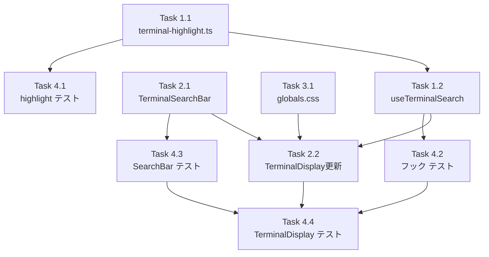

# 作業計画書

## Issue: ターミナル出力・ファイル内容のテキスト検索機能

**Issue番号**: #47
**サイズ**: M
**優先度**: Medium
**依存Issue**: なし（ファイル内容検索は Issue #21 で実装済み）
**設計方針書**: `dev-reports/design/issue-47-terminal-search-design-policy.md`

---

## スコープ確認

Issue #47 の実装スコープ（Issue レビューで確定済み）:

| 機能 | 実装要否 | 備考 |
|-----|---------|------|
| ターミナル検索 UI | **必須** | 新規実装 |
| CSS Highlight API ハイライト | **必須** | 新規実装 |
| ファイル内容検索 | **不要** | Issue #21 で実装済み |

---

## 詳細タスク分解

### Phase 1: ユーティリティ・フック実装

- [ ] **Task 1.1**: ターミナルハイライトユーティリティ実装
  - 成果物: `src/lib/terminal-highlight.ts`
  - 内容:
    - `isCSSHighlightSupported(): boolean`
    - `applyTerminalHighlights(container, matchPositions, currentIndex): void`
    - `clearTerminalHighlights(): void`
    - TreeWalker でテキストノード走査・Range生成ロジック
  - 依存: なし

- [ ] **Task 1.2**: useTerminalSearch フック実装
  - 成果物: `src/hooks/useTerminalSearch.ts`
  - 内容:
    - `UseTerminalSearchOptions` 型定義（output, containerRef）
    - `UseTerminalSearchReturn` 型定義
    - 検索状態管理（query, isOpen, matchCount, currentIndex, matchPositions）
    - `findMatches()` - container.textContent 検索（indexOf, 最小2文字, 上限500件）
    - デバウンス処理（300ms）
    - `openSearch() / closeSearch() / nextMatch() / prevMatch()`
    - DOM 更新後ハイライト再適用（useEffect、output 変化で再実行）
  - 依存: Task 1.1

### Phase 2: UI コンポーネント実装

- [ ] **Task 2.1**: TerminalSearchBar コンポーネント実装
  - 成果物: `src/components/worktree/TerminalSearchBar.tsx`
  - 内容:
    - `TerminalSearchBarProps` 型定義
    - 検索入力欄（2文字未満は非活性表示）
    - 件数表示（例: `3/12`、上限時は `500以上`）
    - 前/次ボタン（matchCount=0 時は disabled）
    - 閉じるボタン
    - Esc キーで閉じる
    - aria-live による件数読み上げ対応
  - 依存: なし（独立コンポーネント）

- [ ] **Task 2.2**: TerminalDisplay.tsx 更新
  - 成果物: `src/components/worktree/TerminalDisplay.tsx`
  - 内容:
    - `showSearchButton?: boolean` prop 追加（optional、後方互換）
    - `tabIndex={0}` をターミナルコンテナに追加
    - `useTerminalSearch` フックを統合（scrollRef を containerRef として渡す）
    - Ctrl+F / Cmd+F でisOpen=true（`e.preventDefault()`でブラウザ検索抑制）
    - `isOpen && <TerminalSearchBar ...>` をレンダリング
    - `showSearchButton && !isOpen && <SearchButton>` をモバイル向けに追加
    - `::highlight()` CSS のため globals.css 更新と連携
  - 依存: Task 1.2, Task 2.1

### Phase 3: CSS 更新

- [ ] **Task 3.1**: globals.css に `::highlight()` 定義追加
  - 成果物: `src/app/globals.css`
  - 内容:
    ```css
    ::highlight(terminal-search) {
      background-color: rgba(255, 255, 0, 0.4);
      color: inherit;
    }
    ::highlight(terminal-search-current) {
      background-color: rgba(255, 165, 0, 0.8);
      color: black;
    }
    ```
  - 依存: なし

### Phase 4: テスト実装

- [ ] **Task 4.1**: terminal-highlight.ts 単体テスト
  - 成果物: `tests/unit/lib/terminal-highlight.test.ts`
  - テストケース:
    - isCSSHighlightSupported() サポートあり/なしのモック
    - clearTerminalHighlights() が CSS.highlights.delete を呼ぶ
  - 依存: Task 1.1

- [ ] **Task 4.2**: useTerminalSearch フック単体テスト
  - 成果物: `tests/unit/hooks/useTerminalSearch.test.ts`
  - テストケース:
    - 初期状態: isOpen=false, matchCount=0
    - openSearch() で isOpen=true
    - closeSearch() で isOpen=false, クエリクリア
    - クエリ1文字以下でマッチなし（最小2文字）
    - 大文字小文字を区別しない検索
    - nextMatch() で currentIndex が循環（末尾→先頭）
    - prevMatch() で currentIndex が循環（先頭→末尾）
    - matchCount が TERMINAL_SEARCH_MAX_MATCHES 上限を超えない
  - 依存: Task 1.2

- [ ] **Task 4.3**: TerminalSearchBar 単体テスト
  - 成果物: `tests/unit/components/TerminalSearchBar.test.tsx`
  - テストケース:
    - 件数表示 `3/12` が正しく表示される
    - matchCount=0 時に前/次ボタンが disabled
    - Esc キーで onClose が呼ばれる
    - 前/次ボタンクリックで onPrev/onNext が呼ばれる
    - aria-live の内容が更新される
  - 依存: Task 2.1

- [ ] **Task 4.4**: TerminalDisplay.tsx テスト更新
  - 成果物: `tests/unit/components/TerminalDisplay.test.tsx`
  - テストケース（追加分）:
    - showSearchButton=true で検索ボタンが表示される
    - tabIndex=0 が設定されている（既存テスト影響確認）
    - Ctrl+F キーで TerminalSearchBar が表示される
    - 検索を閉じると TerminalSearchBar が非表示になる
  - 依存: Task 2.2, Task 4.2, Task 4.3

---

## タスク依存関係



**並列実行可能**: Task 1.1, Task 2.1, Task 3.1 は依存関係なし → 並列実装可能

---

## 実装順序（推奨）

```
1. Task 1.1 (terminal-highlight.ts)
   + Task 2.1 (TerminalSearchBar) [並列]
   + Task 3.1 (globals.css) [並列]

2. Task 1.2 (useTerminalSearch) → 1.1 完了後

3. Task 2.2 (TerminalDisplay更新) → 1.2, 2.1, 3.1 完了後

4. Task 4.1 + 4.2 + 4.3 [並列] → 各依存完了後

5. Task 4.4 (TerminalDisplay テスト) → 2.2, 4.2, 4.3 完了後
```

---

## 品質チェック項目

| チェック項目 | コマンド | 基準 |
|-------------|----------|------|
| ESLint | `npm run lint` | エラー0件 |
| TypeScript | `npx tsc --noEmit` | 型エラー0件 |
| Unit Test | `npm run test:unit` | 全テストパス |
| Build | `npm run build` | 成功 |

---

## 主要セキュリティ制約（実装時必須）

| アノテーション | 内容 |
|-------------|------|
| SEC-TS-001 | indexOf のみ使用（RegExp 禁止）|
| SEC-TS-002 | CSS Highlight API で XSS を回避（DOM 変更なし）|
| SEC-TS-003 | container.textContent を検索ソースに使用 |
| SEC-TS-004 | クエリ最小2文字以上を強制（DoS 防止）|

---

## 成果物チェックリスト

### コード（新規）
- [ ] `src/lib/terminal-highlight.ts`
- [ ] `src/hooks/useTerminalSearch.ts`
- [ ] `src/components/worktree/TerminalSearchBar.tsx`

### コード（変更）
- [ ] `src/components/worktree/TerminalDisplay.tsx`
- [ ] `src/app/globals.css`

### テスト（新規）
- [ ] `tests/unit/lib/terminal-highlight.test.ts`
- [ ] `tests/unit/hooks/useTerminalSearch.test.ts`
- [ ] `tests/unit/components/TerminalSearchBar.test.tsx`

### テスト（更新）
- [ ] `tests/unit/components/TerminalDisplay.test.tsx`

---

## Definition of Done

- [ ] すべてのタスク（Task 1.1 〜 4.4）が完了
- [ ] `npm run lint` エラー0件
- [ ] `npx tsc --noEmit` 型エラー0件
- [ ] `npm run test:unit` 全テストパス
- [ ] `npm run build` 成功
- [ ] 受入条件（Issue #47）がすべて満たされている
  - PC: Ctrl+F で検索バーが表示される
  - モバイル: 検索ボタンで検索バーが表示される
  - ハイライト表示（XSSリスクなし）
  - 前/次ナビゲーション
  - 大量テキストでもUIフリーズしない

---

## 次のアクション

```
/pm-auto-dev 47
```
