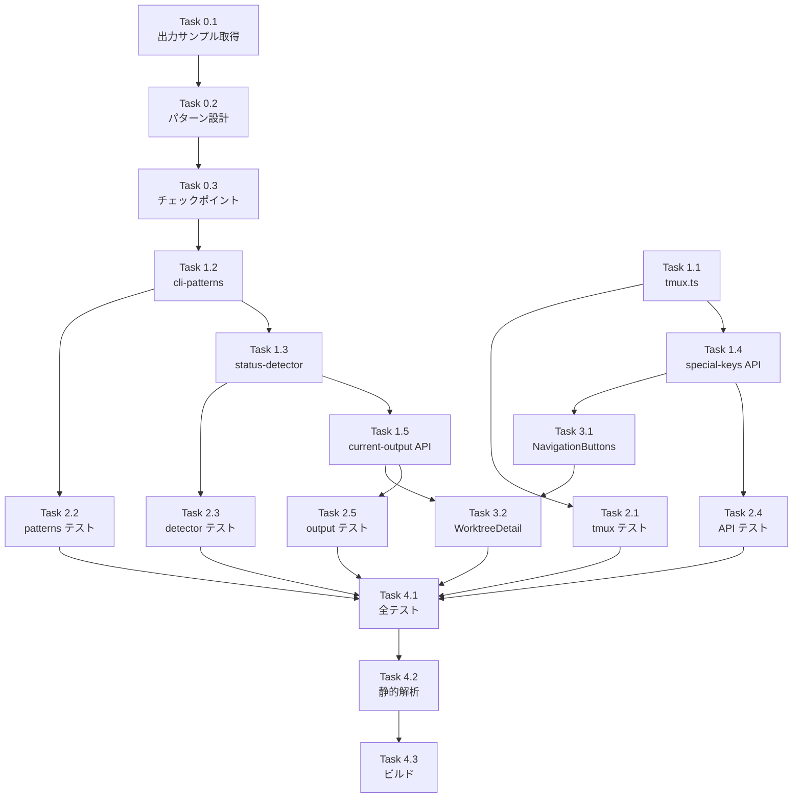

# Issue #473 作業計画書

## Issue: OpenCode TUI選択リストのキーボードナビゲーション対応
**Issue番号**: #473
**サイズ**: M
**優先度**: Medium
**依存Issue**: なし
**ブランチ**: `feature/473-worktree`

---

## 詳細タスク分解

### Phase 0: 前提作業（パターン設計）

- [ ] **Task 0.1**: OpenCode TUI選択リストの出力サンプル取得
  - 成果物: capture-pane出力サンプル（テスト用）
  - 作業: OpenCode `/models`, `/providers` 実行時の tmux capture-pane 出力を取得
  - 依存: なし

- [ ] **Task 0.2**: 正規表現パターン設計
  - 成果物: `OPENCODE_SELECTION_LIST_PATTERN` の正規表現確定
  - 作業: サンプルからパターンを設計、既存パターンとの非重複確認 [DR1-005]
  - 依存: Task 0.1

- [ ] **Task 0.3**: パターン確定後チェックポイント実施
  - 成果物: チェックポイント確認記録
  - 作業: セクション6.4の全検証項目を実施（既存パターン競合、他CLIツール誤検知テスト）
  - 依存: Task 0.2

### Phase 1: バックエンド基盤（型定義・インフラ）

- [ ] **Task 1.1**: tmux.ts - NAVIGATION_KEY_VALUES export + ラッパー関数
  - 成果物: `src/lib/tmux.ts` 修正
  - 作業:
    - `NAVIGATION_KEY_VALUES` as const配列を export [DR3-001]
    - `NavigationKey` 型を export
    - `isAllowedSpecialKey()` 関数を export [DR2-004]
    - `sendSpecialKeysAndInvalidate()` ラッパー関数を追加 [DR1-003]
  - 依存: なし
  - テスト: Task 2.1

- [ ] **Task 1.2**: cli-patterns.ts - 選択リストパターン定義
  - 成果物: `src/lib/cli-patterns.ts` 修正
  - 作業: `OPENCODE_SELECTION_LIST_PATTERN` 定義を追加
  - 依存: Task 0.3（パターン確定後）
  - テスト: Task 2.2

- [ ] **Task 1.3**: status-detector.ts - 選択リスト検出分岐
  - 成果物: `src/lib/status-detector.ts` 修正
  - 作業:
    - priority 2.5ブロック内(B)thinkingの後、(D)response_completeの前に selection_list 検出を追加
    - `reason: 'opencode_selection_list'`, `status: 'waiting'`, `hasActivePrompt: false`
    - reason定数化 [DR2-003]: `STATUS_REASON.OPENCODE_SELECTION_LIST`
  - 依存: Task 1.2
  - テスト: Task 2.3

- [ ] **Task 1.4**: special-keys API エンドポイント新設
  - 成果物: `src/app/api/worktrees/[id]/special-keys/route.ts` 新規
  - 作業:
    - terminal/route.ts の構造を踏襲した多層防御 [DR1-001]
    - JSONパース防御 [DR4-002]
    - keys型バリデーション（Array.isArray, typeof, 空配列）[DR4-004]
    - isAllowedSpecialKey()による事前バリデーション
    - getWorktreeById + hasSession
    - sendSpecialKeysAndInvalidate()呼び出し
    - 固定文字列エラーレスポンス [DR4-003]
  - 依存: Task 1.1
  - テスト: Task 2.4

- [ ] **Task 1.5**: current-output API - isSelectionListActive フラグ追加
  - 成果物: `src/app/api/worktrees/[id]/current-output/route.ts` 修正
  - 作業:
    - `isSelectionListActive` boolean判定追加
    - reason定数参照 [DR2-003]
  - 依存: Task 1.3
  - テスト: Task 2.5

### Phase 2: テスト（TDD - Red→Green）

- [ ] **Task 2.1**: tmux.ts ユニットテスト
  - 成果物: `tests/unit/tmux-navigation.test.ts`
  - テスト内容:
    - `isAllowedSpecialKey()` の正常/異常ケース
    - `NAVIGATION_KEY_VALUES` の内容確認
    - `sendSpecialKeysAndInvalidate()` の呼び出し確認

- [ ] **Task 2.2**: cli-patterns.ts ユニットテスト
  - 成果物: `tests/unit/cli-patterns-selection.test.ts`
  - テスト内容:
    - `OPENCODE_SELECTION_LIST_PATTERN` の正常検出・非検出・エッジケース
    - 他CLIツール出力で誤検知しないこと（回帰テスト）

- [ ] **Task 2.3**: status-detector.ts ユニットテスト
  - 成果物: `tests/unit/status-detector-selection.test.ts`
  - テスト内容:
    - `opencode_selection_list` reason の検出テスト
    - 優先順位テスト（priority 2.5内の全4分岐(A)(B)(C)(D)排他性）[DR3-002]
    - OpenCode通常応答で誤検知しない回帰テスト [DR3-002]
    - response_complete が(C)をスキップして(D)に到達する確認 [DR3-002]

- [ ] **Task 2.4**: special-keys API ユニットテスト
  - 成果物: `tests/unit/special-keys-route.test.ts`
  - テスト内容:
    - 正常系（200）
    - バリデーションエラー各種（400）: 不正cliToolId、不正キー名、配列長超過、非配列、非string要素、空配列、JSONパースエラー
    - worktree不存在（404）
    - セッション不存在（404）
    - 内部エラー（500）

- [ ] **Task 2.5**: current-output API テスト
  - 成果物: 既存テストファイルに追加
  - テスト内容:
    - isSelectionListActive が reason === 'opencode_selection_list' 時にtrueになること
    - 他のreason値で false であること

### Phase 3: フロントエンド実装

- [ ] **Task 3.1**: NavigationButtons コンポーネント新設
  - 成果物: `src/components/worktree/NavigationButtons.tsx`
  - 作業:
    - Up/Down/Enter/Escape ボタン（最小タッチターゲット44x44px）
    - POST /api/worktrees/[id]/special-keys 呼び出し
    - フォーカスハンドリング（矢印キーインターセプト）
    - dangerouslySetInnerHTML不使用 [DR4-006]
  - 依存: Task 1.4

- [ ] **Task 3.2**: WorktreeDetailRefactored.tsx - 状態管理・表示制御
  - 成果物: `src/components/worktree/WorktreeDetailRefactored.tsx` 修正
  - 作業:
    - CliStatus インターフェースに `isSelectionListActive: boolean` 追加 [DR3-003]
    - `isSelectionListActive` に基づくNavigationButtons条件付き表示
  - 依存: Task 1.5, Task 3.1

### Phase 4: 品質確認

- [ ] **Task 4.1**: 全テスト実行
  - コマンド: `npm run test:unit`
  - 基準: 全テストパス

- [ ] **Task 4.2**: 静的解析
  - コマンド: `npx tsc --noEmit && npm run lint`
  - 基準: エラー0件

- [ ] **Task 4.3**: ビルド確認
  - コマンド: `npm run build`
  - 基準: 成功

---

## タスク依存関係

---

## 並列実行可能なタスク

以下のタスクは依存関係がないため並列実行可能：
- **Task 1.1** (tmux.ts) と **Task 0.1-0.3** (前提作業) は並列実行可
- **Task 2.1** (tmux テスト) と **Task 2.2** (patterns テスト) は各自の依存完了後に並列実行可
- **Task 2.3**, **Task 2.4**, **Task 2.5** も各自の依存完了後に並列実行可

---

## 品質チェック項目

| チェック項目 | コマンド | 基準 |
|-------------|----------|------|
| ESLint | `npm run lint` | エラー0件 |
| TypeScript | `npx tsc --noEmit` | 型エラー0件 |
| Unit Test | `npm run test:unit` | 全テストパス |
| Build | `npm run build` | 成功 |

---

## 成果物チェックリスト

### コード
- [ ] `src/lib/tmux.ts` - NAVIGATION_KEY_VALUES, isAllowedSpecialKey(), sendSpecialKeysAndInvalidate()
- [ ] `src/lib/cli-patterns.ts` - OPENCODE_SELECTION_LIST_PATTERN
- [ ] `src/lib/status-detector.ts` - selection_list検出分岐
- [ ] `src/app/api/worktrees/[id]/special-keys/route.ts` - 新規API
- [ ] `src/app/api/worktrees/[id]/current-output/route.ts` - isSelectionListActiveフラグ
- [ ] `src/components/worktree/NavigationButtons.tsx` - 新規UIコンポーネント
- [ ] `src/components/worktree/WorktreeDetailRefactored.tsx` - 表示制御

### テスト
- [ ] tmux-navigation.test.ts
- [ ] cli-patterns-selection.test.ts
- [ ] status-detector-selection.test.ts
- [ ] special-keys-route.test.ts
- [ ] current-output テスト追加

---

## Definition of Done

- [ ] 全タスク完了
- [ ] CIチェック全パス（lint, type-check, test, build）
- [ ] OpenCode TUI選択リスト検出→ボタン表示→キー送信→選択のE2E動作確認
- [ ] 既存CLIツール（Claude/Codex/Gemini/VibeLocal）に影響なし
- [ ] 設計方針書チェックリスト全項目クリア

---

## 次のアクション

1. **TDD実装開始**: `/pm-auto-dev 473` でTask 0.1から順次実装
2. **進捗報告**: `/progress-report` で定期報告
3. **PR作成**: `/create-pr` で自動作成

---

*Generated by work-plan command for Issue #473*
