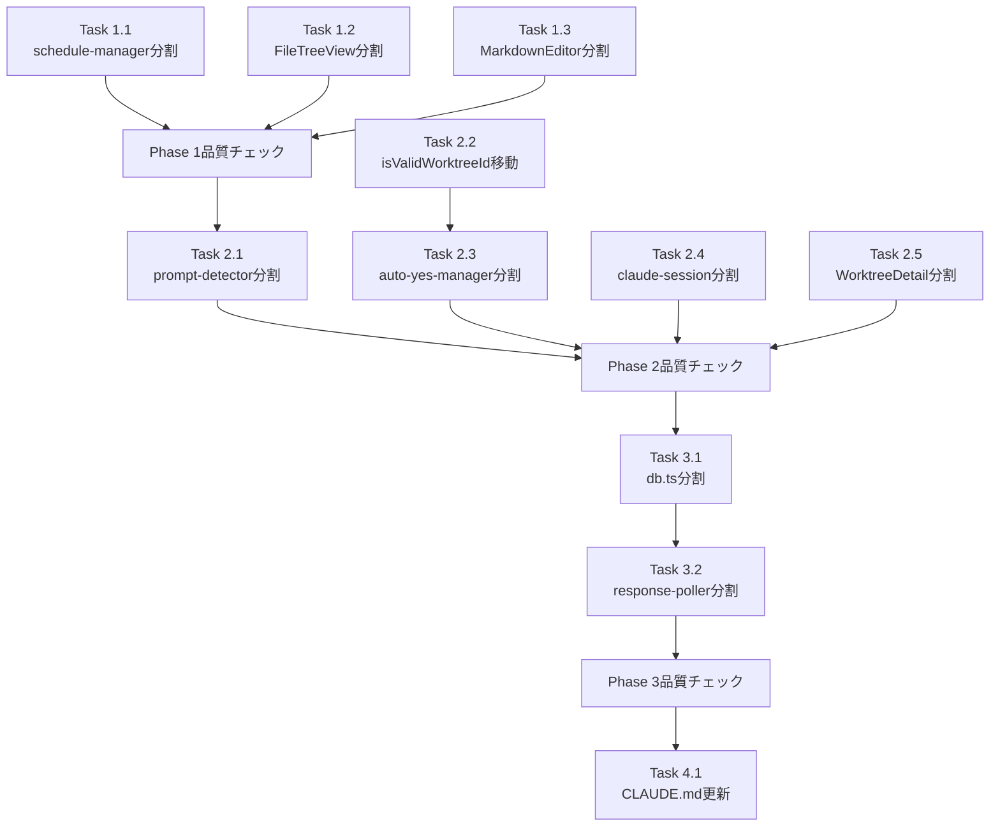

# Issue #479 作業計画書

## Issue: refactor: 巨大ファイル分割（R-1）

**Issue番号**: #479
**サイズ**: XL
**優先度**: Medium
**依存Issue**: #475（親Issue）
**設計方針書**: `dev-reports/design/issue-479-large-file-split-design-policy.md`

---

## 作業概要

300行超のファイル上位10件を責務ごとに分割する内部リファクタリング。
3つのPhaseに分け、低リスク→中リスク→高リスクの順で実施する。

---

## Phase 1: 低リスクファイル分割（独立性が高く消費者が限定的）

### Task 1.1: schedule-manager.ts 分割

- **作業内容**: `src/lib/schedule-manager.ts`（761行）を3ファイルに分割
- **成果物**:
  - `src/lib/schedule-manager.ts`（スケジューラーメイン、ジョブ登録・管理）
  - `src/lib/cron-parser.ts`（cron式解析ロジック）
  - `src/lib/job-executor.ts`（ジョブ実行エンジン）
- **テスト**: `tests/unit/lib/schedule-manager.test.ts`, `tests/unit/lib/schedule-manager-cleanup.test.ts` のimportパス更新
- **依存**: なし

### Task 1.2: FileTreeView.tsx 分割

- **作業内容**: `src/components/worktree/FileTreeView.tsx`（963行）を3ファイルに分割
- **成果物**:
  - `src/components/worktree/FileTreeView.tsx`（メインツリービュー、状態管理・レイアウト）
  - `src/components/worktree/TreeNode.tsx`（ツリーノードコンポーネント）
  - `src/components/worktree/TreeContextMenu.tsx`（コンテキストメニューコンポーネント）
- **テスト**: `tests/unit/components/worktree/FileTreeView.test.tsx` のimportパス更新
- **依存**: なし

### Task 1.3: MarkdownEditor.tsx 分割

- **作業内容**: `src/components/worktree/MarkdownEditor.tsx`（1027行）を3ファイルに分割
- **成果物**:
  - `src/components/worktree/MarkdownEditor.tsx`（メインエディタコンポーネント）
  - `src/components/worktree/MarkdownToolbar.tsx`（ツールバーUI）
  - `src/components/worktree/MarkdownPreview.tsx`（プレビュー表示コンポーネント）
- **テスト**: `tests/unit/components/MarkdownEditor.test.tsx` のimportパス更新
- **依存**: なし

### Task 1.4: Phase 1 品質チェック

```bash
npm run test:unit
npm run lint
npx tsc --noEmit
```

---

## Phase 2: 中リスクファイル分割（UIコンポーネントまたは適度な依存関係）

### Task 2.1: prompt-detector.ts 分割

- **作業内容**: `src/lib/prompt-detector.ts`（965行）を2ファイルに分割
- **成果物**:
  - `src/lib/prompt-detector.ts`（メイン検出ロジック、detectPrompt, resetDetectPromptCache, Pass1/Pass2内部関数）〜800行以下目標
  - `src/lib/prompt-answer-input.ts`（getAnswerInputおよび関連ヘルパー）〜200行以下目標
- **テスト**: `tests/unit/prompt-detector.test.ts`, `tests/unit/prompt-detector-cache.test.ts`, `tests/unit/lib/prompt-answer-sender.test.ts` のimportパス更新
- **依存**: なし

### Task 2.2: isValidWorktreeId を path-validator.ts に移動

- **作業内容**: `auto-yes-manager.ts` の `isValidWorktreeId` と `WORKTREE_ID_PATTERN` を `src/lib/path-validator.ts` に移動
- **成果物**: `src/lib/path-validator.ts`（既存ファイルに関数追加）
- **影響ファイル**: 以下11のAPIルートのimportを `path-validator.ts` に変更
  - `src/app/api/worktrees/[id]/git/log/route.ts`
  - `src/app/api/worktrees/[id]/git/diff/route.ts`
  - `src/app/api/worktrees/[id]/git/show/[commitHash]/route.ts`
  - その他8ファイル（execution-logs, schedules, prompt-response等）
- **テスト**: `tests/unit/api/git-log.test.ts`, `tests/unit/api/git-diff.test.ts`, `tests/unit/api/git-show.test.ts` のimport更新
- **依存**: なし（Task 2.3より先に実施推奨）

### Task 2.3: auto-yes-manager.ts 分割

- **作業内容**: `src/lib/auto-yes-manager.ts`（866行）を3ファイルに分割
- **成果物**:
  - `src/lib/auto-yes-manager.ts`（バレル + ライフサイクル管理、startAutoYesPolling, stopAutoYesPolling）
  - `src/lib/auto-yes-poller.ts`（ポーリングループ本体、`__autoYesPollerStates` Map配置）
  - `src/lib/auto-yes-state.ts`（状態管理、AutoYesState型、`__autoYesStates` Map配置）
- **バレル方針**: 明示的な名前付きre-export（`export *` 禁止）、`@internal`関数はre-exportしない
- **テスト更新**:
  - `tests/unit/lib/auto-yes-manager.test.ts` → `auto-yes-poller.test.ts` + `auto-yes-state.test.ts` に分割
  - `tests/unit/auto-yes-manager-cleanup.test.ts` → `auto-yes-poller.test.ts` に統合
  - `tests/unit/session-cleanup-issue404.test.ts` → mockを `auto-yes-poller.ts` に変更
  - `tests/unit/resource-cleanup.test.ts` → import先更新
  - `tests/integration/auto-yes-persistence.test.ts` → import先を `auto-yes-state.ts` に更新
- **依存**: Task 2.2（isValidWorktreeId移動後に実施）

### Task 2.4: claude-session.ts 分割

- **作業内容**: `src/lib/claude-session.ts`（838行）を2ファイルに分割
- **成果物**:
  - `src/lib/claude-session.ts`（セッション管理〜600行）
  - `src/lib/session-key-sender.ts`（キー送信ロジック〜250行、tmux.sendKeys/sendSpecialKeyのラッパー）
- **テスト**: `tests/unit/lib/claude-session.test.ts` のimportパス更新
- **依存**: なし

### Task 2.5: WorktreeDetailRefactored.tsx 分割

- **作業内容**: `src/components/worktree/WorktreeDetailRefactored.tsx`（2709行）を多ファイルに分割
- **成果物**:
  - `src/components/worktree/WorktreeDetailRefactored.tsx`（メインコンポーネント〜800行）
  - `src/components/worktree/WorktreeDesktopContent.tsx`（デスクトップレイアウト）
  - `src/components/worktree/WorktreeMobileContent.tsx`（モバイルレイアウト）
  - `src/components/worktree/WorktreeInfoFields.tsx`（内部コンポーネント）
  - `src/components/worktree/DesktopHeader.tsx`
  - `src/components/worktree/InfoModal.tsx`
  - `src/components/worktree/LoadingIndicator.tsx`
  - `src/components/worktree/ErrorDisplay.tsx`
  - `src/components/worktree/MobileInfoContent.tsx`
  - `src/components/worktree/MobileContent.tsx`
  - `src/hooks/useWorktreePolling.ts`（ポーリング・WebSocketロジック）
  - `src/hooks/useWorktreeCallbacks.ts`（コールバック群）
- **テスト**: `tests/unit/components/WorktreeDetailRefactored.test.tsx`, `tests/unit/components/WorktreeDetailWebSocket.test.tsx` のimport更新
- **依存**: なし

### Task 2.6: Phase 2 品質チェック

```bash
npm run test:unit
npm run lint
npx tsc --noEmit
npx madge --circular src/  # 循環依存チェック（推奨）
```

---

## Phase 3: 高リスクファイル分割（多数の消費者、広範なimport変更）

### Task 3.1: db.ts 分割（先行実施）

- **作業内容**: `src/lib/db.ts`（1403行）を5ファイルに分割
- **成果物**:
  - `src/lib/db/worktree-db.ts`（Worktree CRUD〜470行）
    - getWorktrees, getWorktreeById, upsertWorktree, updateWorktreeDescription, updateLastViewedAt, **updateWorktreeLink**, getRepositories, updateFavorite, updateStatus, updateCliToolId, updateSelectedAgents, updateVibeLocalModel, updateVibeLocalContextWindow, saveInitialBranch, getInitialBranch, getWorktreeIdsByRepository, deleteRepositoryWorktrees, deleteWorktreesByIds
  - `src/lib/db/chat-db.ts`（Chat CRUD〜350行）
    - createMessage, updateMessageContent, getMessages, getLastUserMessage, getLastMessage, deleteAllMessages, deleteMessageById, deleteMessagesByCliTool, getMessageById, updatePromptData, markPendingPromptsAsAnswered, updateLastUserMessage, getLastAssistantMessageAt
  - `src/lib/db/session-db.ts`（セッション状態管理〜180行）
    - getSessionState, updateSessionState, setInProgressMessageId, clearInProgressMessageId, deleteSessionState
  - `src/lib/db/memo-db.ts`（メモ管理〜150行）
    - getMemosByWorktreeId, getMemoById, createMemo, updateMemo, deleteMemo, reorderMemos
  - `src/lib/db.ts`（バレルファイル〜50行）
    - re-export（名前付きexport）+ initDatabase
- **バレル方針**: 明示的な名前付きre-export（`export *` 禁止）
- **テスト**: `tests/unit/db.test.ts` のimport確認（バレル経由のため変更不要）
- **依存**: なし（response-poller.tsより先に実施）

### Task 3.2: response-poller.ts 分割（db.ts完了後）

- **作業内容**: `src/lib/response-poller.ts`（1307行）を4ファイルに分割
- **成果物**:
  - `src/lib/response-poller.ts`（バレル + ポーリング制御、startPolling, stopPolling, stopAllPolling, getActivePollers、`activePollers` Map）
  - `src/lib/response-extractor.ts`（抽出ロジック、extractResponse, resolveExtractionStartIndex, isOpenCodeComplete）
  - `src/lib/response-cleaner.ts`（クリーニング、cleanClaudeResponse, cleanGeminiResponse, cleanOpenCodeResponse）
  - `src/lib/tui-accumulator.ts`（TUI状態管理、6関数 + TUI accumulator Map）
- **モジュールスコープ変数**: `activePollers` Mapはモジュールスコープ変数（非globalThis）のため、モジュールキャッシュによりシングルトン性が保たれる
- **テスト更新**:
  - `response-poller.test.ts` → `response-cleaner.test.ts` にリネーム
  - `response-poller-opencode.test.ts` → `response-cleaner-opencode.test.ts` + `response-extractor-opencode.test.ts` に分割
  - `response-poller-tui-accumulator.test.ts` → `tui-accumulator.test.ts` にリネーム
  - `resolve-extraction-start-index.test.ts` → `response-extractor.test.ts` にリネーム
- **依存**: Task 3.1（db.tsのバレルファイル化完了後）

### Task 3.3: Phase 3 品質チェック + vi.mockバレル互換性検証

```bash
npm run test:unit
npm run lint
npx tsc --noEmit
npx madge --circular src/
# vi.mockバレル互換性確認
# vi.mock('@/lib/db', ...) を使用するテストが正常動作することを確認
```

---

## Phase 4: ドキュメント更新

### Task 4.1: CLAUDE.md の主要モジュール一覧更新

- 分割前のモジュールエントリを削除
- 分割後の新モジュールをIssue #479付きで追加

### Task 4.2: db-migrations.ts の扱い確認

- `src/lib/db-migrations.ts`（1234行）は「構造的問題ではないので低優先」のためスコープ外
- 本Issueで対応しない旨をコメントに記録

---

## タスク依存関係



---

## 品質チェック項目

| チェック項目 | コマンド | 基準 |
|-------------|----------|------|
| ESLint | `npm run lint` | エラー0件 |
| TypeScript | `npx tsc --noEmit` | 型エラー0件 |
| Unit Test | `npm run test:unit` | 全テストパス |
| 循環依存 | `npx madge --circular src/` | 循環依存0件 |

---

## 成果物チェックリスト

### Phase 1
- [ ] `src/lib/cron-parser.ts` 新規作成
- [ ] `src/lib/job-executor.ts` 新規作成
- [ ] `src/components/worktree/TreeNode.tsx` 新規作成
- [ ] `src/components/worktree/TreeContextMenu.tsx` 新規作成
- [ ] `src/components/worktree/MarkdownToolbar.tsx` 新規作成
- [ ] `src/components/worktree/MarkdownPreview.tsx` 新規作成

### Phase 2
- [ ] `src/lib/prompt-answer-input.ts` 新規作成
- [ ] `src/lib/auto-yes-poller.ts` 新規作成
- [ ] `src/lib/auto-yes-state.ts` 新規作成
- [ ] `src/lib/session-key-sender.ts` 新規作成
- [ ] `src/components/worktree/WorktreeDesktopContent.tsx` 新規作成
- [ ] `src/components/worktree/WorktreeMobileContent.tsx` 新規作成
- [ ] 内部コンポーネント7個を個別ファイルに抽出
- [ ] `src/hooks/useWorktreePolling.ts` 新規作成
- [ ] `src/hooks/useWorktreeCallbacks.ts` 新規作成
- [ ] `src/lib/path-validator.ts` に `isValidWorktreeId` + `WORKTREE_ID_PATTERN` 追加

### Phase 3
- [ ] `src/lib/db/worktree-db.ts` 新規作成
- [ ] `src/lib/db/chat-db.ts` 新規作成
- [ ] `src/lib/db/session-db.ts` 新規作成
- [ ] `src/lib/db/memo-db.ts` 新規作成
- [ ] `src/lib/response-extractor.ts` 新規作成
- [ ] `src/lib/response-cleaner.ts` 新規作成
- [ ] `src/lib/tui-accumulator.ts` 新規作成

### Phase 4
- [ ] `CLAUDE.md` 更新（分割後の新モジュール追記）

---

## Definition of Done

- [ ] 全10ファイルの分割完了（db-migrations.tsは除外）
- [ ] 各ファイルが500行以下（例外：WorktreeDetailRefactored.tsx・prompt-detector.tsは800行以下）
- [ ] `npm run test:unit` 全パス
- [ ] `npm run lint` エラー0件
- [ ] `npx tsc --noEmit` 型エラー0件
- [ ] 循環依存0件
- [ ] CLAUDE.md主要モジュール一覧更新完了
- [ ] `isValidWorktreeId` + `WORKTREE_ID_PATTERN` が `path-validator.ts` に移動完了

---

## 次のアクション

1. **Phase 1から着手**: `schedule-manager.ts` → `FileTreeView.tsx` → `MarkdownEditor.tsx` の順（並行作業可）
2. **各Phase完了時に品質チェック実施**
3. **PR作成**: `/create-pr` で自動作成

---

*Generated for Issue #479 - 2026-03-13*
