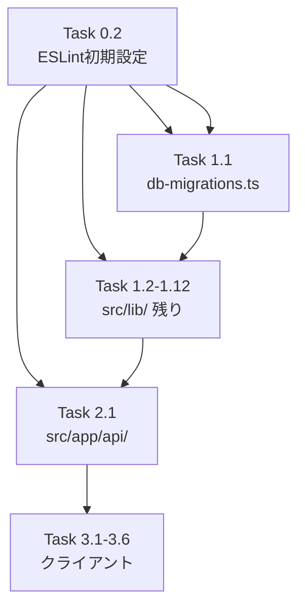

# Issue #480 作業計画書

## Issue概要

**Issue番号**: #480
**タイトル**: refactor: console.log 整理・logger統一（R-2）
**サイズ**: L（約340件、約60ファイル）
**優先度**: Medium（リファクタリング）
**親Issue**: #475

---

## 現状把握

| 対象 | 実測件数 | 備考 |
|------|---------|------|
| `src/lib/` 配下 | 約220件 | db-migrations.ts 57件を含む |
| `src/app/api/` 配下 | 約80件 | 38ファイルに分散 |
| `src/components/` 配下 | 6件（console.log/warn） | console.errorは残置 |
| `src/hooks/` 配下 | 0件（実行コード） | JSDocのみ |
| **実移行対象合計** | **約306件** | console.error残置分除く |

---

## 前提条件

以下のファイルは既に `createLogger` 導入済みで `console.log` 残存なし（確認のみ）:
- `src/lib/cli-session.ts`, `src/lib/prompt-detector.ts`, `src/lib/cli-patterns.ts`
- `src/lib/pasted-text-helper.ts`, `src/lib/tmux-control-client.ts`, `src/lib/tmux-control-registry.ts`
- `src/app/api/worktrees/[id]/interrupt/route.ts`, `src/app/api/worktrees/[id]/search/route.ts`

---

## タスク分解

### Phase 0: 基盤準備（PR-A）

- [ ] **Task 0.1**: テストヘルパー作成
  - 成果物: `tests/helpers/logger-mock.ts`
  - 内容: `createMockLogger()` および `mockLoggerModule()` の共通ヘルパー
  - 依存: なし

- [ ] **Task 0.2**: ESLint no-console ルール初期設定
  - 成果物: `.eslintrc.json`（または `.eslintrc.js`）の更新
  - 内容: `no-console` ルールを `warn` レベルで有効化（段階的に `error` へ昇格）
  - 依存: なし

### Phase 1: src/lib/ 配下のサーバーサイドモジュール（PR-B: db-migrations.ts, PR-C: 残りsrc/lib/）

#### PR-B: db-migrations.ts（独立PR推奨）

- [ ] **Task 1.1**: `src/lib/db-migrations.ts` の移行（57件）
  - `createLogger('db-migrations')` 導入
  - console.log → logger.info/debug
  - console.error → logger.error（error.messageのみ記録、stackはdebug）
  - 依存: Task 0.1
  - 完了確認: `npm run lint && npx tsc --noEmit && npm run test:unit && npm run test:integration && npm run build`

#### PR-C: src/lib/ 残りファイル

優先度高（件数多い順）:

- [ ] **Task 1.2**: `src/lib/schedule-manager.ts`（21件）
  - `createLogger('schedule-manager')` 導入
  - 影響テスト修正: `tests/unit/lib/schedule-manager.test.ts`（行130, 367）

- [ ] **Task 1.3**: `src/lib/claude-session.ts`（15件）
  - `createLogger('claude-session')` 導入

- [ ] **Task 1.4**: `src/lib/resource-cleanup.ts`（11件）
  - `createLogger('resource-cleanup')` 導入

- [ ] **Task 1.5**: `src/lib/cli-tools/opencode-config.ts`（11件）
  - `createLogger('cli-tools/opencode-config')` 導入

- [ ] **Task 1.6**: `src/lib/cli-tools/codex.ts`（11件）
  - `createLogger('cli-tools/codex')` 導入

- [ ] **Task 1.7**: `src/lib/ws-server.ts`（10件）
  - `createLogger('ws-server')` 導入

- [ ] **Task 1.8**: `src/lib/auto-yes-manager.ts`（10件）
  - `createLogger('auto-yes-manager')` 導入

- [ ] **Task 1.9**: `src/lib/cmate-parser.ts`（9件）
  - `createLogger('cmate-parser')` 導入
  - 影響テスト修正: `tests/unit/lib/cmate-parser.test.ts`（console.warn spy x5）

- [ ] **Task 1.10**: `src/lib/cli-tools/gemini.ts`（9件）
  - `createLogger('cli-tools/gemini')` 導入

- [ ] **Task 1.11**: `src/lib/response-poller.ts`（8件）
  - `createLogger('response-poller')` 導入

- [ ] **Task 1.12**: src/lib/ 残りファイル（合計約70件）
  - `src/lib/worktrees.ts`（7件）
  - `src/lib/session-cleanup.ts`（6件）
  - `src/lib/db-migration-path.ts`（6件）
  - `src/lib/clone-manager.ts`（6件）
  - `src/lib/assistant-response-saver.ts`（6件）
  - `src/lib/slash-commands.ts`（5件）
  - `src/lib/selected-agents-validator.ts`（5件）
  - `src/lib/cli-tools/vibe-local.ts`（5件）
  - `src/lib/cli-tools/opencode.ts`（5件）
  - `src/lib/git-utils.ts`（4件）
  - `src/lib/cli-tools/manager.ts`（4件）
  - `src/lib/tmux.ts`（3件）
  - その他3件以下のファイル群

  影響テスト修正:
  - `tests/unit/selected-agents-validator.test.ts`（console.warn spy）
  - `tests/unit/db-migration-path.test.ts`（console.warn spy x3）
  - `tests/unit/lib/clone-manager.test.ts`（console.warn spy x4）
  - `tests/unit/slash-commands.test.ts`（console.warn spy x2）
  - `tests/unit/prompt-detector-cache.test.ts`（console.log/warn spy）
  - `tests/unit/lib/tmux-capture-cache.test.ts`（console.debug spy）

完了確認（PR-C）:
```bash
npm run lint && npx tsc --noEmit && npm run test:unit && npm run test:integration && npm run build
```

ESLint強化: `src/lib/` に `no-console: error` を設定

### Phase 2: src/app/api/ 配下（PR-D）

- [ ] **Task 2.1**: 主要APIルートの移行（件数多い順）
  - `src/app/api/worktrees/[id]/send/route.ts`（10件）
  - `src/app/api/repositories/route.ts`（8件）
  - `src/app/api/worktrees/[id]/files/[...path]/route.ts`（5件）
  - `src/app/api/worktrees/[id]/route.ts`（4件）
  - `src/app/api/worktrees/[id]/respond/route.ts`（4件）
  - `src/app/api/repositories/clone/route.ts`（4件）
  - その他2-3件のAPIルートファイル群（約30ファイル）

  影響テスト修正:
  - `tests/integration/trust-dialog-auto-response.test.ts`（行119）
  - `tests/integration/security.test.ts`（console.warn spy）
  - `tests/integration/auth-middleware.test.ts`（console.warn spy x3）
  - `tests/unit/ip-restriction.test.ts`（console.warn spy x4）

完了確認（PR-D）:
```bash
npm run lint && npx tsc --noEmit && npm run test:unit && npm run test:integration && npm run build
```

ESLint強化: `src/app/api/` に `no-console: error` を設定

### Phase 3: src/components/, src/hooks/ のクライアントサイド（PR-E）

3段階方針に従い:
- [ ] **Task 3.1**: `src/components/worktree/MessageList.tsx` の console.warn(1件)・console.log(1件) を削除
- [ ] **Task 3.2**: `src/components/Terminal.tsx` の console.log(1件) を削除
- [ ] **Task 3.3**: `src/components/worktree/TerminalDisplay.tsx` の console.log(1件) を削除
- [ ] **Task 3.4**: `src/components/worktree/SlashCommandList.tsx` の console.log(1件) を削除
- [ ] **Task 3.5**: `src/components/worktree/MarkdownEditor.tsx` の console.log(1件) を削除
- [ ] **Task 3.6**: `src/hooks/useSwipeGesture.ts`（JSDocのみ）、`src/hooks/useFullscreen.ts`（JSDocのみ）、`src/hooks/useWebSocket.ts`（JSDocのみ）→ 変更不要（実行コードなし）

完了確認（PR-E）:
```bash
npm run lint && npx tsc --noEmit && npm run test:unit
```

---

## タスク依存関係



---

## PR分割戦略

| PR | 内容 | ベースブランチ | マージ順序 |
|-----|------|-------------|---------|
| PR-A | tests/helpers/logger-mock.ts + ESLint初期設定 | feature/480 | 1番目 |
| PR-B | src/lib/db-migrations.ts（57件） | PR-A | 2番目 |
| PR-C | src/lib/ 残りファイル（約163件） | PR-A | PR-Bと並行可 |
| PR-D | src/app/api/ 配下（約80件） | PR-C | 4番目 |
| PR-E | クライアントサイド（6件削除） | PR-D | 5番目 |

---

## セキュリティガイドライン（実装時注意事項）

| ルール | 内容 |
|--------|------|
| action引数 | 静的文字列のみ使用。動的値はdata引数に渡す |
| data引数禁止 | 認証トークン・パスワード・APIキー |
| data引数許容 | worktreeId, ファイルパス, セッション名 |
| data引数debugのみ | ユーザー入力テキスト（メッセージ内容等） |
| エラーログ | error.messageのみ記録、stackはlogger.debugで別途 |

---

## 品質チェック項目

| チェック項目 | コマンド | 基準 |
|-------------|----------|------|
| ESLint | `npm run lint` | エラー0件 |
| TypeScript | `npx tsc --noEmit` | 型エラー0件 |
| Unit Test | `npm run test:unit` | 全テストパス |
| Integration Test | `npm run test:integration` | 全テストパス |
| Build | `npm run build` | 成功 |

### 最終検証コマンド

```bash
# 実行コード内のconsole残存確認
grep -r "console\.\(log\|warn\)" src/lib/ src/app/api/ \
  --include="*.ts" --include="*.tsx" \
  | grep -v "logger\.ts" | grep -v "env\.ts" \
  | grep -v "node_modules" | grep -v "\.test\." | grep -v "^\s*//"

grep -r "console\.\(log\|warn\)" src/components/ src/hooks/ \
  --include="*.ts" --include="*.tsx" \
  | grep -v "node_modules" | grep -v "\.test\." | grep -v "^\s*//"
```

---

## Definition of Done

- [ ] src/lib/ 配下のconsole.log/warn/errorがlogger経由に統一（env.tsのconsole.warnを除く）
- [ ] src/app/api/ 配下のconsole.log/warn/errorがlogger経由に統一
- [ ] src/components/, src/hooks/ のconsole.log/warnが削除（console.errorは残置）
- [ ] 影響テスト（13ファイル）がloggerモック方式に更新済み
- [ ] `tests/helpers/logger-mock.ts` が作成済み
- [ ] ESLint no-console ルールが移行済みスコープに設定済み
- [ ] 全PRでCIパス（lint, tsc, test:unit, test:integration, build）
- [ ] JSDocコメント内のconsole.logは対象外

---

*作成日: 2026-03-13*
