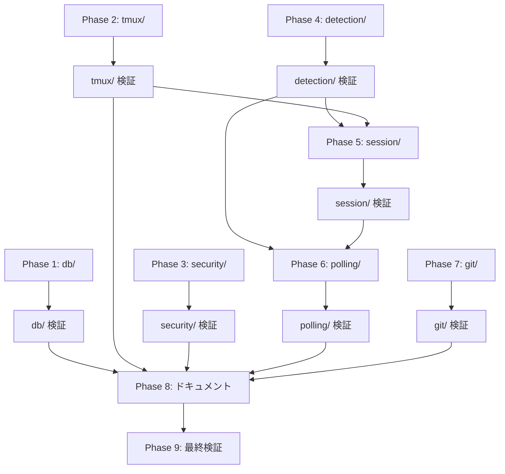

# 作業計画: Issue #481 - src/lib ディレクトリ再整理（R-3）

## Issue概要
**Issue番号**: #481
**タイトル**: refactor: src/lib ディレクトリ再整理（R-3）
**サイズ**: L（36ファイル移動、約696行import更新）
**優先度**: Medium
**依存Issue**: #475（親Issue）

---

## Phase 1: db/ グループ移行（独立）

### Task 1.1: db/ ディレクトリ作成と原子的移行（1コミット）
- **成果物**:
  - `src/lib/db/db.ts`（移動）
  - `src/lib/db/db-instance.ts`（移動）
  - `src/lib/db/db-migrations.ts`（移動）
  - `src/lib/db/db-path-resolver.ts`（移動）
  - `src/lib/db/db-repository.ts`（移動）
  - `src/lib/db/db-migration-path.ts`（移動）
  - `src/lib/db/index.ts`（新規: バレルエクスポート）
- **注意**: `src/lib/db.ts` の削除と `src/lib/db/index.ts` の作成を1コミットで原子的に実施（I001）
- **互換レイヤー設置**:
  - `src/lib/db-instance.ts` → `export * from './db/db-instance'`（48ファイル参照）
  - `src/lib/db-migrations.ts` → `export * from './db/db-migrations'`（34ファイル参照）
  - `src/lib/db-path-resolver.ts` → `export * from './db/db-path-resolver'`
  - `src/lib/db-repository.ts` → `export * from './db/db-repository'`
  - `src/lib/db-migration-path.ts` → `export * from './db/db-migration-path'`
- **依存**: なし

### Task 1.2: db/ 移行後の検証
- `npm run lint && npx tsc --noEmit && npm run test:unit`
- `npm run build:cli`
- 失敗時: `git revert <commit1>`

---

## Phase 2: tmux/ グループ移行（transports/ 統合含む）

### Task 2.1: tmux/ ディレクトリ作成とファイル移動（1コミット）
- **成果物**:
  - `src/lib/tmux/tmux.ts`（移動）
  - `src/lib/tmux/tmux-capture-cache.ts`（移動）
  - `src/lib/tmux/tmux-control-client.ts`（移動）
  - `src/lib/tmux/tmux-control-mode-flags.ts`（移動）
  - `src/lib/tmux/tmux-control-mode-metrics.ts`（移動）
  - `src/lib/tmux/tmux-control-parser.ts`（移動）
  - `src/lib/tmux/tmux-control-registry.ts`（移動）
  - `src/lib/tmux/control-mode-tmux-transport.ts`（transports/ から移動）
  - `src/lib/tmux/polling-tmux-transport.ts`（transports/ から移動）
  - `src/lib/tmux/session-transport.ts`（ルートから移動）
  - `src/lib/tmux/index.ts`（新規: バレルエクスポート）
- **importパス更新（4ファイル）**:
  - `src/lib/ws-server.ts`: `./transports/control-mode-tmux-transport` → `@/lib/tmux`
  - `src/lib/cli-session.ts`: `./transports/polling-tmux-transport` → `@/lib/tmux`
  - `tests/unit/lib/cli-session-transport.test.ts`: vi.mock パス更新
  - `tests/unit/lib/ws-server-terminal.test.ts`: vi.mock パス更新
- **transports/ ディレクトリの完全削除確認**
- **依存**: なし

### Task 2.2: tmux/ 移行後の検証
- `npm run lint && npx tsc --noEmit && npm run test:unit`

---

## Phase 3: security/ グループ移行（独立）

### Task 3.1: security/ ディレクトリ作成とファイル移動（1コミット）
- **成果物**:
  - `src/lib/security/auth.ts`（移動）
  - `src/lib/security/ip-restriction.ts`（移動）
  - `src/lib/security/path-validator.ts`（移動）
  - `src/lib/security/env-sanitizer.ts`（移動）
  - `src/lib/security/sanitize.ts`（移動）
  - `src/lib/security/worktree-path-validator.ts`（移動）
  - `src/lib/security/index.ts`（新規: named export 方式、`isWithinRoot`, `generateToken`, `hashToken` を除外）
- **middleware.ts の更新**: `'./lib/ip-restriction'` → `'./lib/security/ip-restriction'`（直接import）
- **その他importパス更新**: 外部からの `@/lib/auth`, `@/lib/path-validator` 等を `@/lib/security` に更新
- **依存**: なし

### Task 3.2: security/ 移行後のセキュリティ接続確認（S004）
- ws-server.ts が auth.ts から必要関数を正しくimportしているか
- middleware.ts が ip-restriction.ts から正しくimportしているか
- file-operations.ts が `isPathSafe` を正しくimportしているか
- `npm run lint && npx tsc --noEmit && npm run test:unit`

---

## Phase 4: detection/ グループ移行

### Task 4.1: detection/ ディレクトリ作成とファイル移動（1コミット）
- **成果物**:
  - `src/lib/detection/status-detector.ts`（移動）
  - `src/lib/detection/prompt-detector.ts`（移動）
  - `src/lib/detection/cli-patterns.ts`（移動）
  - `src/lib/detection/prompt-key.ts`（移動）
  - `src/lib/detection/index.ts`（新規: バレルエクスポート）
- **importパス更新**: `@/lib/status-detector`, `@/lib/prompt-detector` 等を `@/lib/detection` に更新
- **`__tests__/` 内更新**: `../status-detector`, `../cli-patterns` 等を `@/lib/detection/xxx` に更新
- **依存**: なし（session/, polling/ の前提）

### Task 4.2: detection/ 移行後の検証
- `npm run lint && npx tsc --noEmit && npm run test:unit`

---

## Phase 5: session/ グループ移行

### Task 5.1: session/ ディレクトリ作成とファイル移動（1コミット）
- **成果物**:
  - `src/lib/session/claude-session.ts`（移動）
  - `src/lib/session/cli-session.ts`（移動）
  - `src/lib/session/worktree-status-helper.ts`（移動）
  - `src/lib/session/claude-executor.ts`（移動）
  - `src/lib/session/index.ts`（新規: バレルエクスポート）
- **注意**: session-cleanup.ts はルート残留（Facade）、session-transport.ts はtmux/ 移行済み
- **importパス更新**: `@/lib/claude-session`, `@/lib/cli-session` 等を `@/lib/session` に更新
- **依存**: detection/, tmux/ 移行完了後

### Task 5.2: session/ 移行後の検証
- `npm run lint && npx tsc --noEmit && npm run test:unit`

---

## Phase 6: polling/ グループ移行

### Task 6.1: polling/ ディレクトリ作成とファイル移動（1コミット）
- **成果物**:
  - `src/lib/polling/response-poller.ts`（移動）
  - `src/lib/polling/auto-yes-manager.ts`（移動）
  - `src/lib/polling/auto-yes-resolver.ts`（移動）
  - `src/lib/polling/index.ts`（新規: バレルエクスポート）
- **importパス更新**: `@/lib/response-poller`, `@/lib/auto-yes-manager` 等を `@/lib/polling` に更新
- **依存**: session/, detection/ 移行完了後

### Task 6.2: polling/ 移行後の検証
- `npm run lint && npx tsc --noEmit && npm run test:unit`

---

## Phase 7: git/ グループ移行（独立）

### Task 7.1: git/ ディレクトリ作成とファイル移動（1コミット）
- **成果物**:
  - `src/lib/git/git-utils.ts`（移動）
  - `src/lib/git/worktrees.ts`（移動）
  - `src/lib/git/clone-manager.ts`（移動）
  - `src/lib/git/index.ts`（新規: バレルエクスポート）
- **importパス更新**: `@/lib/git-utils`, `@/lib/worktrees` 等を `@/lib/git` に更新
- **依存**: なし

### Task 7.2: git/ 移行後の検証
- `npm run lint && npx tsc --noEmit && npm run test:unit`

---

## Phase 8: ドキュメント更新

### Task 8.1: CLAUDE.md モジュール一覧更新（約52箇所）
- `src/lib/xxx.ts` → `src/lib/group/xxx.ts` のパス更新

### Task 8.2: docs/module-reference.md 更新（約54箇所）
- パス参照の一括更新

### Task 8.3: docs/architecture.md 更新（約6箇所）
- 該当箇所のパス更新

---

## Phase 9: 最終検証

### Task 9.1: 全体品質チェック
```bash
npm run lint
npx tsc --noEmit
npm run test:unit
npm run build
npm run build:cli
```

### Task 9.2: 受け入れ基準の全項目確認
- [ ] 全importパス更新完了
- [ ] transports/ ディレクトリ削除確認
- [ ] セキュリティ関連import接続確認（ws-server.ts, middleware.ts, file-operations.ts）
- [ ] 循環依存なし
- [ ] 全テストパス
- [ ] ドキュメント更新完了

---

## タスク依存関係



**並列実行可能**: Phase 1(db/), Phase 2(tmux/), Phase 3(security/), Phase 4(detection/), Phase 7(git/) は相互に独立しており並列実施可能。

---

## 品質チェック項目

| チェック項目 | コマンド | 基準 |
|-------------|----------|------|
| ESLint | `npm run lint` | エラー0件 |
| TypeScript | `npx tsc --noEmit` | 型エラー0件 |
| Unit Test | `npm run test:unit` | 全テストパス |
| Build | `npm run build` | 成功 |
| CLI Build | `npm run build:cli` | 成功 |

---

## Definition of Done

- [ ] 36ファイルの移動完了（7グループ）
- [ ] 各グループにindex.ts（バレルエクスポート）設置
- [ ] security/index.ts はnamed export形式
- [ ] transports/ ディレクトリ完全削除
- [ ] importパス更新完了
- [ ] セキュリティ関連import接続確認
- [ ] 全テストパス（`npm run test:unit`）
- [ ] 静的解析エラー0件（`npm run lint && npx tsc --noEmit`）
- [ ] ドキュメント更新完了（CLAUDE.md, module-reference.md, architecture.md）
- [ ] PR作成

---

## 次のアクション

1. **実装開始**: `/pm-auto-dev 481`
2. **進捗報告**: `/progress-report`
3. **PR作成**: `/create-pr`
