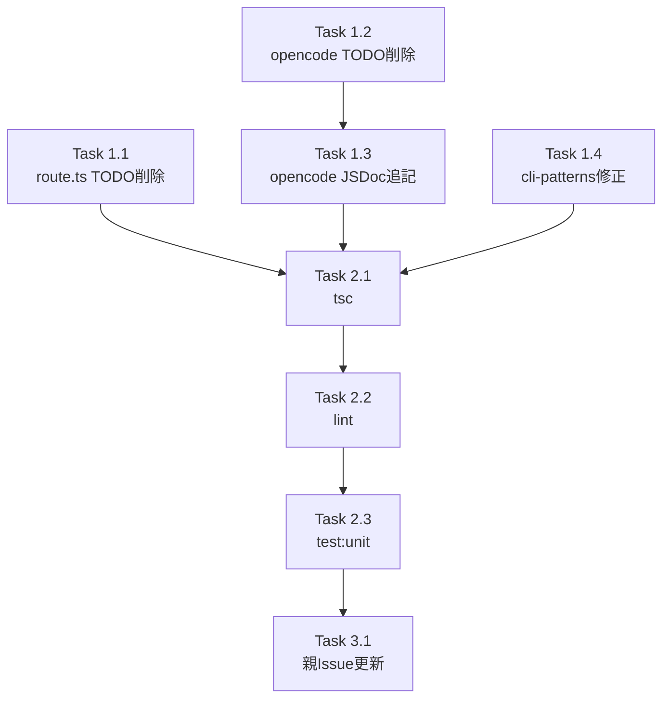

# 作業計画: Issue #482 refactor: TODO/FIXME マーカー解消（R-4）

## Issue概要

| 項目 | 内容 |
|------|------|
| **Issue番号** | #482 |
| **タイトル** | refactor: TODO/FIXME マーカー解消（R-4） |
| **サイズ** | S |
| **優先度** | Low |
| **依存Issue** | #475（親Issue） |

---

## 変更概要

コードベースに残存する4箇所のTODO/FIXMEマーカーをすべてコメント・JSDoc修正で解消する。
**ソースコードのロジック変更は一切なし。**

---

## 詳細タスク分解

### Phase 1: コード修正

- [ ] **Task 1.1**: `src/app/api/worktrees/[id]/slash-commands/route.ts` L33 TODOコメント削除
  - 成果物: route.ts の L33 から `// TODO: api-client.ts の...` 行を削除
  - 依存: なし
  - 注意: L29-32 の NOTEコメントは維持する

- [ ] **Task 1.2**: `src/lib/cli-tools/opencode-config.ts` TODOコメント削除（2箇所）
  - 成果物: L217-218、L284-285 のTODOコメント（各2行）を削除
  - 依存: なし

- [ ] **Task 1.3**: `src/lib/cli-tools/opencode-config.ts` `ensureOpencodeConfig` JSDocに1行追記
  - 成果物: L340-342付近のJSDocに以下を追記:
    ```
    HTTP fetch logic (fetchWithTimeout) can be extracted to a shared helper.
    ```
  - 依存: Task 1.2

- [ ] **Task 1.4**: `src/lib/cli-patterns.ts` L27 `Issue #XXX` → `Issue #188` に修正
  - 成果物: JSDoc内の参照を `Issue #188` に更新
  - 依存: なし

### Phase 2: 品質確認

- [ ] **Task 2.1**: `npx tsc --noEmit` でコンパイルエラーがないことを確認
  - 依存: Phase 1全タスク完了後

- [ ] **Task 2.2**: `npm run lint` でリントエラーがないことを確認
  - 依存: Phase 1全タスク完了後

- [ ] **Task 2.3**: `npm run test:unit` で既存テストが全パスすることを確認
  - 依存: Phase 1全タスク完了後

### Phase 3: 後処理

- [ ] **Task 3.1**: 親Issue #475 のR-4行の残存件数を更新
  - 内容: `gh issue edit 475` または GitHub Web UIで、R-4行の残存件数を本Issue完了分を反映して更新
  - 依存: Phase 1, 2完了後

---

## タスク依存関係



---

## 品質チェック項目

| チェック項目 | コマンド | 基準 |
|-------------|----------|------|
| TypeScript | `npx tsc --noEmit` | 型エラー0件 |
| ESLint | `npm run lint` | エラー0件 |
| Unit Test | `npm run test:unit` | 全テストパス |

---

## 変更ファイル一覧

| ファイル | 変更内容 | 変更規模 |
|---------|---------|---------|
| `src/app/api/worktrees/[id]/slash-commands/route.ts` | L33 TODOコメント1行削除 | 極小 |
| `src/lib/cli-tools/opencode-config.ts` | L217-218, L284-285 削除 + JSDoc1行追記 | 極小 |
| `src/lib/cli-patterns.ts` | L27 Issue番号修正 | 極小 |

---

## Definition of Done

- [ ] Task 1.1〜1.4すべて完了
- [ ] `npx tsc --noEmit` パス
- [ ] `npm run lint` パス
- [ ] `npm run test:unit` パス
- [ ] 親Issue #475 のR-4行更新完了

---

## 次のアクション

1. **TDD実装**: `/pm-auto-dev 482` で実装開始
2. **PR作成**: `/create-pr` で自動作成

---

## 参考ドキュメント

- 設計方針書: `dev-reports/design/issue-482-todo-fixme-cleanup-design-policy.md`
- Issueレビュー: `dev-reports/issue/482/issue-review/summary-report.md`
- 設計レビュー: `dev-reports/issue/482/multi-stage-design-review/summary-report.md`
