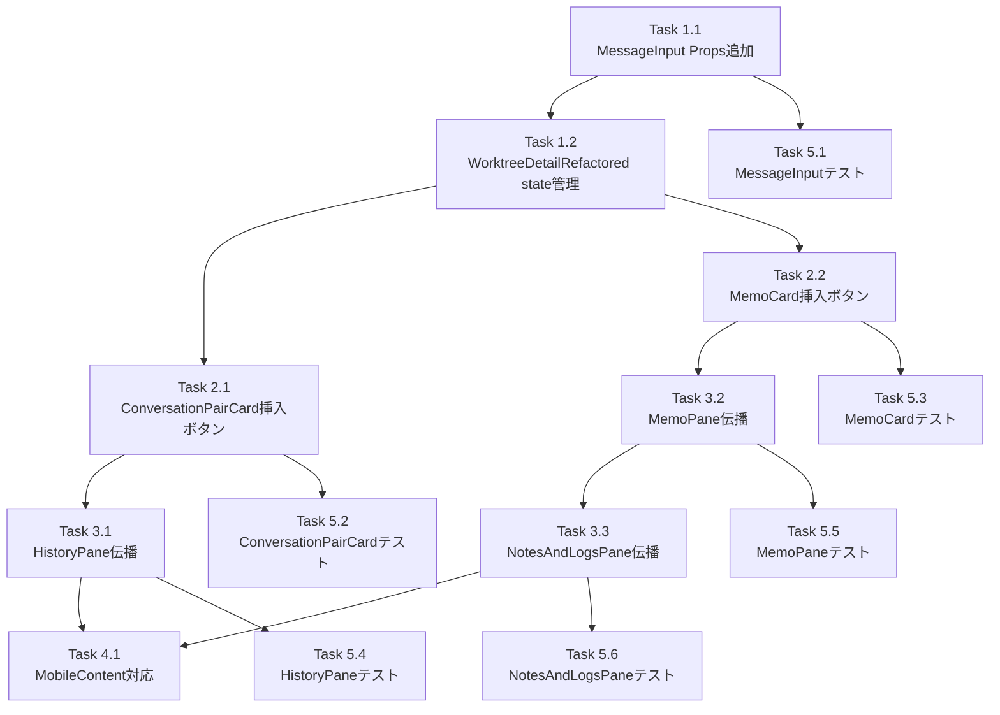

# 作業計画: Issue #485

## Issue: 履歴・メモからメッセージ入力欄への挿入機能

**Issue番号**: #485
**サイズ**: M
**優先度**: Medium
**依存Issue**: なし
**設計方針書**: `dev-reports/design/issue-485-insert-to-message-design-policy.md`

---

## 実装方針サマリー

`pendingInsertText` props パターンを採用。WorktreeDetailRefactored で state 管理し、MessageInput に props 経由で渡す。履歴とメモの各カードに「挿入ボタン」を追加し、コールバックをバケツリレーで伝播する。

---

## 詳細タスク分解

### Phase 1: コアインターフェース実装

- [ ] **Task 1.1**: MessageInput に外部テキスト挿入インターフェース追加
  - **ファイル**: `src/components/worktree/MessageInput.tsx`
  - **変更内容**:
    - `MessageInputProps` に `pendingInsertText?: string | null` と `onInsertConsumed?: () => void` を追加
    - `useEffect` を追加: pendingInsertText 消費 → 末尾追加（改行2つ区切り）→ onInsertConsumed 呼び出し
    - 前提: pendingInsertText は初回レンダリング時 null（localStorage復元 useEffect との競合なし）
  - **依存**: なし
  - **テストファイル**: `tests/unit/components/worktree/MessageInput.test.tsx`（更新）

- [ ] **Task 1.2**: WorktreeDetailRefactored に state 管理とコールバック接続
  - **ファイル**: `src/components/worktree/WorktreeDetailRefactored.tsx`
  - **変更内容**:
    - `pendingInsertText` state 追加（`useState<string | null>(null)`）
    - `handleInsertToMessage` useCallback 追加（空依存配列）
    - `handleInsertConsumed` useCallback 追加（`() => setPendingInsertText(null)`、空依存配列）
    - TODO コメント追記: `useTextInsertion` フック抽出の技術的負債
    - `leftPaneMemo` 依存配列に `handleInsertToMessage` 追加
    - `leftPaneMemo` 内の HistoryPane（historySubTab==='message'ブロック）と NotesAndLogsPane（leftPaneTab==='memo'ブロック）に `onInsertToMessage={handleInsertToMessage}` 追加
    - デスクトップ・モバイル両方の MessageInput に `pendingInsertText` と `onInsertConsumed={handleInsertConsumed}` 追加
  - **依存**: Task 1.1

### Phase 2: UI コンポーネント実装

- [ ] **Task 2.1**: ConversationPairCard に挿入ボタン追加
  - **ファイル**: `src/components/worktree/ConversationPairCard.tsx`
  - **変更内容**:
    - `ConversationPairCardProps` に `onInsertToMessage?: (content: string) => void` 追加
    - `UserMessageSection` の props に `onInsertToMessage` 追加し伝播
    - `UserMessageSection` 内に挿入ボタン追加（ArrowDownToLine アイコン、Copy ボタンの隣に配置）
  - **依存**: Task 1.2
  - **テストファイル**: `tests/unit/components/worktree/ConversationPairCard.test.tsx`（**新規作成**）

- [ ] **Task 2.2**: MemoCard に挿入ボタン追加
  - **ファイル**: `src/components/worktree/MemoCard.tsx`
  - **変更内容**:
    - `MemoCardProps` に `onInsertToMessage?: (content: string) => void` 追加
    - 既存 Copy ボタンの隣に挿入ボタン追加（ArrowDownToLine アイコン）
  - **依存**: Task 1.2
  - **テストファイル**: `tests/unit/components/worktree/MemoCard.test.tsx`（更新）

### Phase 3: コールバック伝播

- [ ] **Task 3.1**: HistoryPane コールバック伝播
  - **ファイル**: `src/components/worktree/HistoryPane.tsx`
  - **変更内容**:
    - `HistoryPaneProps` に `onInsertToMessage?: (content: string) => void` 追加
    - `ConversationPairCard` へ `onInsertToMessage={onInsertToMessage}` 伝播
  - **依存**: Task 2.1
  - **テストファイル**: `tests/unit/components/HistoryPane.test.tsx`（更新、実パス注意）

- [ ] **Task 3.2**: MemoPane コールバック伝播
  - **ファイル**: `src/components/worktree/MemoPane.tsx`
  - **変更内容**:
    - `MemoPaneProps` に `onInsertToMessage?: (content: string) => void` 追加
    - `MemoCard` へ `onInsertToMessage={onInsertToMessage}` 伝播
  - **依存**: Task 2.2
  - **テストファイル**: `tests/unit/components/worktree/MemoPane.test.tsx`（更新、MemoPaneモック修正が必要）

- [ ] **Task 3.3**: NotesAndLogsPane コールバック伝播
  - **ファイル**: `src/components/worktree/NotesAndLogsPane.tsx`
  - **変更内容**:
    - `NotesAndLogsPaneProps` に `onInsertToMessage?: (content: string) => void` 追加
    - notes サブタブの `MemoPane` 呼び出し箇所（114行目付近）に `onInsertToMessage={onInsertToMessage}` 伝播
  - **依存**: Task 3.2
  - **テストファイル**: `tests/unit/components/worktree/NotesAndLogsPane.test.tsx`（更新）

### Phase 4: モバイル対応

- [ ] **Task 4.1**: WorktreeDetailSubComponents（MobileContent）対応
  - **ファイル**: `src/components/worktree/WorktreeDetailSubComponents.tsx`
  - **変更内容**:
    - `MobileContentProps` に `onInsertToMessage?: (content: string) => void` 追加
    - `MobileContent` 内の `HistoryPane`（829行目付近）に `onInsertToMessage={onInsertToMessage}` 追加
    - `MobileContent` 内の `NotesAndLogsPane`（885行目付近）に `onInsertToMessage={onInsertToMessage}` 追加
    - `WorktreeDetailRefactored.tsx` の `MobileContent` 呼び出し箇所に `onInsertToMessage={handleInsertToMessage}` 追加
  - **依存**: Task 3.1, Task 3.3

### Phase 5: テスト

- [ ] **Task 5.1**: MessageInput テスト更新
  - **ファイル**: `tests/unit/components/worktree/MessageInput.test.tsx`
  - **テストケース**:
    - `pendingInsertText` が null の場合、既存動作に影響しないこと
    - `pendingInsertText` を渡すと末尾に追加されること（既存テキストあり: `\n\n` 区切り）
    - 入力欄が空の場合はそのまま挿入されること
    - `onInsertConsumed` が呼び出されること

- [ ] **Task 5.2**: ConversationPairCard テスト新規作成
  - **ファイル**: `tests/unit/components/worktree/ConversationPairCard.test.tsx`（**新規**）
  - **テストケース**:
    - `onInsertToMessage` 未指定時に挿入ボタンが表示されないこと
    - `onInsertToMessage` 指定時に挿入ボタンが表示されること
    - 挿入ボタンクリック時に `onInsertToMessage` が呼ばれること
    - 既存の `onCopy` 機能のテストも追加

- [ ] **Task 5.3**: MemoCard テスト更新
  - **ファイル**: `tests/unit/components/worktree/MemoCard.test.tsx`
  - **テストケース**:
    - 挿入ボタン表示・クリック時の `onInsertToMessage` 呼び出し

- [ ] **Task 5.4**: HistoryPane テスト更新
  - **ファイル**: `tests/unit/components/HistoryPane.test.tsx`（worktree/ サブディレクトリではない）
  - **テストケース**:
    - `onInsertToMessage` の ConversationPairCard への伝播

- [ ] **Task 5.5**: MemoPane テスト更新
  - **ファイル**: `tests/unit/components/worktree/MemoPane.test.tsx`
  - **テストケース**:
    - `onInsertToMessage` の MemoCard への伝播
    - MemoPane モックの更新（onInsertToMessage 受け取り対応）

- [ ] **Task 5.6**: NotesAndLogsPane テスト更新
  - **ファイル**: `tests/unit/components/worktree/NotesAndLogsPane.test.tsx`
  - **テストケース**:
    - `onInsertToMessage` の MemoPane への伝播（notes タブ）
    - MemoPane モック更新

---

## タスク依存関係

---

## 品質チェック項目

| チェック項目 | コマンド | 基準 |
|-------------|----------|------|
| ESLint | `npm run lint` | エラー0件 |
| TypeScript | `npx tsc --noEmit` | 型エラー0件 |
| Unit Test | `npm run test:unit` | 全テストパス |
| Build | `npm run build` | 成功 |

---

## 受入条件チェックリスト

- [ ] 履歴のユーザーメッセージから選択してメッセージ入力欄に挿入できること
- [ ] WorktreeMemo（Notes）から選択してメッセージ入力欄に挿入できること
- [ ] 入力欄に既存テキストがある場合、改行2つを挟んで末尾に追加されること
- [ ] 入力欄が空の場合、そのまま挿入されること
- [ ] モバイルビューでも同等に動作すること
- [ ] ユニットテストが追加されていること
- [ ] 既存の下書き保存機能と整合性があること

---

## 実装上の注意事項

1. **pendingInsertText の useCallback**: `handleInsertConsumed` は必ず `useCallback(() => setPendingInsertText(null), [])` でラップする（useEffect依存配列の安定参照が必要）
2. **TODO コメント**: `WorktreeDetailRefactored.tsx` に `useTextInsertion` フック抽出の技術的負債 TODO を追記すること
3. **MemoPane テスト**: `NotesAndLogsPane.test.tsx` の MemoPane モック更新が必要
4. **HistoryPane テストパス**: `tests/unit/components/HistoryPane.test.tsx`（worktree/ サブディレクトリではない）
5. **ArrowDownToLine**: lucide-react ^0.554.0 で使用可能（確認済み）

---

## Definition of Done

- [ ] Phase 1〜4 の全タスクが完了
- [ ] 全テストパス（`npm run test:unit`）
- [ ] TypeScript エラー 0件（`npx tsc --noEmit`）
- [ ] ESLint エラー 0件（`npm run lint`）
- [ ] 受入条件を全て満たす

---

## 次のアクション

1. TDD実装開始（`/pm-auto-dev 485`）
2. 実装完了後 PR 作成（`/create-pr`）
