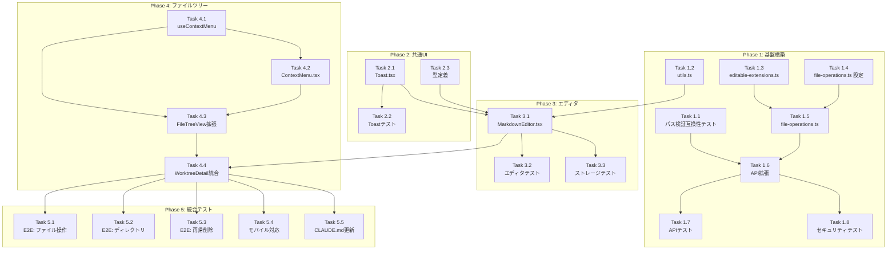

# Issue #49 作業計画書

## Issue: マークダウンエディタとビューワーを追加

**Issue番号**: #49
**サイズ**: L（Large）
**優先度**: Medium
**依存Issue**: なし

---

## 1. Issue概要

GUIからマークダウンファイルの作成・編集・管理を可能にし、ドキュメント作業の効率を向上させる。

### 主要機能
- Filesタブでのディレクトリ/ファイル操作（追加/リネーム/削除）
- マークダウンエディタ + リアルタイムプレビュー
- 表示モード切り替え（分割/エディタのみ/プレビューのみ）

### 関連ドキュメント
- 設計方針書: `dev-reports/design/issue-49-markdown-editor-design-policy.md` (v1.4)
- Issueレビュー: `dev-reports/issue/49/issue-review/summary-report.md`
- 設計レビュー: `dev-reports/issue/49/multi-stage-design-review/summary-report.md`

---

## 2. 詳細タスク分解

### Phase 1: 基盤構築（API・設定・ユーティリティ）

> **重要**: [Stage 3 MF-001対応] パス検証互換性テストを最優先で実装し、既存機能への影響がないことを確認してから後続タスクに進むこと。

| Task | 内容 | 成果物 | 依存 |
|------|------|--------|------|
| **1.1** | パス検証互換性テスト作成 [Stage 3 MF-001] | `tests/integration/path-validation-compatibility.test.ts` | なし |
| **1.2** | ユーティリティ関数作成 [MF-001] | `src/lib/utils.ts` (debounce) | なし |
| **1.3** | 編集可能拡張子設定 [SF-003] | `src/config/editable-extensions.ts` | なし |
| **1.4** | 再帰削除安全設定 [SEC-SF-004] | `src/config/file-operations.ts` | なし |
| **1.5** | ファイル操作ビジネスロジック [SF-001] | `src/lib/file-operations.ts` | 1.3, 1.4 |
| **1.6** | API拡張（PUT/POST/DELETE/PATCH） | `src/app/api/worktrees/[id]/files/[...path]/route.ts` | 1.5 |
| **1.7** | APIテスト作成 | `tests/integration/api-file-operations.test.ts` | 1.6 |
| **1.8** | セキュリティテスト作成 | `tests/integration/security.test.ts` | 1.6 |

### Phase 2: 共通UIコンポーネント

| Task | 内容 | 成果物 | 依存 |
|------|------|--------|------|
| **2.1** | Toastコンポーネント作成 | `src/components/common/Toast.tsx` | なし |
| **2.2** | Toastテスト作成 | `tests/unit/components/Toast.test.tsx` | 2.1 |
| **2.3** | 型定義ファイル作成 | `src/types/markdown-editor.ts` | なし |

### Phase 3: マークダウンエディタ

| Task | 内容 | 成果物 | 依存 |
|------|------|--------|------|
| **3.1** | MarkdownEditorコンポーネント作成 [SEC-MF-001] | `src/components/worktree/MarkdownEditor.tsx` | 1.2, 2.1, 2.3 |
| **3.2** | MarkdownEditorテスト作成 | `tests/unit/components/MarkdownEditor.test.tsx` | 3.1 |
| **3.3** | ローカルストレージ永続化テスト | `tests/unit/components/MarkdownEditor.test.tsx` (追加) | 3.1 |

### Phase 4: ファイルツリー拡張

| Task | 内容 | 成果物 | 依存 |
|------|------|--------|------|
| **4.1** | useContextMenuフック作成 [Stage 3 SF-001] | `src/hooks/useContextMenu.ts` | なし |
| **4.2** | ContextMenuコンポーネント作成 [Stage 2 SF-003] | `src/components/worktree/ContextMenu.tsx` | 4.1 |
| **4.3** | FileTreeView右クリックメニュー統合 | `src/components/worktree/FileTreeView.tsx` | 4.1, 4.2 |
| **4.4** | WorktreeDetailRefactored統合 [Stage 3 SF-004] | `src/components/worktree/WorktreeDetailRefactored.tsx` | 3.1, 4.3 |

### Phase 5: 統合・E2Eテスト

| Task | 内容 | 成果物 | 依存 |
|------|------|--------|------|
| **5.1** | E2Eテスト: ファイル作成→編集→保存 | `tests/e2e/markdown-editor.spec.ts` | Phase 1-4 |
| **5.2** | E2Eテスト: ディレクトリ操作 | `tests/e2e/file-tree-operations.spec.ts` | Phase 1-4 |
| **5.3** | E2Eテスト: 再帰削除フロー | `tests/e2e/recursive-delete.spec.ts` | Phase 1-4 |
| **5.4** | モバイルレイアウト対応 [Stage 3 NTH-003] | `WorktreeDetailRefactored.tsx` MobileContent | 4.4 |
| **5.5** | CLAUDE.md更新 [Stage 3 SF-002] | `CLAUDE.md` | Phase 1-4 |

---

## 3. タスク依存関係図

---

## 4. 新規作成ファイル一覧

| ファイル | 行数目安 | 内容 |
|----------|---------|------|
| `src/lib/utils.ts` | 30行 | debounce関数 |
| `src/config/editable-extensions.ts` | 50行 | 編集可能拡張子設定 + validateContent |
| `src/config/file-operations.ts` | 20行 | 再帰削除安全設定 |
| `src/lib/file-operations.ts` | 200行 | ファイル操作ビジネスロジック |
| `src/types/markdown-editor.ts` | 50行 | 型定義 |
| `src/components/common/Toast.tsx` | 80行 | トースト通知 |
| `src/components/worktree/MarkdownEditor.tsx` | 300行 | エディタ本体 |
| `src/components/worktree/ContextMenu.tsx` | 100行 | 右クリックメニュー |
| `src/hooks/useContextMenu.ts` | 50行 | コンテキストメニューフック |
| `tests/integration/path-validation-compatibility.test.ts` | 50行 | パス検証互換性テスト |
| `tests/integration/api-file-operations.test.ts` | 150行 | APIテスト |
| `tests/integration/security.test.ts` | 100行 | セキュリティテスト |
| `tests/unit/components/Toast.test.tsx` | 50行 | Toastテスト |
| `tests/unit/components/MarkdownEditor.test.tsx` | 100行 | エディタテスト |
| `tests/unit/lib/utils.test.ts` | 30行 | debounceテスト |

**合計**: 約1,360行の新規コード

---

## 5. 変更対象ファイル一覧

| ファイル | 現行行数 | 変更内容 | リスク |
|----------|---------|---------|--------|
| `src/app/api/worktrees/[id]/files/[...path]/route.ts` | 95行 | PUT/POST/DELETE/PATCH追加、file-operations.tsに委譲 | **高** |
| `src/components/worktree/FileTreeView.tsx` | 465行 | 右クリックメニュー追加、useContextMenu統合 | 中 |
| `src/components/worktree/WorktreeDetailRefactored.tsx` | 1300行 | md選択時エディタ表示、editorFilePath状態追加 | 低 |
| `src/lib/file-tree.ts` | 296行 | 書き込み/削除関数追加（必要に応じて） | 低 |
| `CLAUDE.md` | - | `src/components/common/`説明追加 | 低 |

---

## 6. 品質チェック項目

| チェック項目 | コマンド | 基準 |
|-------------|----------|------|
| ESLint | `npm run lint` | エラー0件 |
| TypeScript | `npx tsc --noEmit` | 型エラー0件 |
| Unit Test | `npm run test:unit` | 全テストパス、カバレッジ80%以上 |
| Integration Test | `npm run test:integration` | 全テストパス |
| Build | `npm run build` | 成功 |

---

## 7. セキュリティチェックリスト

実装時に以下のセキュリティ対策を確認すること：

### XSS対策 [SEC-MF-001]
- [ ] MarkdownEditor.tsxでrehype-sanitizeを統合
- [ ] dangerouslySetInnerHTMLを使用しない
- [ ] XSSテストケースを追加

### パストラバーサル対策
- [ ] isPathSafe()を一貫して使用 [SF-002]
- [ ] リネーム操作のnewName検証 [SEC-SF-003]
- [ ] URLエンコードされたパスの挙動テスト [Stage 3 MF-001]

### 再帰削除の安全ガード [SEC-SF-004]
- [ ] .gitディレクトリの保護
- [ ] 削除上限設定（MAX_RECURSIVE_DELETE_FILES: 100）
- [ ] 保護ディレクトリテストケース

### エラーレスポンス [SEC-SF-002]
- [ ] 絶対パスを含めない
- [ ] 本番環境でスタックトレース抑制

### コンテンツバリデーション [SEC-SF-001]
- [ ] バイナリデータ検出（NULL文字チェック）
- [ ] 制御文字警告

---

## 8. 実装チェックリスト（Phase別）

### Phase 1 完了条件
- [ ] パス検証互換性テストがパス
- [ ] URLエンコードされたパスの挙動確認済み
- [ ] file-operations.tsの全関数実装
- [ ] API（PUT/POST/DELETE/PATCH）動作確認
- [ ] APIテスト・セキュリティテストがパス

### Phase 2 完了条件
- [ ] Toastコンポーネント動作確認
- [ ] 成功/エラー表示、自動消去（3秒）
- [ ] 型定義ファイル完成

### Phase 3 完了条件
- [ ] MarkdownEditor動作確認
- [ ] 表示モード切替（分割/エディタのみ/プレビューのみ）
- [ ] ローカルストレージ永続化
- [ ] rehype-sanitize統合済み
- [ ] デバウンス処理（300ms）動作確認

### Phase 4 完了条件
- [ ] 右クリックメニュー動作確認
- [ ] ファイル/ディレクトリ追加・リネーム・削除
- [ ] FileViewerとの競合なし確認

### Phase 5 完了条件
- [ ] 全E2Eテストがパス
- [ ] モバイルレイアウト動作確認
- [ ] CLAUDE.md更新完了

---

## 9. Definition of Done

Issue完了条件：

- [ ] すべてのタスクが完了
- [ ] 単体テストカバレッジ80%以上
- [ ] CIチェック全パス（lint, type-check, test, build）
- [ ] コードレビュー承認
- [ ] セキュリティチェックリスト全項目確認
- [ ] ドキュメント更新完了（CLAUDE.md）
- [ ] 受け入れ条件（Issue記載の14項目）すべて満たす

---

## 10. 次のアクション

作業計画承認後：

1. **ブランチ作成**: `feature/49-markdown-editor`
2. **タスク実行**: Phase 1から順次実装
3. **進捗報告**: `/progress-report`で定期報告
4. **PR作成**: `/create-pr`で自動作成

---

## 更新履歴

| 日付 | バージョン | 内容 |
|------|----------|------|
| 2026-01-30 | 1.0 | 初版作成（設計方針書v1.4ベース） |
