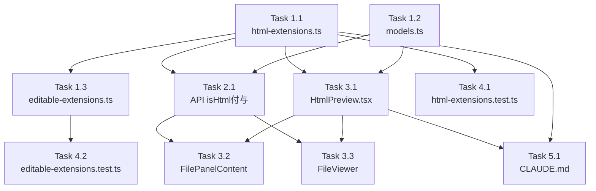

# Issue #490 作業計画書

## Issue概要
**タイトル**: ファイル内容表示にてhtmlファイル レンダリング
**Issue番号**: #490
**サイズ**: M
**優先度**: Medium
**依存Issue**: なし

---

## 詳細タスク分解

### Phase 1: 基盤実装

- [ ] **Task 1.1**: HTML拡張子設定ファイル新規作成
  - 成果物: `src/config/html-extensions.ts`
  - 内容:
    - `HTML_EXTENSIONS: readonly string[]`（`.html`, `.htm`）
    - `HTML_MAX_SIZE_BYTES = 5 * 1024 * 1024`（5MB）
    - `isHtmlExtension(ext: string): boolean`（`normalizeExtension`を`image-extensions.ts`から`import`して使用）
    - `SandboxLevel = 'safe' | 'interactive'`型（DR1-001: DRY - Single Source of Truth）
    - `SANDBOX_ATTRIBUTES: Record<SandboxLevel, string>`（2段階のみ - DR1-003: YAGNI）
  - 依存: なし

- [ ] **Task 1.2**: 型定義更新
  - 成果物: `src/types/models.ts`
  - 内容: `FileContent`インターフェースに`isHtml?: boolean`追加（既存の`isImage`/`isVideo`パターンに準拠）
  - 注意: JSDocコメントを `/** Whether the file is an HTML file (optional, for HTML files) - Issue #490 */` 形式で統一
  - 依存: なし

- [ ] **Task 1.3**: 編集可能拡張子設定更新
  - 成果物: `src/config/editable-extensions.ts`
  - 内容:
    - JSDocを「ブラウザ上で編集・保存可能なファイル拡張子（PUT APIの書き込み許可リスト）」に更新（DR1-004）
    - `EDITABLE_EXTENSIONS`に`.html`, `.htm`を追加（アトミックに）
    - `EXTENSION_VALIDATORS`にHTMLエントリ追加（maxFileSize: `HTML_MAX_SIZE_BYTES`、`additionalValidation: undefined`）
    - `HTML_MAX_SIZE_BYTES`は`html-extensions.ts`からimport
  - 依存: Task 1.1

- [ ] **Task 1.4**: CSP設定更新
  - 成果物: `next.config.js`
  - 内容: CSPヘッダーに`"frame-src 'self'"`を追加（DR4-007: blob:なし）
  - 注意: `frame-src 'self'`追加後も既存MARPプレビューへの影響なし（`X-Frame-Options: DENY`はsrcdocに影響しない）
  - 依存: なし

### Phase 2: APIルート実装

- [ ] **Task 2.1**: ファイル取得APIにisHtmlフラグ追加
  - 成果物: `src/app/api/worktrees/[id]/files/[...path]/route.ts`
  - 内容:
    - `isHtmlExtension`を`html-extensions.ts`からimport
    - HTMLファイル専用パス：`fileStat.size`で5MBサイズ事前チェック（DR4-004）
    - 既存のテキスト読み込みパスにフォールスルーし、`NextResponse.json`のレスポンスオブジェクトに`isHtml: isHtmlExtension(extension)`を追加
    - 既存の`isImageExtension()`/`isVideoExtension()`分岐の後、通常テキスト分岐の前に挿入
  - 依存: Task 1.1, Task 1.2

### Phase 3: UIコンポーネント実装

- [ ] **Task 3.1**: HtmlPreviewコンポーネント新規作成
  - 成果物: `src/components/worktree/HtmlPreview.tsx`
  - 内容:
    - `SandboxLevel`/`SANDBOX_ATTRIBUTES`を`html-extensions.ts`からimport（再定義しない - DR1-001）
    - `HtmlViewMode = 'source' | 'preview' | 'split'`型（コンポーネントローカル定義）
    - `HtmlPreviewProps`インターフェース
    - トップバー: ViewMode切り替え（Source/Preview/Split）+ SandboxLevel切り替え（Safe/Interactive）
    - ソースビュー: 既存`CodeViewer`パターン（シンタックスハイライト）
    - プレビュービュー: `<iframe srcDoc={htmlContent} sandbox={sandboxAttr} title={...} />`
    - **Interactiveモード切り替え時に確認ダイアログ表示**（DR4-002）
    - onDirtyChangeコールバックで`useFileContentPolling`と連携（DR3-003）
  - 依存: Task 1.1, Task 1.2

- [ ] **Task 3.2**: FilePanelContent.tsxにHTML分岐追加（PC版）
  - 成果物: `src/components/worktree/FilePanelContent.tsx`
  - 内容:
    - `HtmlPreview`を`next/dynamic`で動的import
    - isVideo分岐の後、md分岐の前に`content.isHtml`分岐を挿入（DR3-005: フラグ優先）
    - `MaximizableWrapper`内で`HtmlPreview`をレンダリング
    - `copyableContent`にはHTMLソース（`content.content`）を指定
  - 依存: Task 3.1, Task 2.1

- [ ] **Task 3.3**: FileViewer.tsxにHTML分岐追加（モバイル版）
  - 成果物: `src/components/worktree/FileViewer.tsx`
  - 内容:
    - `isHtml`フラグによる分岐を`renderContent()`内に追加
    - `codeViewData` useMemoのガード条件に`!content.isHtml`を追加（DR2-002）
    - `canCopy`判定に`isHtml`除外を追加
    - モバイル版はタブ切り替え（ソース/プレビュー）で実装（分割表示なし）
    - タブ切り替えUIを新規実装（MobileTabBarパターン参照）
  - 依存: Task 3.1, Task 2.1

### Phase 4: テスト実装（TDD準拠）

- [ ] **Task 4.1**: html-extensions.tsのユニットテスト
  - 成果物: `tests/unit/config/html-extensions.test.ts`
  - テストケース:
    - `isHtmlExtension('.html')` → true
    - `isHtmlExtension('.htm')` → true
    - `isHtmlExtension('.HTML')` → true（大文字正規化）
    - `isHtmlExtension('html')` → false（ドットなし）
    - `isHtmlExtension('.md')` → false
    - `HTML_MAX_SIZE_BYTES === 5 * 1024 * 1024`
    - `SANDBOX_ATTRIBUTES.safe === ''`
    - `SANDBOX_ATTRIBUTES.interactive === 'allow-scripts'`
    - `Object.keys(SANDBOX_ATTRIBUTES).length === 2`（Fullなし確認）
  - 依存: Task 1.1

- [ ] **Task 4.2**: editable-extensions.tsの既存テスト更新
  - 成果物: `tests/unit/config/editable-extensions.test.ts`
  - 内容:
    - 既存の`EDITABLE_EXTENSIONS.length === 1`をlength 3に更新（または配列内容チェックに変更）
    - `.html`, `.htm`が`isEditableExtension()`でtrueを返すテスト追加
    - `.html`で`validateContent()`が5MB以内でvalidを返すテスト追加
    - `isEditableExtension('html')`（ドットなし）がfalseを返すテスト追加（DR3-004）
    - NULLバイト拒否テスト（`.html`用）追加
  - 依存: Task 1.3

### Phase 5: CLAUDE.md更新

- [ ] **Task 5.1**: CLAUDE.mdのモジュール一覧に新規ファイルを追加
  - 成果物: `CLAUDE.md`
  - 内容:
    - `src/config/html-extensions.ts`: HTML拡張子定義・判定・サンドボックスレベル
    - `src/components/worktree/HtmlPreview.tsx`: HTMLプレビューコンポーネント（Issue #490）
  - 依存: Task 1.1, Task 3.1

---

## タスク依存関係

---

## 品質チェック項目

| チェック項目 | コマンド | 基準 |
|-------------|----------|------|
| ESLint | `npm run lint` | エラー0件 |
| TypeScript | `npx tsc --noEmit` | 型エラー0件 |
| Unit Test | `npm run test:unit` | 全テストパス |
| Build | `npm run build` | 成功 |

---

## Definition of Done

- [ ] すべてのタスク完了
- [ ] `npm run lint` エラー0件
- [ ] `npx tsc --noEmit` 型エラー0件
- [ ] `npm run test:unit` 全テストパス
- [ ] PC版・モバイル版両方でHTMLプレビューが動作
- [ ] Interactiveモード切り替え時に確認ダイアログが表示される
- [ ] CLAUDE.md更新完了

---

## 実装チェックリスト（設計方針書より）

- [ ] DR1-001: `SandboxLevel`型と`SANDBOX_ATTRIBUTES`は`html-extensions.ts`のみで定義し、`HtmlPreview.tsx`では`import`する
- [ ] DR1-002: `isHtmlExtension`の実装で`normalizeExtension`（from image-extensions.ts）を再利用
- [ ] DR1-003: `SANDBOX_ATTRIBUTES`は`safe`と`interactive`の2エントリのみ（fullなし）
- [ ] DR4-002: Interactiveモード切り替え時にconfirmダイアログ表示
- [ ] DR4-007: CSPは`frame-src 'self'`（blob:なし）
