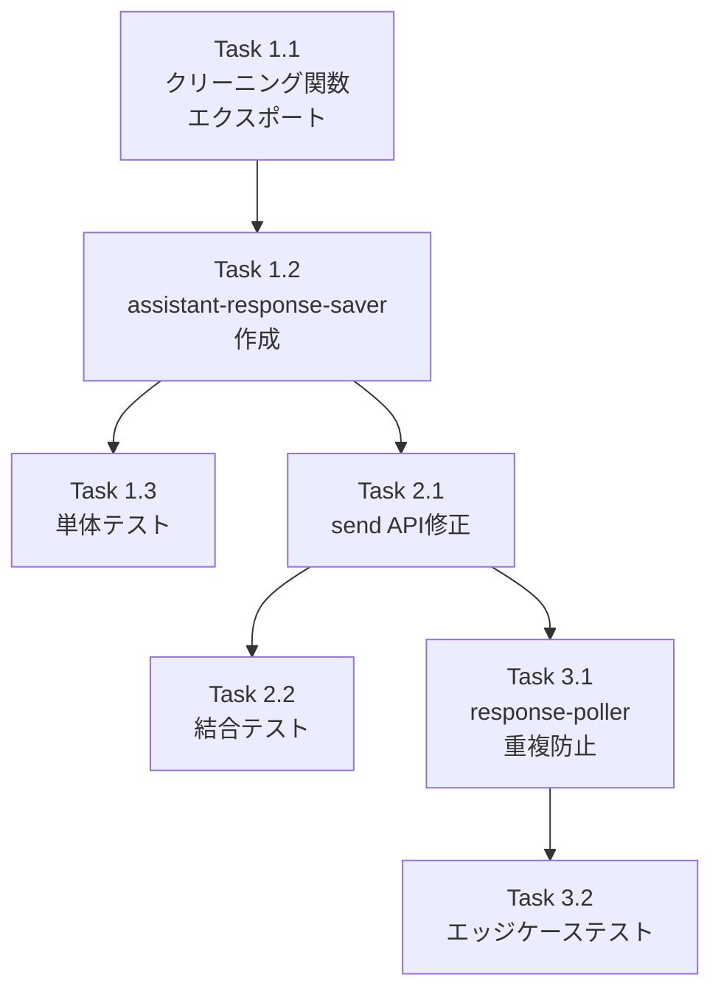

# 作業計画書: Issue #53

## Issue概要

| 項目 | 内容 |
|------|------|
| **Issue番号** | #53 |
| **タイトル** | fix: Assistant応答の保存ロジックを「次のユーザー入力まで」方式に変更 |
| **サイズ** | M（中規模） |
| **優先度** | High |
| **関連Issue** | #51 |

### 要約
Assistant（Claude CLI）の応答履歴が保存されないバグを修正する。現在の「完了判定ポーリング」方式から「次のユーザー入力トリガー」方式に変更し、確実にAssistant応答を保存する。

---

## 詳細タスク分解

### Phase 1: 基盤実装

#### Task 1.1: クリーニング関数のエクスポート
- **成果物**: `src/lib/response-poller.ts`（修正）
- **依存**: なし
- **作業内容**:
  - `cleanClaudeResponse()`をエクスポート可能にする
  - `cleanGeminiResponse()`をエクスポート可能にする
  - または共通モジュール`src/lib/cli-response-cleaner.ts`に分離

```typescript
// エクスポート対象
export function cleanClaudeResponse(response: string): string;
export function cleanGeminiResponse(response: string): string;
export function cleanCliResponse(output: string, cliToolId: CLIToolType): string;
```

#### Task 1.2: Assistant応答保存モジュール作成
- **成果物**: `src/lib/assistant-response-saver.ts`（新規）
- **依存**: Task 1.1
- **作業内容**:
  - `savePendingAssistantResponse()`関数の実装
  - 重複保存防止ロジック（`currentLineCount <= lastCapturedLine`チェック）
  - タイムスタンプ整合性（`userMessageTimestamp - 1ms`）

```typescript
export async function savePendingAssistantResponse(
  db: Database.Database,
  worktreeId: string,
  cliToolId: CLIToolType,
  userMessageTimestamp: Date
): Promise<ChatMessage | null>;
```

#### Task 1.3: 単体テスト作成（Phase 1）
- **成果物**: `__tests__/lib/assistant-response-saver.test.ts`（新規）
- **依存**: Task 1.2
- **作業内容**:
  - 基本保存機能のテスト
  - 重複保存防止のテスト
  - タイムスタンプ整合性のテスト
  - エラーハンドリングのテスト

---

### Phase 2: API統合

#### Task 2.1: send APIの修正
- **成果物**: `src/app/api/worktrees/[id]/send/route.ts`（修正）
- **依存**: Task 1.2
- **作業内容**:
  - `savePendingAssistantResponse()`の呼び出し追加
  - タイムスタンプの事前生成
  - セッション状態更新ロジックの修正（リセット→更新）

```typescript
// 変更箇所（99-120行目付近）
const userMessageTimestamp = new Date();
await savePendingAssistantResponse(db, params.id, cliToolId, userMessageTimestamp);
const message = createMessage(db, { ..., timestamp: userMessageTimestamp });
// updateSessionState(db, params.id, cliToolId, 0);  // 削除
const currentLineCount = await getCurrentLineCount(params.id, cliToolId);
updateSessionState(db, params.id, cliToolId, currentLineCount);
```

#### Task 2.2: 結合テスト作成
- **成果物**: `__tests__/integration/message-flow.test.ts`（新規または追加）
- **依存**: Task 2.1
- **作業内容**:
  - 連続メッセージ送信テスト
  - 競合テスト（savePending vs poller）
  - 時系列順序テスト

---

### Phase 3: 重複防止

#### Task 3.1: response-pollerの修正
- **成果物**: `src/lib/response-poller.ts`（修正）
- **依存**: Task 2.1
- **作業内容**:
  - `checkForResponse()`に重複保存防止チェック追加
  - 競合防止のための再チェックロジック

```typescript
// checkForResponse()内に追加
if (result.lineCount <= lastCapturedLine) {
  return false;  // 既に保存済み
}

// 保存前の再チェック
const currentSessionState = getSessionState(db, worktreeId, cliToolId);
if (currentSessionState && result.lineCount <= currentSessionState.lastCapturedLine) {
  return false;  // 競合検出
}
```

#### Task 3.2: エッジケーステスト
- **成果物**: `__tests__/lib/assistant-response-saver.edge-cases.test.ts`（新規）
- **依存**: Task 3.1
- **作業内容**:
  - tmuxバッファリセットのテスト
  - プロンプト応答後のテスト
  - 高速連続送信のテスト

---

## タスク依存関係



---

## 成果物一覧

### 新規作成ファイル

| ファイル | 説明 |
|----------|------|
| `src/lib/assistant-response-saver.ts` | Assistant応答保存ロジック |
| `__tests__/lib/assistant-response-saver.test.ts` | 単体テスト |
| `__tests__/lib/assistant-response-saver.edge-cases.test.ts` | エッジケーステスト |
| `__tests__/integration/message-flow.test.ts` | 結合テスト（または追加） |

### 修正ファイル

| ファイル | 変更内容 |
|----------|---------|
| `src/lib/response-poller.ts` | クリーニング関数エクスポート、重複防止 |
| `src/app/api/worktrees/[id]/send/route.ts` | 保存ロジック組み込み |

---

## 品質チェック項目

| チェック項目 | コマンド | 基準 |
|-------------|----------|------|
| ESLint | `npm run lint` | エラー0件 |
| TypeScript | `npx tsc --noEmit` | 型エラー0件 |
| Unit Test | `npm run test:unit` | 全テストパス |
| Integration Test | `npm run test:integration` | 全テストパス |
| Build | `npm run build` | 成功 |

---

## 実装順序とチェックポイント

### Checkpoint 1: Phase 1完了後
- [ ] `assistant-response-saver.ts`が作成されている
- [ ] クリーニング関数がエクスポートされている
- [ ] 単体テストが全てパス
- [ ] `npm run lint` エラー0件
- [ ] `npx tsc --noEmit` エラー0件

### Checkpoint 2: Phase 2完了後
- [ ] send APIが修正されている
- [ ] 結合テストが全てパス
- [ ] 手動テスト: 連続メッセージ送信でAssistant応答が保存される

### Checkpoint 3: Phase 3完了後
- [ ] response-pollerに重複防止が追加されている
- [ ] エッジケーステストが全てパス
- [ ] `npm run build` 成功

---

## Definition of Done

Issue #53の完了条件：

### 必須
- [ ] すべてのタスク（Task 1.1〜3.2）が完了
- [ ] 単体テストカバレッジ80%以上
- [ ] CIチェック全パス（lint, type-check, test, build）
- [ ] 手動テスト合格

### 受け入れ条件（Issue記載）
- [ ] ユーザーが連続でメッセージを送信しても、各userメッセージに対応するassistantメッセージが保存される
- [ ] 履歴表示で「Waiting for response」が不適切に表示されない
- [ ] 既存のリアルタイム表示（current-output API）は維持される
- [ ] 単体テストが追加されている

---

## 次のアクション

作業計画承認後：

1. **ブランチ作成**
   ```bash
   git checkout -b fix/53-assistant-response-save
   ```

2. **タスク実行**: Phase 1 → Phase 2 → Phase 3の順序で実装

3. **進捗報告**: 各Phase完了時に `/progress-report` で報告

4. **PR作成**: 全Phase完了後に `/create-pr` で自動作成

---

## 関連ドキュメント

- [設計方針書](../design/issue53-assistant-response-save-design-policy.md)
- [アーキテクチャレビュー](../review/20260115-230823-architecture-review-issue53.md)
