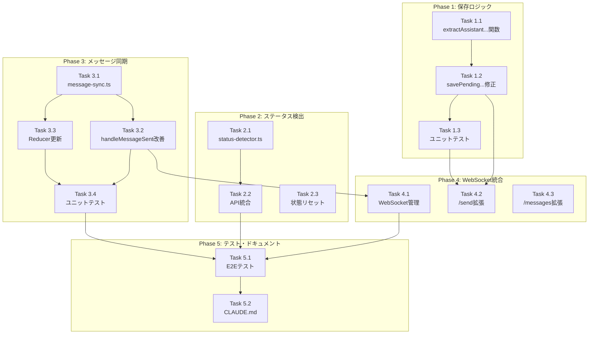

# 作業計画書: Issue #54 セッション状態管理の改善

## Issue概要

| 項目 | 内容 |
|------|------|
| **Issue番号** | #54 |
| **タイトル** | セッションが切り替わるとステータス管理がうまくいかなくなる |
| **サイズ** | L（Large） |
| **優先度** | High |
| **依存Issue** | なし |

### 症状

1. 処理中にもかかわらず緑（ready）が点灯する
2. yes/noの指示があるにもかかわらず、それに対する応答ができない
3. Assistant履歴が正しく更新されない
4. Assistant応答がDBに保存されない

### 根本原因

- レースコンディション（フロントエンド状態更新とバックエンドDB保存のタイミングずれ）
- `cleanClaudeResponse()`のロジック問題（最後のプロンプト以降のみ抽出）

---

## 詳細タスク分解

### Phase 1: 保存ロジックの修正（優先度最高）

- [ ] **Task 1.1**: `extractAssistantResponseBeforeLastPrompt()`関数の実装
  - 成果物: `src/lib/assistant-response-saver.ts`
  - 依存: なし
  - 内容:
    - 最後のユーザープロンプト**以前**の内容を抽出する新関数
    - `CLAUDE_SKIP_PATTERNS`によるフィルタリング
    - CLIツール別の処理分岐

- [ ] **Task 1.2**: `savePendingAssistantResponse()`の修正
  - 成果物: `src/lib/assistant-response-saver.ts`
  - 依存: Task 1.1
  - 内容:
    - `cleanCliResponse()`の呼び出しを`extractAssistantResponseBeforeLastPrompt()`に置換
    - エラーハンドリングの改善

- [ ] **Task 1.3**: 保存ロジックのユニットテスト
  - 成果物: `src/lib/__tests__/assistant-response-saver.test.ts`
  - 依存: Task 1.2
  - カバレッジ目標: 80%以上

### Phase 2: ステータス検出の改善

- [ ] **Task 2.1**: `status-detector.ts`の新規作成
  - 成果物: `src/lib/status-detector.ts`
  - 依存: なし
  - 内容:
    - `detectSessionStatus()`関数の実装
    - 信頼度レベル（high/low）の導入
    - 出力経過時間のチェック追加

- [ ] **Task 2.2**: APIへのステータス検出統合
  - 成果物: `src/app/api/worktrees/route.ts`, `src/app/api/worktrees/[id]/route.ts`
  - 依存: Task 2.1
  - 内容:
    - 既存のステータス検出ロジックを`status-detector.ts`に移行
    - 信頼度の低い場合の処理追加

- [ ] **Task 2.3**: セッション切り替え時の状態リセット
  - 成果物: `src/components/worktree/WorktreeDetailRefactored.tsx`
  - 依存: なし
  - 内容:
    - `worktreeId`変更時に状態をクリア
    - `clearPrompt()`、`setMessages([])`の呼び出し

### Phase 3: メッセージ同期の改善

- [ ] **Task 3.1**: `message-sync.ts`の新規作成
  - 成果物: `src/lib/message-sync.ts`
  - 依存: なし
  - 内容:
    - `mergeMessages()`関数（重複排除、ソート）
    - `MAX_MESSAGES`定数（200件上限）
    - 楽観的更新ユーティリティ

- [ ] **Task 3.2**: `handleMessageSent()`の改善
  - 成果物: `src/components/worktree/WorktreeDetailRefactored.tsx`
  - 依存: Task 3.1
  - 内容:
    - 楽観的UI更新の実装
    - ロールバック機構の追加
    - `fetchMessages()`直接呼び出しの削除

- [ ] **Task 3.3**: useWorktreeUIStateのReducer更新
  - 成果物: `src/hooks/useWorktreeUIState.ts`
  - 依存: Task 3.1
  - 内容:
    - `ADD_OPTIMISTIC_MESSAGE`アクション追加
    - `CONFIRM_MESSAGE`アクション追加
    - `REMOVE_MESSAGE`アクション追加
    - `MERGE_MESSAGES`アクション追加

- [ ] **Task 3.4**: メッセージ同期のユニットテスト
  - 成果物: `src/lib/__tests__/message-sync.test.ts`
  - 依存: Task 3.1
  - カバレッジ目標: 80%以上

### Phase 4: WebSocket統合

- [ ] **Task 4.1**: WebSocket接続管理の実装
  - 成果物: `src/components/worktree/WorktreeDetailRefactored.tsx`
  - 依存: Task 3.2
  - 内容:
    - WebSocket接続/切断の管理
    - ポーリングへのフォールバック
    - 再接続ロジック（最大5回）

- [ ] **Task 4.2**: `/send`エンドポイントのレスポンス拡張
  - 成果物: `src/app/api/worktrees/[id]/send/route.ts`
  - 依存: Task 1.2
  - 内容:
    - `assistantMessage`フィールドの追加
    - レスポンス型の更新

- [ ] **Task 4.3**: `/messages`エンドポイントの`after`パラメータ対応
  - 成果物: `src/app/api/worktrees/[id]/messages/route.ts`
  - 依存: なし
  - 内容:
    - `after`クエリパラメータの追加
    - `limit`パラメータの追加（デフォルト50、最大200）

### Phase 5: テストとドキュメント

- [ ] **Task 5.1**: E2Eテストの追加
  - 成果物: `tests/e2e/session-state.spec.ts`
  - 依存: Phase 1-4完了
  - 内容:
    - セッション切り替えシナリオ
    - メッセージ送信・保存シナリオ
    - WebSocket切断時のフォールバックシナリオ

- [ ] **Task 5.2**: CLAUDE.md更新
  - 成果物: `CLAUDE.md`
  - 依存: Phase 5.1
  - 内容:
    - 新機能の説明追加
    - 関連モジュールの説明更新

---

## タスク依存関係

---

## 実装順序（推奨）

| 順序 | タスク | 理由 |
|------|--------|------|
| 1 | Task 1.1 | 最も影響の大きい保存ロジックの修正 |
| 2 | Task 1.2 | Task 1.1の統合 |
| 3 | Task 1.3 | 保存ロジックのテスト |
| 4 | Task 3.1 | メッセージ同期ユーティリティ（並行可） |
| 5 | Task 2.1 | ステータス検出（並行可） |
| 6 | Task 2.2, 2.3, 3.2, 3.3 | 統合作業（並行可） |
| 7 | Task 3.4 | メッセージ同期テスト |
| 8 | Task 4.1, 4.2, 4.3 | WebSocket統合 |
| 9 | Task 5.1 | E2Eテスト |
| 10 | Task 5.2 | ドキュメント更新 |

---

## 品質チェック項目

| チェック項目 | コマンド | 基準 |
|-------------|----------|------|
| ESLint | `npm run lint` | エラー0件 |
| TypeScript | `npx tsc --noEmit` | 型エラー0件 |
| Unit Test | `npm run test:unit` | 全テストパス |
| Integration Test | `npm run test:integration` | 全テストパス |
| Build | `npm run build` | 成功 |

---

## 成果物チェックリスト

### コード（新規作成）

- [ ] `src/lib/status-detector.ts`
- [ ] `src/lib/message-sync.ts`

### コード（変更）

- [ ] `src/lib/assistant-response-saver.ts`
- [ ] `src/app/api/worktrees/route.ts`
- [ ] `src/app/api/worktrees/[id]/route.ts`
- [ ] `src/app/api/worktrees/[id]/send/route.ts`
- [ ] `src/app/api/worktrees/[id]/messages/route.ts`
- [ ] `src/components/worktree/WorktreeDetailRefactored.tsx`
- [ ] `src/hooks/useWorktreeUIState.ts`

### テスト

- [ ] `src/lib/__tests__/assistant-response-saver.test.ts`
- [ ] `src/lib/__tests__/message-sync.test.ts`
- [ ] `tests/e2e/session-state.spec.ts`

### ドキュメント

- [ ] `CLAUDE.md`更新

---

## Definition of Done

Issue完了条件：

- [ ] すべてのタスク（Task 1.1〜5.2）が完了
- [ ] 単体テストカバレッジ80%以上（新規コード）
- [ ] CIチェック全パス（lint, type-check, test, build）
- [ ] E2Eテストでセッション切り替え・メッセージ保存シナリオがパス
- [ ] コードレビュー承認
- [ ] CLAUDE.md更新完了

---

## リスクと対策

| リスク | 影響度 | 対策 |
|--------|--------|------|
| 既存`response-poller`への影響 | 高 | `cleanClaudeResponse()`は変更せず新関数を追加 |
| WebSocket切断時のデータロス | 中 | フォールバックポーリングで対応 |
| メモリリーク | 中 | MAX_MESSAGES=200で上限設定 |
| コードブロック内❯の誤認識 | 低 | 発生頻度が低いため優先度を下げる |

---

## 次のアクション

作業計画承認後：

1. **ブランチ作成**: `feature/54-session-state-management`
2. **Phase 1実行**: TDDで保存ロジック修正
   - `/tdd-impl`を使用
3. **Phase 2-4実行**: 段階的に実装
4. **Phase 5実行**: E2Eテスト・ドキュメント
5. **PR作成**: `/create-pr`で自動作成

---

## 関連ドキュメント

- [設計方針書](../../design/issue54-session-state-management-design-policy.md)
- [アーキテクチャレビュー](../../review/20260116-issue54-architecture-review.md)
- [Issue #53 設計方針書](../../design/issue53-assistant-response-save-design-policy.md)

---

## 作業見積もり

| Phase | タスク数 | 複雑度 |
|-------|---------|--------|
| Phase 1 | 3 | M |
| Phase 2 | 3 | S |
| Phase 3 | 4 | M |
| Phase 4 | 3 | M |
| Phase 5 | 2 | S |
| **合計** | **15** | **L** |
