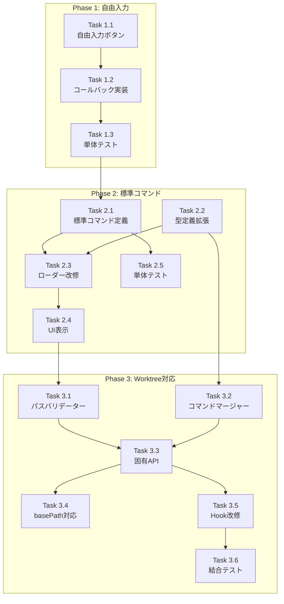

# 作業計画書: Issue #56

## Issue概要

| 項目 | 内容 |
|------|------|
| **Issue番号** | #56 |
| **タイトル** | claude code標準搭載のスラッシュコマンドを利用出来るようにする |
| **サイズ** | M（中規模） |
| **優先度** | High |
| **依存Issue** | なし |

### 要件
1. Claude Code標準スラッシュコマンド（`/clear`, `/compact`等）をUI上で利用可能にする
2. 最新のClaude Code機能をフル活用したい
3. **制約**: 標準機能が追加された際、自動で対応

### 追加要件（調査で判明）
- モバイルUIで自由入力が困難 → 自由入力モード追加
- 対象worktreeのコマンドがUIに表示されない → worktree固有API追加

---

## 設計ドキュメント

| ドキュメント | パス |
|-------------|------|
| 設計方針書 | `dev-reports/design/issue-56-design-policy.md` |
| アーキテクチャレビュー | `dev-reports/review/20260125-132343-architecture-review.md` |
| 調査詳細 | `dev-reports/design/issue-56/` |

### 承認状況
- **設計レビュー**: ✅ 条件付き承認（2026-01-25）
- **承認条件**: MF-1, SF-1 → ✅ 設計書に反映済み

---

## 実装フェーズ

### Phase 1: 自由入力モード（優先度: 高）

**目的**: 任意のコマンドを入力可能にし、「自動対応」要件を満たす

#### Task 1.1: SlashCommandSelector自由入力ボタン追加

| 項目 | 内容 |
|------|------|
| 成果物 | `src/components/worktree/SlashCommandSelector.tsx` |
| 工数 | 小（1-2時間） |
| 依存 | なし |

**実装内容**:
```typescript
// 自由入力ボタンをコマンドリストの上部に追加
<button onClick={onFreeInput}>
  🔤 その他のコマンドを入力...
</button>
```

**変更箇所**:
- `SlashCommandSelectorProps` に `onFreeInput: () => void` 追加
- モバイル・デスクトップ両方で表示

#### Task 1.2: MessageInput自由入力コールバック実装

| 項目 | 内容 |
|------|------|
| 成果物 | `src/components/worktree/MessageInput.tsx` |
| 工数 | 小（1時間） |
| 依存 | Task 1.1 |

**実装内容**:
```typescript
const handleFreeInput = () => {
  setShowCommandSelector(false);
  setMessage('/');
  textareaRef.current?.focus();
};
```

#### Task 1.3: 単体テスト追加

| 項目 | 内容 |
|------|------|
| 成果物 | `tests/unit/components/worktree/SlashCommandSelector.test.tsx` |
| 工数 | 小（1時間） |
| 依存 | Task 1.1, 1.2 |

**テストケース**:
- [ ] 自由入力ボタンが表示される
- [ ] クリックでonFreeInputが呼ばれる
- [ ] モバイル・デスクトップ両方で動作

---

### Phase 2: 標準コマンド表示（優先度: 高）

**目的**: よく使う標準コマンドを発見しやすくする

#### Task 2.1: 標準コマンド定義ファイル作成

| 項目 | 内容 |
|------|------|
| 成果物 | `src/lib/standard-commands.ts` |
| 工数 | 小（1時間） |
| 依存 | なし |

**実装内容**:
```typescript
export const STANDARD_COMMANDS: SlashCommand[] = [
  { name: 'clear', description: '会話履歴をクリア', category: 'standard-session', isStandard: true },
  { name: 'compact', description: 'コンテキストを圧縮', category: 'standard-session', isStandard: true },
  // ... 16個の主要コマンド
];

export const FREQUENTLY_USED = ['clear', 'compact', 'status', 'help', 'review'];
```

#### Task 2.2: 型定義拡張

| 項目 | 内容 |
|------|------|
| 成果物 | `src/types/slash-commands.ts` |
| 工数 | 小（30分） |
| 依存 | なし |

**変更内容**:
- `SlashCommandCategory` に標準カテゴリ追加
- `SlashCommand` に `isStandard`, `source` フィールド追加
- `CATEGORY_LABELS` に日本語ラベル追加

#### Task 2.3: コマンドローダー改修

| 項目 | 内容 |
|------|------|
| 成果物 | `src/lib/slash-commands.ts` |
| 工数 | 小（1時間） |
| 依存 | Task 2.1, 2.2 |

**変更内容**:
- 標準コマンドとカスタムコマンドのマージ
- Frontmatter `category` の読み取り対応

#### Task 2.4: UIでの標準コマンド表示

| 項目 | 内容 |
|------|------|
| 成果物 | `src/components/worktree/SlashCommandList.tsx` |
| 工数 | 中（2時間） |
| 依存 | Task 2.3 |

**変更内容**:
- 「よく使う」カテゴリを上部に表示
- 「標準（その他）」を折りたたみ可能に

#### Task 2.5: 単体テスト追加

| 項目 | 内容 |
|------|------|
| 成果物 | `tests/unit/lib/standard-commands.test.ts` |
| 工数 | 小（1時間） |
| 依存 | Task 2.1 |

**テストケース**:
- [ ] STANDARD_COMMANDSが正しい構造を持つ
- [ ] FREQUENTLY_USEDが存在するコマンド名のみ含む
- [ ] 全コマンドにisStandard: trueが設定されている

---

### Phase 3: Worktree固有コマンド対応（優先度: 中）

**目的**: 対象リポジトリのコマンドをUIに表示

#### Task 3.1: パスバリデーター作成（MF-1: 必須）

| 項目 | 内容 |
|------|------|
| 成果物 | `src/lib/path-validator.ts` |
| 工数 | 小（1時間） |
| 依存 | なし |

**実装内容**:
```typescript
export function isValidWorktreePath(path: string): boolean {
  if (!path || path.includes('..') || !path.startsWith('/')) {
    return false;
  }
  const allowedBasePaths = process.env.ALLOWED_WORKTREE_PATHS?.split(',') || ['/Users', '/home'];
  return allowedBasePaths.some(base => path.startsWith(base));
}
```

#### Task 3.2: コマンドマージャー作成（SF-1: 推奨）

| 項目 | 内容 |
|------|------|
| 成果物 | `src/lib/command-merger.ts` |
| 工数 | 小（1時間） |
| 依存 | Task 2.2 |

**実装内容**:
```typescript
export function mergeCommandGroups(
  standardGroups: SlashCommandGroup[],
  worktreeGroups: SlashCommandGroup[]
): SlashCommandGroup[] {
  // worktreeコマンドが標準コマンドより優先
}
```

#### Task 3.3: Worktree固有API作成

| 項目 | 内容 |
|------|------|
| 成果物 | `src/app/api/worktrees/[id]/slash-commands/route.ts` |
| 工数 | 中（2時間） |
| 依存 | Task 3.1, 3.2 |

**実装内容**:
- worktree IDからパスを取得
- パスバリデーション実行
- worktree固有コマンドを読み込み
- 標準コマンドとマージ

#### Task 3.4: コマンドローダーbasePath対応

| 項目 | 内容 |
|------|------|
| 成果物 | `src/lib/slash-commands.ts` |
| 工数 | 小（1時間） |
| 依存 | Task 3.3 |

**変更内容**:
```typescript
function getCommandsDir(basePath?: string): string {
  const root = basePath || process.cwd();
  return path.join(root, '.claude', 'commands');
}
```

#### Task 3.5: useSlashCommands Hook改修

| 項目 | 内容 |
|------|------|
| 成果物 | `src/hooks/useSlashCommands.ts` |
| 工数 | 小（1時間） |
| 依存 | Task 3.3 |

**変更内容**:
```typescript
export function useSlashCommands(worktreeId?: string): UseSlashCommandsResult {
  const endpoint = worktreeId
    ? `/api/worktrees/${worktreeId}/slash-commands`
    : '/api/slash-commands';
  // ...
}
```

#### Task 3.6: 結合テスト追加

| 項目 | 内容 |
|------|------|
| 成果物 | `tests/integration/slash-commands.test.ts` |
| 工数 | 中（2時間） |
| 依存 | Task 3.3, 3.5 |

**テストケース**:
- [ ] worktree固有APIが正しいコマンドを返す
- [ ] パスバリデーションが機能する
- [ ] コマンドマージが正しい優先順位で動作

---

## タスク依存関係



---

## 品質チェック項目

| チェック項目 | コマンド | 基準 |
|-------------|----------|------|
| ESLint | `npm run lint` | エラー0件 |
| TypeScript | `npx tsc --noEmit` | 型エラー0件 |
| Unit Test | `npm run test:unit` | 全テストパス |
| Integration Test | `npm run test:integration` | 全テストパス |
| Build | `npm run build` | 成功 |

---

## 成果物チェックリスト

### Phase 1
- [ ] `src/components/worktree/SlashCommandSelector.tsx` - 自由入力ボタン
- [ ] `src/components/worktree/MessageInput.tsx` - コールバック
- [ ] `tests/unit/components/worktree/SlashCommandSelector.test.tsx`

### Phase 2
- [ ] `src/lib/standard-commands.ts` - 標準コマンド定義
- [ ] `src/types/slash-commands.ts` - 型定義拡張
- [ ] `src/lib/slash-commands.ts` - ローダー改修
- [ ] `src/components/worktree/SlashCommandList.tsx` - UI改修
- [ ] `tests/unit/lib/standard-commands.test.ts`

### Phase 3
- [ ] `src/lib/path-validator.ts` - パスバリデーター（MF-1）
- [ ] `src/lib/command-merger.ts` - コマンドマージャー（SF-1）
- [ ] `src/app/api/worktrees/[id]/slash-commands/route.ts` - 新規API
- [ ] `src/hooks/useSlashCommands.ts` - Hook改修
- [ ] `tests/integration/slash-commands.test.ts`

---

## Definition of Done

Issue完了条件：

### 機能要件
- [ ] モバイルで自由入力が可能
- [ ] 標準コマンド（`/clear`, `/compact`等）がUIに表示される
- [ ] 対象worktreeのコマンドがUIに表示される
- [ ] 新しい標準コマンドに自動対応（自由入力で対応可能）

### 品質要件
- [ ] 単体テストカバレッジ80%以上（対象ファイル）
- [ ] CIチェック全パス（lint, type-check, test, build）
- [ ] セキュリティ: パスバリデーション実装（MF-1）

### ドキュメント
- [ ] 設計書完成
- [ ] コードコメント適切

---

## 工数見積もり

| Phase | タスク数 | 合計工数 |
|-------|---------|---------|
| Phase 1 | 3 | 約3-4時間 |
| Phase 2 | 5 | 約5-6時間 |
| Phase 3 | 6 | 約8-10時間 |
| **合計** | **14** | **約16-20時間** |

---

## リスクと対策

| リスク | 影響度 | 対策 |
|--------|--------|------|
| 標準コマンド陳腐化 | 低 | 自由入力モードで軽減済み |
| モバイルUX低下 | 中 | 「よく使う」を上部表示 |
| パス検証漏れ | 中 | 単体テストで網羅 |

---

## 次のアクション

1. **ブランチ作成**
   ```bash
   git checkout -b feature/56-slash-commands
   ```

2. **Phase 1から順次実装**
   - Task 1.1 → 1.2 → 1.3

3. **各Phase完了時にテスト実行**
   ```bash
   npm run test:unit
   npm run lint
   ```

4. **全Phase完了後PR作成**
   ```bash
   /create-pr #56
   ```

---

## 関連ドキュメント

- 設計方針書: `dev-reports/design/issue-56-design-policy.md`
- アーキテクチャレビュー: `dev-reports/review/20260125-132343-architecture-review.md`
- 調査詳細: `dev-reports/design/issue-56/`
