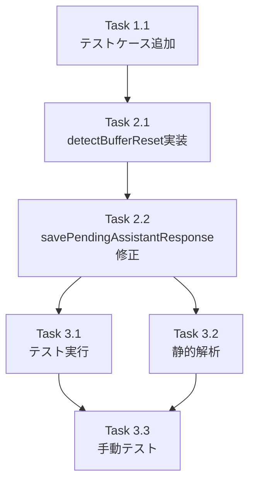

# Issue #59 作業計画書

## Issue概要

**Issue番号**: #59
**タイトル**: assistant-response-saver.tsにバッファリセット検出ロジックがなく、応答が保存されないケースがある
**ラベル**: bug
**サイズ**: S（単一ファイルへのロジック追加）
**優先度**: High（データ損失に関わるバグ）
**依存Issue**: なし

---

## 1. 問題の概要

`assistant-response-saver.ts` にtmuxバッファリセット検出ロジックがないため、以下の条件でassistant応答がDBに保存されない:

1. ポーリングがタイムアウト（5分）で停止
2. tmuxバッファがスクロール/リセットで縮小（例: 1993行→608行）
3. `currentLineCount(608) <= lastCapturedLine(1993)` で「新しい出力なし」と誤判定

**関連問題**: ブランチ頻繁切り替え時にも同様の問題が発生する可能性あり

---

## 2. 詳細タスク分解

### Phase 1: テスト作成（TDD: Red）

- [ ] **Task 1.1**: バッファリセット検出テストケース追加
  - 成果物: `src/lib/__tests__/assistant-response-saver.test.ts`
  - 依存: なし
  - 内容:
    - バッファ縮小テスト（1993→608行）
    - セッション再起動テスト（500→30行）
    - 境界値テスト（toleranceちょうど）
    - 初回実行テスト（lastCapturedLine=0）
    - 空バッファテスト（currentLineCount=0）
    - ブランチ切り替えシナリオテスト

### Phase 2: 実装（TDD: Green）

- [ ] **Task 2.1**: `detectBufferReset()` 関数実装
  - 成果物: `src/lib/assistant-response-saver.ts`
  - 依存: Task 1.1
  - 内容:
    - `BUFFER_RESET_TOLERANCE` 定数定義（25）
    - `bufferShrank` 条件実装
    - `sessionRestarted` 条件実装
    - 戻り値型 `{ bufferReset: boolean; reason: 'shrink' | 'restart' | null }`

- [ ] **Task 2.2**: `savePendingAssistantResponse()` 修正
  - 成果物: `src/lib/assistant-response-saver.ts`
  - 依存: Task 2.1
  - 内容:
    - `detectBufferReset()` 呼び出し追加
    - `effectiveLastCapturedLine` 計算
    - ログメッセージにリセット理由を含める
    - 既存ロジックとの統合

### Phase 3: 品質確認

- [ ] **Task 3.1**: テスト実行・確認
  - 成果物: テスト結果
  - 依存: Task 2.2
  - 内容:
    - 新規テスト7ケース全パス
    - 既存テスト全パス
    - カバレッジ確認

- [ ] **Task 3.2**: 静的解析
  - 成果物: lint/type-check結果
  - 依存: Task 2.2
  - 内容:
    - ESLint エラー0件
    - TypeScript型エラー0件

- [ ] **Task 3.3**: 手動テスト
  - 成果物: 動作確認結果
  - 依存: Task 3.1
  - 内容:
    - Issue記載の再現条件での確認
    - ブランチ切り替え時の動作確認

---

## 3. タスク依存関係



---

## 4. 実装詳細

### 4.1 追加する定数

```typescript
/**
 * Buffer reset tolerance (lines)
 * If buffer shrinks by more than this, consider it a reset
 */
const BUFFER_RESET_TOLERANCE = 25;
```

### 4.2 追加する関数

```typescript
/**
 * Detect buffer reset conditions
 */
function detectBufferReset(
  currentLineCount: number,
  lastCapturedLine: number
): { bufferReset: boolean; reason: 'shrink' | 'restart' | null } {
  const bufferShrank = currentLineCount > 0
    && lastCapturedLine > BUFFER_RESET_TOLERANCE
    && (currentLineCount + BUFFER_RESET_TOLERANCE) < lastCapturedLine;

  const sessionRestarted = currentLineCount > 0
    && lastCapturedLine > 50
    && currentLineCount < 50;

  if (bufferShrank) return { bufferReset: true, reason: 'shrink' };
  if (sessionRestarted) return { bufferReset: true, reason: 'restart' };
  return { bufferReset: false, reason: null };
}
```

### 4.3 修正箇所

`savePendingAssistantResponse()` 内、行数チェック部分:

```typescript
// 現在（問題あり）
if (currentLineCount <= lastCapturedLine) {
  return null;
}

// 修正後
const { bufferReset, reason } = detectBufferReset(currentLineCount, lastCapturedLine);

if (bufferReset) {
  console.log(
    `[savePendingAssistantResponse] Buffer reset detected (${reason}): ` +
    `current=${currentLineCount}, last=${lastCapturedLine}`
  );
}

const effectiveLastCapturedLine = bufferReset ? 0 : lastCapturedLine;

if (!bufferReset && currentLineCount <= lastCapturedLine) {
  console.log(
    `[savePendingAssistantResponse] No new output ` +
    `(current: ${currentLineCount}, last: ${lastCapturedLine})`
  );
  return null;
}

const newLines = lines.slice(effectiveLastCapturedLine);
```

---

## 5. テストケース一覧

| # | テストケース | lastCapturedLine | currentLineCount | 期待結果 |
|---|-------------|------------------|------------------|---------|
| 1 | バッファ縮小 | 1993 | 608 | bufferReset=true, 応答保存 |
| 2 | セッション再起動 | 500 | 30 | bufferReset=true, 応答保存 |
| 3 | 通常の重複防止 | 100 | 100 | bufferReset=false, スキップ |
| 4 | 境界値（tolerance内） | 50 | 30 | bufferReset=false, スキップ |
| 5 | 境界値（ちょうど） | 55 | 30 | bufferReset=false, スキップ |
| 6 | 初回実行 | 0 | 100 | bufferReset=false, 応答保存 |
| 7 | 空バッファ | 100 | 0 | bufferReset=false, スキップ |
| 8 | ブランチ切り替え | 1000 | 200 | bufferReset=true, 応答保存 |

---

## 6. 品質チェック項目

| チェック項目 | コマンド | 基準 |
|-------------|----------|------|
| ESLint | `npm run lint` | エラー0件 |
| TypeScript | `npx tsc --noEmit` | 型エラー0件 |
| Unit Test | `npm run test:unit` | 全テストパス |
| Build | `npm run build` | 成功 |

---

## 7. 成果物チェックリスト

### コード
- [ ] `BUFFER_RESET_TOLERANCE` 定数
- [ ] `detectBufferReset()` 関数
- [ ] `savePendingAssistantResponse()` 修正

### テスト
- [ ] バッファ縮小テスト
- [ ] セッション再起動テスト
- [ ] 境界値テスト（2ケース）
- [ ] 初回実行テスト
- [ ] 空バッファテスト
- [ ] ブランチ切り替えテスト

### 確認
- [ ] Issue記載の再現条件での動作確認
- [ ] ブランチ切り替え時の動作確認

---

## 8. Definition of Done

Issue完了条件:
- [ ] すべてのタスクが完了
- [ ] 新規テスト8ケース全パス
- [ ] 既存テスト全パス
- [ ] CIチェック全パス（lint, type-check, test, build）
- [ ] 手動テストで問題なし
- [ ] コードレビュー承認
- [ ] PRマージ

---

## 9. リスクと対策

| リスク | 影響度 | 対策 |
|-------|-------|------|
| 誤ったバッファリセット検出 | 中 | tolerance値(25)で誤検出防止、既存テストで回帰確認 |
| 既存機能への影響 | 低 | 追加ロジックのみ、既存テストで確認 |
| ブランチ切り替え問題が別原因 | 中 | 本対応後に追加調査を計画 |

---

## 10. 次のアクション

作業計画承認後:
1. **ブランチ作成**: `fix/59-buffer-reset-detection`
2. **TDD実装**: テスト作成 → 実装 → リファクタリング
3. **品質確認**: lint, type-check, test, build
4. **手動テスト**: 実環境での動作確認
5. **PR作成**: `/create-pr` で自動作成

---

## 11. 関連ドキュメント

- [設計方針書](../design/issue59-buffer-reset-detection-design-policy.md)
- [アーキテクチャレビュー](../review/2026-01-25-issue59-architecture-review.md)
- [response-poller.ts](../../src/lib/response-poller.ts) - 参考実装
- [assistant-response-saver.ts](../../src/lib/assistant-response-saver.ts) - 修正対象
