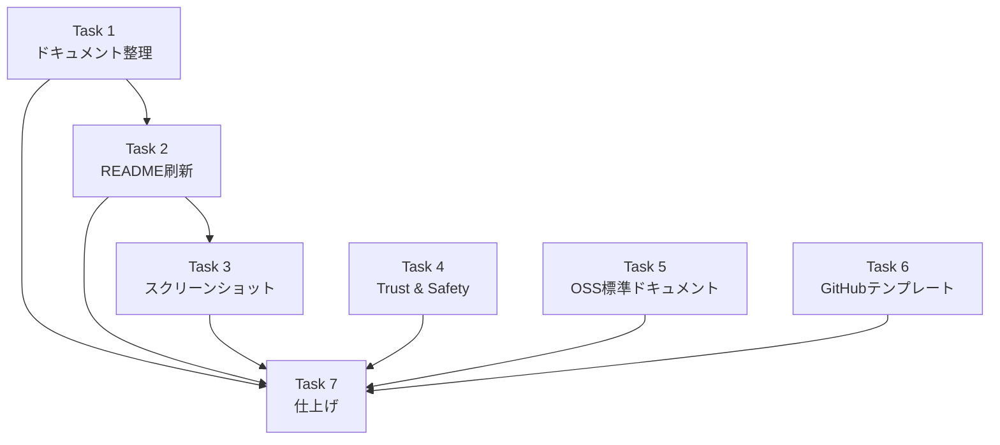

# 作業計画: Issue #64 — Docs整備（OSS公開準備）

## Issue概要

| 項目 | 値 |
|------|-----|
| **Issue番号** | #64 |
| **タイトル** | Docs整備：README/セキュリティ/貢献ガイド/ブランド文言の確定（OSS公開準備） |
| **サイズ** | L |
| **優先度** | High |
| **関連Issue** | #3（MITライセンス追加） |

---

## 現状分析

### 既存ドキュメント構成

```
（ルート）
├── README.md          … 402行、日本語混在、ブランド文言なし
├── CLAUDE.md          … Claude Code用ガイドライン
├── LICENSE            … ★未作成（READMEにMIT記載あるのみ）
├── CONTRIBUTING.md    … ★未作成
├── SECURITY.md        … ★未作成
├── CODE_OF_CONDUCT.md … ★未作成
│
├── .github/
│   └── workflows/ci-pr.yml
│   （ISSUE_TEMPLATE/、PULL_REQUEST_TEMPLATE.md … ★未作成）
│
└── docs/
    ├── concept.md                           … 公開向け（ビジョン）
    ├── architecture.md                      … 公開向け（設計）
    ├── DEPLOYMENT.md                        … 公開向け（デプロイ手順）
    ├── UI_UX_GUIDE.md                       … 公開向け（UI/UX実装）
    ├── swe-agents.md                        … 内部向け（SWEエージェント設定）
    ├── requirements-design.md               … 内部向け（要件設計）
    ├── TESTING_GUIDE.md                     … 内部向け（テストガイド）
    ├── MANUAL_TESTING_GUIDE.md              … 内部向け（手動テスト）
    ├── PRODUCTION_CHECKLIST.md              … 内部向け（本番チェック）
    ├── PHASE5-7_IMPLEMENTATION_PLAN.md      … 内部向け（実装計画）
    ├── PROMPT_HANDLING_IMPLEMENTATION_PLAN.md… 内部向け（実装計画）
    ├── user-guide/                          … 公開向け
    │   ├── quick-start.md
    │   ├── commands-guide.md
    │   ├── agents-guide.md
    │   └── workflow-examples.md
    └── features/                            … 公開向け
        ├── sidebar-status-indicator.md
        └── issue-3-mit-license.md
```

### 作成が必要なファイル一覧

| ファイル | 種別 |
|---------|------|
| `LICENSE` | 新規作成 |
| `CONTRIBUTING.md` | 新規作成 |
| `SECURITY.md` | 新規作成 |
| `CODE_OF_CONDUCT.md` | 新規作成 |
| `docs/TRUST_AND_SAFETY.md` | 新規作成 |
| `.github/ISSUE_TEMPLATE/bug_report.md` | 新規作成 |
| `.github/ISSUE_TEMPLATE/feature_request.md` | 新規作成 |
| `.github/ISSUE_TEMPLATE/question.md` | 新規作成 |
| `.github/PULL_REQUEST_TEMPLATE.md` | 新規作成 |
| `docs/images/` 配下スクリーンショット | 新規作成 |

### 変更が必要な既存ファイル

| ファイル | 変更内容 |
|---------|---------|
| `README.md` | 全面刷新（ブランド文言、構成変更、2000字以内） |
| `CLAUDE.md` | リンク更新（docs/internal/ 移動に伴う） |

---

## 作業計画

### Task 1: 既存ドキュメント整理（前準備）

**目的**: 内部向け/公開向けドキュメントを分離し、OSS公開に適した構成にする

#### 作業内容

| # | 作業 | 成果物 |
|---|------|--------|
| 1.1 | `docs/internal/` ディレクトリ作成 | ディレクトリ |
| 1.2 | 内部ドキュメント6ファイルを移動 | `docs/internal/` 配下 |
| 1.3 | `swe-agents.md` を `docs/internal/` に移動 | `docs/internal/swe-agents.md` |
| 1.4 | README内のdocsリンク更新 | `README.md` |
| 1.5 | CLAUDE.md内のリンク更新 | `CLAUDE.md` |

**移動対象ファイル**:
- `docs/PHASE5-7_IMPLEMENTATION_PLAN.md` → `docs/internal/`
- `docs/PROMPT_HANDLING_IMPLEMENTATION_PLAN.md` → `docs/internal/`
- `docs/PRODUCTION_CHECKLIST.md` → `docs/internal/`
- `docs/MANUAL_TESTING_GUIDE.md` → `docs/internal/`
- `docs/TESTING_GUIDE.md` → `docs/internal/`
- `docs/requirements-design.md` → `docs/internal/`
- `docs/swe-agents.md` → `docs/internal/`

**残留ファイル**（公開向け）:
- `docs/architecture.md`
- `docs/concept.md`
- `docs/DEPLOYMENT.md`
- `docs/UI_UX_GUIDE.md`
- `docs/user-guide/*`
- `docs/features/*`

#### 依存: なし

---

### Task 2: README刷新

**目的**: 初見ユーザーが2000字以内で「何ができるか/どう始めるか/安全に使うには」を理解できるREADME

#### 作業内容

| # | 作業 | 詳細 |
|---|------|------|
| 2.1 | README構成を設計 | 下記構成案に従う |
| 2.2 | タグライン＋説明文 | ブランド文言2段 + 1-2文の概要 |
| 2.3 | 「これは何か/何ではない」 | ポジショニング明記 |
| 2.4 | 想定ユーザー | 1文で記載 |
| 2.5 | 主機能一覧 | 箇条書き、簡潔に |
| 2.6 | Quick Start | 最短手順（5ステップ以内） |
| 2.7 | スクリーンショット埋め込み | Task 3完了後にパス挿入 |
| 2.8 | FAQ | 7問程度 |
| 2.9 | リンク集 | docs/配下へのリンク |
| 2.10 | 文字数確認 | 2000字以内 |

**README構成案**:

```markdown
# MyCodeBranchDesk

> 「入力待ちを見逃さない、開発の相棒。」
> 「軽量。その場で完結。Claude Codeを、どこからでも動かす。」

[スクリーンショット: PC表示]

## これは何か
（1-2文で概要）

## 何ではないか
（Claude Codeの補完であり、ターミナルの代替ではない）

## 想定ユーザー

## 主な機能
- 入力待ち/未確認検知
- ブラウザから指示送信
- チャット履歴・メモ
- ファイルビュー
- Auto Yes モード
- マルチCLIツール対応

[スクリーンショット: スマホ表示]

## Quick Start
1. clone
2. npm install
3. 設定
4. npm run build && npm start
5. ブラウザでアクセス

## FAQ

## ドキュメント
（docs/へのリンク集）

## Contributing / License
（1行ずつ、詳細は各ファイルへリンク）
```

#### 依存: Task 1（リンク先が確定している必要あり）

---

### Task 3: スクリーンショット撮影

**目的**: READMEに掲載する製品スクリーンショットを撮影

#### 作業内容

| # | 作業 | 詳細 |
|---|------|------|
| 3.1 | `docs/images/` ディレクトリ作成 | — |
| 3.2 | 開発サーバー起動・データ準備 | worktree/セッションが存在する状態にする |
| 3.3 | PC表示キャプチャ | Playwright MCP使用、サイドバー＋ステータス表示 |
| 3.4 | スマホ表示キャプチャ | Playwright MCP使用、モバイルビューポート |
| 3.5 | 作業風景キャプチャ | Issue #64作業中のMyCodeBranchDesk画面 |
| 3.6 | READMEに画像パス挿入 | Task 2のプレースホルダーを置換 |

**前提条件**:
- 開発サーバーが起動していること（`npm run dev`）
- DBにworktreeデータが存在すること（空DBでは意味のある画面にならない）

#### 依存: Task 2（READMEの構成が決まっている必要あり）

---

### Task 4: Trust & Safety

**目的**: セキュリティスタンスと最小権限の考え方を明文化

#### 作業内容

| # | 作業 | 成果物 |
|---|------|--------|
| 4.1 | `docs/TRUST_AND_SAFETY.md` 作成 | 新規ファイル |
| 4.2 | セキュリティスタンス記載 | ローカル実行前提、Cloudflare Tunnel依存箇所 |
| 4.3 | 最小権限ガイド記載 | 推奨/非推奨の権限設定 |
| 4.4 | リスク注意喚起 | ファイル削除・任意操作への警告 |
| 4.5 | 確認ダイアログ・ログの方針 | 既存のauto yes確認ダイアログ等を説明 |
| 4.6 | READMEからリンク | FAQ or ドキュメントセクションから参照 |

**構成案**:

```markdown
# Trust & Safety

## セキュリティモデル
（ローカル実行、Claude Code自体の権限に依存）

## 外部依存
（Cloudflare Tunnel: 外部アクセス時のみ）

## 最小権限ガイド
### 推奨設定
### 非推奨設定

## 危険操作の防止
（確認ダイアログ、操作ログ）

## 注意事項
（ユーザーへの警告）
```

#### 依存: なし（Task 2と並行可能だが、READMEリンクはTask 2後）

---

### Task 5: OSS標準ドキュメント作成

**目的**: OSS公開に必要な標準ファイルを配置

#### 作業内容

| # | 作業 | 成果物 | 備考 |
|---|------|--------|------|
| 5.1 | LICENSE（MIT）作成 | `LICENSE` | コミット時 `Closes #3` を含める |
| 5.2 | CONTRIBUTING.md 作成 | `CONTRIBUTING.md` | 開発環境構築、PR手順、コーディングルール |
| 5.3 | SECURITY.md 作成 | `SECURITY.md` | 脆弱性報告フロー |
| 5.4 | CODE_OF_CONDUCT.md 作成 | `CODE_OF_CONDUCT.md` | Contributor Covenant v2.1 |

**CONTRIBUTING.md 構成案**:

```markdown
# Contributing

## 開発環境のセットアップ
## ブランチ戦略
## コミットメッセージ規約
## PR手順
## コーディングルール（要点のみ、詳細はCLAUDE.md参照）
## テスト
```

#### 依存: なし（他タスクと並行可能）

---

### Task 6: GitHub テンプレート作成

**目的**: Issue/PR作成時の品質を均一化

#### 作業内容

| # | 作業 | 成果物 |
|---|------|--------|
| 6.1 | Bug Report テンプレート | `.github/ISSUE_TEMPLATE/bug_report.md` |
| 6.2 | Feature Request テンプレート | `.github/ISSUE_TEMPLATE/feature_request.md` |
| 6.3 | Question テンプレート | `.github/ISSUE_TEMPLATE/question.md` |
| 6.4 | PR テンプレート | `.github/PULL_REQUEST_TEMPLATE.md` |

#### 依存: なし（他タスクと並行可能）

---

### Task 7: 仕上げ・体裁

**目的**: 全体の整合性確認と最終調整

#### 作業内容

| # | 作業 | 詳細 |
|---|------|------|
| 7.1 | 用語統一確認 | 入力待ち/未確認/auto yes/desk/branch |
| 7.2 | リンク整合性確認 | docs/内の全リンクが有効か検証 |
| 7.3 | README文字数最終確認 | 2000字以内 |
| 7.4 | 言語方針確認 | 日本語のみで初版（英語対応は別Issue） |
| 7.5 | CI確認 | lint, type-check, build が通ること |

#### 依存: Task 1〜6 すべて完了後

---

## タスク依存関係



**並行実行可能なグループ**:
- **直列**: Task 1 → Task 2 → Task 3
- **並行**: Task 4, Task 5, Task 6（互いに独立。Task 1完了後に着手可能）
- **最後**: Task 7（全タスク完了後）

---

## 品質チェック項目

| チェック項目 | コマンド | 基準 |
|-------------|----------|------|
| ESLint | `npm run lint` | エラー0件 |
| TypeScript | `npx tsc --noEmit` | 型エラー0件 |
| Build | `npm run build` | 成功 |
| リンク確認 | 手動 | docs/内の全リンクが有効 |
| README文字数 | `wc -m README.md` | 2000字以内（目安） |

---

## 成果物チェックリスト

### 新規ファイル
- [ ] `LICENSE`
- [ ] `CONTRIBUTING.md`
- [ ] `SECURITY.md`
- [ ] `CODE_OF_CONDUCT.md`
- [ ] `docs/TRUST_AND_SAFETY.md`
- [ ] `docs/images/` 配下スクリーンショット（3枚以上）
- [ ] `.github/ISSUE_TEMPLATE/bug_report.md`
- [ ] `.github/ISSUE_TEMPLATE/feature_request.md`
- [ ] `.github/ISSUE_TEMPLATE/question.md`
- [ ] `.github/PULL_REQUEST_TEMPLATE.md`

### 変更ファイル
- [ ] `README.md`（全面刷新）
- [ ] `CLAUDE.md`（リンク更新）

### 移動ファイル
- [ ] `docs/internal/` に7ファイル移動

---

## Definition of Done

- [ ] すべてのタスク（Task 1〜7）が完了
- [ ] README本文2000字以内
- [ ] スクリーンショットPC/スマホ各1枚以上がREADMEに掲載
- [ ] OSS標準ドキュメント4ファイルが配置済み
- [ ] Issue/PRテンプレートが配置済み
- [ ] docs/内の全リンクが有効
- [ ] CI全パス（lint, type-check, build）
- [ ] Issue #3 が `Closes #3` でクローズされる

---

## 次のアクション

1. **ブランチ作成**: `docs/64-oss-docs-setup`
2. **Task 1から着手**: ドキュメント整理
3. **Task 4/5/6を並行実行**: Task 1完了後
4. **Task 7で仕上げ**: 全タスク完了後
5. **PR作成**: `/create-pr` で作成
