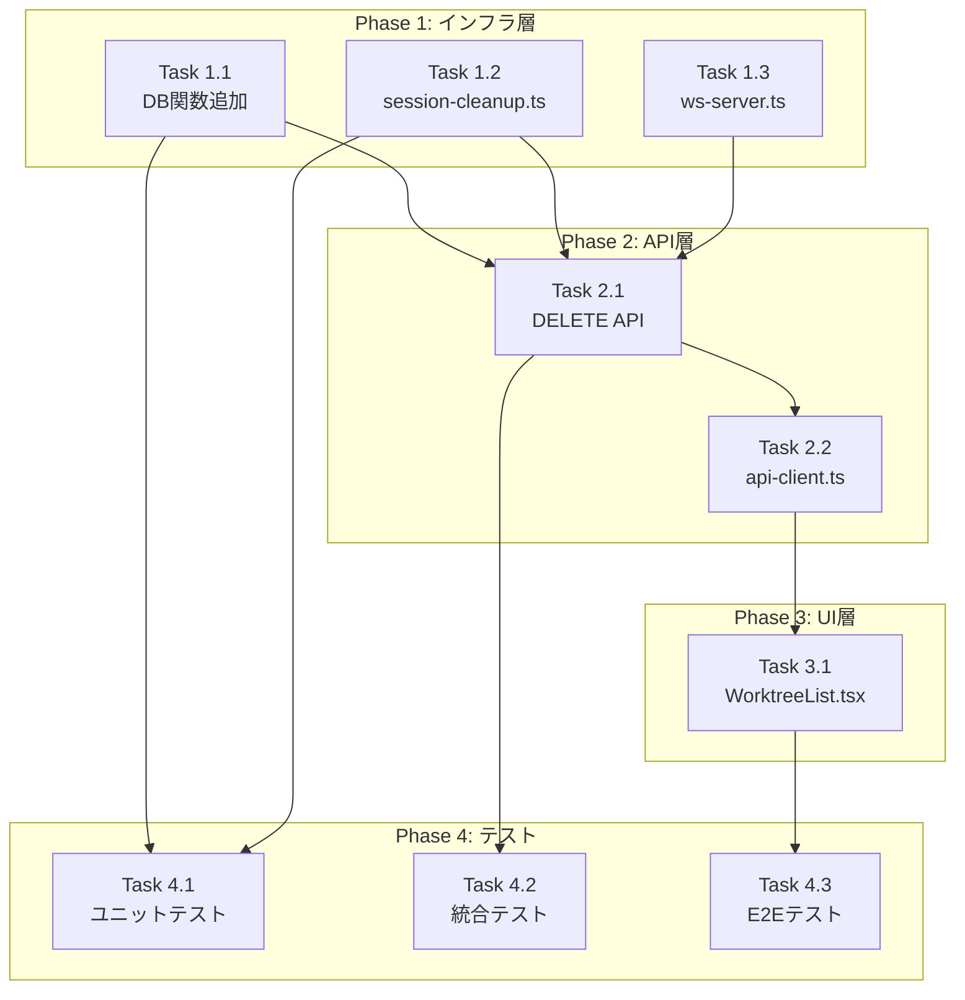

# 作業計画: Issue #69 登録済みリポジトリの削除機能

## Issue概要

**Issue番号**: #69
**タイトル**: feat: 登録済みリポジトリの削除機能を追加
**サイズ**: M（中規模）
**優先度**: Medium
**依存Issue**: なし

### 概要
アプリに登録したリポジトリをUIから削除する機能を追加する。現状はSQLite直接操作か`npm run db:reset`でDB全体をリセットするしかない。

### 関連ドキュメント
- 設計書: `dev-reports/design/issue-69-repository-delete-design-policy.md`
- レビュー: `dev-reports/review/2026-01-28-issue-69-architecture-review.md`
- **アーキテクチャレビュー**: ✅ 承認済み

---

## 詳細タスク分解

### Phase 1: インフラ層（バックエンド基盤）

#### Task 1.1: DB関数追加
- **成果物**: `src/lib/db.ts`
- **作業内容**:
  - `getWorktreeIdsByRepository()` 関数追加
  - `deleteRepositoryWorktrees()` 関数追加
- **依存**: なし
- **見積り**: 小

```typescript
// 追加する関数
export function getWorktreeIdsByRepository(db: Database.Database, repositoryPath: string): string[]
export function deleteRepositoryWorktrees(db: Database.Database, repositoryPath: string): { deletedCount: number }
```

#### Task 1.2: セッションクリーンアップユーティリティ新規作成
- **成果物**: `src/lib/session-cleanup.ts` (新規)
- **作業内容**:
  - `WorktreeCleanupResult` インターフェース定義
  - `cleanupWorktreeSessions()` 関数実装
  - `cleanupMultipleWorktrees()` 関数実装
  - ログ出力（設計書セクション9準拠）
- **依存**: なし
- **見積り**: 中

#### Task 1.3: WebSocketサーバーにcleanupRooms追加
- **成果物**: `src/lib/ws-server.ts`
- **作業内容**:
  - `cleanupRooms(worktreeIds: string[])` 関数追加
- **依存**: なし
- **見積り**: 小

---

### Phase 2: API層

#### Task 2.1: リポジトリ削除APIエンドポイント新規作成
- **成果物**: `src/app/api/repositories/route.ts` (DELETEハンドラ追加)
- **作業内容**:
  - DELETEハンドラ実装
  - リクエストバリデーション
  - セッションクリーンアップ呼び出し
  - WebSocketクリーンアップ呼び出し
  - DB削除処理
  - WebSocket削除通知
  - ログ出力（設計書セクション9準拠）
- **依存**: Task 1.1, 1.2, 1.3
- **見積り**: 中

#### Task 2.2: APIクライアントにdelete追加
- **成果物**: `src/lib/api-client.ts`
- **作業内容**:
  - `repositoryApi.delete()` メソッド追加
  - 型定義追加
- **依存**: Task 2.1
- **見積り**: 小

---

### Phase 3: UI層

#### Task 3.1: WorktreeListに削除機能追加
- **成果物**: `src/components/worktree/WorktreeList.tsx`
- **作業内容**:
  - リポジトリフィルターボタンに削除アイコン追加（ホバー時表示）
  - 環境変数チェック関数実装
  - 環境変数警告アイコン表示（設計書セクション7準拠）
  - 確認ダイアログ実装（`delete`入力確認）
  - 環境変数警告メッセージ追加
  - 削除API呼び出し
  - 削除後のUI更新
- **依存**: Task 2.2
- **見積り**: 中

---

### Phase 4: テスト

#### Task 4.1: ユニットテスト
- **成果物**:
  - `tests/unit/lib/session-cleanup.test.ts` (新規)
  - `tests/unit/lib/db.test.ts` (追加)
- **作業内容**:
  - `cleanupWorktreeSessions()` テスト
  - `cleanupMultipleWorktrees()` テスト
  - `getWorktreeIdsByRepository()` テスト
  - `deleteRepositoryWorktrees()` テスト
- **依存**: Phase 1完了
- **見積り**: 中

#### Task 4.2: 統合テスト
- **成果物**: `tests/integration/repositories-delete.test.ts` (新規)
- **作業内容**:
  - 正常削除フロー
  - 部分成功（warnings含む）
  - 404エラー（存在しないリポジトリ）
  - 400エラー（不正リクエスト）
- **依存**: Phase 2完了
- **見積り**: 中

#### Task 4.3: E2Eテスト
- **成果物**: `e2e/repository-delete.spec.ts` (新規)
- **作業内容**:
  - UI削除フロー
  - キャンセルフロー
  - 環境変数警告表示確認
- **依存**: Phase 3完了
- **見積り**: 小

---

## タスク依存関係



---

## 実装順序

| 順序 | タスク | ファイル | 作業内容 |
|------|--------|---------|---------|
| 1 | Task 1.1 | `src/lib/db.ts` | DB関数2つ追加 |
| 2 | Task 1.2 | `src/lib/session-cleanup.ts` | 新規作成 |
| 3 | Task 1.3 | `src/lib/ws-server.ts` | cleanupRooms追加 |
| 4 | Task 2.1 | `src/app/api/repositories/route.ts` | DELETEハンドラ追加 |
| 5 | Task 2.2 | `src/lib/api-client.ts` | delete()追加 |
| 6 | Task 3.1 | `src/components/worktree/WorktreeList.tsx` | 削除UI実装 |
| 7 | Task 4.1 | `tests/unit/` | ユニットテスト |
| 8 | Task 4.2 | `tests/integration/` | 統合テスト |
| 9 | Task 4.3 | `e2e/` | E2Eテスト |

---

## 品質チェック項目

| チェック項目 | コマンド | 基準 |
|-------------|----------|------|
| ESLint | `npm run lint` | エラー0件 |
| TypeScript | `npx tsc --noEmit` | 型エラー0件 |
| Unit Test | `npm run test:unit` | 全テストパス |
| Integration Test | `npm run test:integration` | 全テストパス |
| Build | `npm run build` | 成功 |

---

## 成果物チェックリスト

### コード
- [ ] `src/lib/db.ts` - DB関数追加
- [ ] `src/lib/session-cleanup.ts` - 新規作成
- [ ] `src/lib/ws-server.ts` - cleanupRooms追加
- [ ] `src/app/api/repositories/route.ts` - DELETEハンドラ追加
- [ ] `src/lib/api-client.ts` - delete()追加
- [ ] `src/components/worktree/WorktreeList.tsx` - 削除UI実装

### テスト
- [ ] `tests/unit/lib/session-cleanup.test.ts` - 新規
- [ ] `tests/unit/lib/db.test.ts` - 追加
- [ ] `tests/integration/repositories-delete.test.ts` - 新規
- [ ] `e2e/repository-delete.spec.ts` - 新規

---

## テスト観点（設計書より）

### 機能テスト
- [ ] リポジトリ削除（複数worktree含む）
- [ ] セッション実行中のリポジトリ削除
- [ ] ログファイル保持確認
- [ ] DB関連テーブルのカスケード削除確認
- [ ] WebSocket削除通知配信確認
- [ ] WebSocket購読状態のクリーンアップ確認
- [ ] 両ポーラー（response-poller, claude-poller）の停止確認
- [ ] 存在しないリポジトリパスでの削除試行（404レスポンス確認）
- [ ] repositoryPath未指定での削除試行（400レスポンス確認）
- [ ] 削除後のSync All実行時の再登録確認（環境変数設定時）

### エラーハンドリングテスト
- [ ] セッションkill失敗時もDB削除が成功すること
- [ ] ポーラー停止失敗時もDB削除が成功すること
- [ ] WebSocketクリーンアップ失敗時もDB削除が成功すること
- [ ] 部分成功時にwarningsが正しく返却されること
- [ ] DB削除失敗時は500エラーが返却されること
- [ ] 無効なJSONボディで400エラーが返却されること

---

## Definition of Done

Issue完了条件：
- [ ] すべてのタスク（Phase 1-4）が完了
- [ ] ユニットテストカバレッジ80%以上（session-cleanup.ts）
- [ ] CIチェック全パス（lint, type-check, test, build）
- [ ] コードレビュー承認
- [ ] 設計書のテスト観点をすべてカバー

---

## リスクと対策

| リスク | 影響度 | 対策 |
|-------|-------|------|
| ポーラー停止失敗 | 低 | 段階的エラーハンドリングで続行 |
| 環境変数リポジトリの再登録 | 低 | 警告UI追加済み（設計書セクション7） |
| 大量worktree削除時の処理時間 | 低 | 将来的にPromise.allSettled検討 |

---

## 次のアクション

作業計画承認後：

1. **ブランチ作成**
   ```bash
   git checkout -b feature/69-repository-delete
   ```

2. **タスク実行**: Phase 1から順次実装

3. **進捗報告**: `/progress-report` で定期報告

4. **PR作成**: `/create-pr` で自動作成

---

## 変更履歴

| 日付 | 内容 |
|------|------|
| 2026-01-28 | 初版作成 |
