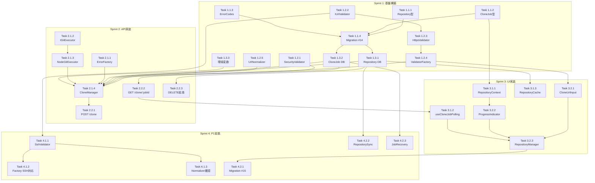

# Issue #71: クローンURL登録機能 作業計画

## Issue概要

**Issue番号**: #71
**タイトル**: feat: リポジトリ登録時にクローンURLを指定して登録可能にする
**サイズ**: L（大規模）
**優先度**: High
**依存Issue**: #69（リポジトリ削除機能 - 削除API互換性）
**設計書**: `dev-reports/design/issue-71-clone-url-registration-design-policy.md`

### スコープサマリ

| 優先度 | 機能 |
|--------|------|
| P0 | HTTPS URLでのクローン・登録、repositoriesテーブル新設、重複防止、URL正規化 |
| P1 | SSH URL対応、環境変数管理リポジトリ同期、外部キー移行 |
| P2 | 進捗表示、ディスク容量チェック、物理削除オプション |
| P3 | カスタムディレクトリ指定、キャンセル機能、ホストホワイトリスト |

---

## Sprint 1: 基盤構築（P0）

### Phase 1.1: 型定義・マイグレーション

| タスク | 成果物 | 依存 | 工数 |
|--------|--------|------|------|
| **Task 1.1.1** Repository型拡張 | `src/types/models.ts` | なし | S |
| **Task 1.1.2** CloneJob型・CloneError型定義 | `src/types/clone.ts` | なし | S |
| **Task 1.1.3** ErrorCodes定義 | `src/types/errors.ts` | なし | S |
| **Task 1.1.4** Migration #14実装 | `src/lib/db-migrations.ts` | Task 1.1.1-1.1.3 | M |

#### Task 1.1.1: Repository型拡張
```
成果物: src/types/models.ts
変更内容:
- Repository interfaceに4フィールド追加（全てオプショナル）
  - cloneUrl?: string
  - normalizedCloneUrl?: string
  - cloneSource?: 'local' | 'https' | 'ssh'
  - isEnvManaged?: boolean
```

#### Task 1.1.2: CloneJob型・CloneError型定義
```
成果物: src/types/clone.ts（新規作成）
定義内容:
- CloneJobStatus型
- CloneJob interface
- CloneError interface
- ValidationResult interface
- CloneRequest / CloneResponse interface
```

#### Task 1.1.3: ErrorCodes定義
```
成果物: src/types/errors.ts（新規作成）
定義内容:
- ErrorCodes const object
  - validation: INVALID_URL, DUPLICATE_CLONE_URL, SECURITY_VIOLATION
  - network: NETWORK_ERROR, TIMEOUT
  - auth: AUTH_FAILED, SSH_KEY_NOT_FOUND
  - filesystem: DIRECTORY_EXISTS, INSUFFICIENT_DISK_SPACE
  - git: REPO_NOT_FOUND, CLONE_IN_PROGRESS
  - system: INTERNAL_ERROR, TOO_MANY_CLONES
```

#### Task 1.1.4: Migration #14実装
```
成果物: src/lib/db-migrations.ts
変更内容:
- CURRENT_SCHEMA_VERSION を 14 に更新
- migration14 追加
  - repositoriesテーブル作成
  - clone_jobsテーブル作成
  - インデックス作成
  - 既存worktreesからのデータ移行
- validateSchema() に repositories, clone_jobs を追加
```

---

### Phase 1.2: URL検証・正規化

| タスク | 成果物 | 依存 | 工数 |
|--------|--------|------|------|
| **Task 1.2.1** UrlSecurityValidator実装 | `src/lib/validators/url-security.ts` | なし | S |
| **Task 1.2.2** IUrlValidator interface定義 | `src/lib/url-validators/types.ts` | なし | S |
| **Task 1.2.3** HttpsUrlValidator実装 | `src/lib/url-validators/https-validator.ts` | Task 1.2.2 | S |
| **Task 1.2.4** UrlValidatorFactory実装 | `src/lib/url-validators/validator-factory.ts` | Task 1.2.3 | S |
| **Task 1.2.5** UrlNormalizer実装 | `src/lib/url-normalizer.ts` | なし | M |

#### Task 1.2.1: UrlSecurityValidator実装
```
成果物: src/lib/validators/url-security.ts（新規作成）
機能:
- 禁止パターン検出（.., ;, |, `, $(, \x00）
- URL長制限（2048文字）
- SecurityValidationResult返却
```

#### Task 1.2.5: UrlNormalizer実装
```
成果物: src/lib/url-normalizer.ts（新規作成）
機能:
- Singletonパターン
- normalize(): HTTPS/SSH → 正規化形式
- isSameRepository(): 2URL比較
テストケース:
- .git除去
- 末尾スラッシュ除去
- 大文字小文字統一
- SSH → HTTPS変換
```

---

### Phase 1.3: DB関数・環境変数

| タスク | 成果物 | 依存 | 工数 |
|--------|--------|------|------|
| **Task 1.3.1** Repository DB関数追加 | `src/lib/db.ts` | Task 1.1.4 | M |
| **Task 1.3.2** CloneJob DB関数追加 | `src/lib/db.ts` | Task 1.1.4 | M |
| **Task 1.3.3** 環境変数定義追加 | `src/lib/env.ts` | なし | S |

#### Task 1.3.1: Repository DB関数追加
```
成果物: src/lib/db.ts
追加関数:
- getAllRepositories()
- getRepositoryById()
- getRepositoryByNormalizedCloneUrl()
- createRepository()
- deleteRepository()
- mapRepositoryRow()
```

#### Task 1.3.2: CloneJob DB関数追加
```
成果物: src/lib/db.ts
追加関数:
- getCloneJobById()
- getCloneJobsByStatus()
- getCloneJobByNormalizedUrl()
- createCloneJob()
- updateCloneJobStatus()
- updateCloneJobProgress()
- updateCloneJobError()
- mapCloneJobRow()
```

#### Task 1.3.3: 環境変数定義追加
```
成果物: src/lib/env.ts
追加内容:
- MCBD_CLONE_TIMEOUT
- MCBD_MAX_CONCURRENT_CLONES
- MCBD_MIN_FREE_SPACE_MB
- MCBD_ALLOWED_GIT_HOSTS（P3用、定義のみ）
- getCloneConfig() 関数
```

---

## Sprint 2: API実装（P0）

### Phase 2.1: ビジネスロジック

| タスク | 成果物 | 依存 | 工数 |
|--------|--------|------|------|
| **Task 2.1.1** CloneErrorFactory実装 | `src/lib/errors/clone-error-factory.ts` | Task 1.1.2 | S |
| **Task 2.1.2** IGitExecutor interface定義 | `src/lib/git/types.ts` | なし | S |
| **Task 2.1.3** NodeGitExecutor実装 | `src/lib/git/node-git-executor.ts` | Task 2.1.2 | M |
| **Task 2.1.4** CloneManager実装 | `src/lib/clone-manager.ts` | Task 1.2.*, Task 1.3.*, Task 2.1.1-2.1.3 | L |

#### Task 2.1.4: CloneManager実装
```
成果物: src/lib/clone-manager.ts（新規作成）
機能:
- cloneRepository(): メインエントリポイント
  1. セキュリティチェック
  2. URL形式バリデーション
  3. URL正規化
  4. 重複チェック
  5. 進行中ジョブチェック
  6. 同時クローン数チェック
  7. ディスク容量チェック（簡易）
  8. ジョブ作成
  9. 非同期クローン実行
- executeCloneAsync(): バックグラウンド処理
- parseGitError(): エラー分類
```

---

### Phase 2.2: APIエンドポイント

| タスク | 成果物 | 依存 | 工数 |
|--------|--------|------|------|
| **Task 2.2.1** POST /clone API | `src/app/api/repositories/clone/route.ts` | Task 2.1.4 | M |
| **Task 2.2.2** GET /clone/:jobId API | `src/app/api/repositories/clone/[jobId]/route.ts` | Task 1.3.2 | S |
| **Task 2.2.3** DELETE API互換性拡張 | `src/app/api/repositories/route.ts` | Task 1.3.1 | S |

#### Task 2.2.1: POST /clone API
```
成果物: src/app/api/repositories/clone/route.ts（新規作成）
エンドポイント: POST /api/repositories/clone
リクエスト: { cloneUrl: string, targetDir?: string }
レスポンス: { success: true, jobId, status: 'pending' }
エラー: { success: false, error: CloneError }
```

#### Task 2.2.2: GET /clone/:jobId API
```
成果物: src/app/api/repositories/clone/[jobId]/route.ts（新規作成）
エンドポイント: GET /api/repositories/clone/:jobId
レスポンス: { jobId, status, progress, repositoryId?, error? }
```

#### Task 2.2.3: DELETE API互換性拡張
```
成果物: src/app/api/repositories/route.ts（既存拡張）
変更内容:
- repositoryId パラメータ対応追加
- repositoryPath との両立（repositoryId優先）
- 404エラー処理追加
```

---

## Sprint 3: UI実装（P0）

### Phase 3.1: Context・状態管理

| タスク | 成果物 | 依存 | 工数 |
|--------|--------|------|------|
| **Task 3.1.1** RepositoryContext実装 | `src/contexts/RepositoryContext.tsx` | Task 1.1.2 | M |
| **Task 3.1.2** useCloneJobPolling hook | `src/hooks/useCloneJobPolling.ts` | Task 2.2.2 | S |
| **Task 3.1.3** RepositoryCache実装 | `src/lib/cache/repository-cache.ts` | Task 1.3.1 | S |

#### Task 3.1.1: RepositoryContext実装
```
成果物: src/contexts/RepositoryContext.tsx（新規作成）
State:
- repositories: Repository[]
- cloneJobs: Record<string, CloneJobState>
- isLoading: boolean
- error: CloneError | null
- inputMode: 'local' | 'url'

Actions:
- SET_REPOSITORIES
- START_CLONE
- UPDATE_CLONE_PROGRESS
- CLONE_COMPLETED
- CLONE_FAILED
- REMOVE_CLONE_JOB
- SET_INPUT_MODE
```

---

### Phase 3.2: UIコンポーネント

| タスク | 成果物 | 依存 | 工数 |
|--------|--------|------|------|
| **Task 3.2.1** CloneUrlInput実装 | `src/components/repository/CloneUrlInput.tsx` | Task 1.2.* | M |
| **Task 3.2.2** CloneProgressIndicator実装 | `src/components/repository/CloneProgressIndicator.tsx` | Task 3.1.1 | S |
| **Task 3.2.3** RepositoryManager拡張 | `src/components/repository/RepositoryManager.tsx` | Task 3.2.1, 3.2.2 | M |

#### Task 3.2.1: CloneUrlInput実装
```
成果物: src/components/repository/CloneUrlInput.tsx（新規作成）
機能:
- URL入力フィールド
- リアルタイムバリデーション
- エラー表示
- プレースホルダー案内
```

#### Task 3.2.2: CloneProgressIndicator実装
```
成果物: src/components/repository/CloneProgressIndicator.tsx（新規作成）
機能:
- 進捗スピナー表示
- ステータステキスト（pending/running/completed/failed）
- エラー時のsuggestedAction表示
```

---

## Sprint 4: 拡張機能（P1）

### Phase 4.1: SSH対応

| タスク | 成果物 | 依存 | 工数 |
|--------|--------|------|------|
| **Task 4.1.1** SshUrlValidator実装 | `src/lib/url-validators/ssh-validator.ts` | Task 1.2.2 | M |
| **Task 4.1.2** UrlValidatorFactory SSH対応 | `src/lib/url-validators/validator-factory.ts` | Task 4.1.1 | S |
| **Task 4.1.3** UrlNormalizer SSH対応確認 | `src/lib/url-normalizer.ts` | Task 4.1.1 | S |

#### Task 4.1.1: SshUrlValidator実装
```
成果物: src/lib/url-validators/ssh-validator.ts（新規作成）
対応形式:
- git@host:path/repo.git（標準SSH）
- ssh://git@host[:port]/path/repo.git（SSH URL）
- GitLab subgroups（group/subgroup/repo）
```

---

### Phase 4.2: 外部キー移行・環境変数同期

| タスク | 成果物 | 依存 | 工数 |
|--------|--------|------|------|
| **Task 4.2.1** Migration #15実装 | `src/lib/db-migrations.ts` | Sprint 1-3完了 | M |
| **Task 4.2.2** RepositorySync実装 | `src/lib/repository-sync.ts` | Task 1.3.1 | M |
| **Task 4.2.3** JobRecovery実装 | `src/lib/clone-job-recovery.ts` | Task 1.3.2 | S |

#### Task 4.2.1: Migration #15実装
```
成果物: src/lib/db-migrations.ts
変更内容:
- CURRENT_SCHEMA_VERSION を 15 に更新
- migration15 追加
  - worktrees.repository_id追加（NULL許容）
  - 既存データのrepository_id設定
  - インデックス作成
```

#### Task 4.2.2: RepositorySync実装
```
成果物: src/lib/repository-sync.ts（新規作成）
機能:
- syncEnvManagedRepositories()
- キャッシュ付き同期（TTL: 1分）
- 同期ルール:
  - 環境変数にあり、DBにない → 挿入
  - 環境変数にあり、DBにもある → is_env_managed更新
  - 環境変数になく、is_env_managed=1 → DB管理に降格
```

---

## タスク依存関係図



---

## テストタスク

### Sprint 1-2 並行: 単体テスト

| タスク | 成果物 | 対象 |
|--------|--------|------|
| **Test 1.1** UrlNormalizerテスト | `__tests__/lib/url-normalizer.test.ts` | Task 1.2.5 |
| **Test 1.2** UrlValidatorテスト | `__tests__/lib/url-validators/*.test.ts` | Task 1.2.3, 4.1.1 |
| **Test 1.3** SecurityValidatorテスト | `__tests__/lib/validators/url-security.test.ts` | Task 1.2.1 |
| **Test 1.4** DB関数テスト | `__tests__/lib/db-repository.test.ts` | Task 1.3.1, 1.3.2 |
| **Test 1.5** CloneManagerテスト（Mock） | `__tests__/lib/clone-manager.test.ts` | Task 2.1.4 |

### Sprint 2-3 並行: 統合テスト

| タスク | 成果物 | 対象 |
|--------|--------|------|
| **Test 2.1** Clone APIテスト | `__tests__/api/repositories/clone.test.ts` | Task 2.2.1, 2.2.2 |
| **Test 2.2** マイグレーションテスト | `__tests__/lib/db-migrations.test.ts` | Task 1.1.4, 4.2.1 |

---

## 品質チェック項目

| チェック項目 | コマンド | 基準 |
|-------------|----------|------|
| ESLint | `npm run lint` | エラー0件 |
| TypeScript | `npx tsc --noEmit` | 型エラー0件 |
| Unit Test | `npm run test:unit` | 全テストパス |
| Build | `npm run build` | 成功 |

---

## 成果物チェックリスト

### Sprint 1 完了条件
- [ ] `src/types/models.ts` - Repository型拡張
- [ ] `src/types/clone.ts` - CloneJob型定義
- [ ] `src/types/errors.ts` - ErrorCodes定義
- [ ] `src/lib/db-migrations.ts` - Migration #14
- [ ] `src/lib/validators/url-security.ts` - セキュリティ検証
- [ ] `src/lib/url-validators/` - URL検証モジュール群
- [ ] `src/lib/url-normalizer.ts` - URL正規化
- [ ] `src/lib/db.ts` - Repository/CloneJob DB関数
- [ ] `src/lib/env.ts` - 環境変数定義
- [ ] 単体テスト: UrlNormalizer, Validators

### Sprint 2 完了条件
- [ ] `src/lib/errors/clone-error-factory.ts` - エラー生成
- [ ] `src/lib/git/` - GitExecutorモジュール群
- [ ] `src/lib/clone-manager.ts` - クローン処理管理
- [ ] `src/app/api/repositories/clone/route.ts` - POST API
- [ ] `src/app/api/repositories/clone/[jobId]/route.ts` - GET API
- [ ] `src/app/api/repositories/route.ts` - DELETE拡張
- [ ] 統合テスト: Clone API

### Sprint 3 完了条件
- [ ] `src/contexts/RepositoryContext.tsx` - 状態管理
- [ ] `src/hooks/useCloneJobPolling.ts` - ポーリングhook
- [ ] `src/lib/cache/repository-cache.ts` - キャッシュ
- [ ] `src/components/repository/CloneUrlInput.tsx` - URL入力
- [ ] `src/components/repository/CloneProgressIndicator.tsx` - 進捗表示
- [ ] `src/components/repository/RepositoryManager.tsx` - 拡張

### Sprint 4 完了条件
- [ ] `src/lib/url-validators/ssh-validator.ts` - SSH検証
- [ ] `src/lib/db-migrations.ts` - Migration #15
- [ ] `src/lib/repository-sync.ts` - 環境変数同期
- [ ] `src/lib/clone-job-recovery.ts` - ジョブリカバリ

---

## Definition of Done

### P0（Sprint 1-3）完了条件
- [ ] HTTPS URLでクローン・登録できる
- [ ] URL形式のバリデーションが行われる
- [ ] 既存ディレクトリ衝突時にエラーメッセージが表示される
- [ ] クローン元URLがDBに保存される
- [ ] 同一URLの重複登録が防止される
- [ ] 単体テストカバレッジ80%以上
- [ ] CIチェック全パス（lint, type-check, test, build）

### P1（Sprint 4）完了条件
- [ ] SSH URLでクローン・登録できる
- [ ] 認証失敗時に適切なエラーが表示される
- [ ] 環境変数管理リポジトリとDB管理リポジトリが区別される
- [ ] worktreesテーブルがrepositoriesテーブルを外部キー参照する

---

## 次のアクション

1. **ブランチ作成**: `feature/71-clone-url-registration`
2. **Sprint 1開始**: Phase 1.1の型定義・マイグレーションから着手
3. **テスト並行作成**: UrlNormalizer, Validatorの単体テスト先行作成
4. **進捗報告**: 各Sprint完了時に `/progress-report` で報告
5. **PR作成**: Sprint 3完了後（P0完了時点）で `/create-pr` を実行

---

## 参考資料

- [設計方針書](../design/issue-71-clone-url-registration-design-policy.md)
- [アーキテクチャレビュー](../review/2026-01-29-issue71-architecture-review.md)
- [Issue #71](https://github.com/Kewton/MyCodeBranchDesk/issues/71)
- [Issue #69 設計書](../design/issue-69-repository-delete-design-policy.md)
