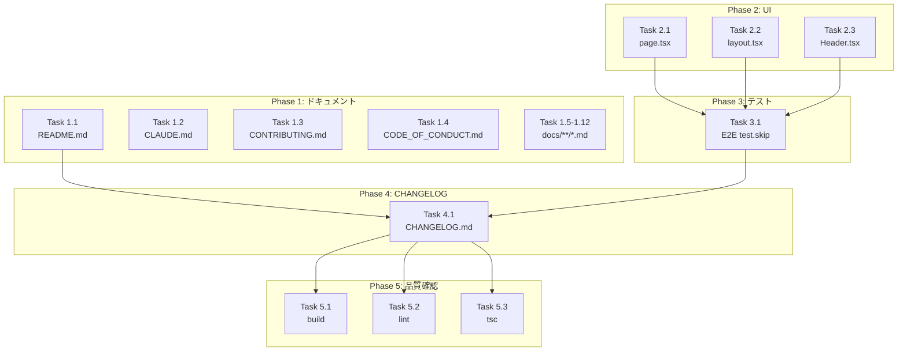

# 作業計画書: Issue #75

## Issue: Phase 2: ドキュメント・UI表示の変更 (CommandMate リネーム)

**Issue番号**: #75
**サイズ**: M
**優先度**: High
**依存Issue**: #76（完了済み）
**後続Issue**: #77

---

## 1. 概要

プロジェクト名を「MyCodeBranchDesk」から「CommandMate」に変更する Phase 2。
ドキュメントとUI表示文字列のみを変更し、コードの破壊的変更は含まない。

### 設計方針書

詳細な設計判断は以下を参照：
- `dev-reports/design/issue-75-design-policy.md`

### 重要な設計判断

1. **環境変数名**: ドキュメント内のコード例は `MCBD_*` のまま維持（#77 で更新）
2. **E2Eテスト**: `test.skip()` で一時スキップ（#77 で解除）
3. **Footer**: 実装が存在しないため、E2Eテストをスキップ

---

## 2. 詳細タスク分解

### Phase 1: ドキュメント置換

| Task | 成果物 | 依存 | 注意点 |
|------|--------|------|--------|
| **Task 1.1** | README.md | なし | チャット用語の置換も実施 |
| **Task 1.2** | CLAUDE.md | なし | プロジェクト概要部分 |
| **Task 1.3** | CONTRIBUTING.md | なし | - |
| **Task 1.4** | CODE_OF_CONDUCT.md | なし | line 5 |
| **Task 1.5** | docs/architecture.md | なし | 表記揺れ統一 |
| **Task 1.6** | docs/concept.md | なし | 環境変数例は維持 |
| **Task 1.7** | docs/DEPLOYMENT.md | なし | 環境変数例は維持 |
| **Task 1.8** | docs/TRUST_AND_SAFETY.md | なし | - |
| **Task 1.9** | docs/UI_UX_GUIDE.md | なし | - |
| **Task 1.10** | docs/user-guide/*.md | なし | 4ファイル |
| **Task 1.11** | docs/features/*.md | なし | 必要に応じて |
| **Task 1.12** | docs/internal/*.md | なし | 必要に応じて |

### Phase 2: UI表示文字列の変更

| Task | 成果物 | 依存 | 変更内容 |
|------|--------|------|----------|
| **Task 2.1** | src/app/page.tsx | なし | line 21: h1 タイトル |
| **Task 2.2** | src/app/layout.tsx | なし | line 6: metadata.title |
| **Task 2.3** | src/components/layout/Header.tsx | なし | line 23: default title |

### Phase 3: テスト対応

| Task | 成果物 | 依存 | 内容 |
|------|--------|------|------|
| **Task 3.1** | tests/e2e/worktree-list.spec.ts | Phase 2完了 | test.skip() 適用（5テスト） |

### Phase 4: CHANGELOG更新

| Task | 成果物 | 依存 | 内容 |
|------|--------|------|------|
| **Task 4.1** | CHANGELOG.md | Phase 1-3完了 | [Unreleased] に追記 |

### Phase 5: 品質確認

| Task | コマンド | 依存 | 基準 |
|------|----------|------|------|
| **Task 5.1** | `npm run build` | Phase 4完了 | 成功 |
| **Task 5.2** | `npm run lint` | Phase 4完了 | エラー0件 |
| **Task 5.3** | `npx tsc --noEmit` | Phase 4完了 | 型エラー0件 |

---

## 3. タスク依存関係



---

## 4. 置換対象の詳細

### 4.1 プロジェクト名の置換

| 置換前 | 置換後 |
|--------|--------|
| `MyCodeBranchDesk` | `CommandMate` |
| `myCodeBranchDesk` | `CommandMate` |
| `mycodebranch-desk` | `commandmate` |

### 4.2 チャット用語の置換（README.md のみ）

| 置換前 | 置換後 |
|--------|--------|
| チャットUI | メッセージUI |
| チャット履歴 | 実行履歴 |
| チャット・ターミナル画面 | Message / Console / History 画面 |

### 4.3 変更しない箇所（#77 で対応）

- ドキュメント内のコード例における環境変数名（`MCBD_*`）
- `cd MyCodeBranchDesk` コマンド（リポジトリ名は変更なし）
- clone URL（`github.com/Kewton/MyCodeBranchDesk`）

---

## 5. E2Eテストスキップ対象

```typescript
// tests/e2e/worktree-list.spec.ts

// 以下のテストに test.skip() を適用
test.skip('should display page header and title', ...);
test.skip('should be responsive (mobile)', ...);  // MyCodeBranchDesk heading検証部分
test.skip('should be responsive (desktop)', ...); // MyCodeBranchDesk heading検証部分
test.skip('should display footer', ...);          // Footer未実装のため
```

---

## 6. 品質チェック項目

| チェック項目 | コマンド | 基準 |
|-------------|----------|------|
| ESLint | `npm run lint` | エラー0件 |
| TypeScript | `npx tsc --noEmit` | 型エラー0件 |
| Build | `npm run build` | 成功 |
| E2E Test | `npm run test:e2e` | スキップ以外パス |

---

## 7. 成果物チェックリスト

### ドキュメント（15ファイル）
- [ ] README.md
- [ ] CLAUDE.md
- [ ] CONTRIBUTING.md
- [ ] CODE_OF_CONDUCT.md
- [ ] docs/architecture.md
- [ ] docs/concept.md
- [ ] docs/DEPLOYMENT.md
- [ ] docs/TRUST_AND_SAFETY.md
- [ ] docs/UI_UX_GUIDE.md
- [ ] docs/user-guide/quick-start.md
- [ ] docs/user-guide/commands-guide.md
- [ ] docs/user-guide/agents-guide.md
- [ ] docs/user-guide/workflow-examples.md
- [ ] docs/features/*.md（必要に応じて）
- [ ] docs/internal/*.md（必要に応じて）

### UIコンポーネント（3ファイル）
- [ ] src/app/page.tsx
- [ ] src/app/layout.tsx
- [ ] src/components/layout/Header.tsx

### テスト（1ファイル）
- [ ] tests/e2e/worktree-list.spec.ts（test.skip 適用）

### CHANGELOG（1ファイル）
- [ ] CHANGELOG.md（追記）

---

## 8. Definition of Done

Issue完了条件：
- [ ] すべてのドキュメントから `MyCodeBranchDesk` が削除されている
- [ ] UI表示が `CommandMate` に統一されている
- [ ] チャット用語が適切に置換されている
- [ ] E2Eテストが適切にスキップされている
- [ ] ビルドが成功する
- [ ] lint エラーがない
- [ ] TypeScript 型エラーがない
- [ ] CHANGELOG.md が更新されている
- [ ] PR が作成されている

---

## 9. リスク評価

| リスク | 影響度 | 対策 |
|--------|--------|------|
| SEO一時低下 | Medium | Google Search Console で再クロール要求 |
| E2Eテスト失敗 | High | test.skip() で CI/CD ブロック回避 |
| ドキュメント不整合 | Medium | 全ファイル一括置換で統一性確保 |
| 置換漏れ | Medium | grep で最終確認 |

---

## 10. 次のアクション

作業計画承認後：

1. **ブランチ作成**: `feature/75-commandmate-rename-docs-ui`
2. **タスク実行**: Phase 1 → Phase 2 → Phase 3 → Phase 4 → Phase 5
3. **最終確認**: `grep -r "MyCodeBranchDesk" --include="*.md" --include="*.tsx"`
4. **コミット作成**: `feat(branding): rename MyCodeBranchDesk to CommandMate in docs and UI`
5. **PR作成**: `/create-pr`

---

## 11. 参考資料

- 設計方針書: `dev-reports/design/issue-75-design-policy.md`
- マルチステージレビュー結果: `dev-reports/issue/75/multi-stage-review/`
- 親Issue: #74 (CommandMate リネーム全体)
- 前提Issue: #76 (環境変数フォールバック) - **完了済み**
- 後続Issue: #77 (コード・設定変更)

---

*Generated by /work-plan command*
